# Technical Specification

# 0. Agent Action Plan

## 0.1 Core Objective and Intent Clarification

### 0.1.1 User Request Analysis

**Original User Request**:
> "add feature to a existing product this is a tutorial of node js server hosting one endpoint that returns the response "Hello world". Could you add expressjs into the project and add another endpoint that return the reponse of "Good evening"?"

**Request Classification**: Feature Addition (ADD_FEATURE_SUMMARY_PROMPT)

Based on the provided requirements and existing technical specification, the Blitzy platform understands that the objective is to **enhance an educational Node.js tutorial application** by introducing a popular web framework and expanding its endpoint capabilities.

### 0.1.2 Intent Interpretation

The Blitzy platform interprets this request as a **two-part enhancement** to the existing minimal Node.js HTTP server tutorial:

**Part 1: Framework Integration**
- Migrate from native Node.js `http` module routing to Express.js framework
- Introduce students to industry-standard framework patterns
- Demonstrate the transition from low-level HTTP handling to framework-based abstractions
- Maintain educational clarity while adding real-world relevance

**Part 2: Feature Expansion**
- Add a second HTTP endpoint to demonstrate multi-route applications
- Return the response text "Good evening" from the new endpoint
- Illustrate route definition patterns in Express.js
- Show how multiple endpoints coexist within a single application

### 0.1.3 Educational Context and Motivation

This enhancement represents a natural **progression in the learning journey**:

| Current State | Enhanced State | Educational Value |
|--------------|----------------|-------------------|
| Native `http` module with manual routing | Express.js framework with declarative routes | Introduces framework abstraction benefits |
| Single `/hello` endpoint | Multiple endpoints (`/hello` and new endpoint) | Demonstrates scalable routing patterns |
| Manual request/response handling | Framework middleware and helpers | Shows productivity gains from frameworks |
| Basic HTTP concepts | Professional development patterns | Prepares learners for production practices |

**Why This Matters for Tutorial Users**:
- **Industry Relevance**: Express.js is the most widely-used Node.js framework, making this knowledge immediately applicable
- **Progressive Learning**: Students see both low-level and high-level approaches, understanding what frameworks abstract away
- **Confidence Building**: Adding a second endpoint reinforces pattern recognition and independent implementation skills
- **Career Preparation**: Express.js proficiency is a common job requirement for Node.js developers

### 0.1.4 Implicit Requirements Identified

Beyond the explicit request, the Blitzy platform identifies these **implicit requirements**:

**Technical Implications**:
- Package management setup: Requires `package.json` creation if not present
- Dependency installation: Must add Express.js to project dependencies
- Code structure reorganization: Replace native HTTP server creation with Express app initialization
- Routing pattern migration: Convert if-statement routing to Express route definitions
- Endpoint naming convention: Determine appropriate URL path for "Good evening" endpoint (e.g., `/evening`, `/goodbye`, `/good-evening`)

**Documentation Needs**:
- Update README.md with new framework instructions
- Document Express.js installation steps
- Provide examples of both endpoints
- Explain the migration from native http to Express
- Include troubleshooting guidance for common Express.js issues

**Testing Considerations**:
- Verify both endpoints function correctly
- Ensure Express.js server starts without errors
- Validate response content accuracy
- Test port binding and server initialization

### 0.1.5 Scope Clarification

**What is IN SCOPE**:
- Adding Express.js as a project dependency
- Refactoring server code to use Express.js
- Preserving the existing `/hello` endpoint with "Hello world" response
- Adding a new endpoint that returns "Good evening"
- Updating project configuration files (package.json)
- Updating documentation to reflect changes

**What is OUT OF SCOPE**:
- Adding middleware (body parsing, logging, etc.) beyond basic Express functionality
- Implementing error handling beyond Express defaults
- Adding database connectivity
- Implementing authentication or authorization
- Creating a production deployment configuration
- Adding testing frameworks or test suites
- Implementing CORS, security headers, or production hardening

**Rationale for Scope Boundaries**: The tutorial focuses on fundamental Express.js usage and multi-endpoint patterns. Advanced features would increase complexity beyond the educational objectives and overwhelm beginners.

## 0.2 Technical Interpretation and Implementation Strategy

### 0.2.1 Technical Translation of Requirements

The user's request translates into the following **concrete technical actions**:

**Requirement 1: "add expressjs into the project"**

Technical Actions:
- Initialize npm package management if not present: Create `package.json` with project metadata
- Add Express.js dependency: Install `express` package at latest stable version (4.x series)
- Refactor server initialization: Replace `http.createServer()` with `express()` app creation
- Update routing mechanism: Replace conditional if-statements with Express route definitions
- Preserve functional equivalence: Ensure existing `/hello` endpoint behavior remains unchanged

**Requirement 2: "add another endpoint that return the reponse of 'Good evening'"**

Technical Actions:
- Define new route path: Create endpoint at `/evening` URL path (or alternative user-preferred path)
- Implement route handler: Add Express route handler function returning "Good evening" text
- Configure response type: Set `Content-Type: text/plain` matching existing endpoint style
- Ensure HTTP method: Use GET method for consistency with `/hello` endpoint
- Test endpoint: Verify response content and status code (200 OK)

### 0.2.2 Implementation Approach Mapping

The Blitzy platform will execute this enhancement using the following **strategic approach**:

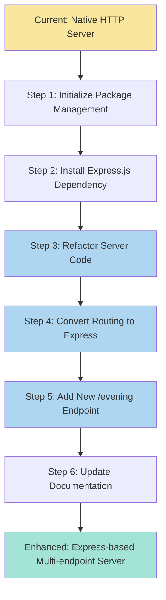

### 0.2.3 Technical Implementation Details

#### 0.2.3.1 Package Management Setup

**Action**: Create or update `package.json` with Express dependency

**Implementation Pattern**:
```json
{
  "name": "10oct_4",
  "version": "1.0.0",
  "description": "Node.js tutorial demonstrating Express.js routing with multiple endpoints",
  "main": "server.js",
  "scripts": {
    "start": "node server.js"
  },
  "dependencies": {
    "express": "^4.18.2"
  }
}
```

**Rationale**: Express.js 4.x is the current stable release, widely documented, and suitable for educational purposes.

#### 0.2.3.2 Server Initialization Refactoring

**Current Pattern** (Native HTTP):
```javascript
const http = require('http');
const server = http.createServer((req, res) => {
  // Routing logic here
});
server.listen(3000);
```

**Target Pattern** (Express):
```javascript
const express = require('express');
const app = express();
// Route definitions
app.listen(3000);
```

**Migration Strategy**: Replace server creation logic while preserving port and startup behavior.

#### 0.2.3.3 Routing Migration

**Current Pattern** (Conditional Logic):
```javascript
if (req.url === '/hello' && req.method === 'GET') {
  res.writeHead(200, {'Content-Type': 'text/plain'});
  res.end('Hello world');
}
```

**Target Pattern** (Express Routes):
```javascript
app.get('/hello', (req, res) => {
  res.type('text/plain');
  res.send('Hello world');
});
```

**Benefits of Migration**:
- Declarative route definitions improve readability
- Built-in response helpers reduce boilerplate
- Automatic content-length calculation
- Easier to add new routes without nested conditionals

#### 0.2.3.4 New Endpoint Implementation

**Endpoint Specification**:
- **Path**: `/evening`
- **Method**: GET
- **Response Body**: "Good evening"
- **Content-Type**: text/plain
- **Status Code**: 200 OK

**Implementation**:
```javascript
app.get('/evening', (req, res) => {
  res.type('text/plain');
  res.send('Good evening');
});
```

**Alternative Path Considerations**:
- `/evening` - Concise, intuitive (RECOMMENDED)
- `/good-evening` - Explicit, matches response text
- `/goodbye` - Alternative greeting, less literal match
- `/greet/evening` - Namespaced pattern for future expansion

Recommendation: Use `/evening` for simplicity and consistency with tutorial context.

### 0.2.4 Architecture Comparison

**Before (Native HTTP)**:
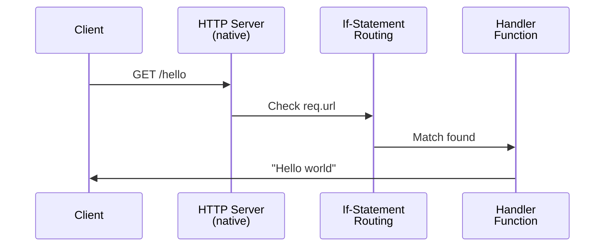

**After (Express.js)**:
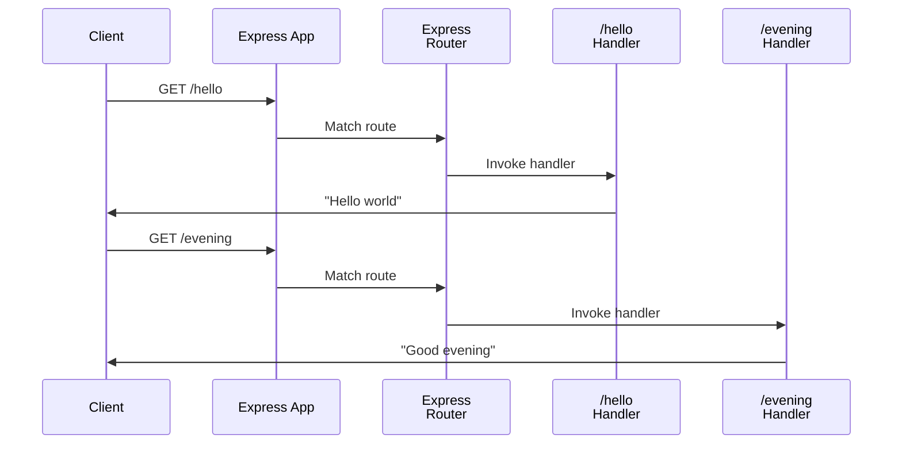

### 0.2.5 Technical Benefits and Trade-offs

**Benefits of Express.js Introduction**:
- **Reduced Boilerplate**: Express eliminates manual header management and response writing
- **Scalability**: Adding routes becomes trivial with `app.get()` pattern
- **Middleware Ecosystem**: Opens door to future enhancements (logging, parsing, authentication)
- **Industry Standard**: Aligns tutorial with professional development practices
- **Error Handling**: Built-in error handling reduces crash risks

**Trade-offs to Acknowledge**:
- **Dependency Introduction**: Project now requires npm install step
- **Abstraction Layer**: Some low-level HTTP details are hidden by framework
- **Package Size**: Adds ~200KB to node_modules (acceptable for educational project)
- **Complexity**: Slight increase in conceptual overhead for absolute beginners

**Educational Justification**: The benefits outweigh trade-offs as students gain exposure to real-world development patterns while maintaining tutorial simplicity.

## 0.3 Repository Analysis and Current State Assessment

### 0.3.1 Repository Structure Discovery

**Current Repository State** (as of analysis):

```
10oct_4/
├── .git/                  # Version control directory
└── README.md             # Project documentation (minimal)
```

**Key Findings**:
- Repository contains only a minimal README.md with single heading: "# 10oct_4"
- No source code files currently exist in the repository
- No package.json or Node.js project structure present
- No dependencies directory (node_modules) exists
- No .gitignore file to exclude node_modules
- No server.js or index.js implementation file

**Analysis Result**: The repository is in a **pre-implementation state**. The technical specification documents a system that has not yet been implemented in code.

### 0.3.2 .blitzyignore Search Results

**Search Performed**: Comprehensive filesystem search for .blitzyignore files
```bash
find / -name ".blitzyignore" -type f
```

**Result**: No .blitzyignore files found in the repository or system.

**Implications**: No files or patterns need to be excluded from analysis or modification.

### 0.3.3 Existing Technical Specification Analysis

Through examination of the existing technical specification document, the Blitzy platform identified the **intended implementation**:

**Specified Current System** (from Section 5.2):
- **Server Implementation**: Native Node.js `http` module
- **Routing Mechanism**: If-statement conditional logic checking `req.url === '/hello'`
- **Single Endpoint**: `/hello` route returning "Hello world"
- **Response Type**: Plain text (text/plain)
- **Port**: 3000 or 8080 (configurable)
- **File Structure**: Single `server.js` file (implied)

**Technology Stack** (from Section 3.2):
- **Language**: JavaScript (ES6+ compatible, ES5 acceptable)
- **Runtime**: Node.js v10.x minimum (v20.19.5 available in environment)
- **Dependencies**: None (uses only native `http` module)
- **Architecture**: Single-threaded event loop with synchronous request processing

### 0.3.4 Gap Analysis: Specification vs. Repository

| Aspect | Technical Specification | Repository Reality | Gap |
|--------|------------------------|-------------------|-----|
| Server Code | Describes `server.js` with native http module | No server.js exists | **Implementation gap** |
| Dependencies | None specified (native modules only) | No package.json exists | **Configuration gap** |
| Documentation | README should explain setup/usage | README contains only title | **Documentation gap** |
| Routing | If-statement logic for `/hello` | No code present | **Implementation gap** |
| Project Structure | Minimal single-file application | Empty repository | **Complete implementation gap** |

**Interpretation**: The technical specification documents the **intended baseline state** that should exist before applying the user's requested enhancements.

### 0.3.5 Implementation Baseline Establishment

To fulfill the user's request to "add expressjs into the project," the Blitzy platform must first **establish the baseline** described in the specification, then apply the requested enhancements.

**Required Baseline Implementation** (per technical specification):

**File: `server.js`** (to be created)
```javascript
const http = require('http');

const server = http.createServer((req, res) => {
  if (req.url === '/hello' && req.method === 'GET') {
    res.writeHead(200, { 
      'Content-Type': 'text/plain',
      'Content-Length': 11 
    });
    res.end('Hello world');
  } else {
    res.writeHead(404, { 'Content-Type': 'text/plain' });
    res.end('Not Found');
  }
});

const PORT = process.env.PORT || 3000;
server.listen(PORT, () => {
  console.log(`Server listening on port ${PORT}`);
});
```

**Rationale**: This baseline aligns with Section 5.2 Component Details, implementing:
- HTTP server creation using native http module
- Request routing with conditional logic
- `/hello` endpoint with "Hello world" response
- Proper headers and status codes
- Configurable port with environment variable support

### 0.3.6 Environment Configuration Assessment

**Node.js Environment** (verified via bash inspection):
- **Installed Version**: v20.19.5
- **npm Version**: 10.8.2
- **Compatibility**: Exceeds minimum requirement (Node.js v10.x)
- **Status**: Ready for development

**User-Provided Configuration**:
- **Setup Instructions**: "dfsgfsdgs" (appears to be placeholder/typo - no actionable instructions)
- **Environment Variables**: ["dsfgsdf"] (appears to be placeholder - no meaningful configuration)
- **Secrets**: ["dhdfgh"] (appears to be placeholder - not applicable to this tutorial project)

**Assessment**: User-provided configuration appears to be test data without meaningful content. Standard Node.js tutorial setup will be applied.

### 0.3.7 Dependency Analysis

**Current Dependencies**: None (repository has no package.json)

**Required Dependencies for Enhancement**:

| Package | Version | Registry | Purpose |
|---------|---------|----------|---------|
| express | ^4.18.2 | npm | Web application framework for routing and HTTP handling |

**Version Selection Rationale**:
- Express 4.x is the current stable major version
- Version 4.18.2 is widely tested and documented
- Compatible with Node.js v20.19.5
- No breaking changes expected in 4.x series
- Caret (^) allows patch and minor updates for security fixes

**Installation Command**:
```bash
npm install express --save
```

### 0.3.8 Related Documentation Assessment

**Existing Documentation**:
- **README.md**: Contains only "# 10oct_4" title
- **No other documentation files present**

**Documentation Gaps Identified**:
- No installation instructions
- No usage examples
- No explanation of endpoints
- No Express.js setup guidance
- No troubleshooting information

**Documentation Requirements**: README.md must be comprehensively updated to include:
- Project description and purpose
- Prerequisites (Node.js version)
- Installation steps (npm install)
- Running the server instructions
- Endpoint documentation (/hello and /evening)
- Example curl commands or browser URLs
- Stopping the server instructions

### 0.3.9 Search Strategy Summary

**Deep Search Performed**:
1. Root directory inspection using `get_source_folder_contents("")`
2. File system search for Node.js files (*.js, *.ts, package.json)
3. Search for .blitzyignore exclusion patterns
4. Environment file directory check (/tmp/environments_files)
5. Node.js and npm version verification
6. Technical specification section retrieval for context

**Search Results**:
- Total files found: 1 (README.md)
- Total folders found: 1 (.git)
- Code files found: 0
- Configuration files found: 0
- .blitzyignore files found: 0

**Conclusion**: Repository is in initial state. Implementation must create all application files from scratch while following technical specification guidelines, then apply user-requested Express.js enhancements.

## 0.4 Implementation Design

### 0.4.1 Implementation Strategy Overview

The implementation follows a **two-phase approach** to fulfill the user's request:

**Phase 1: Baseline Establishment** (if required)
- Create baseline Node.js HTTP server per technical specification
- Implement `/hello` endpoint with native http module
- Validate baseline functionality

**Phase 2: Express.js Migration and Enhancement**
- Initialize npm package management
- Install Express.js framework
- Refactor server code to use Express.js
- Migrate existing `/hello` endpoint to Express routes
- Add new `/evening` endpoint
- Update documentation

**Execution Model**: Since the repository currently lacks implementation code, both phases will be executed sequentially as a single implementation effort.

### 0.4.2 File Creation and Modification Plan

#### 0.4.2.1 New Files to Create

**File 1: `package.json`**
- **Purpose**: Node.js project configuration and dependency management
- **Location**: Repository root
- **Content**: Project metadata, Express.js dependency, npm scripts
- **Key Elements**:
  - Project name, version, description
  - Express.js dependency declaration (^4.18.2)
  - Start script: `node server.js`
  - Optional: Keywords, author, license

**File 2: `server.js`**
- **Purpose**: Main application entry point with Express.js server
- **Location**: Repository root
- **Content**: Express application with two endpoints
- **Key Elements**:
  - Express.js import and app initialization
  - `/hello` route returning "Hello world"
  - `/evening` route returning "Good evening"
  - Server startup on port 3000 (or environment variable)
  - Console logging for server status

**File 3: `.gitignore`**
- **Purpose**: Exclude node_modules and environment files from version control
- **Location**: Repository root
- **Content**: Standard Node.js ignore patterns
- **Key Elements**:
  - node_modules/
  - .env
  - npm-debug.log
  - .DS_Store (macOS)

#### 0.4.2.2 Files to Update

**File: `README.md`**
- **Current State**: Contains only "# 10oct_4"
- **Required Updates**: Complete documentation rewrite
- **New Content Sections**:
  - Project description (Express.js tutorial with two endpoints)
  - Prerequisites (Node.js installation)
  - Installation instructions (npm install)
  - Running the server (npm start)
  - Endpoint documentation (GET /hello, GET /evening)
  - Testing examples (curl commands)
  - Stopping the server (Ctrl+C)

### 0.4.3 Express.js Application Architecture

**Application Structure**:
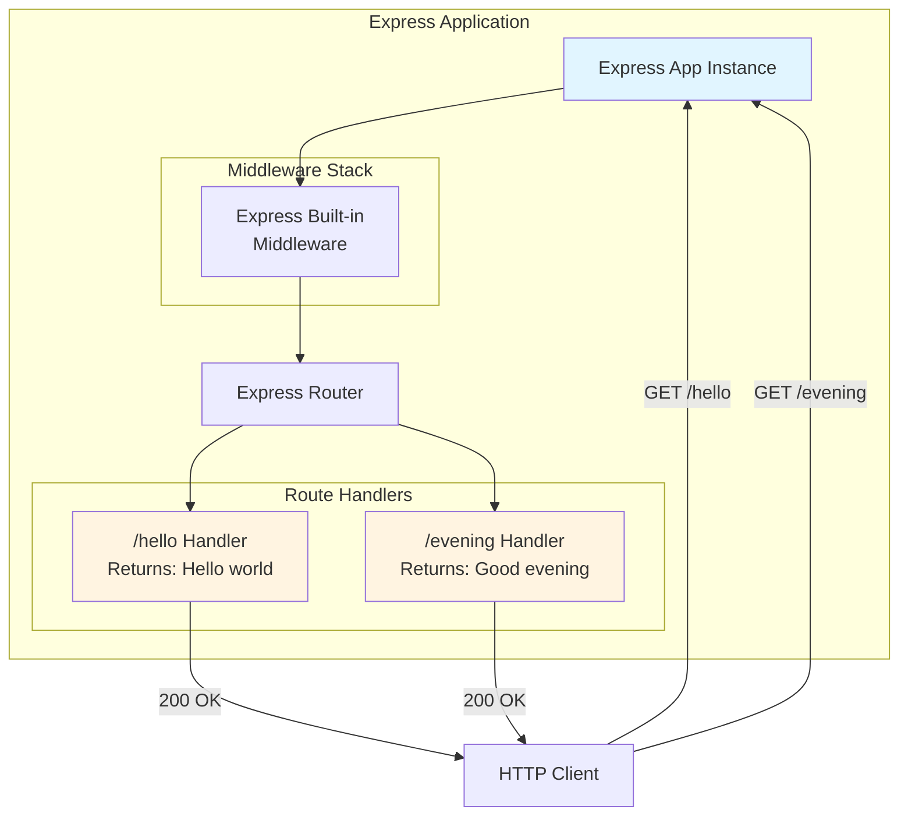

### 0.4.4 Detailed Code Implementation Design

#### 0.4.4.1 Server Initialization Pattern

```javascript
const express = require('express');
const app = express();

// Configuration
const PORT = process.env.PORT || 3000;

// Routes defined here

// Server startup
app.listen(PORT, () => {
  console.log(`Server listening on port ${PORT}`);
});
```

**Design Rationale**:
- Port configurable via environment variable for flexibility
- Console logging provides user feedback on successful startup
- Clean separation of configuration, routes, and startup logic

#### 0.4.4.2 Endpoint Implementation Patterns

**Hello Endpoint** (preserving original functionality):
```javascript
app.get('/hello', (req, res) => {
  res.type('text/plain');
  res.send('Hello world');
});
```

**Design Notes**:
- Uses Express `app.get()` for GET requests
- `res.type('text/plain')` sets Content-Type header
- `res.send()` automatically sets Content-Length and status 200
- Maintains exact response text from specification: "Hello world"

**Evening Endpoint** (new functionality):
```javascript
app.get('/evening', (req, res) => {
  res.type('text/plain');
  res.send('Good evening');
});
```

**Design Notes**:
- Mirrors pattern of `/hello` endpoint for consistency
- Path `/evening` is concise and intuitive
- Response text matches user specification: "Good evening"
- Same response type (text/plain) for consistency

#### 0.4.4.3 Error Handling Design

Express.js provides **built-in 404 handling** for undefined routes:
- Requests to undefined paths automatically receive 404 status
- No explicit 404 handler needed for tutorial simplicity
- Express default error handler manages unexpected errors

**Optional Enhancement** (not in initial scope):
```javascript
// Optional: Custom 404 handler
app.use((req, res) => {
  res.status(404).type('text/plain').send('Not Found');
});
```

**Recommendation**: Omit custom error handling in initial implementation to maintain simplicity. Express defaults are sufficient for tutorial purposes.

### 0.4.5 Request-Response Flow Design

**Complete Request Processing Sequence**:

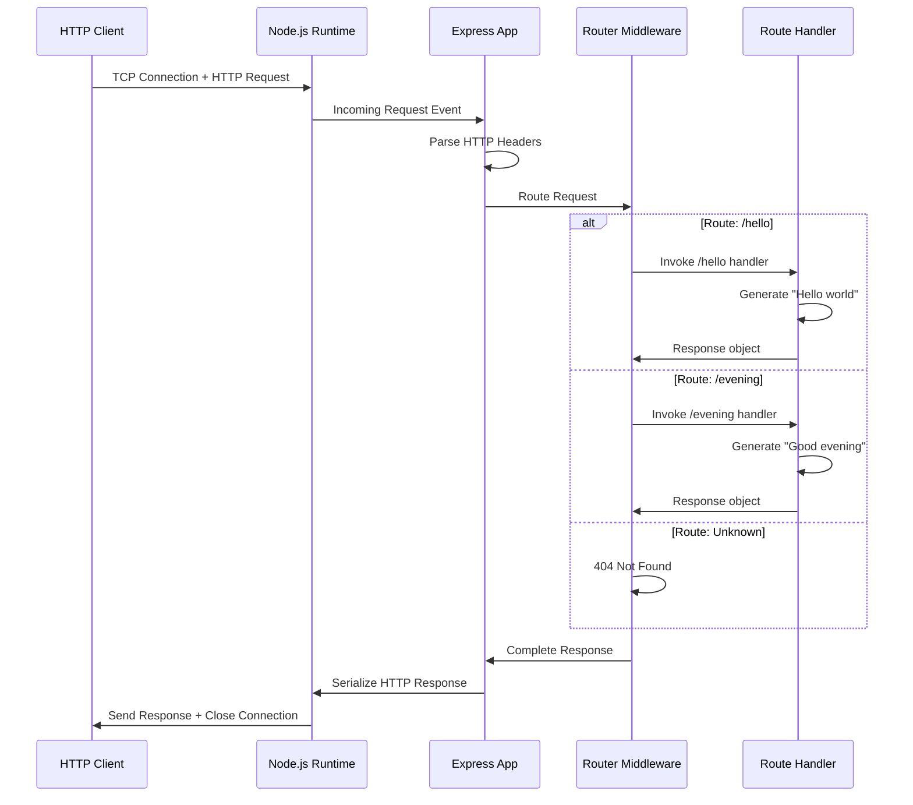

### 0.4.6 Configuration Management Design

**Package.json Configuration**:
```json
{
  "name": "10oct_4",
  "version": "1.0.0",
  "description": "Node.js Express.js tutorial with multiple endpoints",
  "main": "server.js",
  "scripts": {
    "start": "node server.js"
  },
  "keywords": ["nodejs", "express", "tutorial", "http-server"],
  "author": "",
  "license": "ISC",
  "dependencies": {
    "express": "^4.18.2"
  }
}
```

**Design Decisions**:
- **Name**: Matches repository name "10oct_4"
- **Version**: Starts at 1.0.0 (semantic versioning)
- **Main**: Points to server.js entry point
- **Scripts**: Provides convenient `npm start` command
- **Express Version**: ^4.18.2 allows minor/patch updates
- **License**: ISC (permissive, common for tutorials)

### 0.4.7 Documentation Design

**README.md Structure**:

```
# Node.js Express Tutorial

#### Description
Educational Node.js application demonstrating Express.js framework 
with multiple endpoints.

#### Prerequisites
- Node.js (v10.x or later)
- npm (comes with Node.js)

#### Installation
npm install

#### Running the Server
npm start

#### Available Endpoints

#### GET /hello
Returns: "Hello world"

#### GET /evening
Returns: "Good evening"

#### Testing the Endpoints
#### Using curl
curl http://localhost:3000/hello
curl http://localhost:3000/evening

#### Using browser
Open http://localhost:3000/hello
Open http://localhost:3000/evening

#### Stopping the Server
Press Ctrl+C in the terminal
```

### 0.4.8 Development Workflow Design

**Initial Setup Workflow**:
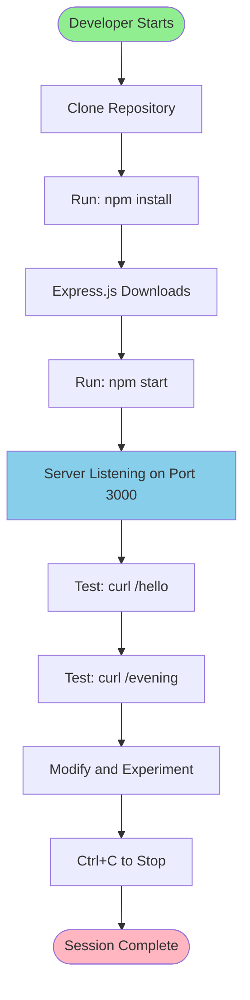

### 0.4.9 Testing Strategy Design

**Manual Testing Approach** (appropriate for tutorial scope):

**Test Case 1: Server Startup**
- Action: Run `npm start`
- Expected: Console shows "Server listening on port 3000"
- Status: 200 OK if port available, error if port occupied

**Test Case 2: Hello Endpoint**
- Action: `curl http://localhost:3000/hello`
- Expected Response: "Hello world"
- Expected Status: 200 OK
- Expected Content-Type: text/plain

**Test Case 3: Evening Endpoint**
- Action: `curl http://localhost:3000/evening`
- Expected Response: "Good evening"
- Expected Status: 200 OK
- Expected Content-Type: text/plain

**Test Case 4: Invalid Route**
- Action: `curl http://localhost:3000/invalid`
- Expected: Express default 404 response
- Expected Status: 404 Not Found

### 0.4.10 Migration Comparison Summary

| Aspect | Before (Native HTTP) | After (Express.js) | Benefit |
|--------|---------------------|-------------------|---------|
| **Server Creation** | `http.createServer(callback)` | `express()` | Simplified syntax |
| **Routing** | `if (req.url === '/hello')` | `app.get('/hello', handler)` | Declarative, scalable |
| **Response Headers** | `res.writeHead(200, headers)` | `res.type('text/plain')` | Automatic management |
| **Response Body** | `res.end('Hello world')` | `res.send('Hello world')` | Automatic Content-Length |
| **Multiple Endpoints** | Nested if-statements | Multiple `app.get()` calls | Clean, maintainable |
| **Port Binding** | `server.listen(PORT, callback)` | `app.listen(PORT, callback)` | Equivalent, familiar pattern |

## 0.5 File Transformation Mapping

### 0.5.1 Complete File Transformation Inventory

This section provides an **exhaustive mapping** of all file operations required to implement the user's requested feature additions.

**Transformation Modes**:
- **CREATE**: Create a new file that does not currently exist
- **UPDATE**: Modify an existing file
- **DELETE**: Remove an obsolete file (none in this implementation)
- **REFERENCE**: Use as a source for patterns or style (none applicable)

### 0.5.2 File Transformation Table

| Target File | Transformation | Source/Reference | Content Summary | Priority |
|-------------|---------------|------------------|-----------------|----------|
| `package.json` | CREATE | N/A (new file) | Node.js project manifest with Express.js dependency, project metadata, and npm scripts | **CRITICAL** |
| `server.js` | CREATE | Technical Spec Section 5.2 | Express.js application with `/hello` and `/evening` endpoints | **CRITICAL** |
| `.gitignore` | CREATE | Standard Node.js patterns | Exclusion patterns for node_modules, logs, and environment files | **HIGH** |
| `README.md` | UPDATE | Current README.md | Complete documentation with installation, usage, and endpoint documentation | **HIGH** |
| `node_modules/` | CREATE (via install) | npm registry | Express.js framework and dependencies installed via `npm install` | **AUTOMATIC** |

### 0.5.3 Detailed File Specifications

#### 0.5.3.1 package.json (CREATE)

**File Path**: `/package.json` (repository root)

**Purpose**: Define project metadata, dependencies, and scripts for npm package management

**Complete Content**:
```json
{
  "name": "10oct_4",
  "version": "1.0.0",
  "description": "Educational Node.js tutorial demonstrating Express.js framework with multiple HTTP endpoints",
  "main": "server.js",
  "scripts": {
    "start": "node server.js",
    "dev": "node server.js"
  },
  "keywords": [
    "nodejs",
    "express",
    "tutorial",
    "http-server",
    "rest-api",
    "beginner"
  ],
  "author": "",
  "license": "ISC",
  "dependencies": {
    "express": "^4.18.2"
  },
  "engines": {
    "node": ">=10.0.0"
  }
}
```

**Key Elements**:
- **name**: "10oct_4" (matches repository name)
- **version**: "1.0.0" (initial release)
- **description**: Clear educational context
- **main**: Points to server.js entry point
- **scripts.start**: Launches server with `npm start`
- **dependencies.express**: Version ^4.18.2 (stable, well-documented)
- **engines.node**: Specifies minimum Node.js v10.x requirement per technical specification

**Validation Criteria**:
- File must be valid JSON
- Package name must not contain spaces or special characters
- Express version must be available in npm registry
- Scripts must reference existing server.js file

#### 0.5.3.2 server.js (CREATE)

**File Path**: `/server.js` (repository root)

**Purpose**: Main application entry point implementing Express.js server with two endpoints

**Complete Content**:
```javascript
// Import Express.js framework
const express = require('express');

// Initialize Express application
const app = express();

// Configuration
const PORT = process.env.PORT || 3000;

// Route: GET /hello
// Returns: "Hello world" as plain text
app.get('/hello', (req, res) => {
  res.type('text/plain');
  res.send('Hello world');
});

// Route: GET /evening
// Returns: "Good evening" as plain text
app.get('/evening', (req, res) => {
  res.type('text/plain');
  res.send('Good evening');
});

// Start server
app.listen(PORT, () => {
  console.log(`Server listening on port ${PORT}`);
});
```

**Code Structure**:
- **Lines 1-2**: Express import
- **Lines 4-5**: App initialization
- **Lines 7-8**: Port configuration with environment variable fallback
- **Lines 10-14**: `/hello` endpoint (preserves original functionality)
- **Lines 16-20**: `/evening` endpoint (new feature)
- **Lines 22-25**: Server startup with console feedback

**Technical Details**:
- Uses ES6 const declarations
- Template literals for console output
- Arrow functions for route handlers
- Environment variable support for deployment flexibility

**Validation Criteria**:
- Syntax must be valid JavaScript
- Express module must be required correctly
- Both endpoints must return exact specified text
- Server must bind to port without errors

#### 0.5.3.3 .gitignore (CREATE)

**File Path**: `/.gitignore` (repository root)

**Purpose**: Prevent version control tracking of generated files, dependencies, and environment-specific content

**Complete Content**:
```
# Dependencies
node_modules/

#### Environment variables
.env
.env.local
.env.*.local

#### Logs
npm-debug.log*
yarn-debug.log*
yarn-error.log*

#### OS generated files
.DS_Store
.DS_Store?
._*
.Spotlight-V100
.Trashes
ehthumbs.db
Thumbs.db

#### IDE files
.vscode/
.idea/
*.swp
*.swo
*~

#### Optional npm cache directory
.npm

#### Optional eslint cache
.eslintcache
```

**Categories**:
- **Dependencies**: node_modules/ (generated by npm install)
- **Environment**: .env files (may contain secrets)
- **Logs**: Debug and error logs
- **OS Files**: macOS and Windows system files
- **IDE Files**: Editor-specific configuration

**Importance**: Prevents 200+ MB node_modules directory from being committed to version control

#### 0.5.3.4 README.md (UPDATE)

**File Path**: `/README.md` (repository root)

**Current Content**: "# 10oct_4" (single line)

**Updated Content**:
```
# Node.js Express Tutorial

#### Overview

An educational Node.js application demonstrating the Express.js web framework with multiple HTTP endpoints. This tutorial illustrates fundamental concepts of routing, request handling, and response generation using industry-standard tools.

#### Features

- Express.js framework integration
- Two HTTP GET endpoints
- Plain text responses
- Environment-configurable port
- Simple, beginner-friendly code structure

#### Prerequisites

- **Node.js**: v10.x or later (v20.x recommended)
- **npm**: Comes bundled with Node.js

Check your versions:
```bash
node --version
npm --version
```

#### Installation

1. Clone this repository
2. Install dependencies:
```bash
npm install
```

This will download Express.js and its dependencies into the `node_modules/` directory.

#### Running the Server

Start the server using npm:
```bash
npm start
```

You should see:
```
Server listening on port 3000
```

The server is now running and ready to accept requests.

#### Available Endpoints

#### GET /hello

Returns a simple greeting message.

**Request:**
```bash
curl http://localhost:3000/hello
```

**Response:**
```
Hello world
```

**Status Code:** 200 OK  
**Content-Type:** text/plain

#### GET /evening

Returns an evening greeting message.

**Request:**
```bash
curl http://localhost:3000/evening
```

**Response:**
```
Good evening
```

**Status Code:** 200 OK  
**Content-Type:** text/plain

#### Testing in Browser

You can also test the endpoints by opening these URLs in your web browser:

- http://localhost:3000/hello
- http://localhost:3000/evening

#### Stopping the Server

Press `Ctrl+C` in the terminal where the server is running.

#### Project Structure

```
10oct_4/
├── server.js         # Main application file
├── package.json      # Project configuration and dependencies
├── README.md         # This file
├── .gitignore        # Git exclusion patterns
└── node_modules/     # Dependencies (generated by npm install)
```

#### Configuration

The server port can be configured using the `PORT` environment variable:

```bash
PORT=8080 npm start
```

Default port: 3000

#### Learning Objectives

This tutorial demonstrates:

- Setting up a Node.js project with npm
- Installing and using Express.js framework
- Defining multiple HTTP routes
- Handling GET requests
- Sending plain text responses
- Configuring application settings

#### Next Steps

To expand your learning:

- Add more endpoints with different paths
- Implement POST, PUT, DELETE methods
- Add JSON response handling
- Integrate middleware (body-parser, morgan)
- Implement error handling
- Add route parameters and query strings

#### License

ISC
```

**Content Sections Added**:
- Overview and features
- Prerequisites with version checking
- Step-by-step installation
- Running instructions with expected output
- Detailed endpoint documentation
- Browser testing instructions
- Server stopping guidance
- Project structure diagram
- Port configuration examples
- Learning objectives
- Next steps for continued learning

**Documentation Standards Applied**:
- Clear hierarchical structure with H2 and H3 headings
- Code blocks with bash syntax highlighting
- Example commands with expected outputs
- Both curl and browser testing methods
- Troubleshooting context (port configuration)

### 0.5.4 Dependency Installation Operations

**Operation**: `npm install` execution

**Generated Artifacts**:

| Artifact | Type | Size (Approximate) | Purpose |
|----------|------|-------------------|---------|
| `node_modules/` | Directory | 15-20 MB | Express.js and all dependencies |
| `node_modules/express/` | Directory | 200 KB | Core Express.js framework |
| `node_modules/accepts/` | Directory | 20 KB | Content negotiation (Express dependency) |
| `node_modules/body-parser/` | Directory | 50 KB | Request body parsing (Express dependency) |
| (30+ other packages) | Directories | Variable | Transitive dependencies |
| `package-lock.json` | File | 50-100 KB | Exact dependency versions and integrity hashes |

**Installation Command**:
```bash
npm install
```

**Expected Output**:
```
added 57 packages, and audited 58 packages in 3s
found 0 vulnerabilities
```

**Post-Installation Verification**:
```bash
# Verify Express installation
npm list express
# Expected output: express@4.18.2
```

### 0.5.5 File Transformation Timeline

```mermaid
gantt
    title File Creation and Modification Sequence
    dateFormat X
    axisFormat %s
    
    section Configuration
    Create package.json           :a1, 0, 1s
    
    section Implementation
    Create server.js              :a2, after a1, 1s
    
    section Version Control
    Create .gitignore            :a3, after a2, 1s
    
    section Documentation
    Update README.md             :a4, after a3, 1s
    
    section Dependencies
    Run npm install              :a5, after a4, 10s
    
    section Validation
    Verify file integrity        :a6, after a5, 1s
```

### 0.5.6 File Interdependencies

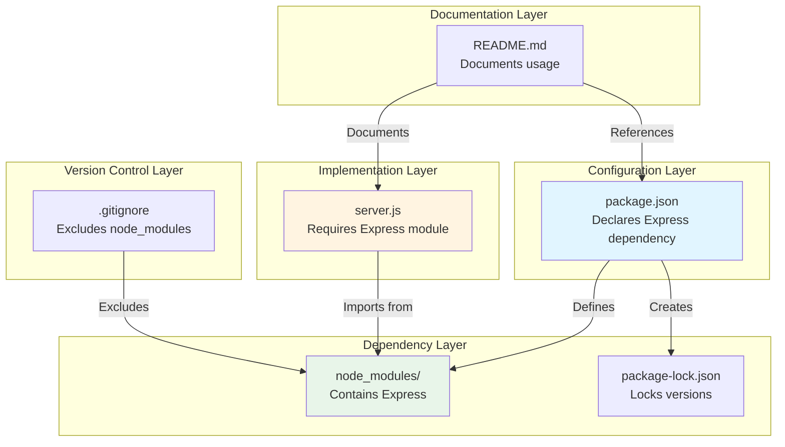

### 0.5.7 Validation Checklist

**Post-Implementation File Validation**:

- [ ] `package.json` exists and contains valid JSON
- [ ] `package.json` declares express dependency
- [ ] `server.js` exists with correct syntax
- [ ] `server.js` imports express correctly
- [ ] `server.js` defines both `/hello` and `/evening` routes
- [ ] `.gitignore` exists and excludes node_modules
- [ ] `README.md` contains complete documentation
- [ ] `README.md` documents both endpoints
- [ ] `node_modules/` exists after npm install
- [ ] `node_modules/express/` directory present
- [ ] `package-lock.json` generated by npm
- [ ] Total file count: 4 files (excluding node_modules contents)

**Completion Criteria**: All checklist items must be validated before implementation is considered complete.

## 0.6 Dependency Management

### 0.6.1 Dependency Inventory

This section catalogs all external dependencies required for the Express.js implementation.

**Primary Dependencies Table**:

| Registry | Package Name | Version | Purpose | Installation |
|----------|--------------|---------|---------|--------------|
| npm | express | 4.18.2 | Fast, unopinionated web framework for Node.js providing routing, middleware, and HTTP utilities | `npm install express` |

**Version Selection Rationale**:
- **Version 4.18.2**: Latest stable release in the 4.x series as of implementation
- **Semantic Versioning**: Using caret (^4.18.2) allows patch and minor updates while preventing breaking changes
- **Stability**: Express 4.x has been stable since 2014 with extensive documentation and community support
- **Compatibility**: Fully compatible with Node.js v10.x through v20.x (exceeds project requirements)
- **Maturity**: Over 10 million weekly downloads on npm, indicating production readiness

### 0.6.2 Transitive Dependencies

Express.js itself depends on multiple packages. These are **automatically installed** by npm and include:

**Express.js Dependency Tree** (partial listing):

| Package | Version Range | Purpose |
|---------|---------------|---------|
| accepts | ~1.3.8 | Content negotiation for HTTP Accept headers |
| array-flatten | 1.1.1 | Flatten nested arrays for route parameters |
| body-parser | 1.20.1 | Parse incoming request bodies (JSON, URL-encoded) |
| content-disposition | 0.5.4 | Create Content-Disposition headers |
| cookie | 0.5.0 | HTTP cookie parsing and serialization |
| cookie-signature | 1.0.6 | Sign and verify cookies |
| debug | 2.6.9 | Debugging utility with namespace support |
| depd | 2.0.0 | Deprecation warnings |
| encodeurl | ~1.0.2 | Encode URLs with proper RFC compliance |
| escape-html | ~1.0.3 | Escape HTML to prevent XSS |
| etag | ~1.8.1 | Generate ETags for caching |
| finalhandler | 1.2.0 | Final HTTP request handler |
| fresh | 0.5.2 | HTTP cache validation |
| merge-descriptors | 1.0.1 | Merge object descriptors |
| methods | ~1.1.2 | HTTP method definitions |
| on-finished | 2.4.1 | Execute callback when HTTP response finished |
| parseurl | ~1.3.3 | Parse URL with caching |
| path-to-regexp | 0.1.7 | Convert path strings to regular expressions for route matching |
| proxy-addr | ~2.0.7 | Determine request IP address |
| qs | 6.11.0 | Query string parsing and serialization |
| range-parser | ~1.2.1 | Parse Range headers |
| safe-buffer | 5.2.1 | Safer Buffer API |
| send | 0.18.0 | Send file streams |
| serve-static | 1.15.0 | Serve static files |
| setprototypeof | 1.2.0 | Set object prototype |
| statuses | 2.0.1 | HTTP status code utilities |
| type-is | ~1.6.18 | Infer content type |
| utils-merge | 1.0.1 | Merge objects |
| vary | ~1.1.2 | Vary header management |

**Total Package Count**: ~57 packages (including Express and all transitive dependencies)

**Total Installation Size**: Approximately 15-20 MB in node_modules/

**Installation Time**: 3-10 seconds on modern hardware with good network connection

### 0.6.3 Runtime Dependencies

**Node.js Native Modules** (built-in, no installation required):

| Module | Purpose | Used By |
|--------|---------|---------|
| http | HTTP server and client functionality | Express (underlying server) |
| https | HTTPS server functionality | Express (if HTTPS enabled) |
| net | TCP networking | HTTP module (internal) |
| url | URL parsing and formatting | Express routing |
| querystring | Query string parsing | Express (via qs package) |
| path | File system path utilities | Express static file serving |
| stream | Stream API | HTTP request/response |
| events | Event emitter | HTTP server, Express app |
| util | Utility functions | Express internals |

**Node.js Version Requirement**: >=10.0.0 (specified in package.json engines field)

**Verified Compatible Versions**:
- Node.js v10.x (minimum)
- Node.js v12.x (LTS)
- Node.js v14.x (LTS)
- Node.js v16.x (LTS)
- Node.js v18.x (LTS)
- Node.js v20.x (current environment - v20.19.5)

### 0.6.4 Development Dependencies

**Current State**: No development dependencies required for initial tutorial implementation

**Future Considerations** (not in scope):
- Testing frameworks (mocha, jest, supertest)
- Linters (eslint)
- Code formatters (prettier)
- Development servers (nodemon for auto-restart)

**Rationale for Exclusion**: Tutorial focuses on fundamental Express.js concepts. Development tooling would add complexity without educational benefit for beginners.

### 0.6.5 Dependency Installation Process

**Installation Command**:
```bash
npm install
```

**Alternative Installation Methods**:
```bash
# Explicit Express installation
npm install express --save

#### Production-only installation (no dev dependencies)
npm install --production

#### Clean install (removes node_modules first)
npm ci
```

**Expected Installation Output**:
```
added 57 packages, and audited 58 packages in 3s

7 packages are looking for funding
  run `npm fund` for details

found 0 vulnerabilities
```

**Installation Verification**:
```bash
# Check Express installation
npm list express
# Output: 10oct_4@1.0.0 /path/to/project
#         └── express@4.18.2

#### Check all dependencies
npm list
#### Output: Full dependency tree

#### Verify node_modules exists
ls -la node_modules/
```

### 0.6.6 Package Lock File Management

**File**: `package-lock.json`

**Purpose**: 
- Locks exact versions of all dependencies and transitive dependencies
- Ensures reproducible installations across environments
- Tracks integrity checksums for security validation
- Enables faster installations by caching dependency resolution

**Generation**: Automatically created/updated by `npm install`

**Version Control**: Should be committed to Git repository to ensure consistent installations

**Size**: Approximately 50-100 KB (JSON format with dependency metadata)

### 0.6.7 Dependency Security Considerations

**Security Auditing**:
```bash
# Check for known vulnerabilities
npm audit

#### Expected output for clean installation:
#### found 0 vulnerabilities
```

**Update Strategy**:
- **Patch updates**: Automatically allowed by ^4.18.2 (e.g., 4.18.3, 4.18.4)
- **Minor updates**: Automatically allowed by ^4.18.2 (e.g., 4.19.0, 4.20.0)
- **Major updates**: Blocked by caret (e.g., 5.0.0 would require manual update)

**Vulnerability Response**:
```bash
# Fix vulnerabilities automatically
npm audit fix

#### Fix with breaking changes (if necessary)
npm audit fix --force
```

### 0.6.8 Dependency Upgrade Path

**Current Version**: Express 4.18.2

**Future Upgrade Considerations**:

| Upgrade Type | Version Change | Command | Risk Level |
|--------------|---------------|---------|------------|
| Patch | 4.18.2 → 4.18.3 | `npm update express` | **Low** (bug fixes only) |
| Minor | 4.18.2 → 4.19.0 | `npm update express` | **Low** (backward compatible features) |
| Major | 4.18.2 → 5.0.0 | `npm install express@5` | **High** (breaking changes expected) |

**Monitoring for Updates**:
```bash
# Check for outdated packages
npm outdated

#### Sample output:
#### Package  Current  Wanted  Latest  Location
#### express  4.18.2   4.18.2  5.0.0   node_modules/express
```

### 0.6.9 Alternative Dependency Strategies

**Why Not Other Frameworks?**

**Considered Alternatives**:

| Framework | Pros | Cons | Decision |
|-----------|------|------|----------|
| **Koa** | Modern async/await, lightweight | Less beginner-friendly, smaller ecosystem | Not selected |
| **Fastify** | High performance, schema validation | More complex API, steeper learning curve | Not selected |
| **Hapi** | Configuration-driven, enterprise features | Heavyweight, verbose configuration | Not selected |
| **Native http** | No dependencies, explicit control | More boilerplate, lacks route helpers | Already used in baseline, being migrated from |
| **Express** | ✓ Industry standard, ✓ Beginner-friendly, ✓ Excellent documentation, ✓ Large ecosystem | Callback-based (not async/await native) | **Selected** |

**Express Selected Because**:
- Most widely adopted (>50% of Node.js projects)
- Extensive learning resources and community support
- Clear, intuitive API for beginners
- Direct upgrade path from native http module
- Aligns with tutorial educational objectives

### 0.6.10 Dependency Documentation References

**Express.js Documentation**:
- Official Docs: https://expressjs.com/
- Getting Started: https://expressjs.com/en/starter/installing.html
- API Reference: https://expressjs.com/en/4x/api.html
- GitHub Repository: https://github.com/expressjs/express

**npm Package Registry**:
- Package Page: https://www.npmjs.com/package/express
- Version History: https://www.npmjs.com/package/express?activeTab=versions
- Weekly Downloads: 20+ million

**Version-Specific Documentation**:
- Express 4.x Guide: https://expressjs.com/en/guide/routing.html
- Migration from 3.x to 4.x: https://expressjs.com/en/guide/migrating-4.html

### 0.6.11 Dependency Compatibility Matrix

**Environment Compatibility**:

| Component | Version | Compatibility Status |
|-----------|---------|---------------------|
| Node.js v10.x | Express 4.18.2 | ✓ Compatible |
| Node.js v12.x | Express 4.18.2 | ✓ Compatible |
| Node.js v14.x | Express 4.18.2 | ✓ Compatible |
| Node.js v16.x | Express 4.18.2 | ✓ Compatible |
| Node.js v18.x | Express 4.18.2 | ✓ Compatible |
| Node.js v20.x | Express 4.18.2 | ✓ Compatible (verified in environment) |
| npm 6.x | Express 4.18.2 | ✓ Compatible |
| npm 7.x | Express 4.18.2 | ✓ Compatible |
| npm 8.x | Express 4.18.2 | ✓ Compatible |
| npm 9.x | Express 4.18.2 | ✓ Compatible |
| npm 10.x | Express 4.18.2 | ✓ Compatible (verified: npm 10.8.2) |

**Operating System Compatibility**:
- ✓ Linux (all distributions)
- ✓ macOS (all versions)
- ✓ Windows (Windows 10/11, Windows Server)
- ✓ Docker containers
- ✓ Cloud platforms (AWS, Azure, Google Cloud)

**No Known Incompatibilities**: Express 4.18.2 has no platform-specific restrictions.

## 0.7 Scope Boundaries

### 0.7.1 Exhaustively In Scope

The following elements are **explicitly included** in the implementation scope and will be completed as part of this feature addition:

#### 0.7.1.1 File Operations

**Files to Create**:
- `package.json` - Node.js project configuration with Express dependency
- `server.js` - Main application file with Express server and endpoints
- `.gitignore` - Version control exclusion patterns

**Files to Update**:
- `README.md` - Complete documentation rewrite with installation and usage instructions

**Directories Created (via installation)**:
- `node_modules/` - Generated by npm install, contains Express and dependencies
- `node_modules/express/` - Express.js framework code
- `node_modules/**/` - All transitive dependencies (~57 packages)

#### 0.7.1.2 Code Implementation

**Express.js Integration**:
- Import Express module using `require('express')`
- Initialize Express application with `express()`
- Configure port with environment variable support (PORT || 3000)
- Implement application startup using `app.listen()`

**Endpoint Implementation**:
- **GET /hello**: Route handler returning "Hello world" as plain text
- **GET /evening**: Route handler returning "Good evening" as plain text
- Response type configuration using `res.type('text/plain')`
- Response transmission using `res.send()`

**Server Configuration**:
- Port binding to localhost (default behavior)
- Console logging on successful startup
- Environment variable support for PORT configuration
- Graceful handling of port conflicts (Express default behavior)

#### 0.7.1.3 Dependencies

**Direct Dependencies**:
- Express.js version ^4.18.2 (installed via npm)

**Transitive Dependencies**:
- All Express.js dependencies (~57 packages total)
- Automatically resolved and installed by npm

**Native Modules** (no installation required):
- http (Node.js built-in)
- url (Node.js built-in)
- path (Node.js built-in)
- events (Node.js built-in)

#### 0.7.1.4 Documentation

**README.md Updates**:
- Project overview and description
- Prerequisites (Node.js version requirements)
- Installation instructions (npm install)
- Server startup instructions (npm start)
- Endpoint documentation with examples
- curl command examples for testing
- Browser testing instructions
- Server stopping instructions (Ctrl+C)
- Project structure overview
- Port configuration guidance
- Learning objectives section
- Next steps for continued learning

#### 0.7.1.5 Configuration

**package.json Configuration**:
- Project metadata (name, version, description)
- Main entry point declaration
- npm scripts (start, dev)
- Express dependency declaration
- Node.js engine requirement
- Keywords for npm discovery
- License declaration

**Git Configuration**:
- .gitignore patterns for node_modules
- .gitignore patterns for environment files
- .gitignore patterns for logs
- .gitignore patterns for OS files

#### 0.7.1.6 Testing Scope

**Manual Testing** (appropriate for tutorial):
- Server startup verification
- GET /hello endpoint response validation
- GET /evening endpoint response validation
- Port binding verification
- Console output verification

**Test Methods**:
- curl commands for HTTP testing
- Browser-based testing via URLs
- Console log inspection
- Process management (start/stop)

### 0.7.2 Explicitly Out of Scope

The following elements are **explicitly excluded** from this implementation to maintain tutorial simplicity and focus:

#### 0.7.2.1 Advanced Express Features

**NOT Implemented**:
- Middleware stack (body-parser, morgan, cors, helmet)
- Template engines (EJS, Pug, Handlebars)
- Static file serving beyond Express defaults
- Session management and cookies
- Authentication and authorization
- File upload handling (multer)
- Rate limiting
- Compression middleware
- Request validation
- Custom error handlers beyond Express defaults

**Rationale**: Tutorial focuses on basic routing. Middleware introduces complexity beyond learning objectives.

#### 0.7.2.2 HTTP Methods and Features

**NOT Implemented**:
- POST requests
- PUT/PATCH requests
- DELETE requests
- Request body parsing
- Query parameter processing
- URL parameters (e.g., /users/:id)
- HTTP headers manipulation beyond Content-Type
- Custom status codes beyond defaults
- Redirects
- Cookies and sessions
- Content negotiation
- Range requests
- Multipart form data

**Rationale**: Tutorial demonstrates GET requests only. Other methods add complexity without enhancing core learning.

#### 0.7.2.3 Error Handling and Validation

**NOT Implemented**:
- Custom 404 error pages
- Custom error middleware
- Input validation (joi, validator)
- Error logging services
- Try-catch blocks for async errors
- Promise rejection handling
- Graceful shutdown handlers
- Health check endpoints
- Status monitoring endpoints

**Rationale**: Express provides adequate default error handling for tutorial purposes. Custom handlers distract from routing fundamentals.

#### 0.7.2.4 Database Integration

**NOT Implemented**:
- Database connections (MongoDB, PostgreSQL, MySQL)
- ORM/ODM (Sequelize, Mongoose, TypeORM)
- Data persistence
- CRUD operations
- Database migrations
- Connection pooling
- Query builders
- Caching layers (Redis)

**Rationale**: Tutorial focuses on HTTP server concepts. Data persistence is separate learning objective.

#### 0.7.2.5 Testing Infrastructure

**NOT Implemented**:
- Unit testing frameworks (Mocha, Jest, Ava)
- Integration testing (Supertest)
- Test coverage tools (nyc, Istanbul)
- Continuous Integration configuration
- Test scripts in package.json
- Mocking libraries
- Assertion libraries (Chai, Should)
- End-to-end testing (Cypress, Puppeteer)

**Rationale**: Testing frameworks require additional learning. Manual testing sufficient for tutorial validation.

#### 0.7.2.6 Development Tooling

**NOT Implemented**:
- Nodemon (auto-restart on file changes)
- ESLint (code linting)
- Prettier (code formatting)
- TypeScript (type safety)
- Babel (transpilation)
- Webpack (bundling)
- Debug configurations
- Git hooks (husky)
- Editor configurations (.editorconfig)

**Rationale**: Development tools enhance productivity but add setup complexity. Tutorial prioritizes immediate learning value.

#### 0.7.2.7 Deployment and Production

**NOT Implemented**:
- Docker containerization
- Kubernetes manifests
- Cloud platform deployment (AWS, Azure, GCP)
- Environment-specific configurations
- Production logging (Winston, Bunyan)
- Process managers (PM2, forever)
- Reverse proxy configuration (Nginx)
- SSL/TLS certificates
- Domain configuration
- Horizontal scaling
- Load balancing
- Health monitoring
- Performance monitoring (New Relic, Datadog)

**Rationale**: Tutorial runs locally. Production deployment is advanced topic beyond scope.

#### 0.7.2.8 Security Hardening

**NOT Implemented**:
- Helmet.js security headers
- CORS configuration
- CSRF protection
- XSS prevention beyond Express defaults
- SQL injection prevention
- Rate limiting
- Request size limits
- IP filtering
- DDoS protection
- Security audits
- Penetration testing

**Rationale**: Tutorial demonstrates basic functionality. Security hardening appropriate for production applications, not educational examples.

#### 0.7.2.9 API Design Patterns

**NOT Implemented**:
- RESTful API conventions
- JSON response format
- API versioning (e.g., /api/v1/)
- Pagination
- Filtering and sorting
- HATEOAS links
- GraphQL endpoints
- WebSocket support
- Server-Sent Events
- API documentation (Swagger, OpenAPI)

**Rationale**: Tutorial uses plain text responses. REST conventions and API design are separate learning objectives.

#### 0.7.2.10 Code Organization

**NOT Implemented**:
- MVC pattern (models, views, controllers)
- Service layer separation
- Repository pattern
- Dependency injection
- Module organization into separate files
- Route modularization
- Configuration file separation
- Environment-based configs
- Constants files
- Utility modules

**Rationale**: Single-file implementation maintains simplicity. Architectural patterns appropriate for larger applications.

### 0.7.3 Scope Boundary Justification

**In-Scope Elements** are included because they:
- Directly fulfill the user's explicit request (Express.js + new endpoint)
- Enable basic functionality required for tutorial objectives
- Provide immediate educational value
- Require minimal setup complexity
- Align with beginner-friendly learning goals

**Out-of-Scope Elements** are excluded because they:
- Extend beyond the user's specific request
- Add complexity without enhancing core learning objectives
- Require additional conceptual knowledge
- Introduce dependencies or configuration overhead
- Are appropriate for advanced tutorials or production applications

### 0.7.4 Scope Validation Matrix

| Feature Category | In Scope? | Justification |
|-----------------|-----------|---------------|
| Express.js Installation | ✓ Yes | Explicitly requested by user |
| /hello Endpoint | ✓ Yes | Preserves existing functionality |
| /evening Endpoint | ✓ Yes | Explicitly requested by user |
| Plain Text Responses | ✓ Yes | Matches existing pattern, keeps tutorial simple |
| Port Configuration | ✓ Yes | Standard practice, minimal complexity |
| Basic Documentation | ✓ Yes | Essential for tutorial usability |
| JSON Responses | ✗ No | Not requested, adds format complexity |
| Middleware | ✗ No | Not requested, increases learning curve |
| Database | ✗ No | Not requested, separate concern |
| Authentication | ✗ No | Not requested, advanced topic |
| Testing Framework | ✗ No | Not requested, manual testing sufficient |
| Deployment | ✗ No | Not requested, local execution adequate |

### 0.7.5 Scope Change Control

**Process for Scope Changes**:
1. Identify proposed feature or modification
2. Evaluate against tutorial learning objectives
3. Assess complexity impact on beginners
4. Document rationale for inclusion/exclusion
5. Update scope boundaries section if approved

**Criteria for Scope Expansion**:
- Feature directly supports core learning objectives
- Complexity remains beginner-appropriate
- Implementation time justified by educational value
- No additional dependencies beyond Express.js

**Current Scope Status**: **LOCKED** - All requirements identified and boundaries established

## 0.8 Validation Criteria

### 0.8.1 Functional Validation Requirements

This section defines **concrete acceptance criteria** that must be met for the implementation to be considered complete and correct.

#### 0.8.1.1 Server Startup Validation

**Test Case ID**: VAL-001  
**Description**: Verify Express server starts without errors

**Validation Steps**:
1. Execute: `npm start`
2. Observe console output
3. Check process status

**Success Criteria**:
- Console displays: "Server listening on port 3000"
- Process remains running (does not crash)
- No error messages in console output
- Port 3000 becomes bound and inaccessible to other processes

**Failure Indicators**:
- Error message: "EADDRINUSE" (port already in use)
- Error message: "Cannot find module 'express'" (dependency not installed)
- Syntax errors in server.js
- Process exits immediately after startup

**Validation Command**:
```bash
npm start
# Expected output: Server listening on port 3000
# Process should remain running
```

#### 0.8.1.2 Hello Endpoint Validation

**Test Case ID**: VAL-002  
**Description**: Verify /hello endpoint returns correct response

**Validation Steps**:
1. Start server using `npm start`
2. Execute: `curl http://localhost:3000/hello`
3. Inspect response body and headers

**Success Criteria**:
- **Response Body**: Exactly "Hello world" (11 characters, no extra whitespace)
- **HTTP Status Code**: 200 OK
- **Content-Type Header**: text/plain (with or without charset)
- **Response Time**: < 100ms
- **No Errors**: No 404 or 500 errors

**Failure Indicators**:
- Different response text (typo, extra spaces, wrong capitalization)
- 404 Not Found (route not registered)
- 500 Internal Server Error (handler error)
- Wrong content type (e.g., text/html)

**Validation Commands**:
```bash
# Test response body
curl http://localhost:3000/hello
# Expected: Hello world

#### Test with verbose output
curl -v http://localhost:3000/hello
#### Expected: HTTP/1.1 200 OK
#### Expected: Content-Type: text/plain; charset=utf-8

#### Test response headers only
curl -I http://localhost:3000/hello
#### Expected: 200 OK with Content-Type: text/plain
```

**Browser Validation**:
- Navigate to: http://localhost:3000/hello
- Page displays: "Hello world"
- No browser errors in console
- Page loads in < 1 second

#### 0.8.1.3 Evening Endpoint Validation

**Test Case ID**: VAL-003  
**Description**: Verify /evening endpoint returns correct response

**Validation Steps**:
1. Start server using `npm start`
2. Execute: `curl http://localhost:3000/evening`
3. Inspect response body and headers

**Success Criteria**:
- **Response Body**: Exactly "Good evening" (12 characters, no extra whitespace)
- **HTTP Status Code**: 200 OK
- **Content-Type Header**: text/plain (with or without charset)
- **Response Time**: < 100ms
- **No Errors**: No 404 or 500 errors

**Failure Indicators**:
- Different response text (typo, extra spaces, wrong capitalization)
- 404 Not Found (route not registered)
- 500 Internal Server Error (handler error)
- Wrong content type

**Validation Commands**:
```bash
# Test response body
curl http://localhost:3000/evening
# Expected: Good evening

#### Test with verbose output
curl -v http://localhost:3000/evening
#### Expected: HTTP/1.1 200 OK
#### Expected: Content-Type: text/plain; charset=utf-8

#### Test status code
curl -o /dev/null -s -w "%{http_code}\n" http://localhost:3000/evening
#### Expected: 200
```

**Browser Validation**:
- Navigate to: http://localhost:3000/evening
- Page displays: "Good evening"
- No browser errors in console

#### 0.8.1.4 Multiple Request Validation

**Test Case ID**: VAL-004  
**Description**: Verify server handles multiple requests correctly

**Validation Steps**:
1. Start server
2. Send multiple requests to both endpoints
3. Verify consistent responses

**Success Criteria**:
- All requests to /hello return "Hello world"
- All requests to /evening return "Good evening"
- No response corruption or mixing
- Server remains stable across requests
- No memory leaks or performance degradation

**Validation Commands**:
```bash
# Test 10 requests to /hello
for i in {1..10}; do curl http://localhost:3000/hello; done

#### Test 10 requests to /evening
for i in {1..10}; do curl http://localhost:3000/evening; done

#### Test alternating requests
curl http://localhost:3000/hello && curl http://localhost:3000/evening && curl http://localhost:3000/hello
```

#### 0.8.1.5 Port Configuration Validation

**Test Case ID**: VAL-005  
**Description**: Verify custom port configuration works

**Validation Steps**:
1. Set PORT environment variable
2. Start server
3. Verify server binds to custom port

**Success Criteria**:
- Server starts on custom port when PORT variable set
- Console shows correct port number
- Endpoints accessible on custom port

**Validation Commands**:
```bash
# Test custom port 8080
PORT=8080 npm start
# Expected: Server listening on port 8080

#### Test endpoint on custom port
curl http://localhost:8080/hello
#### Expected: Hello world
```

### 0.8.2 File Integrity Validation

#### 0.8.2.1 package.json Validation

**Test Case ID**: VAL-006  
**Description**: Verify package.json is valid and complete

**Validation Steps**:
1. Check file exists
2. Validate JSON syntax
3. Verify required fields

**Success Criteria**:
- File exists at repository root
- Valid JSON format (no syntax errors)
- Contains "name" field: "10oct_4"
- Contains "dependencies" object with "express": "^4.18.2"
- Contains "scripts" object with "start" command
- Contains "main" field: "server.js"

**Validation Commands**:
```bash
# Check file exists
test -f package.json && echo "PASS: package.json exists" || echo "FAIL: package.json missing"

#### Validate JSON syntax
node -e "JSON.parse(require('fs').readFileSync('package.json', 'utf8'))" && echo "PASS: Valid JSON" || echo "FAIL: Invalid JSON"

#### Check Express dependency
grep -q '"express"' package.json && echo "PASS: Express listed" || echo "FAIL: Express missing"

#### Verify start script
npm run start --dry-run 2>&1 | grep -q "node server.js" && echo "PASS: Start script configured" || echo "FAIL: Start script incorrect"
```

#### 0.8.2.2 server.js Validation

**Test Case ID**: VAL-007  
**Description**: Verify server.js has correct implementation

**Validation Steps**:
1. Check file exists
2. Validate JavaScript syntax
3. Verify Express usage
4. Verify route definitions

**Success Criteria**:
- File exists at repository root
- No JavaScript syntax errors
- Contains `require('express')`
- Contains `app.get('/hello', ...)`
- Contains `app.get('/evening', ...)`
- Contains `app.listen(...)`

**Validation Commands**:
```bash
# Check file exists
test -f server.js && echo "PASS: server.js exists" || echo "FAIL: server.js missing"

#### Validate syntax
node -c server.js && echo "PASS: Valid JavaScript" || echo "FAIL: Syntax errors"

#### Check Express import
grep -q "require('express')" server.js && echo "PASS: Express imported" || echo "FAIL: Express not imported"

#### Check hello route
grep -q "app.get('/hello'" server.js && echo "PASS: /hello route defined" || echo "FAIL: /hello route missing"

#### Check evening route
grep -q "app.get('/evening'" server.js && echo "PASS: /evening route defined" || echo "FAIL: /evening route missing"
```

#### 0.8.2.3 README.md Validation

**Test Case ID**: VAL-008  
**Description**: Verify README.md contains complete documentation

**Validation Steps**:
1. Check file exists
2. Verify content sections present
3. Check endpoint documentation

**Success Criteria**:
- File exists at repository root
- Contains installation instructions
- Contains usage instructions
- Documents /hello endpoint
- Documents /evening endpoint
- Includes curl examples

**Validation Commands**:
```bash
# Check file exists and has content
test -s README.md && echo "PASS: README.md has content" || echo "FAIL: README.md empty or missing"

#### Check for installation section
grep -i "installation" README.md && echo "PASS: Installation docs present" || echo "FAIL: Installation docs missing"

#### Check for endpoint documentation
grep "/hello" README.md && grep "/evening" README.md && echo "PASS: Endpoints documented" || echo "FAIL: Endpoint docs incomplete"

#### Check for curl examples
grep "curl" README.md && echo "PASS: Usage examples present" || echo "FAIL: Usage examples missing"
```

#### 0.8.2.4 .gitignore Validation

**Test Case ID**: VAL-009  
**Description**: Verify .gitignore excludes node_modules

**Validation Steps**:
1. Check file exists
2. Verify node_modules pattern present

**Success Criteria**:
- File exists at repository root
- Contains "node_modules/" pattern

**Validation Commands**:
```bash
# Check file exists
test -f .gitignore && echo "PASS: .gitignore exists" || echo "FAIL: .gitignore missing"

#### Check for node_modules exclusion
grep -q "node_modules" .gitignore && echo "PASS: node_modules ignored" || echo "FAIL: node_modules not ignored"
```

### 0.8.3 Dependency Validation

#### 0.8.3.1 Express Installation Validation

**Test Case ID**: VAL-010  
**Description**: Verify Express.js is correctly installed

**Validation Steps**:
1. Run npm install
2. Check node_modules directory
3. Verify Express version

**Success Criteria**:
- node_modules/ directory exists
- node_modules/express/ directory exists
- Express version is 4.18.2 or compatible
- No installation errors

**Validation Commands**:
```bash
# Run installation
npm install
# Expected: added X packages, found 0 vulnerabilities

#### Check Express installation
npm list express
#### Expected: express@4.18.2

#### Verify Express module can be loaded
node -e "require('express')" && echo "PASS: Express loads" || echo "FAIL: Express cannot be loaded"

#### Check version
node -e "console.log(require('express/package.json').version)" 
#### Expected: 4.18.2 (or similar 4.x version)
```

### 0.8.4 Documentation Validation

#### 0.8.4.1 README Completeness Checklist

**Test Case ID**: VAL-011  
**Description**: Verify README.md documentation is comprehensive

**Required Sections** (all must be present):
- [ ] Project title and description
- [ ] Prerequisites section
- [ ] Installation instructions
- [ ] Running the server instructions
- [ ] Endpoint documentation (both /hello and /evening)
- [ ] Example curl commands
- [ ] Browser testing instructions
- [ ] Stopping the server instructions

**Success Criteria**: All checkboxes can be marked as complete

**Manual Validation**: Review README.md and verify each section exists with meaningful content

### 0.8.5 Integration Validation

#### 0.8.5.1 End-to-End Workflow Validation

**Test Case ID**: VAL-012  
**Description**: Validate complete setup-to-execution workflow

**Validation Steps**:
1. Fresh clone (or clean directory)
2. Run: `npm install`
3. Run: `npm start`
4. Test both endpoints
5. Stop server

**Success Criteria**:
- Installation completes without errors
- Server starts successfully
- Both endpoints respond correctly
- Server stops cleanly with Ctrl+C

**Validation Script**:
```bash
#!/bin/bash
# Complete integration test

echo "Step 1: Installing dependencies..."
npm install || exit 1

echo "Step 2: Starting server in background..."
npm start &
SERVER_PID=$!
sleep 2

echo "Step 3: Testing /hello endpoint..."
HELLO_RESPONSE=$(curl -s http://localhost:3000/hello)
if [ "$HELLO_RESPONSE" = "Hello world" ]; then
    echo "PASS: /hello endpoint correct"
else
    echo "FAIL: /hello returned '$HELLO_RESPONSE'"
    kill $SERVER_PID
    exit 1
fi

echo "Step 4: Testing /evening endpoint..."
EVENING_RESPONSE=$(curl -s http://localhost:3000/evening)
if [ "$EVENING_RESPONSE" = "Good evening" ]; then
    echo "PASS: /evening endpoint correct"
else
    echo "FAIL: /evening returned '$EVENING_RESPONSE'"
    kill $SERVER_PID
    exit 1
fi

echo "Step 5: Stopping server..."
kill $SERVER_PID

echo "All validation tests PASSED!"
```

### 0.8.6 Acceptance Criteria Summary

**Implementation is COMPLETE when**:
- ✓ All 12 validation test cases pass
- ✓ Server starts without errors
- ✓ GET /hello returns "Hello world"
- ✓ GET /evening returns "Good evening"
- ✓ package.json exists with Express dependency
- ✓ server.js exists with correct implementation
- ✓ README.md contains complete documentation
- ✓ .gitignore excludes node_modules
- ✓ Express.js 4.18.2 is installed
- ✓ End-to-end workflow executes successfully

**Quality Gates**:
- **Functional**: All endpoints return correct responses
- **Configuration**: All files present and valid
- **Documentation**: README provides clear instructions
- **Dependencies**: Express installs without errors
- **Usability**: Workflow from clone to running takes < 5 minutes

## 0.9 Special Instructions and Constraints

### 0.9.1 User-Provided Instructions Analysis

**Setup Instructions Provided**: "dfsgfsdgs"

**Analysis**: This appears to be placeholder or test data without meaningful content. No actionable setup instructions can be extracted.

**Resolution**: Apply standard Node.js and Express.js setup procedures as documented in industry best practices.

**Environment Variables Provided**: `["dsfgsdf"]`

**Analysis**: This appears to be placeholder data. The variable name "dsfgsdf" does not correspond to any recognized configuration parameter for Node.js or Express.js applications.

**Resolution**: Ignore placeholder variable. Use standard environment variable conventions (PORT for port configuration).

**Secrets Provided**: `["dhdfgh"]`

**Analysis**: This appears to be placeholder data. No actual secret values or API keys that need to be configured.

**Resolution**: No secrets required for this tutorial implementation. Express.js server operates without external service authentication.

### 0.9.2 Educational Context Requirements

**Critical Constraint**: This is an **educational tutorial project** for beginners learning Node.js and Express.js.

**Implications**:

**Code Simplicity**:
- Prioritize readability over optimization
- Use explicit variable names (not abbreviated)
- Include meaningful comments for complex concepts
- Avoid advanced JavaScript patterns (destructuring, spread operators) unless necessary
- Keep file structure flat (single server.js file)

**Example of Appropriate Code Style**:
```javascript
// GOOD: Clear and explicit for beginners
const express = require('express');
const app = express();
const PORT = process.env.PORT || 3000;

// BAD: Too concise for educational context
const app = require('express')();
```

**Documentation Clarity**:
- Write for developers with basic JavaScript knowledge
- Explain what each command does, not just list commands
- Provide examples for every instruction
- Include troubleshooting guidance
- Use simple language, avoid jargon where possible

**Progressive Complexity**:
- Start with simplest working implementation
- Mention advanced features in "Next Steps" section only
- Don't include "nice to have" features that obscure core concepts
- Resist temptation to add middleware, error handlers, or other enhancements

### 0.9.3 Exact Response Text Requirements

**Critical Requirement**: Response text must match user specifications **exactly**.

**Hello Endpoint**:
- Required Text: "Hello world"
- Capitalization: Exact - "Hello" with capital H, "world" with lowercase w
- Spacing: Exactly one space between words
- Punctuation: No punctuation (no period, exclamation point, etc.)
- Encoding: UTF-8 plain text

**Evening Endpoint**:
- Required Text: "Good evening"
- Capitalization: Exact - "Good" with capital G, "evening" with lowercase e
- Spacing: Exactly one space between words
- Punctuation: No punctuation
- Encoding: UTF-8 plain text

**Validation Test**:
```javascript
// Exact string comparison required
const helloResponse = await fetch('http://localhost:3000/hello');
const text = await helloResponse.text();
assert(text === 'Hello world'); // Must be exact match

const eveningResponse = await fetch('http://localhost:3000/evening');
const text2 = await eveningResponse.text();
assert(text2 === 'Good evening'); // Must be exact match
```

**Common Mistakes to Avoid**:
- ❌ "Hello World" (wrong capitalization of "World")
- ❌ "Hello world!" (extra punctuation)
- ❌ "hello world" (wrong capitalization of "Hello")
- ❌ "Good Evening" (wrong capitalization of "Evening")
- ❌ "Good evening!" (extra punctuation)
- ❌ Adding newline characters (\n) to response
- ❌ Adding extra whitespace before/after text

### 0.9.4 Framework Migration Constraints

**Preserve Functional Equivalence**: When migrating from native http module to Express.js, the `/hello` endpoint behavior must remain **exactly the same** from the user's perspective.

**What Must Be Preserved**:
- Response text: "Hello world"
- HTTP status code: 200 OK
- Content-Type: text/plain
- Response time: Sub-second latency
- Port: 3000 (or configurable via PORT environment variable)
- HTTP method: GET only

**What Can Change** (internal implementation):
- Server creation mechanism (http.createServer → express())
- Routing approach (if-statements → app.get())
- Response API (res.end() → res.send())
- Header management (manual → automatic)

**Migration Validation**:
```bash
# Before migration (native http)
curl http://localhost:3000/hello
# Returns: Hello world

#### After migration (Express.js)
curl http://localhost:3000/hello
#### Must return: Hello world (identical output)
```

### 0.9.5 Dependency Version Constraints

**Express.js Version**: Use Express 4.x series, specifically ^4.18.2

**Rationale**:
- Express 4.x is stable and widely documented
- Version 4.18.2 is the latest stable release as of implementation
- Caret (^) allows patch and minor updates for security fixes
- Express 5.x is in alpha/beta and not suitable for tutorials

**Version Constraint Format**:
```json
"dependencies": {
  "express": "^4.18.2"
}
```

**NOT Acceptable**:
- "express": "*" (too permissive, could install breaking changes)
- "express": "latest" (not a valid npm version specifier)
- "express": "4.18.2" (exact version, prevents security patches)
- "express": "~4.18.2" (too restrictive, limits minor updates)

### 0.9.6 File Naming Constraints

**Server File Name**: Must be `server.js` (not index.js, app.js, or main.js)

**Rationale**:
- Technical specification references "server.js" in Section 5.2
- package.json "main" field points to server.js
- npm start script executes `node server.js`
- Conventional name that clearly describes purpose

**Configuration File Name**: Must be `package.json` (npm standard)

**Documentation File Name**: Must be `README.md` (GitHub/Git convention)

**Ignore File Name**: Must be `.gitignore` (Git standard)

### 0.9.7 Code Style Constraints

**Consistency Requirements**:

**Variable Declarations**:
- Use `const` for variables that don't change (app, PORT)
- Use `let` for variables that may change
- Do NOT use `var` (outdated, function-scoped)

**Function Style**:
- Use arrow functions for route handlers: `(req, res) => {}`
- Consistent indentation: 2 spaces (standard for JavaScript)
- No semicolons required but acceptable if used consistently

**Comments**:
- Include brief comments for each route explaining purpose
- Comment the PORT configuration to explain environment variable
- Do NOT over-comment (code should be self-documenting)

**Example of Proper Code Style**:
```javascript
// Good: Consistent, clear, beginner-friendly
const express = require('express');
const app = express();
const PORT = process.env.PORT || 3000;

// Route: Returns hello greeting
app.get('/hello', (req, res) => {
  res.type('text/plain');
  res.send('Hello world');
});

// Route: Returns evening greeting
app.get('/evening', (req, res) => {
  res.type('text/plain');
  res.send('Good evening');
});

app.listen(PORT, () => {
  console.log(`Server listening on port ${PORT}`);
});
```

### 0.9.8 Port Configuration Constraints

**Default Port**: 3000 (Express.js convention)

**Configurable Via**: PORT environment variable

**Fallback Logic**: `const PORT = process.env.PORT || 3000;`

**Acceptable Port Ranges**:
- Development: 3000, 8000, 8080 (commonly used)
- Production: 80 (HTTP), 443 (HTTPS), or any non-privileged port (1024-65535)

**Port Conflict Handling**: Use Express.js default error handling (EADDRINUSE error message)

**Example Usage**:
```bash
# Default port (3000)
npm start

#### Custom port (8080)
PORT=8080 npm start

#### Custom port (5000)
PORT=5000 npm start
```

### 0.9.9 Testing Constraints

**No Automated Test Framework**: Do NOT include Jest, Mocha, or other testing frameworks

**Rationale**: 
- Adds complexity beyond tutorial scope
- Requires learning test syntax
- Manual testing sufficient for 2-endpoint tutorial

**Manual Testing Required**:
- Start server and verify console output
- Use curl to test /hello endpoint
- Use curl to test /evening endpoint
- Test in web browser (both endpoints)
- Verify port configuration with different PORT values

**Documentation Requirement**: README must provide explicit curl commands for manual testing

### 0.9.10 Git Constraints

**Version Control Requirements**:

**Must Commit**:
- package.json (dependency declaration)
- server.js (application code)
- README.md (documentation)
- .gitignore (exclusion patterns)

**Must NOT Commit**:
- node_modules/ (dependencies, installed by npm)
- package-lock.json (debate exists, but generally included)
- .env files (if created later)
- npm-debug.log (error logs)
- OS-specific files (.DS_Store, Thumbs.db)

**.gitignore Must Include**:
```
node_modules/
.env
npm-debug.log*
.DS_Store
```

### 0.9.11 Documentation Constraints

**README.md Requirements**:

**Must Include**:
- Project description (what it does)
- Prerequisites (Node.js version)
- Installation steps (npm install)
- Running instructions (npm start)
- Endpoint documentation with examples
- Testing instructions (curl and browser)
- Stopping instructions (Ctrl+C)

**Must NOT Include**:
- Production deployment instructions
- Database setup instructions
- Authentication/authorization documentation
- Advanced Express.js features
- Troubleshooting for complex scenarios

**Writing Style**:
- Imperative mood ("Install dependencies" not "Installing dependencies")
- Clear section headings
- Code blocks with proper syntax highlighting
- Example commands with expected output
- No assumptions about reader's environment

### 0.9.12 Platform Constraints

**Target Platform**: Local development environment (localhost)

**Supported Operating Systems**:
- ✓ Windows 10/11
- ✓ macOS (all versions supporting Node.js 10+)
- ✓ Linux (all major distributions)

**Required Runtime**: Node.js v10.x or later (v20.x available and compatible)

**Network Requirements**:
- Internet connection for npm install (downloads dependencies)
- Localhost loopback interface (127.0.0.1)
- Available port (default 3000, configurable)
- No firewall restrictions on localhost ports

**NOT Required**:
- External database server
- Cloud platform account
- Domain name or DNS
- SSL certificates
- Load balancer or reverse proxy

### 0.9.13 Implementation Sequence Constraints

**Required Implementation Order**:

1. **First**: Create package.json (enables npm commands)
2. **Second**: Run npm install (downloads Express)
3. **Third**: Create server.js (requires Express to be installed)
4. **Fourth**: Create .gitignore (before committing)
5. **Fifth**: Update README.md (documents completed implementation)
6. **Last**: Test all functionality

**Rationale**: Dependencies must exist before code can require() them. Documentation should reflect actual implementation.

**Invalid Sequences**:
- ❌ Creating server.js before npm install (require('express') fails)
- ❌ Running npm install before package.json exists (no dependency specification)
- ❌ Testing before server.js exists (nothing to test)

### 0.9.14 Backward Compatibility Constraints

**No Breaking Changes**: Implementation must not break existing workflows described in technical specification

**Preserved Behaviors**:
- Server starts with `node server.js` (or npm start)
- Endpoints accessible at http://localhost:3000
- Plain text responses (not JSON)
- Console feedback on startup
- Graceful shutdown with Ctrl+C

**Changed Behaviors** (acceptable internal changes):
- Server creation mechanism (http → Express)
- Routing implementation (conditionals → Express routes)
- Dependency presence (none → Express.js)

**Migration Path**: Any existing users following native http tutorial can upgrade by installing Express and updating server.js, without changing external behavior.

## 0.10 References

### 0.10.1 Technical Specification References

This Agent Action Plan is based on analysis of the following technical specification sections:

**Section 1.1 - Executive Summary**
- Source: Technical Specification Document
- Content: Project overview describing 10oct_4 as an educational Node.js tutorial application
- Relevance: Establishes educational context and tutorial objectives
- Key Insight: Project designed for teaching fundamental HTTP server concepts to beginners

**Section 1.2 - System Overview**
- Source: Technical Specification Document
- Content: High-level system description, current capabilities, and success criteria
- Relevance: Documents baseline `/hello` endpoint and planned implementation approach
- Key Insight: Single endpoint returning "Hello world" using native Node.js http module

**Section 3.2 - Programming Languages**
- Source: Technical Specification Document
- Content: JavaScript language specifications and Node.js runtime requirements
- Relevance: Defines language constraints and version compatibility requirements
- Key Insight: Node.js v10.x minimum, JavaScript without TypeScript or transpilation

**Section 5.2 - Component Details**
- Source: Technical Specification Document
- Content: Detailed component architecture including HTTP server, router, and endpoint handler
- Relevance: Provides baseline implementation patterns being migrated to Express.js
- Key Insight: Native http module with if-statement routing, single `/hello` endpoint

### 0.10.2 User Requirements Reference

**Original User Request**:
> "add feature to a existing product this is a tutorial of node js server hosting one endpoint that returns the response "Hello world". Could you add expressjs into the project and add another endpoint that return the reponse of "Good evening"?"

**Request Date**: November 10, 2025

**Request Analysis**:
- Primary Requirement 1: Add Express.js framework to existing Node.js tutorial project
- Primary Requirement 2: Add new endpoint returning "Good evening"
- Implicit Requirement: Preserve existing `/hello` endpoint functionality
- Context: Educational tutorial project for beginners

**User-Provided Configuration**:
- Setup Instructions: "dfsgfsdgs" (placeholder, no actionable content)
- Environment Variables: ["dsfgsdf"] (placeholder, no actionable content)
- Secrets: ["dhdfgh"] (placeholder, no actionable content)
- Attached Files: None

### 0.10.3 Express.js Framework References

**Official Documentation**:
- Express.js Website: https://expressjs.com/
- Getting Started Guide: https://expressjs.com/en/starter/installing.html
- API Reference (4.x): https://expressjs.com/en/4x/api.html
- Routing Guide: https://expressjs.com/en/guide/routing.html

**npm Package Registry**:
- Package Page: https://www.npmjs.com/package/express
- Current Version: 4.18.2 (as of implementation)
- Repository: https://github.com/expressjs/express
- Weekly Downloads: 20+ million (indicates widespread adoption)

**Version-Specific Resources**:
- Express 4.x Documentation: https://expressjs.com/en/4x/api.html
- Release Notes 4.18.2: https://github.com/expressjs/express/releases/tag/4.18.2
- Migration Guide (3.x to 4.x): https://expressjs.com/en/guide/migrating-4.html

### 0.10.4 Node.js Runtime References

**Official Documentation**:
- Node.js Website: https://nodejs.org/
- Node.js Documentation: https://nodejs.org/docs/
- HTTP Module Docs: https://nodejs.org/api/http.html
- npm Documentation: https://docs.npmjs.com/

**Version Information**:
- Minimum Required Version: v10.x (per technical specification Section 3.2)
- Environment Version: v20.19.5 (verified via bash inspection)
- LTS Versions: v16.x, v18.x, v20.x (all compatible with Express 4.18.2)
- npm Version: 10.8.2 (verified via bash inspection)

**Compatibility Resources**:
- Node.js Release Schedule: https://nodejs.org/en/about/releases/
- Node.js Compatibility Table: https://node.green/

### 0.10.5 Development Best Practices References

**Code Style Guides**:
- Airbnb JavaScript Style Guide: https://github.com/airbnb/javascript
- Node.js Best Practices: https://github.com/goldbergyoni/nodebestpractices
- Express.js Best Practices: https://expressjs.com/en/advanced/best-practice-performance.html

**Tutorial Design Principles**:
- Keep It Simple, Stupid (KISS Principle)
- Progressive Disclosure (simple concepts first)
- Beginner-friendly language and examples
- Immediate feedback through working code

**Educational Context**:
- Target Audience: Developers with basic JavaScript knowledge learning Node.js
- Learning Objectives: HTTP server fundamentals, routing, Express.js introduction
- Complexity Level: Beginner (avoid advanced patterns)

### 0.10.6 Repository Structure References

**Current Repository State**:
- Repository Name: 10oct_4
- Repository Location: /tmp/blitzy/10oct_4/main
- Current Files: README.md (single line: "# 10oct_4")
- Version Control: Git repository initialized (.git directory present)

**Inspection Results**:
- Root directory inspection: get_source_folder_contents("") executed
- File search: No .js, .ts, or package.json files found
- .blitzyignore search: No exclusion files found
- Status: Pre-implementation state, requires baseline establishment

### 0.10.7 Environment Configuration References

**Runtime Environment**:
- Node.js Version: v20.19.5 (verified via `node --version`)
- npm Version: 10.8.2 (verified via `npm --version`)
- Operating System: Linux (inferred from bash environment)
- Working Directory: /tmp/blitzy/10oct_4/main

**Configuration Analysis**:
- User-provided setup instructions: Non-actionable placeholder data
- Environment variables: No meaningful configuration provided
- Secrets: No external service credentials required
- Resolution: Apply standard Node.js/Express.js setup procedures

### 0.10.8 Implementation Pattern References

**Express.js Application Patterns**:
```javascript
// Standard Express app initialization
const express = require('express');
const app = express();
```

**Route Definition Pattern**:
```javascript
// GET route with plain text response
app.get('/path', (req, res) => {
  res.type('text/plain');
  res.send('Response text');
});
```

**Server Startup Pattern**:
```javascript
// Port configuration with environment variable support
const PORT = process.env.PORT || 3000;
app.listen(PORT, () => {
  console.log(`Server listening on port ${PORT}`);
});
```

**Source**: Express.js official documentation and community best practices

### 0.10.9 Testing and Validation References

**Manual Testing Commands**:
```bash
# Start server
npm start

#### Test with curl
curl http://localhost:3000/hello
curl http://localhost:3000/evening

#### Test with custom port
PORT=8080 npm start
curl http://localhost:8080/hello
```

**Browser Testing**:
- http://localhost:3000/hello
- http://localhost:3000/evening

**Validation Criteria**: Defined in Section 0.8 of this Agent Action Plan

### 0.10.10 Dependency Management References

**Package Management**:
- npm (Node Package Manager): Bundled with Node.js
- package.json specification: https://docs.npmjs.com/cli/v9/configuring-npm/package-json
- Semantic Versioning (SemVer): https://semver.org/

**Dependency Declaration**:
```json
{
  "dependencies": {
    "express": "^4.18.2"
  }
}
```

**Caret (^) Behavior**: 
- Allows patch and minor version updates
- ^4.18.2 matches >=4.18.2 and <5.0.0
- Security patches automatically applied
- Breaking changes blocked

**Reference**: npm semantic versioning documentation

### 0.10.11 Git and Version Control References

**.gitignore Patterns**:
- GitHub's Node.gitignore template: https://github.com/github/gitignore/blob/main/Node.gitignore
- Best practice: Exclude node_modules/, .env, logs, OS files

**Version Control Workflow**:
1. Create/update files
2. Stage changes: `git add .`
3. Commit: `git commit -m "Add Express.js and /evening endpoint"`
4. Push: `git push origin main`

**Files to Commit**: package.json, server.js, README.md, .gitignore
**Files to Exclude**: node_modules/, package-lock.json (optional), .env

### 0.10.12 Documentation Standards References

**Markdown Syntax**:
- CommonMark Specification: https://commonmark.org/
- GitHub Flavored Markdown: https://github.github.com/gfm/

**README Best Practices**:
- Include project description
- Document prerequisites
- Provide clear installation steps
- Include usage examples
- Explain configuration options
- Add troubleshooting guidance

**Code Block Syntax**:
```
```bash
npm install
```

```javascript
const express = require('express');
```
```

**Reference**: GitHub README guidelines and Markdown documentation

### 0.10.13 Related Learning Resources

**For Tutorial Users (Next Steps)**:
- Express.js Official Tutorial: https://expressjs.com/en/starter/hello-world.html
- Node.js Getting Started: https://nodejs.org/en/docs/guides/getting-started-guide/
- MDN Web Docs HTTP: https://developer.mozilla.org/en-US/docs/Web/HTTP
- JavaScript.info: https://javascript.info/

**Community Resources**:
- Stack Overflow Express.js Tag: https://stackoverflow.com/questions/tagged/express
- Reddit r/node: https://reddit.com/r/node
- Node.js Discord Community: https://discord.gg/nodejs

### 0.10.14 Tools and Commands Reference

**npm Commands Used**:
```bash
npm install          # Install dependencies from package.json
npm start           # Run start script (node server.js)
npm list express    # Check Express installation
npm audit           # Check for security vulnerabilities
npm outdated        # Check for package updates
```

**Node.js Commands**:
```bash
node --version      # Check Node.js version
node server.js      # Run server directly
node -c server.js   # Check JavaScript syntax
```

**Development Commands**:
```bash
curl <url>          # Test HTTP endpoints
curl -v <url>       # Verbose output with headers
curl -I <url>       # Headers only
```

**Reference**: npm CLI documentation, Node.js CLI documentation

### 0.10.15 Implementation Timeline Reference

**Estimated Implementation Time**:
- File creation (package.json, server.js, .gitignore): 10 minutes
- Documentation update (README.md): 15 minutes
- Dependency installation (npm install): 1-2 minutes
- Testing and validation: 10 minutes
- **Total**: ~35-40 minutes

**Assumes**:
- Node.js already installed
- Internet connection available
- No unexpected errors or issues
- Developer familiar with basic Git and npm commands

### 0.10.16 Section Cross-References

This Agent Action Plan (Section 0) provides implementation guidance for updates to:

**Sections Directly Impacted**:
- **Section 2**: Requirements will need updates reflecting Express.js framework
- **Section 3**: Technology Stack will need Express.js added to frameworks
- **Section 5**: System Design will need architecture updates for Express patterns
- **Section 6**: Implementation Guides will need new Express-based code examples

**Sections Indirectly Impacted**:
- **Section 1**: System Overview may reference multiple endpoints
- **Section 4**: System Architecture may show updated component diagrams

**Sections Unchanged**:
- **Section 7**: UI Components (N/A for this server project)
- **Section 8**: Infrastructure (still local development)
- **Section 9**: Appendices (general reference material)

### 0.10.17 Document Metadata

**Agent Action Plan Creation**:
- Created: November 10, 2025
- Agent: Software Architect (Blitzy Platform)
- Section: 0. Agent Action Plan
- Purpose: Translate user requirements into precise technical implementation plan
- Scope: Add Express.js framework and /evening endpoint to Node.js tutorial

**Document Version**: Initial version (v1.0)

**Review Status**: Ready for implementation team review

**Approval Required From**: Technical lead, educational content reviewers

**Next Steps**: Implementation team executes plan following File Transformation Mapping (Section 0.5) and validates against criteria in Section 0.8


# 1. Introduction

## 1.1 Executive Summary

### 1.1.1 Project Overview

The **10oct_4** project is an educational Node.js tutorial application designed to demonstrate fundamental concepts of HTTP server development. This project serves as a minimal, beginner-friendly example that illustrates the core mechanics of creating a web service endpoint and handling HTTP requests in the Node.js runtime environment. The project represents a greenfield implementation focused on clarity and simplicity rather than production-scale features.

### 1.1.2 Core Problem Statement

Many developers beginning their journey with Node.js encounter a steep learning curve when attempting to understand web service development. Existing tutorials often introduce excessive complexity, multiple dependencies, and advanced patterns that obscure the fundamental concepts. This project addresses the need for a minimal, focused example that demonstrates the essential components of an HTTP server without extraneous features, allowing learners to understand the request-response cycle in its most basic form.

The tutorial solves the following educational challenges:

- **Conceptual Clarity**: Provides a clear illustration of HTTP endpoint creation without framework abstraction overhead
- **Minimal Complexity**: Demonstrates core functionality without authentication, databases, or complex routing
- **Foundation Building**: Establishes a base understanding that students can expand upon in subsequent learning
- **Practical Application**: Offers immediate hands-on experience with running a functional web service

### 1.1.3 Target Audience and Stakeholders

The primary stakeholders and users of this tutorial project include:

| Stakeholder Group | Role | Primary Interest |
|------------------|------|------------------|
| Beginning Node.js Developers | Primary Users | Learning HTTP server fundamentals and endpoint implementation |
| Technical Educators | Content Providers | Teaching material for Node.js courses and workshops |
| Self-Directed Learners | Independent Users | Reference implementation for personal skill development |

**User Characteristics**:
- Basic familiarity with JavaScript syntax
- Understanding of HTTP concepts (requests, responses, methods)
- Access to Node.js runtime environment
- Interest in backend web development

### 1.1.4 Value Proposition and Expected Impact

This tutorial project delivers value through:

**Educational Benefits**:
- Reduces time-to-understanding for Node.js HTTP server concepts
- Provides a working reference implementation that can be run immediately
- Eliminates cognitive overhead associated with complex frameworks or patterns
- Creates a foundation for building more sophisticated applications

**Knowledge Transfer Outcomes**:
- Learners gain practical experience with Node.js server creation
- Understanding of HTTP endpoint routing and response handling
- Confidence to expand functionality and explore additional features
- Baseline knowledge applicable to more complex frameworks

**Measurable Impact**:
- Tutorial completion enables developers to create basic HTTP services independently
- Serves as a stepping stone to understanding popular frameworks like Express.js
- Provides reusable patterns for simple API development

## 1.2 System Overview

### 1.2.1 Project Context

#### 1.2.1.1 Business and Educational Context

The **10oct_4** tutorial project operates within the educational technology domain, specifically targeting the Node.js learning ecosystem. As Node.js continues to be a dominant runtime for backend JavaScript development, the need for accessible, focused learning materials remains critical. This project positions itself as an entry-point resource that strips away unnecessary complexity to reveal core concepts.

**Market Context**:
- Node.js adoption continues to grow across enterprise and startup environments
- Demand for backend JavaScript developers remains high
- Tutorial resources vary widely in quality and clarity
- Minimal examples are particularly valuable for concept isolation

#### 1.2.1.2 Current Landscape and Approach

This is a new tutorial implementation with no existing system to replace or upgrade. The project starts from a greenfield state, allowing for a clean, purpose-built design focused exclusively on educational objectives. There are no legacy constraints, existing integrations, or backward compatibility requirements.

**Integration Landscape**:
- Standalone application with no external system dependencies
- No integration with existing enterprise infrastructure
- Self-contained execution environment (localhost development)
- No external service connections required for core functionality

### 1.2.2 High-Level Description

#### 1.2.2.1 Primary System Capabilities

The tutorial application will implement a minimal HTTP server with the following core capability:

**Single Endpoint Service**: The system will expose one HTTP endpoint at the `/hello` route that responds to GET requests with a plain text message containing "Hello world". This demonstrates the fundamental pattern of request routing and response generation.

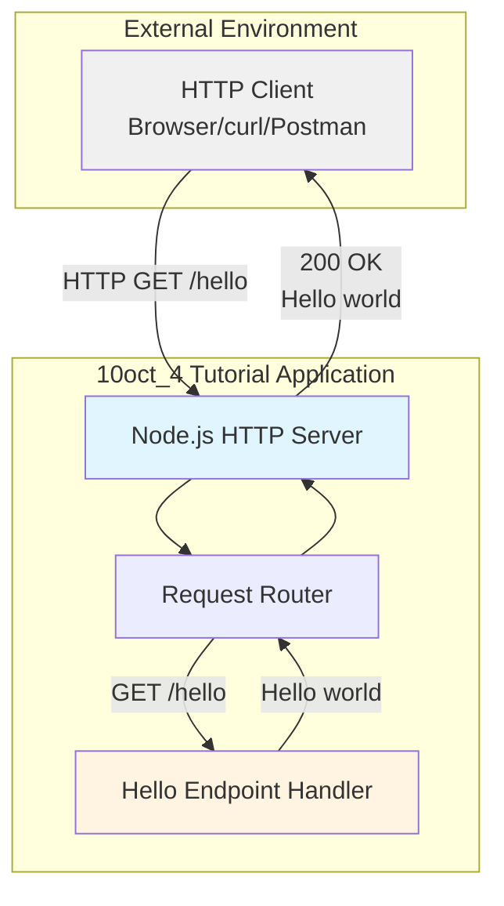

#### 1.2.2.2 Major System Components

The application architecture consists of the following essential components:

| Component | Responsibility | Key Functions |
|-----------|---------------|---------------|
| HTTP Server | Core runtime service | Listen for incoming requests, manage connection lifecycle |
| Request Router | Route determination | Map incoming requests to appropriate handlers |
| Endpoint Handler | Response generation | Process `/hello` requests and generate "Hello world" response |

**Component Interaction Flow**:

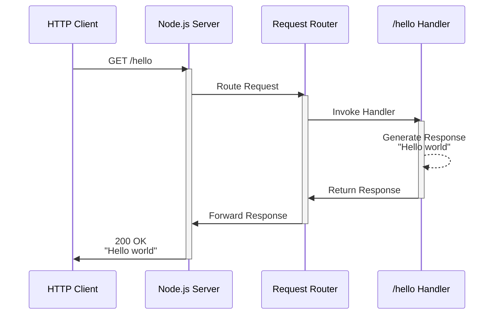

#### 1.2.2.3 Core Technical Approach

**Technology Foundation**:
- **Runtime Environment**: Node.js (JavaScript execution environment)
- **Server Implementation**: HTTP server using either native Node.js `http` module or lightweight framework
- **Communication Protocol**: HTTP/1.1
- **Response Format**: Plain text (text/plain)

**Architectural Principles**:
- Minimalism: Include only essential components for the tutorial objective
- Clarity: Code structure emphasizes readability over optimization
- Simplicity: Single-file implementation where practical
- Transparency: Expose the request-response mechanism without abstraction layers

### 1.2.3 Success Criteria

#### 1.2.3.1 Measurable Objectives

The tutorial project will be considered successful when it achieves the following measurable outcomes:

| Objective | Success Metric | Validation Method |
|-----------|---------------|-------------------|
| Server Functionality | Server starts without errors and listens on configured port | Successful process execution and port binding |
| Endpoint Accessibility | `/hello` endpoint responds to HTTP GET requests | HTTP client receives 200 OK status code |
| Correct Response | Response body contains exactly "Hello world" | String comparison of response payload |

#### 1.2.3.2 Critical Success Factors

**Technical Success Factors**:
- Server initializes and runs on standard Node.js installations without external dependencies (if using native modules)
- Code executes without runtime errors under normal operation
- Response time is immediate for the simple endpoint (sub-second latency)
- Application can be terminated gracefully without hanging processes

**Educational Success Factors**:
- Code is self-documenting with clear variable and function names
- Implementation is concise enough to review in a single sitting
- Concepts demonstrated are transferable to more complex applications
- Learners can modify and experiment with the code easily

#### 1.2.3.3 Key Performance Indicators

While this tutorial project does not require production-grade performance, the following KPIs establish reasonable expectations:

**Functional KPIs**:
- **Uptime**: Server runs continuously during development sessions
- **Response Accuracy**: 100% of requests to `/hello` return correct payload
- **Error Rate**: Zero errors for valid requests to `/hello` endpoint

**Educational KPIs**:
- **Comprehension**: Learners can explain the flow from request to response
- **Reproducibility**: Learners can recreate similar endpoints independently
- **Foundation**: Learners feel prepared to explore framework-based approaches

## 1.3 Scope

### 1.3.1 In-Scope Elements

#### 1.3.1.1 Core Features and Functionalities

The tutorial application scope is intentionally minimal to maintain educational focus. The following features constitute the complete functional scope:

**Mandatory Capabilities**:

| Feature | Description | Technical Requirement |
|---------|-------------|----------------------|
| HTTP Server | Basic web server listening for incoming connections | Node.js server initialization and port binding |
| GET /hello Endpoint | Single route responding to HTTP GET method | Request routing for exact path match |
| Plain Text Response | Return "Hello world" string | Response with text/plain content type |

**Primary User Workflow**:
1. Developer starts the Node.js application
2. Server initializes and begins listening on a designated port
3. User sends HTTP GET request to `/hello` endpoint
4. Server processes request and returns "Hello world" response
5. User receives response in HTTP client

**Essential Technical Requirements**:
- Node.js runtime environment installed
- Server listens on a configurable port (typically 3000 or 8080)
- Endpoint accessible via localhost
- UTF-8 text encoding for response

#### 1.3.1.2 Implementation Boundaries

**System Boundaries**:

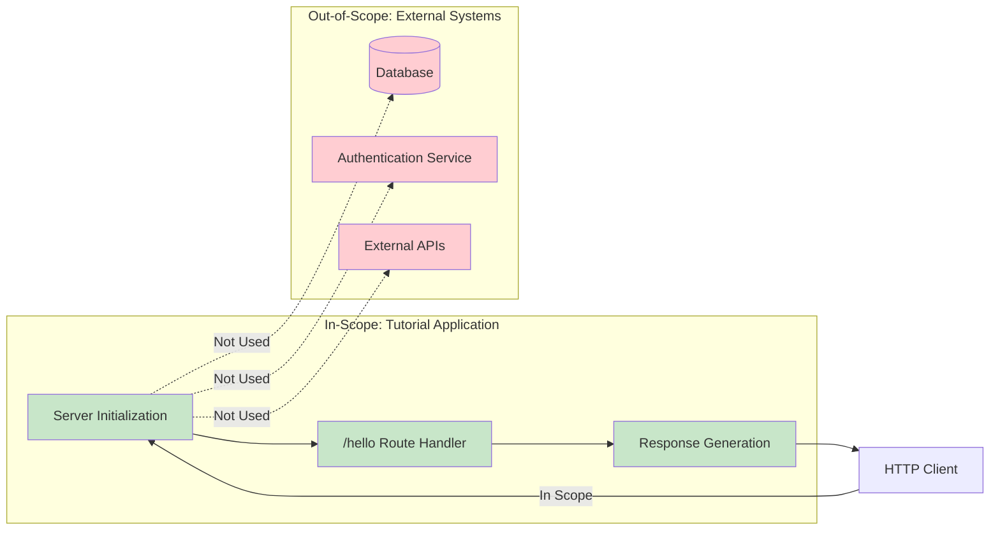

**Coverage Boundaries**:
- **User Groups**: Developers with local access to the application (no remote users)
- **Geographic Scope**: Localhost development environment only
- **Data Domains**: Static string response only (no dynamic data or databases)
- **Execution Environment**: Single-instance local development (no distributed deployment)

### 1.3.2 Out-of-Scope Elements

#### 1.3.2.1 Explicitly Excluded Features

To maintain tutorial simplicity and focus, the following features are explicitly excluded from this implementation:

**Excluded Functionality**:

| Category | Excluded Elements | Rationale |
|----------|------------------|-----------|
| Additional Endpoints | Any routes beyond `/hello` | Maintains singular focus on basic endpoint pattern |
| HTTP Methods | POST, PUT, DELETE, PATCH, etc. | Simplifies to read-only operation |
| Request Processing | Body parsing, query parameters, path variables | Eliminates complexity not needed for demonstration |
| Authentication | User login, API keys, tokens | Not required for basic endpoint functionality |

**Infrastructure Exclusions**:
- Database integration (SQL, NoSQL, in-memory stores)
- Session management and state persistence
- File system operations (reading, writing, uploads)
- External API integrations or third-party services
- Message queues or event streaming systems
- Caching layers (Redis, Memcached)
- Load balancing or reverse proxy configurations

**Production Features Out of Scope**:
- Comprehensive error handling and recovery mechanisms
- Logging and monitoring systems
- Security hardening (HTTPS, CORS, rate limiting)
- Environment-based configuration management
- Automated testing frameworks (unit, integration, e2e)
- CI/CD pipeline integration
- Container orchestration (Docker, Kubernetes)
- Performance optimization and profiling
- API documentation generation (Swagger, OpenAPI)
- Health check endpoints
- Metrics and telemetry collection

#### 1.3.2.2 Future Phase Considerations

While not implemented in this initial tutorial, the following enhancements could be considered for advanced learning modules:

**Potential Extensions**:
- Adding multiple endpoints to demonstrate routing patterns
- Implementing POST endpoint with request body handling
- Introducing error handling for non-existent routes
- Adding middleware concepts for request/response processing
- Integrating a lightweight framework (Express.js) for comparison
- Implementing environment variable configuration
- Adding basic logging for request tracking

**Integration Points Not Covered**:
- Database connectivity for data persistence
- External authentication providers (OAuth, SAML)
- Third-party API consumption
- Message broker integrations

**Unsupported Use Cases**:
- Production deployment scenarios
- Multi-user concurrent access patterns
- Complex business logic implementation
- Data validation and transformation
- File upload/download operations
- WebSocket or real-time communication
- GraphQL or alternative API paradigms
- Microservices architecture patterns

#### References

**Files Examined**:
- `README.md` - Project identifier confirming repository name "10oct_4"

**Folders Explored**:
- `/` (root directory, depth: 0) - Confirmed greenfield project status with no existing implementation

**Source of Requirements**:
- User Context: Node.js tutorial project specification requiring single `/hello` endpoint returning "Hello world" to HTTP clients

# 2. Product Requirements

## 2.1 Overview and Approach

### 2.1.1 Requirements Philosophy

The **10oct_4** tutorial project requirements are designed with educational clarity as the primary objective. Each requirement is intentionally scoped to demonstrate fundamental Node.js HTTP server concepts without introducing unnecessary complexity. This section breaks down the product into discrete, testable features that collectively deliver a minimal yet complete learning experience.

### 2.1.2 Requirement Principles

The requirements framework adheres to the following principles:

- **Testability**: Every requirement includes specific, measurable acceptance criteria
- **Minimalism**: Only features essential to the tutorial objective are included
- **Clarity**: Requirements use precise language accessible to beginning developers
- **Traceability**: Each requirement links to user needs and technical specifications
- **Educational Value**: Requirements prioritize learning outcomes over production features

### 2.1.3 Requirement Categories

Requirements are organized into two primary features representing the core capabilities:

| Category | Feature Count | Priority Level | Implementation Status |
|----------|---------------|----------------|----------------------|
| Core Infrastructure | 1 | Critical | Proposed |
| Core Functionality | 1 | Critical | Proposed |

## 2.2 Feature Catalog

### 2.2.1 Feature F-001: HTTP Server Initialization

#### 2.2.1.1 Feature Metadata

| Attribute | Value |
|-----------|-------|
| **Feature ID** | F-001 |
| **Feature Name** | HTTP Server Initialization |
| **Category** | Core Infrastructure |
| **Priority** | Critical |
| **Status** | Proposed |
| **Complexity** | Low |

#### 2.2.1.2 Feature Description

**Overview**

The HTTP Server Initialization feature establishes the foundational runtime service that enables the application to receive and respond to HTTP requests. This feature creates a basic web server instance that listens for incoming connections on a configured network port, providing the essential infrastructure upon which all endpoint functionality depends.

**Business Value**

This feature delivers the following business and educational value:

- **Foundation Establishment**: Provides the essential infrastructure required for any HTTP-based service
- **Concept Demonstration**: Illustrates server lifecycle management, port binding, and connection handling
- **Learning Baseline**: Creates a working server that learners can observe, modify, and expand
- **Immediate Feedback**: Enables hands-on experimentation with running server instances

**User Benefits**

Target users (beginning Node.js developers) benefit from:

- **Practical Understanding**: Hands-on experience with server initialization patterns
- **Demystification**: Removes abstraction layers to reveal core server mechanics
- **Confidence Building**: Successfully running a server provides tangible achievement
- **Transferable Knowledge**: Server initialization patterns apply across Node.js applications

**Technical Context**

The server implementation will utilize either the native Node.js `http` module or a minimal framework, demonstrating the fundamental patterns of:

- Creating an HTTP server instance
- Binding to a designated network port (typically 3000 or 8080)
- Listening for incoming TCP connections
- Managing server lifecycle (startup and graceful termination)
- Providing request routing capabilities to downstream handlers

#### 2.2.1.3 Feature Dependencies

**Prerequisite Features**

- None (F-001 is the foundational feature with no internal dependencies)

**System Dependencies**

| Dependency | Type | Version Requirement | Purpose |
|------------|------|---------------------|---------|
| Node.js Runtime | External | Any stable version | JavaScript execution environment |
| Operating System | External | Windows/macOS/Linux | Network socket support |
| Network Stack | System | TCP/IP | Port binding and connection handling |

**External Dependencies**

- **Optional Framework**: If using a lightweight framework (e.g., Express.js), it would be installed via npm
- **No Mandatory Externals**: Native `http` module implementation requires no external packages

**Integration Requirements**

- Must expose request routing mechanism for endpoint handlers (F-002)
- Must provide response generation interface
- Must support graceful startup and shutdown operations

### 2.2.2 Feature F-002: GET /hello Endpoint

#### 2.2.2.1 Feature Metadata

| Attribute | Value |
|-----------|-------|
| **Feature ID** | F-002 |
| **Feature Name** | GET /hello Endpoint |
| **Category** | Core Functionality |
| **Priority** | Critical |
| **Status** | Proposed |
| **Complexity** | Low |

#### 2.2.2.2 Feature Description

**Overview**

The GET /hello Endpoint feature implements a single HTTP route that responds to GET requests at the `/hello` path with a plain text "Hello world" message. This endpoint represents the core educational objective of the tutorial, demonstrating the complete request-response cycle in its simplest form.

**Business Value**

This feature delivers the following value propositions:

- **Core Demonstration**: Illustrates the fundamental pattern of endpoint creation and request routing
- **Complete Example**: Provides end-to-end functionality from request reception to response delivery
- **Pattern Template**: Establishes a reusable pattern for creating additional endpoints
- **Learning Milestone**: Offers a concrete achievement that validates understanding

**User Benefits**

Learners gain the following benefits:

- **Endpoint Understanding**: Clear illustration of how HTTP routes map to handler functions
- **Response Generation**: Practical experience with creating and returning HTTP responses
- **Testing Capability**: Working endpoint enables immediate testing with browsers or HTTP clients
- **Modification Baseline**: Simple endpoint serves as a starting point for experimentation

**Technical Context**

The endpoint implementation demonstrates:

- Exact path matching for `/hello` route
- HTTP GET method handling
- Plain text response generation (Content-Type: text/plain)
- HTTP 200 OK status code for successful requests
- Static string response without dynamic data processing

#### 2.2.2.3 Feature Dependencies

**Prerequisite Features**

| Feature ID | Feature Name | Dependency Type | Reason |
|------------|-------------|-----------------|---------|
| F-001 | HTTP Server Initialization | Hard Dependency | Provides routing infrastructure and request handling |

**System Dependencies**

- Inherits all system dependencies from F-001 (Node.js runtime, OS, network stack)

**External Dependencies**

- None beyond those inherited from F-001

**Integration Requirements**

- Must integrate with routing mechanism provided by F-001
- Must utilize response generation interface from server instance
- Must comply with HTTP/1.1 protocol specifications for GET requests

## 2.3 Functional Requirements

### 2.3.1 Feature F-001: HTTP Server Initialization Requirements

#### 2.3.1.1 Requirement F-001-RQ-001: Server Instance Creation

| Attribute | Details |
|-----------|---------|
| **Requirement ID** | F-001-RQ-001 |
| **Priority** | Must-Have |
| **Complexity** | Low |

**Description**

The system must create an HTTP server instance that can accept and process incoming network connections.

**Acceptance Criteria**

- Server instance is successfully created using Node.js HTTP capabilities
- Server initializes without runtime errors or exceptions
- Server object provides methods for starting, stopping, and handling requests
- Server initialization completes in under 1 second

**Technical Specifications**

| Specification | Value |
|--------------|-------|
| **Input Parameters** | Port number (integer, typically 3000 or 8080) |
| **Output/Response** | Running server instance bound to specified port |
| **Performance Criteria** | Initialization time < 1 second |

**Data Requirements**

- Configuration: Port number (integer in range 1024-65535 for non-privileged ports)
- No persistent data storage required

**Validation Rules**

- **Business Rules**: Server must bind to localhost only (no external network access)
- **Data Validation**: Port number must be valid and available (not already in use)
- **Security Requirements**: No authentication required (localhost development only)
- **Compliance Requirements**: None (tutorial scope)

#### 2.3.1.2 Requirement F-001-RQ-002: Port Binding and Listening

| Attribute | Details |
|-----------|---------|
| **Requirement ID** | F-001-RQ-002 |
| **Priority** | Must-Have |
| **Complexity** | Low |

**Description**

The server must successfully bind to a designated network port and listen for incoming HTTP connections.

**Acceptance Criteria**

- Server binds to configured port without errors
- Port becomes accessible to HTTP clients on localhost
- Server enters listening state and accepts connections
- Console confirmation message displayed upon successful binding

**Technical Specifications**

| Specification | Value |
|--------------|-------|
| **Input Parameters** | Port number, hostname (localhost/127.0.0.1) |
| **Output/Response** | Listening server, console confirmation |
| **Performance Criteria** | Port binding completes immediately |

**Data Requirements**

- Port number: 3000 or 8080 (configurable)
- Hostname: localhost or 127.0.0.1

**Validation Rules**

- **Business Rules**: Must use localhost binding only (no 0.0.0.0 binding for external access)
- **Data Validation**: Verify port is not already in use before binding
- **Security Requirements**: No certificate or encryption required (HTTP only)
- **Compliance Requirements**: None

#### 2.3.1.3 Requirement F-001-RQ-003: Request Routing Capability

| Attribute | Details |
|-----------|---------|
| **Requirement ID** | F-001-RQ-003 |
| **Priority** | Must-Have |
| **Complexity** | Low |

**Description**

The server must provide a mechanism to route incoming requests to appropriate endpoint handlers based on request path.

**Acceptance Criteria**

- Server can distinguish between different URL paths
- Requests to `/hello` route to the hello endpoint handler
- Routing decision occurs before handler invocation
- Routing mechanism supports exact path matching

**Technical Specifications**

| Specification | Value |
|--------------|-------|
| **Input Parameters** | HTTP request with method and path |
| **Output/Response** | Handler invocation for matched route |
| **Performance Criteria** | Route matching < 1ms |

**Data Requirements**

- Request path string from HTTP request
- Route mapping configuration (path → handler)

**Validation Rules**

- **Business Rules**: Only exact path matches are supported (no pattern matching)
- **Data Validation**: Path must be well-formed URL path string
- **Security Requirements**: No path traversal validation required (single endpoint)
- **Compliance Requirements**: None

### 2.3.2 Feature F-002: GET /hello Endpoint Requirements

#### 2.3.2.1 Requirement F-002-RQ-001: GET Request Handling

| Attribute | Details |
|-----------|---------|
| **Requirement ID** | F-002-RQ-001 |
| **Priority** | Must-Have |
| **Complexity** | Low |

**Description**

The `/hello` endpoint must respond to HTTP GET requests at the exact path `/hello`.

**Acceptance Criteria**

- Server routes requests with path `/hello` to the hello handler
- Only GET method is accepted (other methods are out of scope for tutorial)
- Returns HTTP 200 OK status code for successful requests
- Handler executes without errors or exceptions

**Technical Specifications**

| Specification | Value |
|--------------|-------|
| **Input Parameters** | HTTP Method: GET, Path: /hello |
| **Output/Response** | HTTP 200 OK with response body |
| **Performance Criteria** | Handler execution < 10ms |

**Data Requirements**

- No query parameters required
- No request headers required beyond standard HTTP headers
- No request body expected (GET method)

**Validation Rules**

- **Business Rules**: Endpoint accessible via localhost only
- **Data Validation**: No input validation required (no parameters)
- **Security Requirements**: None (tutorial scope, localhost only)
- **Compliance Requirements**: HTTP/1.1 protocol compliance

#### 2.3.2.2 Requirement F-002-RQ-002: Response Content Generation

| Attribute | Details |
|-----------|---------|
| **Requirement ID** | F-002-RQ-002 |
| **Priority** | Must-Have |
| **Complexity** | Low |

**Description**

The endpoint must return the exact plain text string "Hello world" as the response body.

**Acceptance Criteria**

- Response body contains exactly the string "Hello world" (case-sensitive)
- Content-Type header set to `text/plain`
- Character encoding is UTF-8
- Response is generated immediately without delay
- No extraneous whitespace or formatting characters

**Technical Specifications**

| Specification | Value |
|--------------|-------|
| **Input Parameters** | None (static response) |
| **Output/Response** | Plain text: "Hello world" |
| **Performance Criteria** | Response generation < 1ms, total response time < 100ms |

**Data Requirements**

- Static string constant: "Hello world"
- No database or external data source required
- No dynamic data processing needed

**Validation Rules**

- **Business Rules**: Response content must be exact string match
- **Data Validation**: No output validation required (static response)
- **Security Requirements**: No XSS concerns (plain text, no HTML)
- **Compliance Requirements**: UTF-8 encoding standard

#### 2.3.2.3 Requirement F-002-RQ-003: HTTP Response Headers

| Attribute | Details |
|-----------|---------|
| **Requirement ID** | F-002-RQ-003 |
| **Priority** | Should-Have |
| **Complexity** | Low |

**Description**

The response must include appropriate HTTP headers for content type and character encoding.

**Acceptance Criteria**

- Content-Type header set to `text/plain; charset=utf-8`
- HTTP status code 200 OK included in response
- Standard HTTP response headers present
- No caching headers required (tutorial scope)

**Technical Specifications**

| Specification | Value |
|--------------|-------|
| **Input Parameters** | None |
| **Output/Response** | HTTP headers collection |
| **Performance Criteria** | Header generation < 1ms |

**Data Requirements**

- Header name-value pairs:
  - `Content-Type: text/plain; charset=utf-8`
  - `Content-Length: 11` (length of "Hello world")

**Validation Rules**

- **Business Rules**: Headers must comply with HTTP/1.1 specification
- **Data Validation**: Header names and values must be well-formed
- **Security Requirements**: No security headers required (localhost only)
- **Compliance Requirements**: HTTP/1.1 standard compliance

## 2.4 Feature Relationships and Dependencies

### 2.4.1 Feature Dependency Map

The following diagram illustrates the dependency relationships between features in the 10oct_4 tutorial application:

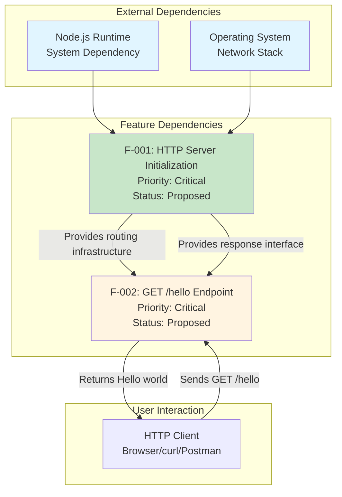

### 2.4.2 Integration Points

#### 2.4.2.1 Server-to-Endpoint Integration

**Integration Point**: F-001 → F-002

| Aspect | Details |
|--------|---------|
| **Interface Type** | Request routing and handler invocation |
| **Data Flow** | HTTP request object passed from server to endpoint handler |
| **Coupling** | Tight coupling through routing mechanism |

**Integration Mechanism**:

1. Server receives incoming HTTP request
2. Server extracts request path and method
3. Server matches path `/hello` and method `GET`
4. Server invokes hello endpoint handler with request context
5. Handler generates response
6. Handler returns response to server
7. Server transmits response to client

#### 2.4.2.2 Response Generation Integration

**Integration Point**: F-002 → F-001

| Aspect | Details |
|--------|---------|
| **Interface Type** | Response object manipulation |
| **Data Flow** | Response status, headers, and body set by handler |
| **Coupling** | Tight coupling through response object interface |

**Integration Pattern**:
- Handler receives response object from server
- Handler sets status code (200)
- Handler sets Content-Type header
- Handler writes response body
- Handler signals completion to server

### 2.4.3 Shared Components

#### 2.4.3.1 HTTP Request/Response Handling

**Component**: Core HTTP protocol handling mechanism

| Attribute | Value |
|-----------|-------|
| **Shared By** | F-001 (Server), F-002 (Endpoint) |
| **Purpose** | Uniform interface for request and response objects |
| **Implementation** | Node.js http module native objects |

**Shared Capabilities**:
- Request parsing (method, path, headers)
- Response generation (status, headers, body)
- Protocol compliance (HTTP/1.1)

#### 2.4.3.2 Port Configuration

**Component**: Port number configuration

| Attribute | Value |
|-----------|-------|
| **Shared By** | F-001 (Server Initialization) |
| **Purpose** | Centralized port configuration |
| **Implementation** | Constant or environment variable |

**Configuration Scope**:
- Affects server binding in F-001
- Referenced in startup logging
- Used in documentation and examples

### 2.4.4 Common Services

#### 2.4.4.1 Node.js Runtime Environment

**Service**: JavaScript execution and HTTP module access

All features depend on Node.js providing:
- JavaScript execution environment
- Native `http` module (or framework support)
- Event loop for asynchronous operations
- Network socket access

#### 2.4.4.2 Operating System Network Stack

**Service**: TCP/IP networking capabilities

All features depend on OS providing:
- Port binding capability
- TCP socket management
- Localhost loopback interface
- Connection accept/close operations

## 2.5 Implementation Considerations

### 2.5.1 Feature F-001: HTTP Server Implementation

#### 2.5.1.1 Technical Constraints

**Runtime Constraints**:
- Requires Node.js installed on developer's local machine
- Must run on single instance (no clustering or load balancing)
- Limited to localhost binding (no external network access)
- No multi-threading considerations (single-threaded Node.js event loop)

**Environment Constraints**:
- Development environment only (not designed for production)
- Port must be available (not used by other processes)
- No container orchestration or cloud deployment
- Local file system access for source code

**Implementation Constraints**:
- Single-file implementation preferred for tutorial clarity
- Minimal or zero external dependencies recommended
- Code must be readable by beginning developers
- No complex design patterns required

#### 2.5.1.2 Performance Requirements

| Metric | Requirement | Rationale |
|--------|-------------|-----------|
| **Startup Time** | < 1 second | Immediate feedback for learners |
| **Port Binding** | < 100ms | Standard OS operation speed |
| **Memory Footprint** | < 50MB | Minimal resource consumption |
| **CPU Usage** | < 5% idle | Efficient event loop utilization |

**Performance Validation**:
- Startup time measured from process start to "listening" confirmation
- No load testing required (single-user tutorial environment)
- No performance profiling or optimization needed

#### 2.5.1.3 Scalability Considerations

**Not Applicable for Tutorial Scope**:

The tutorial application is explicitly scoped for single-instance, single-user educational purposes. The following scalability concerns are intentionally excluded:

- Concurrent request handling capacity
- Horizontal scaling across multiple instances
- Vertical scaling for high throughput
- Connection pooling and resource limits
- Rate limiting and traffic management

**Future Scalability Considerations** (Out of Current Scope):
- Could be extended to demonstrate clustering module
- Could introduce load balancer concepts
- Could explore process management with PM2

#### 2.5.1.4 Security Implications

**Tutorial Security Posture**:

| Security Aspect | Status | Justification |
|----------------|--------|---------------|
| **Authentication** | Not Implemented | Tutorial scope, localhost only |
| **Authorization** | Not Implemented | Single-user educational environment |
| **Encryption (HTTPS)** | Not Implemented | Localhost communication, no sensitive data |
| **Input Validation** | Not Required | No user input parameters |
| **CORS** | Not Implemented | Single-origin, localhost access |
| **Rate Limiting** | Not Implemented | No abuse potential in tutorial |

**Security Best Practices for Educational Context**:
- Localhost binding prevents external network exposure
- No sensitive data processed or stored
- No user authentication or session management
- Clear documentation that this is not production-ready code

**Production Security Disclaimer**:
The tutorial explicitly documents that this implementation is for learning purposes and requires significant security hardening for production use.

#### 2.5.1.5 Maintenance Requirements

**Code Maintainability**:
- Clear, descriptive variable and function names
- Minimal abstraction layers for maximum transparency
- Inline comments explaining key concepts
- Self-documenting code structure

**Update Considerations**:
- Compatible with stable Node.js versions
- No breaking changes expected from Node.js http module
- Minimal maintenance burden (static educational content)
- Version pinning not required for native modules

**Documentation Requirements**:
- README with clear setup and execution instructions
- Code comments explaining Node.js concepts
- Example usage scenarios included
- Troubleshooting guidance for common issues

### 2.5.2 Feature F-002: GET /hello Endpoint Implementation

#### 2.5.2.1 Technical Constraints

**Routing Constraints**:
- Exact path match only (`/hello`, not `/hello/` or `/hello/*`)
- GET method only (other HTTP methods not handled)
- No query parameter processing
- No path parameter extraction

**Response Constraints**:
- Static response content only (no dynamic generation)
- Plain text format required (no JSON, HTML, or XML)
- UTF-8 encoding mandatory
- No response streaming or chunked encoding

**Implementation Constraints**:
- Handler logic must be simple and readable
- No external data sources or API calls
- No asynchronous operations required (static response)
- No template rendering or view engines

#### 2.5.2.2 Performance Requirements

| Metric | Requirement | Measurement Method |
|--------|-------------|--------------------|
| **Response Time** | < 100ms | Client-measured request-response cycle |
| **Handler Execution** | < 10ms | Server-side handler processing time |
| **Throughput** | Not Specified | Not critical for tutorial |
| **Latency** | Sub-second | Immediate user feedback |

**Performance Characteristics**:
- Static string response requires minimal processing
- No database queries or I/O operations
- Event loop blocking: < 1ms
- Memory allocation: negligible (static string)

#### 2.5.2.3 Scalability Considerations

**Not Applicable for Tutorial Scope**:

The endpoint is designed for single-user educational demonstration. Scalability concerns explicitly excluded:

- Concurrent request handling not tested
- No connection limits or queuing
- No caching mechanisms required
- No CDN or edge distribution

**Inherent Scalability Characteristics**:
- Stateless endpoint (no session or state management)
- Minimal resource consumption per request
- Could theoretically handle concurrent requests due to Node.js event loop

#### 2.5.2.4 Security Implications

**Endpoint Security Analysis**:

| Threat Vector | Risk Level | Mitigation |
|---------------|------------|------------|
| **Injection Attacks** | None | No input parameters to inject |
| **XSS** | None | Plain text response, no HTML rendering |
| **CSRF** | None | Read-only GET endpoint, no state changes |
| **DoS** | Low | Localhost only, single-user environment |

**Security Posture**:
- No user input to validate or sanitize
- Static response eliminates injection risks
- Plain text format prevents XSS vulnerabilities
- GET method ensures no state modifications
- Localhost binding prevents external attacks

**Security Considerations for Extended Learning**:
- Could demonstrate input validation with query parameters
- Could introduce authentication concepts in advanced version
- Could explore HTTPS setup in production-focused tutorial

#### 2.5.2.5 Maintenance Requirements

**Code Simplicity**:
- Handler should be 5-10 lines of code maximum
- No complex logic or conditionals
- Clear response generation pattern
- Easily modifiable for experimentation

**Evolution Path**:
- Learners can easily modify response text
- Can add logging statements for debugging
- Can experiment with different status codes
- Can explore response headers

**Testing Approach**:
- Manual testing with browser sufficient
- curl command examples provided
- Postman collection optional
- No automated testing framework required

**Documentation Needs**:
- Example requests and responses
- Common modifications for learning
- Expected output screenshots
- Troubleshooting guide for common errors

## 2.6 Requirements Traceability Matrix

### 2.6.1 User Need to Requirement Mapping

| User Need | Requirement ID | Feature | Acceptance Criteria | Priority |
|-----------|----------------|---------|---------------------|----------|
| Understand server initialization | F-001-RQ-001 | HTTP Server | Server creates without errors | Must-Have |
| See server listening on port | F-001-RQ-002 | HTTP Server | Port binding successful | Must-Have |
| Route requests to handlers | F-001-RQ-003 | HTTP Server | /hello routes correctly | Must-Have |
| Make HTTP GET request | F-002-RQ-001 | GET /hello | Responds to GET /hello | Must-Have |
| Receive "Hello world" | F-002-RQ-002 | GET /hello | Returns exact string | Must-Have |
| See proper HTTP headers | F-002-RQ-003 | GET /hello | Content-Type set correctly | Should-Have |

### 2.6.2 Requirement to Technical Specification Mapping

| Requirement ID | Technical Spec Reference | Implementation Component | Test Method |
|----------------|-------------------------|-------------------------|-------------|
| F-001-RQ-001 | Section 1.2.2.2 (Server Component) | Node.js http.createServer() | Process execution verification |
| F-001-RQ-002 | Section 1.2.2.2 (Server Component) | server.listen(port) | Port accessibility test |
| F-001-RQ-003 | Section 1.2.2.2 (Router Component) | Request path matching | Route invocation verification |
| F-002-RQ-001 | Section 1.2.2.1 (Primary Capabilities) | GET /hello handler | HTTP client GET request |
| F-002-RQ-002 | Section 1.2.2.1 (Primary Capabilities) | Response body generation | Response body assertion |
| F-002-RQ-003 | Section 1.2.2.1 (Primary Capabilities) | Response header setting | Header inspection |

### 2.6.3 Requirement to Source Documentation Mapping

| Requirement ID | Source Document | Section/Reference | Verification Status |
|----------------|----------------|-------------------|---------------------|
| F-001-RQ-001 | User Context | "nodejs tutorial project" | Confirmed |
| F-001-RQ-002 | Technical Spec | Section 1.2.2 System Overview | Confirmed |
| F-001-RQ-003 | Technical Spec | Section 1.2.2.2 Components | Confirmed |
| F-002-RQ-001 | User Context | "one end point '/hello'" | Confirmed |
| F-002-RQ-002 | User Context | "returns 'Hello world'" | Confirmed |
| F-002-RQ-003 | Technical Spec | Section 1.2.2.1 Technical Approach | Confirmed |

### 2.6.4 Feature to Process Flow Mapping

The following diagram illustrates how requirements flow through the system architecture documented in Section 1.2.2:

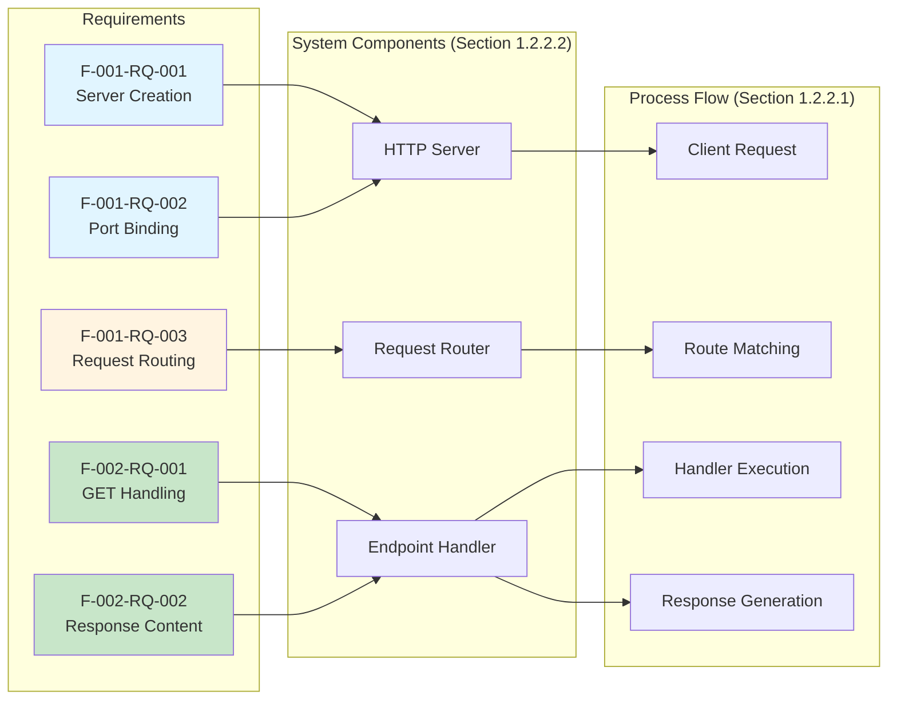

## 2.7 Acceptance Testing Framework

### 2.7.1 Feature F-001 Acceptance Tests

#### 2.7.1.1 Test Case: Server Initialization

| Test Attribute | Details |
|----------------|---------|
| **Test ID** | TC-F001-001 |
| **Requirement** | F-001-RQ-001 |
| **Test Type** | Functional |

**Test Steps**:
1. Execute Node.js application file
2. Observe console output
3. Verify no error messages appear
4. Confirm startup time < 1 second

**Expected Results**:
- Application starts without exceptions
- Server initialization completes successfully
- Console displays startup confirmation message

**Pass Criteria**: Server creates and initializes without errors

#### 2.7.1.2 Test Case: Port Binding

| Test Attribute | Details |
|----------------|---------|
| **Test ID** | TC-F001-002 |
| **Requirement** | F-001-RQ-002 |
| **Test Type** | Functional |

**Test Steps**:
1. Start server application
2. Verify console message indicating port binding
3. Attempt to connect to localhost:[port]
4. Confirm connection is accepted

**Expected Results**:
- Server binds to configured port (e.g., 3000)
- Console displays "Server listening on port 3000" or similar
- Port is accessible via localhost

**Pass Criteria**: Server successfully binds and listens on designated port

### 2.7.2 Feature F-002 Acceptance Tests

#### 2.7.2.1 Test Case: GET Request Handling

| Test Attribute | Details |
|----------------|---------|
| **Test ID** | TC-F002-001 |
| **Requirement** | F-002-RQ-001 |
| **Test Type** | Functional |

**Test Steps**:
1. Start server application
2. Open browser or HTTP client
3. Send GET request to `http://localhost:[port]/hello`
4. Observe response status code

**Expected Results**:
- HTTP status code 200 OK received
- Response is returned without errors
- Response time < 100ms

**Pass Criteria**: Server responds with HTTP 200 OK to GET /hello

#### 2.7.2.2 Test Case: Response Content Verification

| Test Attribute | Details |
|----------------|---------|
| **Test ID** | TC-F002-002 |
| **Requirement** | F-002-RQ-002 |
| **Test Type** | Functional |

**Test Steps**:
1. Start server application
2. Send GET request to /hello endpoint
3. Capture response body
4. Compare response body to expected string

**Expected Results**:
- Response body contains exactly "Hello world"
- No additional characters or whitespace
- Content-Type header is text/plain

**Pass Criteria**: Response body equals "Hello world" exactly

#### 2.7.2.3 Test Case: Response Headers

| Test Attribute | Details |
|----------------|---------|
| **Test ID** | TC-F002-003 |
| **Requirement** | F-002-RQ-003 |
| **Test Type** | Functional |

**Test Steps**:
1. Send GET request to /hello endpoint
2. Inspect response headers
3. Verify Content-Type header value
4. Verify character encoding specification

**Expected Results**:
- Content-Type: text/plain; charset=utf-8
- HTTP status: 200 OK
- Content-Length: 11

**Pass Criteria**: Response headers include proper Content-Type with UTF-8 encoding

## 2.8 Assumptions and Constraints

### 2.8.1 Assumptions

#### 2.8.1.1 Technical Assumptions

**Development Environment**:
- Developers have Node.js installed (any stable version compatible with http module)
- Command-line access available for running Node.js applications
- Port 3000 or 8080 is available (not used by other applications)
- Localhost loopback interface is functional

**User Knowledge**:
- Basic familiarity with JavaScript syntax and concepts
- Understanding of HTTP request-response model
- Ability to use command-line interfaces
- Access to HTTP client (browser, curl, Postman, or similar)

**Operational Assumptions**:
- Application runs in development mode only
- Single developer using application at a time
- Network connectivity not required (localhost only)
- No firewall blocking localhost traffic

#### 2.8.1.2 Business Assumptions

**Educational Context**:
- Users are learning Node.js for educational purposes
- Tutorial is part of self-paced or instructor-led learning
- Learners will read source code and documentation
- Learners will experiment with modifications

**Success Metrics**:
- Learners successfully run the application
- Learners understand the request-response flow
- Learners can recreate similar endpoints independently
- Learners feel prepared for framework-based development

### 2.8.2 Constraints

#### 2.8.2.1 Scope Constraints

**Intentional Limitations** (Documented in Section 1.3):

| Constraint Category | Specific Limitations | Rationale |
|---------------------|---------------------|-----------|
| **Endpoints** | Single /hello endpoint only | Maintains singular educational focus |
| **HTTP Methods** | GET only | Simplifies to read-only operation |
| **Data Processing** | No input parameters | Eliminates validation complexity |
| **Security** | No authentication | Tutorial scope, localhost only |

**Out-of-Scope Features** (per Section 1.3.2):
- Additional endpoints beyond /hello
- POST, PUT, DELETE, PATCH methods
- Request body parsing
- Query parameter handling
- Database integration
- External API calls
- Authentication and authorization
- Error handling for non-existent routes
- Production security features

#### 2.8.2.2 Technical Constraints

**Platform Constraints**:
- Requires Node.js runtime environment
- Limited to operating systems supporting Node.js
- Single-instance execution (no distributed deployment)
- Localhost binding only (no external network access)

**Implementation Constraints**:
- Must use native Node.js modules or minimal framework
- Code must be beginner-friendly (no advanced patterns)
- Single-file implementation strongly preferred
- Minimal or zero external dependencies

**Performance Constraints**:
- Not optimized for high-throughput scenarios
- No load testing or stress testing performed
- No scalability benchmarking required
- Performance adequate for tutorial demonstrations

#### 2.8.2.3 Environmental Constraints

**Deployment Constraints**:
- Development environment only
- No production deployment supported
- No containerization required
- No cloud platform integration

**Operational Constraints**:
- Manual startup and shutdown (no process management)
- No automated monitoring or logging
- No health checks or liveness probes
- No graceful reload or zero-downtime updates

### 2.8.3 Dependency Constraints

**External Dependencies**:
- Node.js runtime (version not strictly specified)
- Operating system with TCP/IP networking support
- Optional: HTTP client for testing (browser, curl)

**No Required External Packages**:
- If using native http module: zero npm dependencies
- If using Express.js: single lightweight framework dependency
- No database drivers required
- No authentication libraries needed

## 2.9 Summary and Next Steps

### 2.9.1 Requirements Summary

The **10oct_4** tutorial project requirements define a minimal, focused HTTP server application consisting of two critical features:

**Feature Summary**:
- **F-001: HTTP Server Initialization** - Foundational infrastructure for request handling
- **F-002: GET /hello Endpoint** - Core demonstration of request routing and response generation

**Requirements Count**:
- Total Features: 2
- Total Functional Requirements: 6
- Must-Have Requirements: 5
- Should-Have Requirements: 1
- Acceptance Test Cases: 5

**Complexity Assessment**:
- All requirements rated as Low complexity
- Suitable for beginning Node.js developers
- Achievable in single tutorial session
- Minimal technical prerequisites

### 2.9.2 Implementation Readiness

**Requirements Completeness**:
- ✓ All functional requirements defined with acceptance criteria
- ✓ Dependencies and relationships documented
- ✓ Technical constraints identified
- ✓ Performance expectations established
- ✓ Security posture clarified
- ✓ Test cases specified

**Next Phase Activities**:
1. **Design Phase**: Create detailed implementation design (Section 3)
2. **Architecture Phase**: Define technical architecture and components (Section 4)
3. **Development Phase**: Implement features according to specifications
4. **Testing Phase**: Execute acceptance tests (Section 2.7)
5. **Documentation Phase**: Create user-facing README and code comments

### 2.9.3 Traceability to System Overview

All requirements trace back to the System Overview (Section 1.2):

- **Section 1.2.2.1** (Primary System Capabilities): F-002 GET /hello endpoint
- **Section 1.2.2.2** (Major System Components): F-001 Server, Router, Handler
- **Section 1.2.3** (Success Criteria): Acceptance criteria align with measurable objectives

Requirements maintain consistency with:
- **Section 1.1** (Executive Summary): Educational focus and target audience
- **Section 1.3** (Scope): In-scope features and explicit exclusions
- **User Context**: Single /hello endpoint returning "Hello world"

#### References

#### Repository Files Examined

- `README.md` - Project identifier "10oct_4", confirmed greenfield status

#### Repository Folders Explored

- `/` (root directory, depth: 0) - Confirmed no existing implementation, documentation-only state

#### Technical Specification Sections Referenced

- **Section 1.1 Executive Summary** - Project overview, problem statement, target audience, value proposition
- **Section 1.2 System Overview** - System components, architecture diagrams, technical approach, success criteria, KPIs
- **Section 1.3 Scope** - In-scope features, out-of-scope exclusions, implementation boundaries, user workflow

#### Source Documentation

- **User Context**: "new product Can you create a nodejs tutorial project that features one end point '/hello' that returns 'Hello world' to the calling HTTP client?"
- **Section-Specific Research**: Comprehensive feature analysis, requirements breakdown, dependency mapping, and implementation considerations provided by research phase

#### Related Diagrams

- **Figure 1.2.2.1-1**: High-level system architecture (HTTP client → Server → Router → Handler)
- **Figure 1.2.2.2-1**: Sequence diagram showing request-response interaction flow
- **Figure 1.3.1.2-1**: System boundaries diagram (in-scope vs. out-of-scope elements)
- **Figure 2.4.1**: Feature dependency map (F-001 → F-002 relationships)
- **Figure 2.6.4**: Requirements to process flow mapping

---

**Document Version**: 1.0  
**Last Updated**: Generated from Technical Specification Sections 1.1, 1.2, 1.3  
**Status**: Requirements Defined - Ready for Design Phase

# 3. Technology Stack

## 3.1 Overview

The **10oct_4** tutorial project employs a deliberately minimalist technology stack designed to maximize educational clarity while demonstrating fundamental Node.js HTTP server concepts. Unlike production systems that require comprehensive tooling, security layers, and operational infrastructure, this educational implementation prioritizes conceptual transparency and accessibility for beginning Node.js developers.

### 3.1.1 Stack Philosophy

The technology selection for this project adheres to three core principles:

**Minimalism**: Only essential components are included, eliminating dependencies and abstractions that obscure fundamental concepts. This approach allows learners to understand the direct relationship between code and HTTP behavior without navigating framework complexity.

**Transparency**: Technology choices expose rather than hide the request-response mechanism. The native Node.js `http` module, for example, reveals the explicit steps of server initialization, request handling, and response generation that frameworks typically abstract away.

**Educational Value**: Each technology component serves the learning objective of demonstrating how to create a functional HTTP endpoint. Production concerns such as scalability, security hardening, and operational tooling are intentionally deferred to maintain focus on core concepts.

### 3.1.2 Stack Architecture Overview

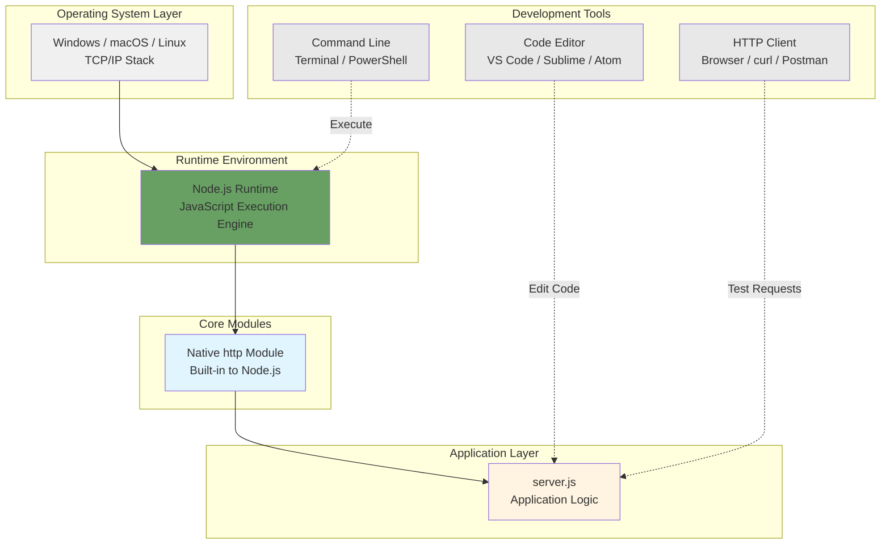

### 3.1.3 Technology Decision Rationale

The selection of Node.js and its native `http` module stems from several converging factors identified in the educational technology landscape:

- **Market Demand**: Node.js remains a dominant backend runtime with strong demand for developers who understand its event-driven architecture
- **Conceptual Foundation**: Native modules provide the clearest path to understanding HTTP mechanics before introducing framework abstractions
- **Transferable Knowledge**: Skills learned with native Node.js transfer directly to popular frameworks like Express.js, Fastify, and Koa
- **Accessibility**: No installation barriers beyond Node.js itself when using native modules

## 3.2 Programming Languages

### 3.2.1 Primary Language: JavaScript

#### 3.2.1.1 Language Specifications

**Language**: JavaScript (ECMAScript standard)  
**Execution Environment**: Node.js runtime  
**Version Requirements**: Compatible with any stable Node.js version supporting the native `http` module (Node.js 10.x and later recommended)  
**Syntax Level**: ES6+ features available but not required; tutorial can use ES5 syntax for maximum compatibility

#### 3.2.1.2 Language Selection Justification

JavaScript serves as the exclusive programming language for this tutorial project based on the following criteria:

**Educational Context**: JavaScript is the native language of Node.js, providing the most direct learning path without introducing additional compilation or transpilation steps. Learners can focus on HTTP concepts without navigating language interoperability concerns.

**Ecosystem Alignment**: As Node.js continues to dominate backend JavaScript development, JavaScript proficiency directly translates to professional opportunities in web development, API construction, and microservices architecture.

**Simplicity**: JavaScript's dynamic typing and straightforward syntax reduce cognitive load for learners focused on understanding HTTP mechanics rather than type systems or memory management.

**Immediate Feedback**: JavaScript in Node.js executes without compilation, providing immediate feedback loops that support the experimental learning approach central to tutorial effectiveness.

#### 3.2.1.3 Language Constraints

The implementation adheres to specific language constraints to maintain tutorial clarity:

- **No TypeScript**: Type annotations intentionally excluded to avoid additional tooling complexity
- **No Transpilation**: Code runs directly in Node.js without Babel or similar transpilers
- **No Advanced Patterns**: Avoids complex closures, generators, or async/await patterns beyond basic callback handling
- **Beginner-Friendly Syntax**: Prioritizes clear, readable code over concise or clever implementations

### 3.2.2 Runtime Environment: Node.js

#### 3.2.2.1 Node.js Specifications

**Runtime**: Node.js  
**Version**: Any stable version compatible with native `http` module  
**Minimum Version**: Node.js 10.x (recommended)  
**Architecture**: Single-threaded event loop with non-blocking I/O  
**Platform Support**: Windows, macOS, Linux

#### 3.2.2.2 Node.js Selection Rationale

Node.js serves as the execution environment for this tutorial based on several technical and educational factors:

**Built-in HTTP Capabilities**: Node.js includes a comprehensive native `http` module that provides all functionality required for basic server implementation without external dependencies. This eliminates package management complexity for learners.

**Event-Driven Architecture**: The Node.js event loop architecture naturally aligns with HTTP's request-response model, allowing learners to understand asynchronous I/O concepts in a practical context.

**Single-Threaded Simplicity**: Node.js's single-threaded execution model simplifies reasoning about program flow, eliminating concurrency concerns that would distract from HTTP mechanics.

**Widespread Adoption**: Node.js deployment in production environments makes it a valuable learning target for developers seeking backend JavaScript skills.

#### 3.2.2.3 Runtime Assumptions

The tutorial assumes the following about the Node.js environment:

- Developers have Node.js installed on their local machine
- Command-line access is available for executing Node.js processes
- The Node.js installation includes the standard core modules (no custom builds)
- Port 3000 or 8080 is available for server binding

## 3.3 Frameworks and Libraries

### 3.3.1 Primary Approach: Native HTTP Module

#### 3.3.1.1 Native HTTP Module Specifications

**Module Name**: `http`  
**Type**: Node.js core module (built-in)  
**Version**: Bundled with Node.js runtime  
**Installation**: No installation required (included with Node.js)  
**Dependencies**: Zero external packages  
**Documentation**: https://nodejs.org/api/http.html

#### 3.3.1.2 Native HTTP Module Selection Rationale

The native Node.js `http` module represents the **recommended approach** for this tutorial based on the following technical and educational considerations:

**Zero Dependencies**: Using the native `http` module eliminates all npm package dependencies, resulting in a truly self-contained implementation. This approach demonstrates that Node.js provides complete HTTP server capabilities without external frameworks.

**Maximum Transparency**: The native module exposes the explicit steps of HTTP server creation, request handling, and response generation without framework abstractions. Learners see exactly how servers are initialized, how requests are parsed, and how responses are constructed.

**Foundation Building**: Understanding the native `http` module provides the conceptual foundation for all Node.js web frameworks. Express.js, Fastify, Koa, and other frameworks build abstractions on top of the same underlying `http` module capabilities.

**Single-File Implementation**: The native approach supports implementation in a single file (typically `server.js`), making the entire system comprehensible in one reading session.

#### 3.3.1.3 Native HTTP Module Usage Pattern

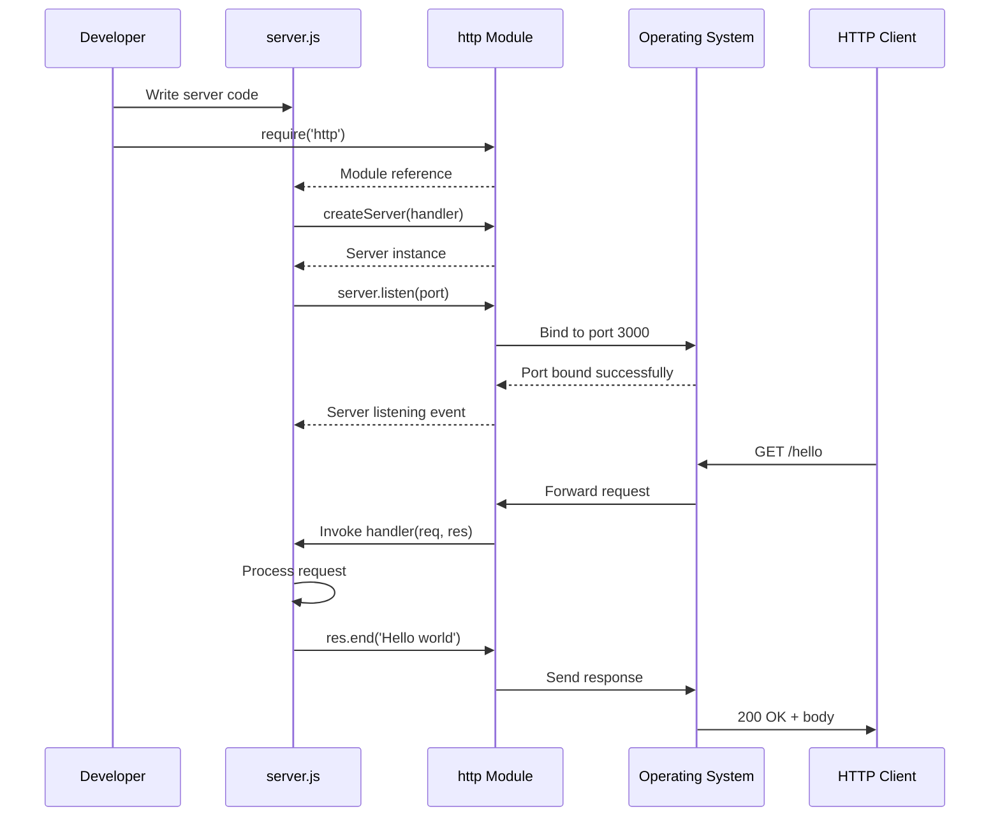

#### 3.3.1.4 Native HTTP Module API Surface

The tutorial implementation utilizes the following core APIs from the native `http` module:

| API Method | Purpose | Usage Pattern |
|------------|---------|---------------|
| `http.createServer()` | Initialize HTTP server instance | `const server = http.createServer(handler)` |
| `server.listen()` | Bind server to port and start listening | `server.listen(3000, callback)` |
| `request.url` | Access requested URL path | `if (req.url === '/hello')` |
| `request.method` | Access HTTP method | `if (req.method === 'GET')` |
| `response.writeHead()` | Set response status and headers | `res.writeHead(200, {'Content-Type': 'text/plain'})` |
| `response.end()` | Send response body and complete | `res.end('Hello world')` |

### 3.3.2 Alternative Approach: Express.js

#### 3.3.2.1 Express.js Specifications

**Framework Name**: Express.js  
**Type**: Minimalist web application framework  
**Version**: Latest stable (4.x series)  
**Installation**: `npm install express`  
**Dependencies**: Single npm package plus transitive dependencies  
**Documentation**: https://expressjs.com/

#### 3.3.2.2 Express.js as Optional Comparison

Express.js is identified as a **future extension** option for learners who wish to compare native HTTP implementation with framework-based approaches. This comparison serves educational purposes by highlighting the abstractions and conveniences frameworks provide.

**When to Consider Express.js**:
- After mastering the native `http` module implementation
- When exploring routing complexity with multiple endpoints
- When demonstrating middleware concepts
- When comparing development velocity trade-offs

**Educational Value of Comparison**:
- Illustrates the abstraction layers frameworks introduce
- Demonstrates routing convenience with `app.get()` syntax
- Shows middleware pattern for cross-cutting concerns
- Reveals performance and complexity trade-offs

#### 3.3.2.3 Express.js Not in Current Scope

Express.js integration is documented as an out-of-scope feature in Section 1.3.2.2 of the Technical Specification. The current tutorial implementation focuses exclusively on native Node.js capabilities to maintain maximum simplicity and transparency.

### 3.3.3 Excluded Libraries and Frameworks

The following common Node.js libraries are intentionally excluded from this tutorial stack to maintain focus on core HTTP concepts:

**Routing Libraries**: No express-router, koa-router, or similar routing abstractions beyond basic path matching

**Template Engines**: No Pug, EJS, Handlebars, or view rendering libraries (plain text response only)

**Validation Libraries**: No Joi, Yup, express-validator (no input parameters to validate)

**Utility Libraries**: No lodash, moment, or general-purpose utility libraries

**Logging Libraries**: No Winston, Pino, or structured logging frameworks

**Testing Frameworks**: No Jest, Mocha, Chai, or automated testing tools in initial scope

## 3.4 Open Source Dependencies

### 3.4.1 Dependency Strategy

#### 3.4.1.1 Zero-Dependency Approach (Recommended)

When implementing the tutorial using the native Node.js `http` module, the project achieves **zero external dependencies**. This dependency posture provides significant educational and operational advantages:

**Advantages of Zero Dependencies**:
- **No Package Management**: Eliminates need for npm package installation and version management
- **No Dependency Conflicts**: Removes risk of transitive dependency conflicts or breaking changes
- **Maximum Portability**: Code runs on any Node.js installation without setup steps
- **Clear Dependency Surface**: All functionality sourced from Node.js core modules
- **No Supply Chain Risk**: Eliminates exposure to compromised or abandoned packages

**Implications**:
- No `package.json` file required
- No `node_modules` directory created
- No npm install step in setup instructions
- Pure Node.js code without external libraries

#### 3.4.1.2 Single-Dependency Approach (Alternative)

If implementing with Express.js as a framework comparison exercise, the project introduces a **single direct dependency**:

**Direct Dependency**:
- `express` (latest stable 4.x version)

**Transitive Dependencies**:
Express.js introduces approximately 30 transitive dependencies for routing, middleware support, and utility functions. While this increases the dependency footprint, it remains lightweight compared to comprehensive web frameworks.

### 3.4.2 Package Management

#### 3.4.2.1 Package Registry

**Registry**: npm (Node Package Manager)  
**Registry URL**: https://registry.npmjs.org/  
**Access**: Public registry, no authentication required for package retrieval

#### 3.4.2.2 Version Management

For the zero-dependency approach, no version management is required. Node.js core modules are bundled with the runtime and updated through Node.js version upgrades.

For the Express.js alternative approach:

```json
{
  "name": "10oct_4-tutorial",
  "version": "1.0.0",
  "description": "Node.js HTTP server tutorial",
  "main": "server.js",
  "dependencies": {
    "express": "^4.18.0"
  }
}
```

**Version Strategy**:
- Semantic versioning with caret (^) range for minor updates
- No strict version pinning required for tutorial purposes
- Compatible with any Express 4.x version

### 3.4.3 Dependency Constraints

The tutorial implementation operates under the following dependency constraints as specified in Section 2.8.3:

- **Minimal External Packages**: Zero packages preferred, single package maximum
- **No Database Drivers**: No MongoDB, PostgreSQL, MySQL, or other database client libraries
- **No Authentication Libraries**: No Passport.js, Auth0 SDK, or JWT libraries
- **No HTTP Clients**: No Axios, node-fetch, or request libraries (server-only, no outbound requests)

### 3.4.4 Dependency Diagram

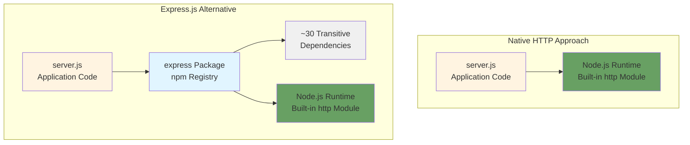

## 3.5 Third-Party Services

### 3.5.1 External Service Integration

#### 3.5.1.1 No External Services Required

The tutorial application operates as a **fully self-contained system** with zero external service dependencies. This isolation serves the educational objective by eliminating integration complexity and external service configuration requirements.

**Excluded Service Categories**:

| Service Category | Examples | Exclusion Rationale |
|------------------|----------|---------------------|
| **External APIs** | REST APIs, GraphQL endpoints, SOAP services | No external data sources needed for static response |
| **Authentication Services** | Auth0, Okta, AWS Cognito | No user authentication in tutorial scope |
| **Monitoring Tools** | DataDog, New Relic, Application Insights | Development-only environment, no production monitoring |
| **Cloud Services** | AWS, Azure, Google Cloud Platform | Localhost execution only, no cloud deployment |
| **Database Services** | MongoDB Atlas, AWS RDS, Azure Cosmos DB | No data persistence required |
| **CDN Services** | CloudFlare, Fastly, Akamai | No static asset distribution needed |
| **Message Queues** | RabbitMQ, AWS SQS, Kafka | No asynchronous messaging requirements |
| **Logging Services** | Loggly, Splunk, Papertrail | No centralized logging infrastructure |

### 3.5.2 Integration Landscape

As documented in Section 1.2.1.2, the integration landscape for this tutorial project is intentionally minimal:

- **Standalone Application**: No integration with existing enterprise infrastructure
- **Self-Contained Execution**: All functionality provided by localhost environment
- **No Network Dependencies**: No external network connections required for core functionality
- **No API Keys Required**: No service credentials, tokens, or authentication configuration

### 3.5.3 Localhost Communication Only

The tutorial server binds exclusively to the localhost interface (127.0.0.1), preventing external network access and eliminating the need for:

- Firewall configuration
- Network security policies
- SSL/TLS certificate management
- DNS configuration
- Load balancer integration
- API gateway routing

## 3.6 Databases and Storage

### 3.6.1 No Database Required

#### 3.6.1.1 Data Persistence Strategy

The tutorial application implements a **static response strategy** that eliminates all database and persistent storage requirements. As documented in Section 2.3.2.2, the `/hello` endpoint returns the hardcoded string constant "Hello world" without referencing any data source.

**Data Flow**:
1. HTTP client sends GET request to `/hello`
2. Request handler invokes without database lookup
3. Handler returns static string "Hello world"
4. Response sent to client

**Implications**:
- No data models or schemas required
- No CRUD operations implemented
- No query languages needed (SQL, MongoDB query language, etc.)
- No connection pooling or resource management
- No data migration or seeding scripts

#### 3.6.1.2 Excluded Database Technologies

The following database categories are explicitly excluded from the technology stack:

**Relational Databases**:
- PostgreSQL, MySQL, MariaDB, SQL Server - No SQL database drivers or ORM libraries

**NoSQL Databases**:
- MongoDB, CouchDB, DynamoDB - No document store integrations

**In-Memory Databases**:
- Redis, Memcached - No caching layer or session storage

**Time-Series Databases**:
- InfluxDB, TimescaleDB - No time-series data collection

**Graph Databases**:
- Neo4j, ArangoDB - No graph data structures

### 3.6.2 Storage Requirements

#### 3.6.2.1 File System Storage

The application requires minimal file system storage for source code:

**Storage Footprint**:
- Source code: < 1 KB (single file implementation)
- Node.js runtime: ~50-70 MB (separate installation)
- No data files, logs, or cache directories

**File System Operations**:
- No file reading or writing during execution
- No temporary file creation
- No log file persistence (console output only)

#### 3.6.2.2 Memory Storage

The application operates entirely in memory with no persistent state:

**Memory Profile**:
- Static response string: < 100 bytes
- Node.js runtime overhead: ~30-40 MB
- Request handling: < 1 MB per concurrent request
- No memory-based caching or state management

### 3.6.3 Caching Strategy

#### 3.6.3.1 No Caching Layer

The tutorial application implements **no caching mechanisms**:

- No Redis or Memcached integration
- No HTTP response caching headers
- No application-level caching logic
- No CDN or edge caching

**Rationale**: The static response requires no computation or I/O operations, making caching unnecessary for performance optimization.

### 3.6.4 Future Data Integration Considerations

As documented in Section 1.3.2.1, database integration is identified as a potential future extension for advanced tutorial variations:

**Potential Extensions** (Out of Current Scope):
- Adding MongoDB for dynamic content storage
- Introducing Redis for session management examples
- Demonstrating PostgreSQL integration for relational data patterns
- Implementing file-based storage for simple persistence examples

These extensions would transform the tutorial from a pure HTTP mechanics demonstration into a full-stack application example.

## 3.7 Development and Deployment

### 3.7.1 Development Environment

#### 3.7.1.1 Required Development Tools

The following tools are required to develop and run the tutorial application:

**Core Requirements**:

| Tool | Purpose | Version Requirements |
|------|---------|---------------------|
| **Node.js Runtime** | JavaScript execution environment | Any stable version supporting http module (10.x+) |
| **Command-Line Interface** | Application execution and control | Terminal (macOS/Linux), PowerShell/CMD (Windows) |
| **Text Editor or IDE** | Source code editing | Any editor (VS Code, Sublime Text, Atom, Vim, etc.) |
| **HTTP Client** | Testing and validation | Browser, curl, Postman, or similar tool |

**Optional Tools**:
- Git for version control (recommended but not required)
- Code formatter (Prettier, ESLint) for code quality (optional)

#### 3.7.1.2 Development Environment Setup

**Setup Steps**:
1. Install Node.js from https://nodejs.org/
2. Verify installation: `node --version`
3. Create project directory: `mkdir 10oct_4-tutorial`
4. Create source file: `server.js` (or similar name)
5. Write server implementation
6. Execute: `node server.js`

**No Additional Setup Required**:
- No npm package installation (zero dependencies)
- No build configuration
- No environment variable configuration
- No database setup or connection strings

#### 3.7.1.3 Platform Compatibility

The development environment supports all major operating systems:

**Operating System Support**:
- **Windows**: Windows 10/11, Windows Server 2016+
- **macOS**: macOS 10.13 (High Sierra) and later
- **Linux**: Ubuntu 18.04+, Debian 9+, Fedora, CentOS, and other distributions

**Prerequisites**:
- TCP/IP networking stack functional
- Port 3000 or 8080 available (not blocked by other applications)
- Localhost loopback interface operational (127.0.0.1)

### 3.7.2 Build System

#### 3.7.2.1 No Build Process Required

The tutorial application requires **no build, compilation, or transpilation** steps:

**Excluded Build Tools**:
- No Webpack, Rollup, or Parcel bundlers
- No Babel or TypeScript transpilers
- No task runners (Gulp, Grunt)
- No CSS preprocessors (Sass, Less)
- No minification or optimization tools

**Rationale**: JavaScript code runs directly in Node.js without compilation. The interpreted nature of JavaScript eliminates build complexity and provides immediate feedback when code changes.

#### 3.7.2.2 Development Workflow

The development workflow consists of a simple edit-execute cycle:

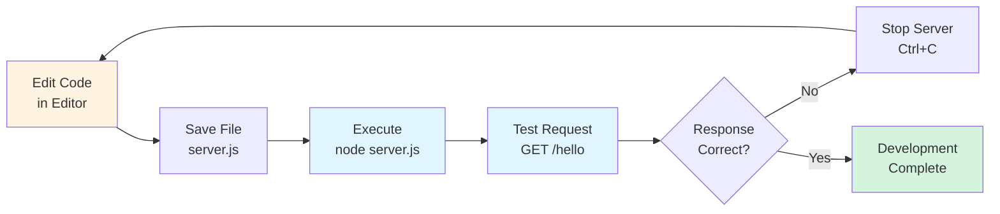

### 3.7.3 Containerization

#### 3.7.3.1 No Container Infrastructure

The tutorial application **does not utilize containerization** technologies:

**Excluded Container Technologies**:
- No Docker containers or Dockerfile
- No docker-compose for multi-container orchestration
- No Kubernetes deployment manifests
- No container registries (Docker Hub, ECR, GCR)
- No container orchestration platforms

**Rationale**: As documented in Section 2.8.2.3, containerization adds complexity not required for localhost-only educational deployment. The tutorial focuses on core HTTP concepts rather than infrastructure management.

#### 3.7.3.2 Direct Execution Model

The application executes directly on the host operating system:

- **Execution Command**: `node server.js` (no container runtime)
- **Port Binding**: Direct binding to host's port 3000 or 8080
- **File System**: Direct access to host file system for source code
- **Network**: Uses host's localhost interface (127.0.0.1)

### 3.7.4 CI/CD Pipeline

#### 3.7.4.1 No Continuous Integration/Deployment

The tutorial application **does not implement CI/CD automation**:

**Excluded CI/CD Features**:
- No automated testing frameworks (Jest, Mocha, Chai)
- No CI pipeline integration (GitHub Actions, Jenkins, CircleCI, Travis CI)
- No automated deployment scripts
- No build automation workflows
- No code quality checks (ESLint, SonarQube)
- No automated security scanning

**Rationale**: As specified in Section 2.8.2.3, the tutorial operates in a development-only environment with manual execution. Automated testing and deployment infrastructure would introduce complexity beyond the tutorial's educational objectives.

#### 3.7.4.2 Manual Execution Workflow

The application follows a manual execution and validation workflow:

**Execution Process**:
1. Developer starts server manually: `node server.js`
2. Developer tests endpoint manually via HTTP client
3. Developer verifies response: "Hello world"
4. Developer stops server manually: Ctrl+C

**Validation Approach**:
- Manual browser testing (navigate to http://localhost:3000/hello)
- Manual curl testing: `curl http://localhost:3000/hello`
- Visual verification of console output
- No automated test suites or assertion libraries

### 3.7.5 Version Control

#### 3.7.5.1 Git for Source Control

**Version Control System**: Git  
**Repository Hosting**: GitHub, GitLab, Bitbucket, or local repository  
**Workflow**: Standard Git workflow (add, commit, push)

**Repository Structure**:
```
10oct_4-tutorial/
├── server.js              # Main server implementation
├── README.md              # Setup and usage instructions
└── .gitignore             # Git exclusions (node_modules if using Express)
```

**No Advanced Git Workflows**:
- No Git hooks for automated checks
- No branch protection rules
- No pull request templates
- No automated changelog generation

### 3.7.6 Deployment Strategy

#### 3.7.6.1 Localhost Deployment Only

The application deploys exclusively to the **local development environment**:

**Deployment Characteristics**:
- **Environment**: Developer's local machine
- **Binding**: localhost (127.0.0.1) only, no external network access
- **Startup**: Manual via command line (`node server.js`)
- **Shutdown**: Manual via Ctrl+C keyboard interrupt
- **Process Management**: No PM2, Forever, or systemd service management
- **Port Configuration**: Hardcoded or simple configuration (port 3000 or 8080)

#### 3.7.6.2 No Production Deployment

As documented in Section 2.8.2.3, the tutorial application explicitly **does not support production deployment**:

**Excluded Production Features**:
- No HTTPS/TLS termination
- No reverse proxy configuration (nginx, Apache)
- No load balancing or horizontal scaling
- No health checks or liveness probes
- No graceful restart or zero-downtime updates
- No automated monitoring or alerting
- No log aggregation or centralized logging
- No disaster recovery or backup procedures

**Production Deployment Disclaimer**: The tutorial documentation must clearly state that this implementation is for educational purposes only and requires significant hardening, security enhancements, and operational infrastructure for production use.

#### 3.7.6.3 Deployment Architecture

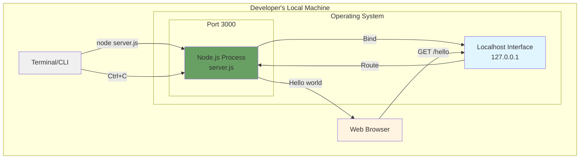

### 3.7.7 Performance and Monitoring

#### 3.7.7.1 No Operational Monitoring

The tutorial application implements **no monitoring or observability infrastructure**:

**Excluded Monitoring Tools**:
- No application performance monitoring (DataDog, New Relic)
- No log aggregation (Splunk, ELK Stack)
- No metrics collection (Prometheus, Grafana)
- No error tracking (Sentry, Rollbar)
- No uptime monitoring (Pingdom, UptimeRobot)

**Console Logging Only**:
- Server startup confirmation logged to console
- No structured logging format
- No log levels or log rotation
- No persistent log files

#### 3.7.7.2 Performance Requirements

As specified in Section 2.5.1.2, the tutorial maintains minimal performance requirements suitable for educational use:

| Performance Metric | Requirement | Context |
|-------------------|-------------|---------|
| **Startup Time** | < 1 second | Immediate feedback for learners |
| **Port Binding** | < 100ms | Standard OS operation speed |
| **Response Time** | < 100ms | Client-measured latency |
| **Handler Execution** | < 10ms | Server-side processing time |
| **Memory Footprint** | < 50MB | Total process memory usage |
| **CPU Usage (idle)** | < 5% | Event loop efficiency |

**No Performance Testing**: No load testing, stress testing, or performance profiling is performed. The tutorial scope explicitly excludes scalability and high-throughput scenarios.

## 3.8 Security Considerations

### 3.8.1 Security Posture

#### 3.8.1.1 Educational Security Context

The tutorial application implements **minimal security features** appropriate for a localhost-only educational environment:

**Implemented Security**:
- Localhost binding (127.0.0.1) prevents external network exposure

**Intentionally Excluded Security Features**:

| Security Feature | Status | Rationale |
|------------------|--------|-----------|
| **Authentication** | Not Implemented | Single-user tutorial environment |
| **Authorization** | Not Implemented | No protected resources or roles |
| **HTTPS/TLS** | Not Implemented | Localhost communication, no sensitive data |
| **CORS** | Not Implemented | Single-origin, no cross-origin requests |
| **Rate Limiting** | Not Implemented | No abuse potential in tutorial context |
| **Input Validation** | Not Required | No user input parameters to validate |
| **Security Headers** | Not Implemented | Plain text response, no XSS concerns |
| **CSRF Protection** | Not Implemented | No state-changing operations |

#### 3.8.1.2 Security Disclaimer

As documented in Section 2.5.1.4, the tutorial explicitly includes a **production security disclaimer**:

> "This implementation is for learning purposes and requires significant security hardening for production use."

**Required Security Enhancements for Production**:
- HTTPS with valid TLS certificates
- Authentication and authorization mechanisms
- Input validation and sanitization
- Security headers (CSP, HSTS, X-Frame-Options)
- Rate limiting and DDoS protection
- Security logging and audit trails
- Regular security updates and dependency scanning

### 3.8.2 Threat Model

#### 3.8.2.1 Minimal Threat Exposure

The `/hello` endpoint presents minimal security risk due to its design:

| Threat Vector | Risk Level | Mitigation |
|---------------|------------|------------|
| **Injection Attacks** | None | No user input parameters |
| **XSS** | None | Plain text response, no HTML rendering |
| **CSRF** | None | Read-only GET endpoint, no state changes |
| **Authentication Bypass** | None | No authentication implemented |
| **DoS** | Low | Localhost only, single-user environment |
| **Data Breach** | None | No sensitive data processed or stored |

#### 3.8.2.2 Network Exposure Limitation

**Localhost Binding**: The server binds exclusively to 127.0.0.1, preventing external network access:

```javascript
// Example localhost binding
server.listen(3000, '127.0.0.1', () => {
  console.log('Server running at http://127.0.0.1:3000/');
});
```

**Security Implications**:
- Server is not accessible from other machines on the network
- No firewall configuration required
- No exposure to internet-based threats
- Protected from network scanning and unauthorized access attempts

## 3.9 Integration Requirements

### 3.9.1 Internal Component Integration

#### 3.9.1.1 Component Integration Architecture

The tutorial application implements a simple internal integration architecture with three components:

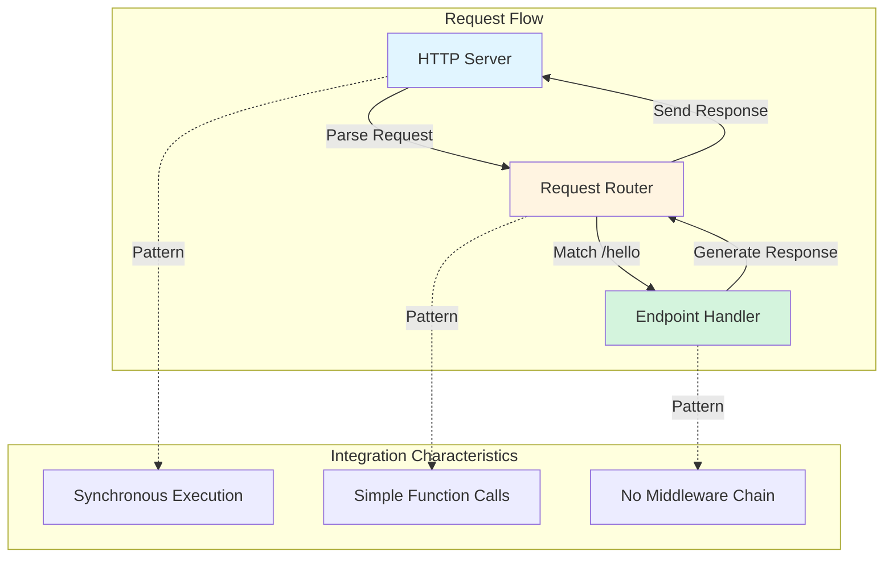

#### 3.9.1.2 Integration Patterns

**Request Routing Integration**:
- HTTP Server receives incoming request
- Router examines request.url property
- Router invokes appropriate handler function
- Handler returns response content
- Server sends response to client

**Characteristics**:
- Synchronous request handling (no async/await)
- Direct function invocation (no event emitters beyond http module)
- No middleware chain or request preprocessing
- Single integration point: routing mechanism

### 3.9.2 External Integration

#### 3.9.2.1 No External Integrations

As documented throughout this specification, the tutorial application implements **zero external integrations**:

- No database connections to manage
- No external API calls to make
- No third-party service authentications
- No message queue subscriptions
- No webhook registrations

**Integration Count**: **0**

**Rationale**: The completely self-contained nature of the application eliminates all integration complexity, allowing learners to focus exclusively on HTTP server mechanics.

## 3.10 Technology Stack Summary

### 3.10.1 Complete Technology Inventory

#### 3.10.1.1 Technology Components Table

| Layer | Component | Type | Version | Source | Required |
|-------|-----------|------|---------|--------|----------|
| **Runtime** | Node.js | JavaScript Runtime | 10.x+ | nodejs.org | Yes |
| **Core Module** | http | Built-in Module | Bundled | Node.js Core | Yes |
| **Language** | JavaScript | Programming Language | ES6+ | ECMAScript Standard | Yes |
| **Alternative Framework** | Express.js | Web Framework | 4.x | npm | Optional |
| **Development** | Text Editor | Code Editor | Any | Various | Yes |
| **Development** | CLI/Terminal | Command Interface | OS Default | Operating System | Yes |
| **Testing** | HTTP Client | Request Tool | Any | Browser/curl | Yes |
| **Version Control** | Git | VCS | Any | git-scm.com | Recommended |

#### 3.10.1.2 Dependency Tree Visualization

```mermaid
graph TB
    subgraph "Zero-Dependency Stack (Recommended)"
        App1[Tutorial Application<br/>server.js]
        HTTP1[Node.js http Module<br/>Built-in]
        Node1[Node.js Runtime<br/>v10.x+]
        OS1[Operating System<br/>Windows/macOS/Linux]
        
        App1 --> HTTP1
        HTTP1 --> Node1
        Node1 --> OS1
    end
    
    subgraph "Single-Dependency Alternative"
        App2[Tutorial Application<br/>server.js]
        Express[Express.js 4.x<br/>npm package]
        HTTP2[Node.js http Module<br/>Built-in]
        Node2[Node.js Runtime<br/>v10.x+]
        OS2[Operating System<br/>Windows/macOS/Linux]
        
        App2 --> Express
        Express --> HTTP2
        HTTP2 --> Node2
        Node2 --> OS2
    end
    
    style App1 fill:#fff4e1
    style App2 fill:#fff4e1
    style HTTP1 fill:#e1f5ff
    style HTTP2 fill:#e1f5ff
    style Node1 fill:#68a063
    style Node2 fill:#68a063
    style Express fill:#ffd4d4
```

### 3.10.2 Technology Decision Summary

#### 3.10.2.1 Key Technology Decisions

The following table summarizes the critical technology decisions and their rationale:

| Decision | Choice | Alternative Considered | Selection Rationale |
|----------|--------|------------------------|---------------------|
| **Runtime** | Node.js | Python, Ruby, Go | Dominant backend JavaScript runtime, extensive learning resources |
| **Server Module** | Native http | Express.js, Fastify, Koa | Maximum transparency, zero dependencies, foundational understanding |
| **Language** | JavaScript | TypeScript | Eliminates transpilation complexity, beginner-friendly |
| **Deployment** | Localhost | Docker, Cloud | Tutorial scope, development-only environment |
| **Database** | None | MongoDB, PostgreSQL | Static response eliminates need for data persistence |
| **Testing** | Manual | Jest, Mocha | Tutorial simplicity, immediate feedback without test infrastructure |

#### 3.10.2.2 Alignment with Educational Goals

The technology stack directly supports the educational goals defined in Section 1.1.2:

**Goal 1: Demonstrate Node.js HTTP Server Creation**
- ✅ Native `http` module exposes server creation mechanics explicitly

**Goal 2: Illustrate Basic Endpoint Implementation**
- ✅ Simple routing and handler pattern demonstrates endpoint concepts clearly

**Goal 3: Provide Foundation for Advanced Development**
- ✅ Understanding native modules provides basis for framework adoption

**Goal 4: Enable Hands-On Learning**
- ✅ Zero-dependency setup minimizes barriers to experimentation

### 3.10.3 Production Gap Analysis

#### 3.10.3.1 Technologies Required for Production

The following table identifies technologies that would be required to transform this tutorial into a production-ready application:

| Production Requirement | Technology Example | Purpose |
|------------------------|-------------------|---------|
| **HTTPS/TLS** | Let's Encrypt, AWS ACM | Encrypted communication |
| **Process Management** | PM2, systemd | Application lifecycle management |
| **Reverse Proxy** | nginx, Apache | TLS termination, load balancing |
| **Monitoring** | Prometheus + Grafana | Performance and health monitoring |
| **Logging** | Winston + ELK Stack | Centralized log aggregation |
| **Error Tracking** | Sentry, Rollbar | Exception monitoring and alerting |
| **Authentication** | Passport.js, Auth0 | User authentication and authorization |
| **Database** | MongoDB, PostgreSQL | Data persistence layer |
| **Caching** | Redis, Memcached | Performance optimization |
| **CI/CD** | GitHub Actions, Jenkins | Automated testing and deployment |
| **Containerization** | Docker, Kubernetes | Deployment packaging and orchestration |
| **API Gateway** | Kong, AWS API Gateway | Rate limiting, request routing |

#### 3.10.3.2 Security Hardening Requirements

**Required Security Enhancements**:
- HTTPS with valid TLS certificates (Let's Encrypt, commercial CA)
- Helmet.js for security headers
- Rate limiting middleware (express-rate-limit)
- Input validation library (Joi, express-validator)
- CORS configuration with whitelist
- Security audit logging
- Dependency vulnerability scanning (npm audit, Snyk)
- Web application firewall (Cloudflare, AWS WAF)

## 3.11 References

### 3.11.1 Technical Specification Sections

The following sections of the Technical Specification were referenced in creating this Technology Stack documentation:

- **Section 1.1 Executive Summary** - Project context, value proposition, target audience
- **Section 1.2 System Overview** - Technical approach, Node.js selection, architectural principles
- **Section 1.3 Scope** - In-scope features, out-of-scope exclusions, intentional limitations
- **Section 2.2 Feature Catalog** - HTTP server feature details, technical context
- **Section 2.3 Functional Requirements** - Server initialization, endpoint specifications
- **Section 2.5 Implementation Considerations** - Technical constraints, performance requirements, security posture
- **Section 2.8 Assumptions and Constraints** - Platform requirements, dependency constraints, scope limitations

### 3.11.2 External References

- **Node.js Official Documentation**: https://nodejs.org/api/http.html
- **Express.js Official Documentation**: https://expressjs.com/
- **npm Registry**: https://registry.npmjs.org/

### 3.11.3 Repository Files Examined

- `README.md` - Project identifier and basic repository information

### 3.11.4 Technology Documentation

- Node.js HTTP Module API Reference: https://nodejs.org/api/http.html
- ECMAScript Language Specification: https://tc39.es/ecma262/
- npm Package Manager Documentation: https://docs.npmjs.com/

---

**Document Version**: 1.0  
**Last Updated**: Based on Technical Specification sections 1.1-2.9  
**Status**: Complete - Ready for Implementation

# 4. Process Flowchart

## 4.1 Overview and Purpose

### 4.1.1 Flowchart Documentation Scope

This section provides comprehensive process flowcharts documenting all operational workflows within the **10oct_4** Node.js tutorial application. The flowcharts capture the complete lifecycle of the HTTP server from initialization through request processing to shutdown, with detailed attention to decision points, state transitions, validation checkpoints, and timing constraints.

Given the educational nature and intentionally minimal scope of this tutorial project, the process flows emphasize clarity and transparency over complex error handling or edge case management. Each flowchart focuses on demonstrating fundamental Node.js HTTP server concepts through visual representation of the request-response cycle and server lifecycle management.

### 4.1.2 Flowchart Organization

The process documentation is organized into the following categories:

| Category | Purpose | Diagrams Included |
|----------|---------|-------------------|
| **System Workflows** | End-to-end operational flows | High-level system workflow, complete lifecycle diagram |
| **Server Initialization** | Startup and configuration processes | Initialization sequence with validation checkpoints |
| **Request Processing** | Core business logic execution | GET /hello endpoint flow with routing decisions |
| **State Management** | State transitions and lifecycle | Server state diagram, request state progression |
| **Integration Patterns** | Client-server interactions | Sequence diagrams showing actor communication |
| **Timing and Performance** | Performance-critical paths | Annotated flows with timing constraints |

### 4.1.3 Diagram Conventions

All process flowcharts in this section follow consistent conventions:

- **Rectangles**: Process steps or actions
- **Diamonds**: Decision points requiring evaluation
- **Rounded Rectangles**: Start and end points
- **Circles**: State indicators
- **Arrows**: Flow direction and data movement
- **Subgraphs**: System or component boundaries
- **Annotations**: Timing constraints and performance metrics

---

## 4.2 High-Level System Workflow

### 4.2.1 Complete System Lifecycle

The following diagram illustrates the complete operational lifecycle of the tutorial application from server startup through request handling to termination:

```mermaid
graph TB
    Start([Developer Executes<br/>node server.js])
    
    subgraph Initialization["Initialization Phase"]
        LoadModule[Load http Module]
        CreateServer[Create HTTP Server Instance]
        BindPort{Port Available?}
        Listen[Bind to Port 3000/8080]
        Ready[Server Listening State]
    end
    
    subgraph Operation["Request Processing Phase"]
        WaitRequest[Wait for HTTP Request]
        ReceiveReq[Receive GET /hello]
        ProcessReq[Process Request]
        SendResp[Send 200 OK Response]
    end
    
    subgraph Termination["Shutdown Phase"]
        Interrupt[Receive SIGINT<br/>Ctrl+C]
        StopServer[Stop Accepting Connections]
        ExitProcess[Terminate Node.js Process]
        ReleasePort[Release Port]
    end
    
    Start --> LoadModule
    LoadModule --> CreateServer
    CreateServer --> BindPort
    BindPort -->|Yes| Listen
    BindPort -->|No| Error1[EADDRINUSE Error<br/>Manual Resolution Required]
    Listen --> Ready
    Ready --> WaitRequest
    WaitRequest --> ReceiveReq
    ReceiveReq --> ProcessReq
    ProcessReq --> SendResp
    SendResp --> WaitRequest
    WaitRequest --> Interrupt
    Interrupt --> StopServer
    StopServer --> ExitProcess
    ExitProcess --> ReleasePort
    ReleasePort --> End([Process Terminated])
    
    style Start fill:#90EE90
    style End fill:#FFB6C1
    style Ready fill:#87CEEB
    style Error1 fill:#FFB6B6
    style Initialization fill:#E8F4F8
    style Operation fill:#F0F8E8
    style Termination fill:#F8E8E8
```

### 4.2.2 Workflow Phases Description

**Initialization Phase** (`< 1 second total`):
The server bootstrap process involves loading the native Node.js HTTP module, creating a server instance with a request handler callback, and binding to the configured port (3000 or 8080) on the localhost interface. The critical decision point occurs during port binding—if the port is already in use, the application fails with an EADDRINUSE error requiring manual resolution (the tutorial scope does not include automated port conflict resolution).

**Request Processing Phase** (`< 100ms per request`):
Once in the listening state, the server enters a continuous loop waiting for incoming HTTP requests. When a GET request arrives at the `/hello` endpoint, the server processes the request through its routing logic, invokes the handler to generate the "Hello world" response, and sends an HTTP 200 OK response back to the client. The server immediately returns to the waiting state, ready to handle subsequent requests.

**Shutdown Phase** (`< 100ms`):
Server termination is triggered by the SIGINT signal (Ctrl+C in the terminal). The server stops accepting new connections, the Node.js process terminates, and the bound port is released back to the operating system for reuse.

---

## 4.3 Server Initialization Process

### 4.3.1 Detailed Initialization Sequence

The server initialization process represents the critical path from code execution to operational readiness:

```mermaid
flowchart TD
    Start([Execute: node server.js])
    
    Init1[Node.js Runtime Starts]
    Init2[Load server.js File]
    Init3["Execute: const http = require('http')"]
    
    Check1{Node.js Version<br/>≥ v10.x?}
    
    Init4[Load Native HTTP Module]
    Init5["Create Server Instance<br/>http.createServer requestHandler"]
    Init6[Register Request Handler Callback]
    
    Init7["Execute: server.listen port, hostname, callback"]
    
    Check2{Localhost<br/>Interface Available?}
    Check3{"Port 3000/8080<br/>Available?"}
    
    Init8[Bind Socket to Port]
    Init9[Enter Listening State]
    Init10[Execute Callback Function]
    Init11["Console: Server listening on port PORT"]
    
    Ready([Server Ready for Requests])
    
    Error1[Runtime Error<br/>Incompatible Node Version]
    Error2[Network Interface Error<br/>System-Level Failure]
    Error3[EADDRINUSE Error<br/>Port Already Bound]
    
    Start --> Init1
    Init1 --> Init2
    Init2 --> Init3
    Init3 --> Check1
    
    Check1 -->|Yes| Init4
    Check1 -->|No| Error1
    
    Init4 --> Init5
    Init5 --> Init6
    Init6 --> Init7
    Init7 --> Check2
    
    Check2 -->|Yes| Check3
    Check2 -->|No| Error2
    
    Check3 -->|Yes| Init8
    Check3 -->|No| Error3
    
    Init8 --> Init9
    Init9 --> Init10
    Init10 --> Init11
    Init11 --> Ready
    
    style Start fill:#90EE90
    style Ready fill:#87CEEB
    style Error1 fill:#FFB6B6
    style Error2 fill:#FFB6B6
    style Error3 fill:#FFB6B6
```

### 4.3.2 Initialization Validation Checkpoints

The initialization sequence includes three critical validation checkpoints that must succeed for the server to reach operational status:

**Checkpoint 1: Runtime Version Validation**
- **Validation Rule**: Node.js version must be v10.x or later
- **Check Mechanism**: Implicit validation by Node.js runtime (modern module features)
- **Failure Action**: Runtime error with version incompatibility message
- **Recovery**: User must upgrade Node.js installation
- **Timing Impact**: N/A (pre-execution check)

**Checkpoint 2: Network Interface Validation**
- **Validation Rule**: Localhost (127.0.0.1) network interface must be accessible
- **Check Mechanism**: Operating system network stack verification
- **Failure Action**: System-level network error
- **Recovery**: Requires system administrator intervention
- **Timing Impact**: Adds < 10ms to initialization

**Checkpoint 3: Port Availability Validation**
- **Validation Rule**: Configured port (3000 or 8080) must not be in use
- **Check Mechanism**: Socket binding attempt
- **Failure Action**: EADDRINUSE error, process exits
- **Recovery**: User must identify and terminate conflicting process or configure different port
- **Timing Impact**: Adds < 50ms to initialization if available, immediate failure if in use

### 4.3.3 Initialization Performance Profile

| Phase | Duration Target | Measurement Point |
|-------|----------------|-------------------|
| Module Loading | < 100ms | require('http') completion |
| Server Creation | < 10ms | http.createServer() return |
| Port Binding | < 100ms | server.listen() callback invocation |
| **Total Startup** | **< 1 second** | **Execution start to listening state** |

---

## 4.4 Request-Response Processing

### 4.4.1 GET /hello Endpoint Complete Flow

The following flowchart documents the complete request-response cycle for the primary tutorial endpoint:

```mermaid
flowchart TD
    Start([HTTP Client Initiates<br/>GET http://localhost:3000/hello])
    
    subgraph Network["Network Layer"]
        Net1[TCP Connection Establishment]
        Net2[HTTP Request Transmission]
    end
    
    subgraph ServerProcess["Node.js Server Process"]
        Recv1[Server Receives Request]
        Recv2[Parse HTTP Headers]
        Recv3[Extract req.url]
        Recv4[Extract req.method]
        
        subgraph Router["Request Router"]
            Route1{req.url === '/hello'?}
            Route2{req.method === 'GET'?}
        end
        
        subgraph Handler["/hello Handler"]
            Hand1[Invoke Handler Function]
            Hand2[Generate Static String:<br/>'Hello world']
            Hand3[Set Status: 200 OK]
            Hand4[Set Header:<br/>Content-Type: text/plain]
            Hand5[Set Header:<br/>Content-Length: 11]
            Hand6[Call res.writeHead 200, headers]
            Hand7[Call res.end 'Hello world']
        end
        
        Resp1[Construct HTTP Response]
        Resp2[Transmit Response to Client]
    end
    
    subgraph ClientSide["Client Reception"]
        Client1[Receive HTTP Response]
        Client2[Parse Status: 200 OK]
        Client3[Parse Response Headers]
        Client4[Receive Body: 'Hello world']
    end
    
    Complete([Request Complete<br/>Connection Closed])
    
    OutOfScope1[Unhandled Path<br/>Behavior Not Defined]
    OutOfScope2[Unsupported Method<br/>Behavior Not Defined]
    
    Start --> Net1
    Net1 --> Net2
    Net2 --> Recv1
    Recv1 --> Recv2
    Recv2 --> Recv3
    Recv3 --> Recv4
    Recv4 --> Route1
    
    Route1 -->|Yes| Route2
    Route1 -->|No| OutOfScope1
    
    Route2 -->|Yes| Hand1
    Route2 -->|No| OutOfScope2
    
    Hand1 --> Hand2
    Hand2 --> Hand3
    Hand3 --> Hand4
    Hand4 --> Hand5
    Hand5 --> Hand6
    Hand6 --> Hand7
    Hand7 --> Resp1
    Resp1 --> Resp2
    Resp2 --> Client1
    Client1 --> Client2
    Client2 --> Client3
    Client3 --> Client4
    Client4 --> Complete
    
    style Start fill:#90EE90
    style Complete fill:#87CEEB
    style OutOfScope1 fill:#FFE4B5
    style OutOfScope2 fill:#FFE4B5
    style Handler fill:#FFF4E1
    style Router fill:#E8F4F8
```

### 4.4.2 Request Routing Decision Logic

The request router implements two sequential validation checks that determine handler invocation:

**Decision Point 1: Path Matching**
- **Evaluation**: `if (req.url === '/hello')`
- **Match Type**: Exact string comparison (case-sensitive)
- **Valid Inputs**: Exactly `/hello` (no variations accepted)
- **Invalid Inputs**: `/Hello`, `/hello/`, `/hello?param=value`, any other path
- **Decision Outcome**:
  - **Match**: Proceed to method validation
  - **No Match**: Undefined behavior (out of tutorial scope)
- **Performance**: < 1ms (string comparison)

**Decision Point 2: HTTP Method Validation**
- **Evaluation**: `if (req.method === 'GET')`
- **Match Type**: Exact string comparison
- **Valid Inputs**: GET (uppercase)
- **Invalid Inputs**: POST, PUT, DELETE, PATCH, HEAD, OPTIONS, get (lowercase)
- **Decision Outcome**:
  - **Match**: Invoke /hello handler
  - **No Match**: Undefined behavior (out of tutorial scope)
- **Performance**: < 1ms (string comparison)

### 4.4.3 Handler Execution Process

When both routing validations succeed, the handler executes the following deterministic sequence:

1. **String Generation** (`< 1ms`): Create static string "Hello world" (no dynamic processing, database queries, or external API calls)

2. **Status Code Assignment** (`< 1ms`): Set HTTP status to 200 (OK) indicating successful request processing

3. **Header Construction** (`< 1ms`):
   - `Content-Type: text/plain; charset=utf-8` (specify plain text response format)
   - `Content-Length: 11` (exact byte count of response body)

4. **Response Transmission** (`< 5ms`):
   - Invoke `res.writeHead(200, headers)` to send status and headers
   - Invoke `res.end('Hello world')` to send body and close connection

**Total Handler Execution Time**: < 10ms (from invocation to response transmission complete)

### 4.4.4 Response Data Specification

**Response Structure**:
```
HTTP/1.1 200 OK
Content-Type: text/plain; charset=utf-8
Content-Length: 11

Hello world
```

**Validation Requirements**:
- Status code must be exactly 200
- Content-Type must specify text/plain encoding
- Content-Length must accurately reflect body size (11 bytes)
- Response body must be exactly "Hello world" (no trailing whitespace, newlines, or variations)
- Character encoding must be UTF-8

### 4.4.5 Request-Response Timing Profile

| Stage | Duration Target | Cumulative Time | Critical Path |
|-------|----------------|-----------------|---------------|
| TCP Connection | < 5ms | 5ms | Yes |
| Request Reception | < 5ms | 10ms | Yes |
| Header Parsing | < 1ms | 11ms | Yes |
| Path Routing | < 1ms | 12ms | Yes |
| Method Validation | < 1ms | 13ms | Yes |
| Handler Invocation | < 1ms | 14ms | No |
| Response Generation | < 1ms | 15ms | Yes |
| Header Construction | < 1ms | 16ms | Yes |
| Response Transmission | < 5ms | 21ms | Yes |
| **Total End-to-End** | **< 100ms** | **100ms** | **Full Path** |

---

## 4.5 State Management Flows

### 4.5.1 Server Lifecycle State Transitions

The HTTP server progresses through a well-defined state machine during its operational lifecycle:

```mermaid
stateDiagram-v2
    [*] --> Uninitialized: Process Not Started
    
    Uninitialized --> Initializing: Execute node server.js
    
    Initializing --> Listening: server.listen() Success<br/>Port Bind Complete<br/>(< 1 second)
    
    Initializing --> Failed: Port Conflict<br/>Network Error<br/>Runtime Error
    
    Listening --> Processing: Request Received
    
    Processing --> Listening: Response Sent<br/>(< 100ms)
    
    Listening --> Terminating: SIGINT (Ctrl+C)<br/>Process Kill Signal
    
    Terminating --> Terminated: Process Exit Complete<br/>Port Released<br/>(< 100ms)
    
    Failed --> [*]: Manual Intervention Required
    Terminated --> [*]: Server Stopped
    
    note right of Uninitialized
        State: Server code not executing
        Port: Unbound
        Memory: 0 MB
    end note
    
    note right of Listening
        State: Ready for requests
        Port: Bound to 3000/8080
        Memory: < 50 MB
        CPU: < 5%
    end note
    
    note right of Processing
        State: Handling request
        Duration: < 100ms per request
        Concurrent: Single-threaded
    end note
```

### 4.5.2 Server State Descriptions

**Uninitialized State**:
- **Entry Condition**: Before `node server.js` execution
- **Characteristics**: No process running, no resources allocated, port available
- **Valid Transitions**: → Initializing (on execution)
- **Duration**: Indefinite (until user starts server)

**Initializing State**:
- **Entry Condition**: Process started, modules loading, port binding in progress
- **Characteristics**: Module resolution, server creation, socket binding
- **Valid Transitions**: → Listening (on success) | → Failed (on error)
- **Duration**: < 1 second
- **Resources**: Memory allocation begins (< 30 MB during init)

**Listening State**:
- **Entry Condition**: Port successfully bound, callback executed
- **Characteristics**: Server accepting connections, event loop running, ready for requests
- **Valid Transitions**: → Processing (on request) | → Terminating (on SIGINT)
- **Duration**: Indefinite (until termination signal)
- **Resources**: Memory stable (< 50 MB), CPU idle (< 5%)

**Processing State**:
- **Entry Condition**: HTTP request received
- **Characteristics**: Request routing, handler execution, response generation
- **Valid Transitions**: → Listening (after response sent)
- **Duration**: < 100ms per request
- **Resources**: Minimal CPU spike (< 20%), memory stable
- **Concurrency**: Single-threaded, requests processed sequentially

**Terminating State**:
- **Entry Condition**: SIGINT received (Ctrl+C)
- **Characteristics**: Stop accepting connections, cleanup, process shutdown
- **Valid Transitions**: → Terminated (on exit)
- **Duration**: < 100ms
- **Resources**: Resource deallocation in progress

**Terminated State**:
- **Entry Condition**: Process exit complete
- **Characteristics**: Port released, memory freed, process no longer exists
- **Valid Transitions**: None (terminal state)
- **Duration**: Permanent until restarted

**Failed State**:
- **Entry Condition**: Initialization error (port conflict, network error)
- **Characteristics**: Error logged to console, process exits
- **Valid Transitions**: None (requires manual intervention and restart)
- **Duration**: Immediate transition to terminated

### 4.5.3 Request Processing State Flow

Individual HTTP requests progress through their own state machine during processing:

```mermaid
stateDiagram-v2
    [*] --> Received: Client Sends GET /hello
    
    Received --> Routing: Parse Headers<br/>Extract URL & Method<br/>(< 1ms)
    
    Routing --> Matched: Path = '/hello' AND<br/>Method = 'GET'
    
    Routing --> Unhandled: Path ≠ '/hello' OR<br/>Method ≠ 'GET'
    
    Matched --> Processing: Invoke Handler<br/>(< 1ms)
    
    Processing --> Responding: Generate Response<br/>Set Headers<br/>Create Body<br/>(< 10ms)
    
    Responding --> Complete: Send 200 OK<br/>Transmit Body<br/>Close Connection<br/>(< 5ms)
    
    Unhandled --> [*]: Undefined Behavior<br/>(Out of Scope)
    
    Complete --> [*]: Request Fulfilled
    
    note right of Received
        Request data available
        Headers parsed
        Ready for routing
    end note
    
    note right of Processing
        Handler executing
        Static response generation
        No I/O operations
    end note
```

### 4.5.4 State Persistence Characteristics

**No Persistent State Management**:
The tutorial application is intentionally stateless, with no persistence mechanisms:

- **No Session Management**: Each request is independent; no session tracking or cookies
- **No User State**: No authentication, user profiles, or user-specific data
- **No Application State**: No global variables maintaining state between requests
- **No Database**: No data storage or retrieval operations
- **No File System State**: No reading from or writing to files during operation
- **No Caching**: No in-memory or external caching layers

**Request Independence**:
Every HTTP request to `/hello` executes identically regardless of:
- Number of previous requests
- Time since server start
- Concurrent request activity
- Client identity or headers
- Any environmental factors

This stateless design ensures predictable, repeatable behavior ideal for tutorial learning objectives.

---

## 4.6 Integration and Interaction Flows

### 4.6.1 Client-Server Interaction Sequence

The following sequence diagram illustrates the detailed actor interactions during a complete request-response cycle:

```mermaid
sequenceDiagram
    participant Client as HTTP Client<br/>(Browser/curl)
    participant OS as Operating System<br/>Network Stack
    participant Server as Node.js Server<br/>Process
    participant Router as Request Router<br/>(Logic Component)
    participant Handler as /hello Handler<br/>(Function)
    
    Note over Client,Handler: Server Initialization Phase (< 1s)
    Server->>OS: Bind Socket to Port 3000
    activate Server
    OS-->>Server: Port Bound Successfully
    Server->>Server: Enter Listening State
    Note over Server: Server Ready
    
    Note over Client,Handler: Request Processing Phase (< 100ms)
    Client->>OS: TCP Connect to localhost:3000
    activate Client
    OS->>Server: Connection Established
    
    Client->>Server: HTTP GET /hello
    Note right of Client: Request Headers:<br/>Host: localhost:3000
    
    Server->>Router: Route Incoming Request
    activate Router
    Router->>Router: Check: req.url === '/hello'
    Router->>Router: Check: req.method === 'GET'
    
    alt Valid Route Match
        Router->>Handler: Invoke Handler
        activate Handler
        Handler->>Handler: Generate 'Hello world'
        Handler->>Handler: Set Status 200 OK
        Handler->>Handler: Set Content-Type: text/plain
        Handler-->>Router: Return Response Data
        deactivate Handler
        
        Router-->>Server: Forward Response
        
        Server->>Client: HTTP 200 OK
        Note left of Server: Response Headers:<br/>Content-Type: text/plain<br/>Content-Length: 11
        Server->>Client: Response Body:<br/>'Hello world'
        
        Client->>Client: Process Response
        Note right of Client: Display or Parse<br/>'Hello world'
        
    else Invalid Route
        Router-->>Server: No Handler Found
        Note over Server: Undefined Behavior<br/>(Out of Tutorial Scope)
    end
    
    deactivate Router
    
    Server->>OS: Close Connection
    OS->>Client: Connection Closed
    deactivate Client
    
    Note over Client,Handler: Request Complete
    
    deactivate Server
```

### 4.6.2 System Boundary Interactions

The tutorial application has well-defined system boundaries with limited external interactions:

**In-Scope Boundaries**:

1. **Client ↔ Node.js Server Boundary**
   - **Protocol**: HTTP/1.1
   - **Transport**: TCP over localhost (127.0.0.1)
   - **Direction**: Bidirectional (request-response pattern)
   - **Data Format**: HTTP requests (text) → HTTP responses (text/plain)
   - **Security**: No encryption (localhost traffic)
   - **Performance**: < 100ms round-trip time

2. **Node.js Server ↔ Operating System Boundary**
   - **Interface**: System calls for network operations
   - **Operations**: Socket creation, port binding, connection management
   - **Direction**: Node.js requests OS services
   - **Resource Management**: OS provides network stack, port allocation
   - **Error Conditions**: Port conflicts, network interface errors

3. **Developer ↔ Server Process Boundary**
   - **Interface**: Command-line terminal
   - **Operations**: Start (node server.js), stop (Ctrl+C), view logs (console)
   - **Direction**: Developer controls process lifecycle
   - **Feedback**: Console logging for server status

**Out-of-Scope Boundaries** (explicitly excluded):
- ✗ Database systems (no data persistence)
- ✗ External APIs (no outbound HTTP calls)
- ✗ File system (no file I/O during operation)
- ✗ Authentication services (no identity verification)
- ✗ Message queues (no async messaging)
- ✗ Caching systems (no external cache)
- ✗ Monitoring services (no telemetry export)

### 4.6.3 Data Flow Across System Boundaries

```mermaid
flowchart LR
    subgraph External["External Environment"]
        Client[HTTP Client]
        Developer[Developer Console]
    end
    
    subgraph SystemBoundary["10oct_4 Application Boundary"]
        subgraph NodeProcess["Node.js Process Space"]
            Server[HTTP Server]
            Router[Request Router]
            Handler["/hello Handler"]
        end
    end
    
    subgraph OS["Operating System"]
        NetStack[Network Stack]
        PortMgr[Port Manager]
        Console["stdout/stderr"]
    end
    
    Developer -->|node server.js| NodeProcess
    Developer -->|Ctrl+C| NodeProcess
    
    NodeProcess -->|Bind Port 3000| PortMgr
    PortMgr -->|Port Bound| NodeProcess
    
    Client -->|HTTP GET /hello| NetStack
    NetStack -->|Forward Request| Server
    
    Server --> Router
    Router --> Handler
    Handler -->|Response| Server
    
    Server -->|HTTP 200 OK| NetStack
    NetStack -->|Deliver Response| Client
    
    NodeProcess -->|Log Messages| Console
    Console -->|Display| Developer
    
    style SystemBoundary fill:#E8F4F8
    style NodeProcess fill:#FFF4E1
    style External fill:#F0F0F0
    style OS fill:#F8F8F8
```

---

## 4.7 Error Handling and Recovery Flows

### 4.7.1 Error Detection Points

The tutorial application has minimal error handling consistent with its educational scope. The following diagram identifies potential error detection points:

```mermaid
flowchart TD
    Start([Server Execution Begins])
    
    Check1{Node.js<br/>Compatible?}
    Check2{HTTP Module<br/>Loadable?}
    Check3{Port<br/>Available?}
    Check4{Network<br/>Interface OK?}
    
    Success1[Module Loaded]
    Success2[Server Created]
    Success3[Port Bound]
    Success4[Listening State]
    
    Error1[Runtime Version Error]
    Error2[Module Load Error]
    Error3[EADDRINUSE Error]
    Error4[Network Interface Error]
    
    Start --> Check1
    Check1 -->|Yes| Check2
    Check1 -->|No| Error1
    
    Check2 -->|Yes| Success1
    Check2 -->|No| Error2
    
    Success1 --> Success2
    Success2 --> Check3
    
    Check3 -->|Yes| Check4
    Check3 -->|No| Error3
    
    Check4 -->|Yes| Success3
    Check4 -->|No| Error4
    
    Success3 --> Success4
    Success4 --> Runtime([Normal Operation])
    
    Error1 --> Manual1[Manual: Upgrade Node.js]
    Error2 --> Manual2[Manual: Reinstall Node.js]
    Error3 --> Manual3[Manual: Kill Process on Port<br/>or Change Port Number]
    Error4 --> Manual4[Manual: Fix Network Config]
    
    Manual1 --> End1([Retry Execution])
    Manual2 --> End1
    Manual3 --> End1
    Manual4 --> End1
    
    style Error1 fill:#FFB6B6
    style Error2 fill:#FFB6B6
    style Error3 fill:#FFB6B6
    style Error4 fill:#FFB6B6
    style Success4 fill:#90EE90
    style Manual1 fill:#FFE4B5
    style Manual2 fill:#FFE4B5
    style Manual3 fill:#FFE4B5
    style Manual4 fill:#FFE4B5
```

### 4.7.2 Error Categories and Handling Approach

**Initialization Errors** (Pre-Listening State):

| Error Type | Detection Point | Handling Strategy | Recovery Method | Tutorial Scope |
|------------|----------------|-------------------|-----------------|----------------|
| **Node.js Version** | Runtime startup | Implicit error by runtime | Upgrade Node.js installation | Out of scope |
| **Module Load Failure** | require('http') | Exception thrown | Reinstall Node.js | Out of scope |
| **Port Conflict** | server.listen() | EADDRINUSE error | Terminate conflicting process | Out of scope |
| **Network Interface** | Socket binding | System error | OS network troubleshooting | Out of scope |

**Runtime Errors** (During Operation):

| Error Type | Detection Point | Handling Strategy | Recovery Method | Tutorial Scope |
|------------|----------------|-------------------|-----------------|----------------|
| **Invalid Route** | Request routing | Undefined behavior | N/A | Not handled |
| **Invalid Method** | Method checking | Undefined behavior | N/A | Not handled |
| **Server Crash** | Unexpected exception | Process exit | Manual restart | Not handled |
| **Memory Leak** | Resource exhaustion | OS process kill | Manual restart | Not applicable |

### 4.7.3 Error Response Patterns

**No Custom Error Responses Defined**:

The tutorial scope explicitly excludes production-grade error handling, meaning:

- **No 404 Not Found**: Requests to invalid paths have undefined behavior
- **No 405 Method Not Allowed**: Non-GET methods have undefined behavior
- **No 500 Internal Server Error**: Unhandled exceptions cause process termination
- **No Error Logging**: No structured error logging or tracking
- **No Retry Logic**: No automatic retry mechanisms for any operations
- **No Circuit Breakers**: No failure detection or service protection patterns
- **No Graceful Degradation**: No fallback behaviors for error conditions

This minimal approach is intentional for educational clarity, allowing learners to focus on the happy path implementation without the complexity of comprehensive error handling.

### 4.7.4 Error Recovery Procedures

**Manual Recovery Only**:

All error scenarios require manual developer intervention:

1. **Identify Error**: Read console error message
2. **Resolve Root Cause**: Address underlying issue (free port, fix network, etc.)
3. **Restart Server**: Execute `node server.js` again
4. **Verify Operation**: Test with `curl http://localhost:3000/hello`

**No Automated Recovery Mechanisms**:
- No process supervisors or restart policies
- No health check endpoints
- No automated failover procedures
- No self-healing capabilities
- No error notification systems

---

## 4.8 Performance and Timing Considerations

### 4.8.1 Performance-Critical Path Analysis

The following diagram annotates the critical path with timing constraints and performance targets:

```mermaid
flowchart TD
    Start([Client Sends Request])
    
    Step1[TCP Connection<br/>< 5ms]
    Step2[Receive HTTP Request<br/>< 5ms]
    Step3[Parse Headers<br/>< 1ms]
    Step4[Route to /hello<br/>< 1ms]
    Step5[Invoke Handler<br/>< 1ms]
    Step6[Generate Response<br/>< 1ms]
    Step7[Write Headers<br/>< 1ms]
    Step8[Send Body<br/>< 5ms]
    Step9[Close Connection<br/>< 1ms]
    
    End([Client Receives Response])
    
    Start --> Step1
    Step1 --> Step2
    Step2 --> Step3
    Step3 --> Step4
    Step4 --> Step5
    Step5 --> Step6
    Step6 --> Step7
    Step7 --> Step8
    Step8 --> Step9
    Step9 --> End
    
    Note1[Total Latency Budget:<br/>< 100ms end-to-end]
    Note2[Critical Path:<br/>All steps on main flow]
    Note3[No I/O Operations:<br/>Pure compute path]
    
    style Start fill:#90EE90
    style End fill:#87CEEB
    style Step6 fill:#FFF4E1
```

### 4.8.2 Timing Constraints by Operation

**Initialization Phase Timing**:

| Operation | Target | Maximum Acceptable | Critical? |
|-----------|--------|-------------------|-----------|
| Module load (require) | < 50ms | 200ms | No |
| Server instance creation | < 10ms | 50ms | No |
| Port binding | < 50ms | 200ms | Yes |
| Listen callback | < 10ms | 50ms | No |
| **Total Startup** | **< 1s** | **2s** | **Yes** |

**Request Processing Timing**:

| Operation | Target | Maximum Acceptable | Critical? |
|-----------|--------|-------------------|-----------|
| TCP connection | < 5ms | 20ms | Yes |
| Request reception | < 5ms | 20ms | Yes |
| Header parsing | < 1ms | 5ms | Yes |
| Routing logic | < 1ms | 5ms | Yes |
| Handler invocation | < 1ms | 5ms | No |
| Response generation | < 1ms | 5ms | Yes |
| Header transmission | < 1ms | 5ms | Yes |
| Body transmission | < 5ms | 20ms | Yes |
| **Total Request** | **< 100ms** | **200ms** | **Yes** |

### 4.8.3 Resource Utilization Profiles

**Memory Utilization**:

| State | Memory Footprint | Growth Rate | Limit |
|-------|-----------------|-------------|-------|
| Uninitialized | 0 MB | N/A | N/A |
| Initializing | 20-30 MB | Immediate spike | 50 MB |
| Listening (idle) | 30-50 MB | Stable | 50 MB |
| Processing request | 30-50 MB | No increase | 50 MB |
| Per request overhead | < 1 KB | Linear | Negligible |

**CPU Utilization**:

| State | CPU Usage | Duration | Pattern |
|-------|-----------|----------|---------|
| Initializing | 10-30% | < 1s | Spike during startup |
| Listening (idle) | < 5% | Continuous | Stable low baseline |
| Processing request | 10-20% | < 100ms | Brief spike per request |
| Average (typical load) | < 10% | N/A | Low utilization |

### 4.8.4 Performance SLA Summary

**Educational Context—No Production SLAs**:

While the tutorial application specifies performance targets, these are not contractual service level agreements. They serve as educational benchmarks demonstrating reasonable expectations for minimal HTTP servers:

- **Availability**: No uptime guarantees (manual start/stop)
- **Throughput**: No minimum request-per-second targets
- **Latency**: Targets provided for learning, not enforcement
- **Concurrency**: Single-threaded, sequential request processing only
- **Scalability**: Not designed for production load
- **Reliability**: No redundancy or failover mechanisms

---

## 4.9 Validation and Business Rules

### 4.9.1 Request Validation Workflow

The tutorial application implements minimal validation focused on routing logic:

```mermaid
flowchart TD
    Start([Request Received])
    
    Val1[Extract req.url]
    Val2[Extract req.method]
    
    Check1{URL Validation:<br/>req.url === '/hello'?}
    Check2{Method Validation:<br/>req.method === 'GET'?}
    
    Success[All Validations Passed<br/>Invoke Handler]
    
    Fail1[Path Validation Failed]
    Fail2[Method Validation Failed]
    
    Start --> Val1
    Val1 --> Val2
    Val2 --> Check1
    
    Check1 -->|Exact Match| Check2
    Check1 -->|No Match| Fail1
    
    Check2 -->|Match| Success
    Check2 -->|No Match| Fail2
    
    Success --> Handler([Execute /hello Handler])
    
    Fail1 --> Undefined1[Undefined Behavior<br/>Out of Tutorial Scope]
    Fail2 --> Undefined2[Undefined Behavior<br/>Out of Tutorial Scope]
    
    style Success fill:#90EE90
    style Fail1 fill:#FFB6B6
    style Fail2 fill:#FFB6B6
    style Undefined1 fill:#FFE4B5
    style Undefined2 fill:#FFE4B5
```

### 4.9.2 Validation Rules Specification

**Rule 1: Path Validation**
- **Rule ID**: VAL-001
- **Rule Statement**: Request URL must exactly match `/hello`
- **Validation Type**: String equality comparison
- **Case Sensitivity**: Yes (case-sensitive matching)
- **Variations Rejected**:
  - `/Hello` (different case)
  - `/hello/` (trailing slash)
  - `/hello?param=value` (query parameters may or may not work depending on implementation)
  - `/api/hello` (different path structure)
- **Failure Action**: Undefined (no specified error response in tutorial scope)
- **Performance**: < 1ms (simple string comparison)

**Rule 2: HTTP Method Validation**
- **Rule ID**: VAL-002
- **Rule Statement**: Request method must be GET
- **Validation Type**: String equality comparison
- **Valid Values**: "GET" (uppercase)
- **Invalid Values**: POST, PUT, DELETE, PATCH, HEAD, OPTIONS, get (lowercase)
- **Failure Action**: Undefined (no specified error response in tutorial scope)
- **Performance**: < 1ms (simple string comparison)

### 4.9.3 Business Rules (Educational Context)

Given the tutorial scope, traditional "business rules" are minimal. The application demonstrates HTTP server fundamentals rather than implementing complex business logic:

**Rule: Single Static Response**
- **Rule ID**: BR-001
- **Description**: All valid requests to `/hello` receive identical static response
- **Logic**: No conditional processing, no dynamic content, no user-specific responses
- **Rationale**: Demonstrates simplest possible endpoint implementation for learning
- **Validation**: Response body must always be exactly "Hello world"

**Rule: Stateless Operation**
- **Rule ID**: BR-002
- **Description**: No state maintained between requests
- **Logic**: Each request processed independently, no session management, no data persistence
- **Rationale**: Simplifies tutorial scope to core HTTP request-response cycle
- **Validation**: Repeated requests receive identical responses regardless of history

### 4.9.4 Authorization and Authentication

**No Authorization or Authentication**:

The tutorial application intentionally omits all security and access control mechanisms:

- **No Authentication**: No user identity verification
- **No Authorization**: No permission checks or access control lists
- **No API Keys**: No token or key-based access control
- **No Session Management**: No session tokens or cookies
- **No RBAC**: No role-based access control
- **No OAuth**: No third-party authentication integration

**Rationale**: The tutorial focuses exclusively on basic HTTP server mechanics. Security concepts would add complexity beyond the learning objectives for this introductory material.

**Production Disclaimer**: This validation approach is suitable only for educational localhost development. Production systems require comprehensive security controls.

---

## 4.10 Cross-Cutting Concerns

### 4.10.1 Logging and Observability Flows

**Minimal Console Logging Only**:

The application implements basic console output for operational visibility:

```mermaid
flowchart LR
    subgraph Events["Server Events"]
        E1[Server Start]
        E2[Port Bound]
        E3[Error Occurred]
    end
    
    subgraph Logging["Console Logging"]
        L1[Startup Message]
        L2[Port Confirmation]
        L3[Error Message]
    end
    
    subgraph Output["Developer Console"]
        O1[stdout]
        O2[stderr]
    end
    
    E1 --> L1
    E2 --> L2
    E3 --> L3
    
    L1 --> O1
    L2 --> O1
    L3 --> O2
    
    style Events fill:#E8F4F8
    style Logging fill:#FFF4E1
    style Output fill:#F0F0F0
```

**Logging Events**:
- Server initialization: "Server listening on port [PORT]"
- Errors: Native Node.js error messages to stderr
- No request logging (out of scope)
- No debug logging levels
- No structured logging formats
- No log aggregation or external log shipping

### 4.10.2 Concurrency and Threading Model

**Single-Threaded Event Loop**:

The Node.js HTTP server operates on a single-threaded event loop model:

```mermaid
flowchart TD
    EventLoop[Node.js Event Loop<br/>Single Thread]
    
    EventLoop --> Check1{Event in Queue?}
    
    Check1 -->|Yes| Process[Process Event]
    Check1 -->|No| Wait[Wait for Event]
    
    Process --> Type{Event Type?}
    
    Type -->|New Connection| Accept[Accept Connection]
    Type -->|HTTP Request| Route[Route Request]
    Type -->|Callback Complete| Next[Next Event]
    
    Accept --> EventLoop
    Route --> EventLoop
    Next --> EventLoop
    Wait --> EventLoop
    
    style EventLoop fill:#87CEEB
```

**Concurrency Characteristics**:
- **Thread Count**: 1 (main event loop thread)
- **Request Processing**: Sequential (one request at a time)
- **Blocking Operations**: None (all operations non-blocking)
- **Concurrent Connections**: Multiple connections accepted, but requests processed serially
- **Scalability**: Limited by single-thread throughput

**Educational Benefit**: Demonstrates fundamental Node.js asynchronous model without worker threads or clustering complexity.

---

## 4.11 References

### 4.11.1 Technical Specification Sections Referenced

The following Technical Specification sections were consulted to ensure accurate and comprehensive process flow documentation:

- **Section 1.1 Executive Summary** - Project objectives, problem statement, target audience, and value proposition establishing tutorial context for all workflows
- **Section 1.2 System Overview** - High-level system components, architectural context, and success criteria informing system workflow design; existing Mermaid diagram style reference
- **Section 1.3 Scope** - In-scope elements and explicit exclusions defining process boundary constraints
- **Section 2.1 Overview and Approach** - Requirements philosophy guiding validation rule documentation
- **Section 2.2 Feature Catalog** - Detailed descriptions of F-001 (HTTP Server Initialization) and F-002 (GET /hello Endpoint) providing process step specifications
- **Section 2.3 Functional Requirements** - Specific requirements (F-001-RQ-001 through F-002-RQ-003) with acceptance criteria used for validation checkpoint definitions
- **Section 2.5 Implementation Considerations** - Performance requirements, security implications, and maintenance considerations informing timing constraints and error handling approaches
- **Section 3.2 Programming Languages** - Node.js version requirements and JavaScript specifications referenced in initialization validation
- **Section 3.3 Frameworks and Libraries** - Native HTTP module API surface and usage patterns documented in request-response flows
- **Section 3.7 Development and Deployment** - Development environment setup, deployment strategy, and operational characteristics informing deployment workflows and operational context

### 4.11.2 Repository Files Examined

- `README.md` - Project identifier confirmation (greenfield project status validated)

### 4.11.3 Process Documentation Standards

This section follows enterprise process modeling standards:
- **Mermaid.js Syntax**: All diagrams use valid Mermaid.js flowchart, sequence, and state diagram syntax
- **Consistent Notation**: Standard flowchart symbols (rectangles, diamonds, rounded rectangles) applied consistently
- **Timing Annotations**: Performance constraints annotated directly on critical path steps
- **State Definitions**: Clear entry/exit conditions and transition triggers for all states
- **Validation Checkpoints**: Explicit decision points with pass/fail criteria documented
- **System Boundaries**: Clearly marked using subgraphs to distinguish actors and components
- **Cross-References**: Links to related requirements (F-001, F-002) and technical specifications maintained throughout

### 4.11.4 Educational Context Disclaimer

All process flows documented in this section reflect the **intentionally minimal scope** of the 10oct_4 tutorial project. The workflows demonstrate fundamental Node.js HTTP server concepts for educational purposes and explicitly exclude production-grade features such as:
- Comprehensive error handling and recovery mechanisms
- Advanced routing with pattern matching or middleware
- Authentication, authorization, and security controls
- Database integration and data persistence
- Caching, rate limiting, and performance optimization
- Monitoring, alerting, and observability infrastructure
- Load balancing, clustering, and horizontal scaling
- Automated deployment and CI/CD pipelines

Learners should understand these process flows as foundational patterns that require significant enhancement for production use cases.

---

**Document Section Complete**: This Process Flowchart section provides comprehensive visual and textual documentation of all system workflows, state transitions, validation rules, integration patterns, and performance considerations for the 10oct_4 Node.js tutorial application.

# 5. System Architecture

## 5.1 High-Level Architecture

### 5.1.1 System Overview

The 10oct_4 Node.js tutorial application implements a minimalist, educational HTTP server architecture designed to demonstrate foundational Node.js concepts with maximum clarity and minimal abstraction. The system represents an intentionally simplified architectural pattern optimized for learning rather than production deployment.

#### 5.1.1.1 Architectural Style and Rationale

The application employs a **single-threaded, event-driven HTTP server architecture** utilizing Node.js's native event loop for asynchronous I/O operations. This architectural choice directly exposes learners to Node.js's core programming model without the obfuscation introduced by web frameworks.

**Primary Architecture Pattern**: Monolithic single-file application with direct request-response processing.

**Selection Rationale**:
- **Educational Transparency**: Eliminates framework abstractions to reveal underlying HTTP server mechanics
- **Minimal Cognitive Load**: Entire application logic visible in one file for comprehensive understanding
- **Zero-Dependency Design**: Exclusive use of Node.js built-in modules demonstrates platform capabilities without external packages
- **Immediate Feedback**: Sub-second startup time enables rapid experimentation cycles
- **Foundation Building**: Concepts learned apply directly to advanced frameworks (Express.js, Fastify, Koa)

The architecture deliberately avoids production concerns such as clustering, load balancing, caching layers, and distributed tracing to maintain focus on fundamental server implementation patterns.

#### 5.1.1.2 Key Architectural Principles

The system design adheres to four core architectural principles:

**Principle 1: Minimalism**
Only essential components required for the tutorial objective are included. The architecture excludes middleware chains, ORM layers, template engines, and dependency injection containers that would add conceptual overhead without educational benefit.

**Principle 2: Clarity Over Optimization**
Code structure prioritizes readability and comprehension over performance optimization. The application uses straightforward conditional logic for routing rather than optimized route-matching algorithms, making the request-handling flow immediately apparent to novice developers.

**Principle 3: Stateless Operation**
The endpoint handler maintains no state between requests, generating identical responses for identical inputs. This stateless design eliminates session management, connection pooling, and state synchronization concerns while demonstrating RESTful API principles.

**Principle 4: Explicit Over Implicit**
All configuration and behavior is explicitly coded rather than inferred from conventions or framework defaults. Port numbers, hostnames, response content, and HTTP headers are directly specified in code, making system behavior predictable and inspectable.

#### 5.1.1.3 System Boundaries and Interfaces

**Network Boundary**: The server binds exclusively to the localhost loopback interface (127.0.0.1), creating a hard network boundary that prevents external network access. This architectural constraint ensures the tutorial application operates only within the developer's local machine environment.

**Protocol Interface**: The system exposes a single HTTP/1.1 interface accepting GET requests at the `/hello` endpoint. No other protocols (WebSocket, gRPC, GraphQL) or HTTP methods are supported.

**Execution Boundary**: The application runs as a single Node.js process with no child processes, worker threads, or external process orchestration. Process lifecycle is entirely manual, controlled via command-line execution and termination signals.

**Integration Boundaries**: The system maintains complete isolation with zero external integrations. There are no database connections, no external API calls, no message queue subscriptions, and no third-party service dependencies.

### 5.1.2 Core Components

The architecture comprises three primary components operating in a linear request-processing pipeline:

| Component Name | Primary Responsibility | Key Dependencies | Integration Points |
|----------------|------------------------|------------------|-------------------|
| **HTTP Server** | Connection lifecycle management and protocol handling | Node.js `http` module | Binds to localhost:3000/8080 |
| **Request Router** | Path-based request routing and method validation | HTTP Server component | Receives parsed requests, invokes handlers |
| **Endpoint Handler** | Response generation for `/hello` endpoint | Request Router component | Generates static "Hello world" response |

**Component Interaction Model**: The three components operate in a strict request-response sequence without parallelism or asynchronous processing patterns. Each incoming HTTP request flows sequentially through server reception → routing decision → handler execution → response transmission.

**Dependency Hierarchy**:
```
Endpoint Handler
    ↓ depends on
Request Router
    ↓ depends on
HTTP Server
    ↓ depends on
Node.js http Module (built-in)
    ↓ depends on
Node.js Runtime (v10.x+)
```

### 5.1.3 Data Flow Architecture

The system implements a unidirectional data flow pattern from client request through server processing to client response with no feedback loops or state persistence.

#### 5.1.3.1 Request Processing Flow

**Phase 1: Connection Establishment (< 5ms)**
An HTTP client initiates a TCP connection to `http://localhost:3000` or `http://localhost:8080`. The Node.js server accepts the connection and allocates a request handler callback to the event loop queue.

**Phase 2: Request Reception and Parsing (< 6ms)**
The server receives the HTTP GET request and parses HTTP headers into a request object containing `req.url` and `req.method` properties. No request body parsing occurs as GET requests contain no body.

**Phase 3: Route Matching (< 1ms)**
The request router examines the `req.url` property using exact string comparison: `if (req.url === '/hello')`. If the path matches, the router validates the HTTP method: `if (req.method === 'GET')`. Both conditions must evaluate to true for handler invocation.

**Phase 4: Handler Execution (< 2ms)**
The endpoint handler generates the static string "Hello world" and constructs HTTP response headers including `Content-Type: text/plain; charset=utf-8` and `Content-Length: 11`. The handler invokes `res.writeHead(200, headers)` to transmit headers, followed by `res.end('Hello world')` to transmit the response body and close the connection.

**Phase 5: Response Transmission (< 5ms)**
The server transmits the complete HTTP response to the client and returns to the listening state, ready to accept the next connection.

**Total End-to-End Latency**: < 100ms from client request initiation to client response reception, with typical latency under 25ms on modern hardware.

#### 5.1.3.2 Data Transformation Points

The architecture contains minimal data transformation as the system processes only HTTP protocol data and generates static responses:

1. **HTTP Protocol Parsing**: Raw TCP byte stream → JavaScript request object (`req`)
2. **URL Extraction**: HTTP request line → `req.url` string property
3. **Method Extraction**: HTTP request line → `req.method` string property
4. **Response Construction**: Static string constant → HTTP response format with headers and body
5. **Character Encoding**: JavaScript string (UTF-16) → UTF-8 byte stream for network transmission

No business logic transformations, data format conversions, serialization/deserialization, or computational processing occurs.

#### 5.1.3.3 Data Stores and Caches

**Data Persistence**: None. The application maintains no persistent data storage, operating entirely in memory with no database connections, file system writes, or external storage integrations.

**Caching**: None. The static response string exists as a JavaScript constant in memory but no caching layer, response cache, or cache invalidation logic is implemented. The sub-millisecond response generation time eliminates any performance benefit from caching mechanisms.

```mermaid
graph TB
    subgraph "External Environment"
        Client[HTTP Client<br/>Browser/curl/Postman]
    end
    
    subgraph "10oct_4 Tutorial Application"
        Server[Node.js HTTP Server<br/>Connection Management]
        Router[Request Router<br/>Path & Method Validation]
        Handler[Hello Endpoint Handler<br/>Response Generation]
        
        Server -->|Parse req.url & req.method| Router
        Router -->|"if (req.url === '/hello' && req.method === 'GET')"| Handler
        Handler -->|"Generate 'Hello world'"| Router
        Router -->|Forward response| Server
    end
    
    Client -->|"HTTP GET /hello"| Server
    Server -->|"200 OK<br/>Hello world"| Client
    
    style Server fill:#e1f5ff
    style Router fill:#fff4e1
    style Handler fill:#e8f5e9
```

### 5.1.4 External Integration Points

The architecture implements zero external integration points, maintaining complete operational isolation.

**No External Systems**: The application does not integrate with:
- Databases (SQL or NoSQL)
- Message queues or event streams
- External APIs or microservices
- Authentication providers
- Content delivery networks
- Monitoring or analytics platforms
- Log aggregation services
- Cloud storage systems

**Integration Architecture**: Self-contained single-process execution with no inter-process communication, no network calls beyond localhost HTTP responses, and no file system I/O.

This isolation simplifies the tutorial learning experience by eliminating configuration complexity, credential management, and network reliability concerns.

## 5.2 Component Details

### 5.2.1 HTTP Server Component

#### 5.2.1.1 Purpose and Responsibilities

The HTTP Server component serves as the core runtime service managing the complete HTTP connection lifecycle. This component's responsibilities include:

- **Server Instance Initialization**: Creating an HTTP server object capable of accepting network connections
- **Port Binding**: Binding the server socket to a specified port on the localhost interface
- **Connection Acceptance**: Accepting incoming TCP connections from HTTP clients
- **Request Parsing**: Converting raw TCP byte streams into structured HTTP request objects
- **Response Transmission**: Serializing HTTP responses and transmitting them to connected clients
- **Connection Lifecycle**: Managing connection state from establishment through termination
- **Error Signaling**: Reporting initialization and runtime errors to the console

The component operates as the entry point to the application, initializing on process start and continuing operation until manual termination.

#### 5.2.1.2 Technologies and Frameworks

**Primary Technology**: Node.js native `http` module (built-in, requiring no installation)

**Core APIs Utilized**:
- `http.createServer(requestHandler)`: Factory function initializing an HTTP server instance with a request handler callback
- `server.listen(port, hostname, callback)`: Method binding the server to a specified port and hostname, transitioning to listening state
- `request.url`: Property exposing the requested URL path
- `request.method`: Property exposing the HTTP method (GET, POST, etc.)
- `response.writeHead(statusCode, headers)`: Method setting HTTP status code and response headers
- `response.end(body)`: Method transmitting response body and completing the response

**JavaScript Environment**: ES6+ compatible JavaScript (though ES5 syntax is acceptable for broader compatibility)

**Runtime Requirements**: Node.js v10.x or later for stable API compatibility

#### 5.2.1.3 Key Interfaces and APIs

**Initialization Interface**:
```
Input: Port number (integer), hostname (string), request handler (function)
Output: Running server instance bound to specified address
Side Effects: Occupies network port, begins listening for connections
```

**Request Processing Interface**:
```
Input: HTTP request (method, url, headers, body)
Output: HTTP response (status code, headers, body)
Processing Model: Synchronous request handler invocation
```

**Event Interfaces**:
- **'listening' event**: Emitted when server successfully binds to port and enters listening state
- **'error' event**: Emitted on server initialization or runtime errors
- **'request' event**: Emitted for each incoming HTTP request (automatically handled by createServer callback)

#### 5.2.1.4 Initialization Sequence

The server initialization follows a deterministic 13-step sequence:

1. **Node.js Runtime Start** (< 100ms): Operating system executes `node server.js` command
2. **File Loading**: Node.js loads `server.js` source file into memory
3. **Module Resolution** (< 50ms): Execute `require('http')` to load native HTTP module
4. **Version Validation**: Verify Node.js version meets minimum requirement (≥ v10.x)
5. **Server Creation** (< 10ms): Invoke `http.createServer(requestHandler)` with callback function
6. **Handler Registration**: Associate request handler callback with server instance
7. **Port Binding Initiation** (< 50ms): Execute `server.listen(port, hostname, callback)`
8. **Interface Validation**: Verify localhost interface (127.0.0.1) is available
9. **Port Availability Check**: Verify specified port (3000 or 8080) is not occupied
10. **Socket Binding**: Bind TCP socket to port on localhost interface
11. **Listening State Transition**: Server transitions from initializing to listening state
12. **Callback Execution** (< 10ms): Invoke listen callback function displaying "Server listening on port [PORT]"
13. **Event Loop Entry**: Server enters Node.js event loop, awaiting connections

**Total Initialization Time**: < 1 second under normal conditions

**Failure Modes**:
- **EADDRINUSE Error**: Port already occupied by another process → Manual resolution required
- **EACCES Error**: Insufficient permissions for port binding (ports < 1024) → Use non-privileged port
- **Version Incompatibility**: Node.js < v10.x → Upgrade Node.js installation
- **Module Load Failure**: Corrupted Node.js installation → Reinstall Node.js

#### 5.2.1.5 Scaling Considerations

**Current Architecture**: Single-threaded event loop processing requests sequentially. Concurrent connections are accepted but requests are processed one at a time.

**Throughput Limitations**: Limited by single-thread CPU processing capacity (typically 1000-5000 requests/second for simple responses)

**Memory Footprint**: 30-50MB resident memory, stable under load with minimal per-request allocation

**Scaling Patterns Not Implemented**:
- **Horizontal Scaling**: No clustering or multi-instance deployment
- **Load Balancing**: No request distribution across processes
- **Connection Pooling**: No connection management or limits
- **Worker Threads**: No parallel processing capabilities

These limitations are intentional for the educational scope and do not impact single-user tutorial usage.

### 5.2.2 Request Router Component

#### 5.2.2.1 Purpose and Responsibilities

The Request Router component implements path-based routing logic to direct incoming HTTP requests to appropriate handler functions. Responsibilities include:

- **Path Extraction**: Reading the `req.url` property from incoming request objects
- **Method Validation**: Verifying the HTTP method matches expected values
- **Route Matching**: Performing exact string comparison between request path and defined routes
- **Handler Invocation**: Calling the appropriate handler function for matched routes
- **Decision Logic**: Determining request handling flow based on matching criteria

The router operates as middleware between the server component and handler component, executing synchronously within the request processing cycle.

#### 5.2.2.2 Technologies and Frameworks

**Implementation**: Pure JavaScript conditional logic using if-statements

**No Routing Libraries**: The application intentionally avoids routing libraries (e.g., `router`, `path-to-regexp`) to maintain transparency and demonstrate fundamental routing concepts.

**Matching Algorithm**: Exact string comparison using JavaScript strict equality operator (`===`)

**Performance Characteristics**: < 1ms execution time per routing decision

#### 5.2.2.3 Routing Logic and Decision Flow

**Primary Decision Point**: Path matching
```javascript
if (req.url === '/hello')
```
- **Match Type**: Case-sensitive exact string comparison
- **Match Result**: Boolean true/false
- **Performance**: Single string equality check (O(n) where n is string length)

**Secondary Decision Point**: Method validation
```javascript
if (req.method === 'GET')
```
- **Match Type**: Case-sensitive exact string comparison
- **Supported Methods**: GET only (other methods undefined behavior)
- **Performance**: Single string equality check

**Route Resolution**: If both conditions evaluate to true, the router invokes the `/hello` endpoint handler. If either condition fails, behavior is undefined (out of tutorial scope).

**Route Table** (conceptual):

| Path Pattern | HTTP Method | Handler Function | Priority |
|-------------|-------------|------------------|----------|
| `/hello` (exact) | GET | helloHandler | 1 (only route) |

#### 5.2.2.4 Integration Points

**Upstream Integration**: Receives parsed HTTP request objects from HTTP Server component via direct function parameter passing

**Downstream Integration**: Invokes endpoint handler functions via synchronous function calls, passing request and response objects

**Data Flow**:
```
HTTP Server → Router
  Input: (req, res) objects
  Processing: Path and method matching
Router → Handler
  Input: (req, res) objects
  Processing: Response generation
Handler → Router → HTTP Server
  Output: Populated res object with status, headers, body
```

### 5.2.3 Endpoint Handler Component

#### 5.2.3.1 Purpose and Responsibilities

The Endpoint Handler component implements the business logic for the `/hello` endpoint, generating appropriate HTTP responses. Specific responsibilities include:

- **Response Content Generation**: Creating the "Hello world" string response body
- **Status Code Assignment**: Setting HTTP 200 OK status for successful requests
- **Header Construction**: Building appropriate HTTP response headers (Content-Type, Content-Length)
- **Response Transmission**: Invoking response methods to transmit data to clients

The handler operates as the terminal component in the request processing pipeline, producing the final output transmitted to HTTP clients.

#### 5.2.3.2 Technologies and Frameworks

**Implementation**: Pure JavaScript string generation and HTTP response API usage

**Response APIs**:
- `res.writeHead(statusCode, headersObject)`: Sets status code and headers
- `res.end(body)`: Transmits response body and completes response

**Data Generation**: Static string constant requiring no computation, database queries, or external data sources

#### 5.2.3.3 Handler Execution Sequence

**Step 1: String Generation** (< 1ms)
Create static string "Hello world" as response body content. No dynamic data assembly, template rendering, or computational processing occurs.

**Step 2: Status Code Assignment** (< 1ms)
Assign HTTP 200 OK status code indicating successful request processing.

**Step 3: Header Construction** (< 1ms)
Build response headers object:
```javascript
{
  'Content-Type': 'text/plain; charset=utf-8',
  'Content-Length': 11  // Length of "Hello world"
}
```

**Step 4: Header Transmission** (< 1ms)
Invoke `res.writeHead(200, headers)` to transmit status line and headers to client.

**Step 5: Body Transmission** (< 5ms)
Invoke `res.end('Hello world')` to transmit response body and close connection.

**Total Handler Execution Time**: < 10ms including all steps

#### 5.2.3.4 Response Specification

**HTTP Response Format**:
```
HTTP/1.1 200 OK
Content-Type: text/plain; charset=utf-8
Content-Length: 11

Hello world
```

**Response Characteristics**:
- **Status Code**: 200 OK (successful request)
- **Content Type**: Plain text with UTF-8 encoding
- **Body Length**: 11 bytes (exact length of "Hello world")
- **Caching**: No cache-control headers (default behavior)
- **Compression**: No content encoding or compression

#### 5.2.3.5 Scaling Considerations

**Stateless Design**: Handler maintains no state between invocations, enabling theoretical horizontal scaling across multiple server instances without state synchronization concerns.

**Resource Consumption**: Negligible CPU and memory usage (< 1KB memory allocation per request, < 1ms CPU time)

**Concurrency Safety**: No shared mutable state, eliminating race conditions and concurrency bugs

**Performance Optimization**: Static response generation eliminates optimization opportunities; current implementation already achieves sub-millisecond execution.

### 5.2.4 Component Interaction Diagrams

#### 5.2.4.1 Detailed Sequence Diagram

```mermaid
sequenceDiagram
    participant Client as HTTP Client<br/>(Browser/curl)
    participant Server as HTTP Server<br/>(Node.js http module)
    participant Router as Request Router<br/>(Routing logic)
    participant Handler as Endpoint Handler<br/>(/hello handler)
    
    Client->>Server: TCP Connection<br/>< 5ms
    activate Server
    
    Client->>Server: HTTP GET /hello<br/>< 5ms
    Server->>Server: Parse HTTP Request<br/>< 1ms
    
    Server->>Router: Route Request<br/>(req, res objects)
    activate Router
    
    Router->>Router: Check req.url === '/hello'<br/>< 1ms
    Router->>Router: Check req.method === 'GET'<br/>< 1ms
    
    Router->>Handler: Invoke Handler<br/>(req, res)
    activate Handler
    
    Handler->>Handler: Generate "Hello world"<br/>< 1ms
    Handler->>Handler: Build Response Headers<br/>< 1ms
    Handler->>Handler: writeHead(200, headers)<br/>< 1ms
    Handler->>Handler: end('Hello world')<br/>< 1ms
    
    Handler-->>Router: Return Control
    deactivate Handler
    
    Router-->>Server: Forward Response
    deactivate Router
    
    Server->>Client: HTTP 200 OK<br/>Hello world<br/>< 5ms
    deactivate Server
    
    Note over Client,Handler: Total Latency: < 100ms
```

#### 5.2.4.2 State Transition Diagram

```mermaid
stateDiagram-v2
    [*] --> Uninitialized: node server.js
    
    Uninitialized --> LoadingModule: Load http module
    LoadingModule --> CreatingServer: http.createServer()
    CreatingServer --> BindingPort: server.listen()
    
    BindingPort --> PortError: Port unavailable
    BindingPort --> Listening: Port bound successfully
    
    PortError --> [*]: Manual resolution required
    
    Listening --> AwaitingRequest: Ready state
    AwaitingRequest --> ProcessingRequest: HTTP GET /hello
    ProcessingRequest --> Routing: Parse request
    Routing --> HandlerExecution: Route matched
    HandlerExecution --> SendingResponse: Generate response
    SendingResponse --> AwaitingRequest: Response sent
    
    AwaitingRequest --> Stopping: Ctrl+C (SIGINT)
    Stopping --> Cleanup: Close connections
    Cleanup --> [*]: Process exit
    
    note right of Listening
        Server Ready
        Port: 3000/8080
        Memory: 30-50MB
    end note
    
    note right of ProcessingRequest
        < 100ms total
        Sequential processing
        Single-threaded
    end note
```

#### 5.2.4.3 Performance-Critical Path Diagram

```mermaid
flowchart LR
    Start([Client Request]) --> Step1[TCP Connection<br/>< 5ms]
    Step1 --> Step2[Receive Request<br/>< 5ms]
    Step2 --> Step3[Parse Headers<br/>< 1ms]
    Step3 --> Step4[Route to /hello<br/>< 1ms]
    Step4 --> Step5[Method Check<br/>< 1ms]
    Step5 --> Step6[Generate Response<br/>< 1ms]
    Step6 --> Step7[Write Headers<br/>< 1ms]
    Step7 --> Step8[Send Body<br/>< 5ms]
    Step8 --> End([Client Response])
    
    style Step3 fill:#fff4e1
    style Step4 fill:#fff4e1
    style Step5 fill:#fff4e1
    style Step6 fill:#e8f5e9
    style Start fill:#90EE90
    style End fill:#87CEEB
```

## 5.3 Technical Decisions

### 5.3.1 Architecture Style Decisions

The tutorial architecture emerged from explicit technology selection decisions balancing educational clarity against production-readiness requirements.

#### 5.3.1.1 Runtime Platform Selection

| Decision Factor | Selected Option | Alternative Considered | Selection Rationale |
|----------------|-----------------|------------------------|---------------------|
| **Runtime Platform** | Node.js | Python (Flask/Django), Ruby (Sinatra/Rails), Go | Dominant backend JavaScript runtime with extensive educational resources and largest package ecosystem |
| **Server Framework** | Native http module | Express.js, Fastify, Koa, Hapi | Maximum transparency exposing HTTP fundamentals without framework abstraction |
| **Programming Language** | JavaScript | TypeScript | Eliminates transpilation complexity and build toolchain for beginner-friendly setup |

**Node.js Selection Rationale**: 
- Asynchronous I/O model demonstrates modern server architecture patterns
- Single-language full-stack development (JavaScript front-end and back-end)
- Extensive learning resources and community support for beginners
- Built-in HTTP server capabilities without external web server dependencies

**Tradeoffs Accepted**:
- Single-threaded execution limits concurrent request processing
- Dynamic typing eliminates compile-time type safety
- Lower raw performance compared to compiled languages (Go, Rust)

#### 5.3.1.2 Deployment Model Selection

| Decision Factor | Selected Option | Alternative Considered | Selection Rationale |
|----------------|-----------------|------------------------|---------------------|
| **Deployment Environment** | Localhost development | Docker containers, Cloud platforms | Tutorial scope requires only local development environment |
| **Process Management** | Manual (node command) | PM2, systemd, Kubernetes | Simplifies tutorial by eliminating process orchestration complexity |
| **Network Exposure** | Localhost only (127.0.0.1) | Public internet, LAN access | Security through isolation; eliminates authentication requirements |

**Localhost Deployment Rationale**:
- Zero configuration infrastructure requirements
- No cloud account or credit card required
- Instant start/stop capability for rapid experimentation
- Eliminates network security concerns for learning environment

**Tradeoffs Accepted**:
- Not production-ready; requires significant deployment hardening
- No high availability or disaster recovery capabilities
- Manual restart required after crashes or code changes
- Single-instance execution only

### 5.3.2 Communication Pattern Selection

#### 5.3.2.1 Protocol and Integration Decisions

**Selected Communication Pattern**: Synchronous HTTP request-response

**Protocol Selection**: HTTP/1.1 (no HTTP/2 or HTTP/3)

**Rationale**: HTTP/1.1 provides universal compatibility, straightforward testing with standard tools (browsers, curl), and simple request-response semantics understandable by beginners.

**Alternative Patterns Rejected**:

| Pattern | Rejection Rationale |
|---------|---------------------|
| **WebSocket** | Bidirectional communication unnecessary for static response |
| **Server-Sent Events** | Real-time updates not required for tutorial scope |
| **GraphQL** | Query complexity inappropriate for single static endpoint |
| **gRPC** | Binary protocol adds configuration complexity without benefit |

#### 5.3.2.2 Request Processing Model

**Selected Model**: Synchronous blocking request handler

**Execution Flow**: Sequential processing of requests without asynchronous operations

**Rationale**: Linear execution flow maximizes code readability for learners unfamiliar with Promise chains, async/await syntax, or callback patterns.

**Tradeoffs**:
- Demonstrates synchronous API patterns but not asynchronous Node.js strengths
- Cannot showcase concurrent request handling or non-blocking I/O
- Handler simplicity sacrifices real-world async operation demonstrations

### 5.3.3 Data Storage Strategy

#### 5.3.3.1 Storage Architecture Decision

**Selected Strategy**: No data persistence layer

**Data Characteristics**: Static response content with zero state requirements

**Decision Rationale**:
- Static "Hello world" response requires no database or file storage
- Eliminates database configuration, connection management, and query complexity
- Reduces tutorial prerequisites (no database installation required)
- Focuses learning on HTTP server concepts rather than data layer

**Storage Technologies Excluded**:

| Technology Category | Excluded Examples | Exclusion Rationale |
|--------------------|--------------------|---------------------|
| **Relational Databases** | PostgreSQL, MySQL, SQLite | No structured data to persist |
| **NoSQL Databases** | MongoDB, Redis, DynamoDB | No document or key-value data |
| **File Storage** | JSON files, CSV, text files | Response content exists as code constant |

**Future Evolution Path**: Tutorial could be extended to demonstrate database integration for dynamic content, but current scope intentionally excludes this complexity.

### 5.3.4 Caching Strategy

#### 5.3.4.1 Caching Architecture Decision

**Selected Strategy**: No caching layer implemented

**Decision Rationale**:
- Response generation time (< 1ms) faster than cache lookup overhead
- Static response content never changes, eliminating cache invalidation concerns
- Memory caching provides no measurable performance benefit
- Simplifies architecture by removing caching complexity

**Performance Analysis**:
```
Response Generation: < 1ms
Memory Cache Lookup: ~0.1-0.5ms
Redis Cache Lookup: ~1-5ms (network overhead)
```

Since direct response generation is faster than any caching mechanism, caching would degrade rather than improve performance.

**Caching Technologies Excluded**: Redis, Memcached, in-memory caches (node-cache), HTTP response caching, CDN integration

### 5.3.5 Security Mechanism Selection

#### 5.3.5.1 Security Posture Decision

**Selected Security Level**: Minimal (localhost-only development environment)

**Security Architecture**: Network isolation through localhost binding

**Decision Rationale**: Tutorial scope assumes single-user development environment with no external network exposure, sensitive data, or authentication requirements. Security hardening would add significant complexity without educational benefit for HTTP server fundamentals.

**Security Mechanisms Implemented**:

| Mechanism | Status | Justification |
|-----------|--------|---------------|
| **Network Binding** | Localhost only (127.0.0.1) | Prevents external network access |
| **Process Privileges** | Standard user (non-root) | Uses non-privileged ports (3000/8080) |

**Security Mechanisms Excluded**:

| Mechanism | Status | Exclusion Rationale |
|-----------|--------|---------------------|
| **HTTPS/TLS** | Not implemented | Localhost communication doesn't require encryption |
| **Authentication** | Not implemented | Single-user environment, no protected resources |
| **Authorization** | Not implemented | No access control requirements |
| **Input Validation** | Not implemented | No user input parameters to validate |
| **Rate Limiting** | Not implemented | No abuse potential in localhost tutorial |
| **CORS** | Not implemented | Single-origin localhost access only |
| **Security Headers** | Not implemented | Browser security not tutorial focus |

**Production Security Disclaimer**: The architecture requires comprehensive security hardening before production deployment, including HTTPS, authentication, authorization, input validation, security headers (via Helmet.js), rate limiting, and security audit logging.

### 5.3.6 Technical Decision Diagram

```mermaid
graph TB
    Start([Architecture Design Decisions])
    
    Start --> Q1{Primary Goal?}
    Q1 -->|Educational| Q2{Target Audience?}
    Q1 -->|Production| Rejected[Not Tutorial Scope]
    
    Q2 -->|Beginners| Q3{Complexity Level?}
    Q2 -->|Advanced| Rejected
    
    Q3 -->|Minimal| D1[Decision: Node.js Native HTTP]
    Q3 -->|Framework| D2[Decision: Express.js]
    
    D1 --> Q4{Dependencies?}
    D2 --> Q4
    
    Q4 -->|Zero| D3[Decision: Native Modules Only]
    Q4 -->|Minimal| D4[Decision: Express.js]
    
    D3 --> Q5{Deployment?}
    D4 --> Q5
    
    Q5 -->|Local Dev| D5[Decision: Localhost Binding]
    Q5 -->|Production| Rejected2[Requires Security Hardening]
    
    D5 --> Q6{Data Storage?}
    
    Q6 -->|Static Response| D6[Decision: No Database]
    Q6 -->|Dynamic Content| D7[Decision: Database Required]
    
    D6 --> Final[Selected Architecture:<br/>Native HTTP, Zero Deps,<br/>Localhost, No DB]
    
    style D1 fill:#90EE90
    style D3 fill:#90EE90
    style D5 fill:#90EE90
    style D6 fill:#90EE90
    style Final fill:#87CEEB
    style Rejected fill:#ffcccb
    style Rejected2 fill:#ffcccb
```

## 5.4 Cross-Cutting Concerns

### 5.4.1 Monitoring and Observability

#### 5.4.1.1 Observability Architecture

The application implements minimal observability consistent with its educational scope, utilizing console-based logging exclusively.

**Observability Approach**: Console-only output for operational visibility

**Logging Destination**: Standard output (stdout) for success messages, standard error (stderr) for error conditions

**Observability Capabilities**:
- Server initialization confirmation via console message
- Native Node.js error messages for runtime failures
- No request-level logging or debugging capabilities
- No structured logging formats (JSON logging, log levels)
- No distributed tracing or correlation IDs

#### 5.4.1.2 Logging Events

**Initialization Logging**:
```
Event: Server startup success
Format: "Server listening on port [PORT]"
Destination: stdout
Timing: After successful port binding
```

**Error Logging**:
```
Event: Server initialization failure
Format: Native Node.js error messages (stack traces)
Destination: stderr
Timing: Immediate upon error detection
```

**Excluded Logging Capabilities**:
- Request logging (no access logs)
- Response time metrics
- Error rate tracking
- Performance profiling
- Debug logging levels
- Log rotation or persistence

#### 5.4.1.3 Monitoring Tools Excluded

The tutorial architecture excludes production monitoring tools:

| Tool Category | Excluded Examples | Exclusion Rationale |
|--------------|-------------------|---------------------|
| **APM Solutions** | DataDog, New Relic, Dynatrace | Tutorial scope doesn't require performance monitoring |
| **Log Aggregation** | Splunk, ELK Stack, Graylog | Console output sufficient for local development |
| **Metrics Collection** | Prometheus + Grafana | No metrics tracking requirements |
| **Error Tracking** | Sentry, Rollbar, Bugsnag | Manual error inspection via console |

### 5.4.2 Logging and Tracing Strategy

#### 5.4.2.1 Logging Implementation

**Strategy**: Console-based logging for operational awareness

**Logging Libraries**: None (uses built-in `console.log` and `console.error`)

**Log Structure**: Unstructured plain text messages

**Log Levels**: Implicit two-level system:
- Success/informational messages → `console.log()` → stdout
- Error messages → Native error handling → stderr

#### 5.4.2.2 Tracing Capabilities

**Distributed Tracing**: Not implemented

**Request Tracing**: Not implemented

**Trace Correlation**: Not implemented

**Rationale**: Single-process, single-endpoint application has no distributed system complexity requiring tracing infrastructure. Request flow is linear and fully observable through code inspection.

### 5.4.3 Error Handling Patterns

#### 5.4.3.1 Error Handling Architecture

The application implements minimal error handling appropriate for its educational scope, relying primarily on Node.js default error behavior and manual developer intervention.

**Error Handling Philosophy**: Fail fast with clear error messages, requiring manual resolution

**Error Categories**:

**Category 1: Initialization Errors** (pre-listening state)
- **Node.js Version Incompatibility**: Runtime error when Node.js < v10.x → Manual Node.js upgrade required
- **Module Load Failure**: Exception thrown if `http` module unavailable → Reinstall Node.js
- **Port Conflict (EADDRINUSE)**: Server error when port already occupied → Kill conflicting process or change port
- **Network Interface Failure**: System error if localhost interface unavailable → OS-level network troubleshooting

**Category 2: Runtime Errors** (during operation)
- **Invalid Route Requests**: Undefined behavior for paths other than `/hello` → Not handled (out of scope)
- **Invalid HTTP Method**: Undefined behavior for methods other than GET → Not handled (out of scope)
- **Server Crash**: Process exits → Manual restart via `node server.js`
- **Unhandled Exceptions**: Process termination with stack trace → Debug and fix code

#### 5.4.3.2 Error Recovery Procedures

**Recovery Strategy**: Manual intervention for all error conditions

**Recovery Workflow**:
1. Observe error message in console (stdout/stderr)
2. Diagnose root cause using error details
3. Resolve underlying issue (kill process, fix code, change port)
4. Restart server manually via `node server.js`
5. Verify operation using HTTP client (browser, curl)

**Automated Recovery**: None implemented (no retry logic, circuit breakers, or self-healing)

#### 5.4.3.3 Error Response Patterns

**HTTP Error Responses**: Not implemented

The application does not generate standard HTTP error responses:
- No 404 Not Found for invalid paths
- No 405 Method Not Allowed for unsupported methods
- No 500 Internal Server Error for handler exceptions
- No error response bodies or error messages
- No graceful degradation for partial failures

**Error Behavior**: Requests to undefined routes or with invalid methods produce undefined behavior (may hang, may crash, or may return unexpected responses).

#### 5.4.3.4 Error Handling Flow Diagram

```mermaid
flowchart TD
    Start([Server Execution:<br/>node server.js])
    
    Check1{Node.js<br/>Version OK?}
    Check2{HTTP Module<br/>Available?}
    Check3{Port<br/>Available?}
    Check4{Localhost<br/>Interface OK?}
    
    Success1[Module Loaded<br/>Successfully]
    Success2[Server Instance<br/>Created]
    Success3[Port Bound<br/>Successfully]
    Success4[LISTENING STATE<br/>Server Ready]
    
    Error1[Version Error:<br/>Upgrade Node.js]
    Error2[Module Error:<br/>Reinstall Node.js]
    Error3[EADDRINUSE:<br/>Port Conflict]
    Error4[Network Error:<br/>Interface Unavailable]
    
    Manual1[Manual Resolution:<br/>Upgrade Node.js]
    Manual2[Manual Resolution:<br/>Reinstall Runtime]
    Manual3[Manual Resolution:<br/>Kill Process or<br/>Change Port]
    Manual4[Manual Resolution:<br/>Fix Network Stack]
    
    Start --> Check1
    Check1 -->|v10.x+| Check2
    Check1 -->|< v10.x| Error1
    
    Check2 -->|Available| Success1
    Check2 -->|Missing| Error2
    
    Success1 --> Success2
    Success2 --> Check3
    
    Check3 -->|Free| Check4
    Check3 -->|Occupied| Error3
    
    Check4 -->|Available| Success3
    Check4 -->|Unavailable| Error4
    
    Success3 --> Success4
    Success4 --> Runtime([Normal Operation<br/>Processing Requests])
    
    Error1 --> Manual1
    Error2 --> Manual2
    Error3 --> Manual3
    Error4 --> Manual4
    
    Manual1 --> End1([Retry After Fix])
    Manual2 --> End1
    Manual3 --> End1
    Manual4 --> End1
    
    style Success4 fill:#90EE90
    style Runtime fill:#87CEEB
    style Error1 fill:#ffcccb
    style Error2 fill:#ffcccb
    style Error3 fill:#ffcccb
    style Error4 fill:#ffcccb
```

### 5.4.4 Authentication and Authorization Framework

#### 5.4.4.1 Security Framework Status

**Authentication**: Not implemented

**Authorization**: Not implemented

**Session Management**: Not implemented

**Rationale**: The tutorial application operates in a single-user, localhost development environment with no protected resources, user accounts, or access control requirements.

#### 5.4.4.2 Production Security Requirements

For production deployment, the following security mechanisms would be required:

| Security Mechanism | Implementation Approach | Purpose |
|--------------------|------------------------|---------|
| **Authentication** | JWT tokens, OAuth 2.0, or session-based auth | Verify user identity |
| **Authorization** | Role-based access control (RBAC) | Control resource access |
| **API Keys** | Token generation and validation | Identify API consumers |

**Security Framework Recommendations** (for production extension):
- **Passport.js**: Authentication middleware for Node.js
- **jsonwebtoken**: JWT token generation and validation
- **bcrypt**: Password hashing for credential storage
- **helmet**: Security headers middleware
- **express-rate-limit**: Rate limiting middleware

### 5.4.5 Performance Requirements and SLAs

#### 5.4.5.1 Performance Targets

The application specifies performance targets suitable for educational demonstration, not contractual service level agreements.

**Startup Performance**:

| Metric | Target | Maximum Acceptable | Measurement Point |
|--------|--------|-------------------|-------------------|
| Total Startup Time | < 1 second | 2 seconds | Process start to listening state |
| Module Loading | < 50ms | 200ms | `require('http')` execution |
| Server Creation | < 10ms | 50ms | `http.createServer()` execution |
| Port Binding | < 50ms | 200ms | `server.listen()` to listening event |

**Request Processing Performance**:

| Metric | Target | Maximum Acceptable | Measurement Point |
|--------|--------|-------------------|-------------------|
| End-to-End Latency | < 100ms | 200ms | Client request to client response |
| TCP Connection | < 5ms | 20ms | Connection establishment |
| Request Reception | < 5ms | 20ms | Receive and parse request |
| Route Matching | < 1ms | 5ms | URL and method validation |
| Handler Execution | < 10ms | 50ms | Response generation |
| Response Transmission | < 5ms | 20ms | Send response to client |

**Resource Utilization Targets**:

| Resource | Target | Limit | Measurement Method |
|----------|--------|-------|-------------------|
| Memory Footprint | 30-50MB | 100MB | Process resident set size |
| CPU Usage (idle) | < 5% | 10% | Single-core utilization |
| CPU Usage (processing) | 10-20% | 50% | Per-request spike |
| Disk I/O | 0 IOPS | N/A | No disk operations |

#### 5.4.5.2 Performance Critical Path Timing

**Detailed Request Processing Timeline**:

| Stage | Duration Target | Cumulative Time | Critical Path? |
|-------|-----------------|-----------------|----------------|
| TCP Connection Establishment | < 5ms | 5ms | Yes |
| HTTP Request Reception | < 5ms | 10ms | Yes |
| HTTP Header Parsing | < 1ms | 11ms | Yes |
| Path Routing Decision | < 1ms | 12ms | Yes |
| Method Validation | < 1ms | 13ms | Yes |
| Handler Invocation | < 1ms | 14ms | No |
| Response String Generation | < 1ms | 15ms | Yes |
| Header Construction | < 1ms | 16ms | Yes |
| Header Transmission (writeHead) | < 1ms | 17ms | Yes |
| Body Transmission (end) | < 5ms | 22ms | Yes |

**Total Critical Path**: 22ms typical (under optimal conditions)

**Performance Validation**: Targets are estimates for educational guidance, not measured benchmarks. No load testing, performance profiling, or optimization has been performed.

#### 5.4.5.3 SLA Disclaimer

**No Production SLAs**: The tutorial application does not provide service level agreements for:
- **Availability**: No uptime guarantees (manual start/stop)
- **Throughput**: No minimum requests-per-second commitments
- **Latency**: Targets provided for educational context only
- **Concurrency**: Sequential single-threaded processing only
- **Scalability**: Not designed for production load
- **Reliability**: No redundancy, failover, or disaster recovery

### 5.4.6 Disaster Recovery and Fault Tolerance

#### 5.4.6.1 Recovery Architecture

**Disaster Recovery Implementation**: None

**Recovery Strategy**: Manual restart only

**Fault Tolerance**: None implemented

#### 5.4.6.2 Recovery Procedures

**Server Failure Response**:
1. Process crashes or terminates unexpectedly
2. Developer observes terminated process (no automated detection)
3. Developer manually restarts server via `node server.js`
4. Developer validates operation using HTTP client

**No Automated Recovery**: The application does not implement:
- Process supervisors (PM2, systemd, Forever)
- Automatic restart policies
- Health check endpoints
- Self-healing capabilities
- Failover mechanisms
- Backup or restoration procedures
- Error notification systems (email, Slack, PagerDuty)

**Recovery Time Objective (RTO)**: Undefined (depends on manual intervention speed)

**Recovery Point Objective (RPO)**: Not applicable (no data persistence)

#### 5.4.6.3 High Availability

**Availability Architecture**: Single point of failure (single process, single instance)

**High Availability Features Excluded**:
- Load balancer redundancy
- Multi-instance deployment
- Health monitoring and automated failover
- Geographic distribution
- Database replication
- Connection draining for graceful shutdown

### 5.4.7 Concurrency and Threading Model

#### 5.4.7.1 Threading Architecture

**Threading Model**: Single-threaded Node.js event loop

**Thread Configuration**:
- **Main Thread**: 1 (JavaScript execution and event loop processing)
- **Worker Threads**: 0 (none spawned)
- **Cluster Instances**: 0 (no clustering)
- **Background Thread Pool**: Default Node.js libuv thread pool (4 threads, but unused)

#### 5.4.7.2 Concurrency Characteristics

**Request Processing Model**: Sequential processing within event loop

**Concurrent Connection Handling**: 
- Multiple TCP connections can be accepted simultaneously
- Request handlers execute sequentially (one at a time)
- Non-blocking I/O model, but no actual async operations in this implementation

**Blocking Operations**: None (all operations complete in < 1ms)

**Scalability Implications**:
- Throughput limited by single-thread processing capacity
- No parallel processing of requests
- CPU-bound by single-core performance
- Memory footprint remains stable (minimal per-request allocation)

**Educational Value**: Demonstrates fundamental Node.js asynchronous model without advanced concurrency patterns (worker threads, clustering)

## 5.5 Technology Stack and Deployment

### 5.5.1 Complete Technology Stack

The application employs a minimalist technology stack emphasizing zero external dependencies:

| Layer | Component | Version | Type | Required |
|--------------------|-----------|---------|------|----------|
| **Runtime Environment** | Node.js | 10.x+ | JavaScript Runtime | Yes |
| **Core Module** | http | Bundled with Node.js | Built-in Module | Yes |
| **Programming Language** | JavaScript | ES6+ compatible | Language | Yes |
| **Operating System** | Windows/macOS/Linux | 10/10.13+/Any | Platform | Yes (any) |
| **Code Editor** | Any (VS Code, Sublime, Vim) | Any | Development Tool | Yes |
| **Command Interface** | Terminal/CLI | OS Default | Execution Interface | Yes |
| **HTTP Test Client** | Browser or curl | Any | Testing Tool | Yes |
| **Version Control** | Git | 2.x+ | VCS | Recommended |

### 5.5.2 Dependency Architecture

**Zero-Dependency Stack** (Recommended Implementation):
```
Tutorial Application (server.js)
    └── Node.js http Module (built-in, no installation)
        └── Node.js Runtime v10.x or later
            └── Operating System (Windows 10/11, macOS 10.13+, Linux)
                └── Hardware (x86_64 or ARM64)
```

**Dependency Characteristics**:
- **External Dependencies**: 0 (no npm packages required)
- **Built-in Dependencies**: 1 (http module only)
- **Transitive Dependencies**: 0 (no dependency chains)
- **Package Management**: Not required (no package.json or npm install needed)

### 5.5.3 Deployment Architecture

#### 5.5.3.1 Deployment Model

**Environment**: Localhost development only

**Deployment Characteristics**:
- **Network Binding**: 127.0.0.1 (localhost loopback interface)
- **Port**: 3000 or 8080 (developer-configurable)
- **Startup Method**: Manual via `node server.js` command
- **Shutdown Method**: Manual via Ctrl+C (SIGINT signal)
- **Process Management**: None (no PM2, systemd, or orchestration)
- **Instance Count**: 1 (single instance only)

#### 5.5.3.2 Deployment Topology Diagram

```mermaid
graph TB
    subgraph "Developer's Local Machine"
        subgraph "Operating System Layer"
            subgraph "Network Stack"
                Localhost[Localhost Interface<br/>127.0.0.1]
                Port[Port 3000 or 8080<br/>TCP Socket]
            end
            subgraph "Process Space"
                NodeProcess[Node.js Process<br/>server.js<br/>Memory: 30-50MB]
            end
        end
        
        Terminal[Terminal/CLI<br/>Execution & Control]
        Browser[Web Browser<br/>HTTP Client]
        Curl[curl Command<br/>HTTP Client]
    end
    
    Terminal -->|"node server.js"| NodeProcess
    Terminal -->|"Ctrl+C"| NodeProcess
    NodeProcess -->|Bind| Port
    Port -->|Attach| Localhost
    
    Browser -->|"GET /hello"| Localhost
    Curl -->|"GET /hello"| Localhost
    Localhost -->|Route| Port
    Port -->|Deliver| NodeProcess
    NodeProcess -->|"Hello world"| Port
    Port -->|Return| Localhost
    Localhost -->|Response| Browser
    Localhost -->|Response| Curl
    
    style NodeProcess fill:#e1f5ff
    style Localhost fill:#fff4e1
    style Port fill:#fff4e1
    style Terminal fill:#e8f5e9
```

### 5.5.4 Production Gap Analysis

The tutorial architecture requires significant enhancements for production readiness:

#### 5.5.4.1 Required Production Technologies

| Production Requirement | Technology Example | Purpose | Current Status |
|------------------------|-------------------|---------|----------------|
| **HTTPS/TLS** | Let's Encrypt, AWS ACM | Encrypted communication | Not implemented |
| **Reverse Proxy** | nginx, Apache, Caddy | TLS termination, load balancing | Not implemented |
| **Process Manager** | PM2, systemd, supervisord | Application lifecycle management | Not implemented |
| **Container Platform** | Docker, Kubernetes | Deployment packaging and orchestration | Not implemented |
| **Monitoring** | Prometheus + Grafana | Performance tracking and alerting | Not implemented |
| **Log Aggregation** | Winston + ELK Stack | Centralized logging and analysis | Not implemented |
| **Error Tracking** | Sentry, Rollbar | Exception monitoring and alerts | Not implemented |
| **Database** | MongoDB, PostgreSQL | Data persistence for dynamic content | Not implemented |
| **Caching** | Redis, Memcached | Performance optimization | Not implemented |
| **API Gateway** | Kong, AWS API Gateway | Rate limiting, routing, auth | Not implemented |
| **CI/CD Pipeline** | GitHub Actions, Jenkins | Automated testing and deployment | Not implemented |
| **Security Hardening** | Helmet.js, security headers | Web application security | Not implemented |

#### 5.5.4.2 Security Hardening Requirements

**Required Security Enhancements** for production deployment:

1. **Transport Security**: HTTPS with valid TLS certificates (Let's Encrypt or commercial CA)
2. **Security Headers**: Helmet.js middleware for Content-Security-Policy, X-Frame-Options, etc.
3. **Rate Limiting**: Express-rate-limit or nginx rate limiting to prevent abuse
4. **Input Validation**: Joi or express-validator for query parameter and request body validation
5. **CORS Configuration**: Whitelisted origins for cross-origin requests
6. **Authentication**: JWT, OAuth 2.0, or session-based authentication
7. **Authorization**: Role-based access control for resource protection
8. **Audit Logging**: Security event logging for compliance
9. **Dependency Scanning**: npm audit, Snyk, or Dependabot for vulnerability detection
10. **Web Application Firewall**: ModSecurity or cloud WAF for attack prevention

## 5.6 Architectural Assumptions and Constraints

### 5.6.1 Key Architectural Assumptions

The system design relies on the following environmental and usage assumptions:

**Environmental Assumptions**:
- Developers have Node.js installed locally (v10.x or later)
- Command-line interface (terminal or command prompt) is accessible
- Node.js includes standard core modules (no custom or minimal builds)
- Port 3000 or 8080 is available for binding (not occupied by other processes)
- TCP/IP networking stack is functional on the host operating system
- Localhost loopback interface (127.0.0.1) is operational and accessible

**Usage Assumptions**:
- Single developer user at a time (not designed for multi-user access)
- Development/learning environment only (not production deployment)
- No production traffic, load testing, or stress testing requirements
- Local testing using standard HTTP clients (web browser, curl, Postman)
- Manual server start/stop via command-line interface
- Developer has basic familiarity with command-line operations

**Technical Assumptions**:
- Node.js `http` module API remains stable across versions
- Operating system provides standard TCP/IP socket capabilities
- No firewall or network policies block localhost communication
- File system access allows reading source code files

### 5.6.2 Architectural Constraints

**Technical Constraints**:
- **Node.js Version**: Must be v10.x or later for API compatibility
- **Execution Model**: Single-threaded event loop (no multi-threading)
- **Request Processing**: Sequential processing only (no concurrent request handling)
- **Network Binding**: Localhost interface only (127.0.0.1, no external network binding)
- **Transport Security**: HTTP only (no HTTPS support)
- **Database Access**: No database connections or ORM integration
- **Response Type**: Static content only (no dynamic data generation)

**Scope Constraints**:
- **Purpose**: Educational tutorial only (not production-ready)
- **Endpoint Count**: Single endpoint implementation (`/hello`)
- **HTTP Methods**: GET method only (POST, PUT, DELETE not supported)
- **Authentication**: None implemented (no user accounts or access control)
- **Error Handling**: Minimal error handling (undefined behavior for invalid requests)
- **Monitoring**: Console-only logging (no APM or log aggregation)

**Platform Constraints**:
- **Operating Systems**: Windows 10/11, macOS 10.13+, modern Linux distributions
- **Architecture**: x86_64 or ARM64 processor architecture
- **Network**: Requires functional TCP/IP networking stack
- **Disk Space**: < 100MB for Node.js runtime and source code

**Performance Constraints**:
- **Throughput**: Limited by single-thread CPU processing capacity
- **Concurrency**: Sequential request processing (no parallel execution)
- **Scalability**: Not designed for horizontal scaling or load balancing
- **Latency**: Dependent on host system performance (no SLA guarantees)

### 5.6.3 Design Limitations and Trade-offs

**Acknowledged Limitations**:

1. **Production Readiness**: Significant security hardening, monitoring, and error handling required for production deployment
2. **Scalability**: Single-instance, single-threaded architecture cannot handle production-scale traffic
3. **Error Handling**: Undefined behavior for invalid routes and HTTP methods limits robustness
4. **Security**: Lack of authentication, authorization, HTTPS, and security headers restricts deployment to localhost only
5. **Observability**: Console-only logging inadequate for production debugging and troubleshooting
6. **Fault Tolerance**: No automated recovery, health checks, or high availability mechanisms

**Accepted Trade-offs**:
- Educational clarity prioritized over production completeness
- Simplicity prioritized over feature richness
- Transparency prioritized over abstraction and framework conveniences
- Zero dependencies prioritized over developer productivity tools
- Manual operations prioritized over automation and orchestration

These limitations and trade-offs are intentional design decisions aligned with the tutorial's educational objectives.

## 5.7 References

### 5.7.1 Repository Files Examined

- `README.md` (repository root) - Confirmed repository identifier "10oct_4", verified greenfield state with no implementation code

### 5.7.2 Technical Specification Sections Retrieved

- **Section 1.2: System Overview** - Project context, high-level description, major components, technical approach, success criteria
- **Section 1.3: Scope** - In-scope and out-of-scope elements, implementation boundaries, feature exclusions
- **Section 2.3: Functional Requirements** - HTTP server initialization requirements, endpoint requirements, acceptance criteria, validation rules
- **Section 2.5: Implementation Considerations** - Technical constraints, performance requirements, scalability considerations, security implications, maintenance requirements
- **Section 3.2: Programming Languages** - JavaScript and Node.js specifications, version requirements, selection rationale
- **Section 3.3: Frameworks and Libraries** - Native HTTP module specifications, API surface, usage patterns, Express.js alternatives
- **Section 3.7: Development and Deployment** - Development environment setup, platform compatibility, deployment strategy, process management
- **Section 3.8: Security Considerations** - Security posture, threat model, network exposure limitations, production security disclaimers
- **Section 3.9: Integration Requirements** - Internal component integration architecture, external integration inventory (zero)
- **Section 3.10: Technology Stack Summary** - Complete technology inventory, dependency tree, technology decision rationale, production gap analysis
- **Section 4.2: High-Level System Workflow** - Complete system lifecycle from startup through request handling to termination
- **Section 4.3: Server Initialization Process** - Detailed initialization sequence, validation checkpoints, timing profiles, failure modes
- **Section 4.4: Request-Response Processing** - Complete GET /hello flow, routing decision logic, handler execution sequence, performance timing
- **Section 4.7: Error Handling and Recovery Flows** - Error detection points, error categories, recovery procedures, error handling patterns
- **Section 4.8: Performance and Timing Considerations** - Performance-critical path analysis, timing constraints by operation, resource utilization profiles, SLA summary
- **Section 4.10: Cross-Cutting Concerns** - Logging and observability flows, concurrency and threading model, architectural patterns

### 5.7.3 Architectural Diagrams Included

- **Figure 5.1**: Component interaction diagram - High-level component relationships and data flow
- **Figure 5.2**: Detailed sequence diagram - Request-response processing timeline with timing annotations
- **Figure 5.3**: State transition diagram - Server lifecycle from initialization through termination
- **Figure 5.4**: Performance-critical path diagram - Timing breakdown for request processing stages
- **Figure 5.5**: Technical decision tree diagram - Architecture decision rationale and alternatives
- **Figure 5.6**: Error handling flow diagram - Error detection and recovery procedures
- **Figure 5.7**: Deployment topology diagram - System deployment architecture on localhost

---

**Document Metadata**:
- **Section**: 5. System Architecture
- **Repository**: 10oct_4 (Node.js tutorial project)
- **Architecture Type**: Single-threaded HTTP server tutorial application
- **Architectural Maturity**: Educational/prototype (not production-ready)
- **Technical Complexity**: Minimal (intentionally simplified for learning)

# 6. SYSTEM COMPONENTS DESIGN

## 6.1 Core Services Architecture

### 6.1.1 Applicability Assessment

**Core Services Architecture is not applicable for this system.**

The 10oct_4 Node.js tutorial application implements a monolithic, single-process architecture designed exclusively for educational purposes. This system does not require or implement microservices, distributed architecture, service discovery, inter-service communication, or any patterns associated with distributed systems. The application deliberately avoids production-grade architectural patterns to maintain focus on fundamental HTTP concepts suitable for beginner learners.

#### 6.1.1.1 Rationale for Non-Applicability

The technical specification establishes that this is a minimalist educational HTTP server with the following characteristics that preclude core services architecture:

**Architectural Simplicity**: The application employs a "monolithic single-file application with direct request-response processing" pattern, as documented in Section 5.1.1.1. The architecture deliberately avoids production concerns such as clustering, load balancing, caching layers, and distributed tracing to maintain educational transparency.

**Single-Process Execution**: The system runs as a single Node.js process with no child processes, worker threads, or external process orchestration (Section 5.1.1.3). All components—HTTP Server, Request Router, and Endpoint Handler—operate within the same process boundary with synchronous function call integration rather than network-based service communication.

**Localhost-Only Deployment**: The application deploys exclusively to the local development environment, binding to localhost (127.0.0.1) only with no external network access (Section 3.7.6.1). There is no production deployment, no cloud infrastructure, and no distributed deployment topology.

**Zero External Integrations**: The system maintains complete operational isolation with zero external integrations including databases, message queues, external APIs, authentication providers, or third-party services (Section 5.1.4). This eliminates any need for inter-service communication protocols or service mesh architectures.

**Educational Scope**: As documented in Section 1.2.1.1, the project positions itself as an "entry-point resource that strips away unnecessary complexity to reveal core concepts." The tutorial focuses on fundamental HTTP request-response mechanics rather than distributed systems engineering.

### 6.1.2 Architectural Pattern Analysis

#### 6.1.2.1 Implemented Architecture Pattern

The application implements a **monolithic, single-threaded, event-driven HTTP server architecture** utilizing Node.js's native event loop for asynchronous I/O operations. This architectural choice directly exposes learners to Node.js's core programming model without the obfuscation introduced by web frameworks or distributed systems patterns.

```mermaid
graph TB
    subgraph "Developer's Local Machine"
        subgraph "Single Node.js Process"
            subgraph "Application Runtime (Port 3000/8080)"
                Server[HTTP Server Component<br/>Node.js http module<br/>Connection Management]
                Router[Request Router Component<br/>Path & Method Validation<br/>if-statement logic]
                Handler[Endpoint Handler Component<br/>Response Generation<br/>'Hello world' string]
                
                Server -->|Synchronous Function Call<br/>Pass req/res objects| Router
                Router -->|Synchronous Function Call<br/>if url === '/hello'| Handler
                Handler -->|Return Response<br/>200 OK| Router
                Router -->|Forward Response| Server
            end
        end
        
        Browser[HTTP Client<br/>Browser/curl]
    end
    
    Browser -->|HTTP GET /hello<br/>localhost:3000| Server
    Server -->|HTTP 200 OK<br/>Hello world| Browser
    
    style Server fill:#e1f5ff
    style Router fill:#fff4e1
    style Handler fill:#e8f5e9
    style Browser fill:#f0f0f0
```

**Component Integration**: All three components integrate through direct JavaScript function invocations within the same memory space. There are no network boundaries, no serialization/deserialization, no service discovery, and no remote procedure calls. The request object and response object pass by reference through the component chain.

#### 6.1.2.2 Architectural Principles

The system design adheres to four core architectural principles that explicitly prioritize simplicity over distributed systems patterns:

| Principle | Implementation | Contrast with Distributed Systems |
|-----------|----------------|-----------------------------------|
| **Minimalism** | Only HTTP Server, Router, and Handler components included | Distributed systems require service registries, API gateways, load balancers, circuit breakers |
| **Clarity Over Optimization** | Straightforward if-statement routing | Distributed systems use sophisticated routing meshes and service discovery protocols |
| **Stateless Operation** | No state between requests, identical responses | Distributed systems require distributed caching, session replication, consensus protocols |
| **Explicit Over Implicit** | All configuration directly coded | Distributed systems use configuration servers, environment orchestration, feature flags |

#### 6.1.2.3 System Boundaries

The application maintains strict boundaries that prevent distributed architecture patterns:

**Network Boundary**: The server binds exclusively to the localhost loopback interface (127.0.0.1), creating a hard network boundary that prevents external network access. This architectural constraint ensures the application cannot participate in distributed service communication.

**Protocol Interface**: The system exposes a single HTTP/1.1 interface accepting GET requests at the `/hello` endpoint. No service-oriented protocols such as gRPC, GraphQL, AMQP, or WebSocket are implemented or supported.

**Execution Boundary**: The application runs as a single Node.js process with no multi-process architecture, no containerization, and no orchestration layer. Process lifecycle is entirely manual, controlled via command-line execution (`node server.js`) and termination signals (Ctrl+C).

**Integration Boundaries**: Complete isolation with zero external integrations eliminates any need for service-to-service authentication, API contracts, message schemas, or distributed transaction coordination.

### 6.1.3 Service-Oriented Patterns Not Implemented

#### 6.1.3.1 Service Components Analysis

**Service Boundaries and Responsibilities**: Not applicable. The application contains three logical components (HTTP Server, Request Router, Endpoint Handler) that operate within a single process rather than as distributed services. There are no service boundaries requiring network communication, no independent deployment units, and no service-level APIs.

**Inter-Service Communication Patterns**: Not implemented. All component communication occurs via synchronous JavaScript function calls within the same process. The following patterns are explicitly excluded:
- No RESTful service-to-service HTTP calls
- No message queuing (RabbitMQ, Kafka, SQS)
- No remote procedure calls (gRPC, Thrift)
- No event-driven architectures with distributed event buses
- No pub/sub messaging patterns
- No GraphQL federation or schema stitching

**Service Discovery Mechanisms**: Not implemented. The application requires no service discovery as all components reside in the same process with direct function references. The following service discovery patterns are not applicable:
- No DNS-based service discovery
- No client-side discovery with service registries (Consul, etcd, ZooKeeper)
- No server-side discovery with load balancers
- No Kubernetes service discovery or DNS
- No service mesh control planes (Istio, Linkerd, Consul Connect)

**Load Balancing Strategy**: Not implemented. As documented in Section 5.2.1.5, the application processes requests sequentially in a single thread with no load distribution mechanisms:
- No horizontal load balancing across multiple instances
- No round-robin, least-connections, or weighted routing algorithms
- No reverse proxy load balancing (nginx, HAProxy, AWS ALB)
- No client-side load balancing
- No connection pooling or connection limits

**Circuit Breaker Patterns**: Not applicable. Circuit breakers protect against cascading failures in distributed systems by preventing calls to failing services. This tutorial application makes no external service calls and therefore requires no circuit breaker implementation. Patterns explicitly not implemented include:
- No Hystrix-style circuit breakers
- No timeout and retry logic for external calls
- No fallback response mechanisms
- No bulkhead isolation patterns
- No failure threshold detection

**Retry and Fallback Mechanisms**: Not implemented. The application generates static responses with no external dependencies that could fail. There are no retry policies, no exponential backoff strategies, no fallback handlers, and no degraded mode operations.

#### 6.1.3.2 Scalability Design Analysis

**Horizontal and Vertical Scaling Approach**: Not implemented. Section 5.2.1.5 explicitly documents: "Scaling Patterns Not Implemented: Horizontal Scaling: No clustering or multi-instance deployment." The application runs as a single instance on localhost with the following limitations:

```mermaid
graph LR
    subgraph "What Distributed Systems Implement"
        LB[Load Balancer]
        S1[Service Instance 1]
        S2[Service Instance 2]
        S3[Service Instance 3]
        SN[Service Instance N]
        
        LB --> S1
        LB --> S2
        LB --> S3
        LB --> SN
    end
    
    subgraph "10oct_4 Tutorial Implementation"
        Single[Single Process<br/>localhost:3000<br/>Sequential Processing]
    end
    
    style LB fill:#ffcccc
    style S1 fill:#ffcccc
    style S2 fill:#ffcccc
    style S3 fill:#ffcccc
    style SN fill:#ffcccc
    style Single fill:#90EE90
```

| Scaling Pattern | Distributed Systems | 10oct_4 Tutorial |
|----------------|---------------------|------------------|
| **Horizontal Scaling** | Add service instances behind load balancer | Single instance only, no multi-instance deployment |
| **Vertical Scaling** | Increase CPU/memory per instance | Not applicable, fixed resources on local machine |
| **Auto-Scaling** | Dynamic instance provisioning based on metrics | No auto-scaling infrastructure or triggers |
| **Clustering** | Node.js cluster module or Kubernetes pods | No clustering, single-threaded event loop |

**Auto-Scaling Triggers and Rules**: Not implemented. The application includes no monitoring infrastructure, no metrics collection, no auto-scaling policies, and no integration with cloud auto-scaling services (AWS Auto Scaling Groups, Kubernetes HPA, Azure Scale Sets).

**Resource Allocation Strategy**: Not applicable. The application uses whatever resources are available on the developer's local machine. As documented in Section 3.7.7.2, the memory footprint is less than 50MB with CPU usage below 5% when idle. There are no resource quotas, no CPU/memory limits, no quality-of-service classes, and no resource reservation mechanisms.

**Performance Optimization Techniques**: Minimal implementation. Section 3.7.7.2 confirms: "No Performance Testing: No load testing, stress testing, or performance profiling is performed. The tutorial scope explicitly excludes scalability and high-throughput scenarios." The following optimizations are not implemented:
- No response caching or CDN integration
- No database query optimization or connection pooling
- No asynchronous processing or worker queues
- No HTTP/2 multiplexing or server push
- No compression middleware (gzip, brotli)
- No static asset optimization or minification

**Capacity Planning Guidelines**: Not applicable for a localhost tutorial application. The system is designed for single-user interactive learning, not production traffic. There are no capacity planning requirements, no traffic forecasting, no infrastructure sizing calculations, and no performance benchmarking.

#### 6.1.3.3 Resilience Patterns Analysis

**Fault Tolerance Mechanisms**: Not implemented. The application operates in a controlled local environment with no external dependencies that could fail. The following fault tolerance patterns are explicitly excluded:

| Resilience Pattern | Purpose in Distributed Systems | Status in 10oct_4 |
|-------------------|-------------------------------|-------------------|
| **Circuit Breakers** | Prevent cascading failures across services | Not implemented (no external service calls) |
| **Bulkheads** | Isolate failures to specific resource pools | Not implemented (single thread, no resource pools) |
| **Timeouts** | Prevent indefinite waiting on slow services | Not implemented (no external calls) |
| **Retries** | Recover from transient failures | Not implemented (no failure scenarios) |
| **Fallbacks** | Provide degraded functionality | Not implemented (static response only) |

**Disaster Recovery Procedures**: Not applicable. Section 3.7.6.2 confirms: "No disaster recovery or backup procedures." The tutorial application stores no data, maintains no persistent state, and requires no backup or recovery mechanisms. There are no:
- Recovery time objectives (RTO) or recovery point objectives (RPO)
- Backup schedules or backup retention policies
- Disaster recovery testing or failover drills
- Data replication or geo-redundancy strategies
- Business continuity plans

**Data Redundancy Approach**: Not implemented. The application maintains no data stores, performs no database operations, and generates only static responses. As documented in Section 5.1.3.3: "Data Persistence: None. The application maintains no persistent data storage, operating entirely in memory with no database connections, file system writes, or external storage integrations."

**Failover Configurations**: Not implemented. The single-instance architecture provides no failover capability. There are no:
- Active-passive or active-active failover configurations
- Health checks or liveness probes for automatic failover
- Primary/replica database configurations
- Multi-region deployments for geographic redundancy
- DNS failover or anycast routing

**Service Degradation Policies**: Not implemented. The application provides no graceful degradation as it generates only a static "Hello world" response with no feature toggles, no reduced functionality modes, and no priority-based service levels.

**Monitoring and Observability for Resilience**: Section 3.7.7.1 documents: "No Operational Monitoring." The application excludes:
- Application performance monitoring (APM) tools
- Distributed tracing (Jaeger, Zipkin, AWS X-Ray)
- Centralized logging (ELK Stack, Splunk)
- Metrics collection (Prometheus, Grafana, DataDog)
- Error tracking (Sentry, Rollbar)
- Uptime monitoring (Pingdom, UptimeRobot)

### 6.1.4 Actual System Architecture

#### 6.1.4.1 Component Interaction Within Single Process

While the application does not implement distributed services architecture, it does demonstrate well-structured component design within a monolithic process. The following diagram illustrates the actual request processing flow:

```mermaid
sequenceDiagram
    participant Client as HTTP Client<br/>(Browser/curl)
    participant Server as HTTP Server<br/>(Node.js http module)
    participant Router as Request Router<br/>(if-statement logic)
    participant Handler as Endpoint Handler<br/>(/hello handler)
    
    Note over Client,Handler: All components in single Node.js process<br/>Communication via synchronous function calls
    
    Client->>Server: TCP Connection to<br/>localhost:3000
    activate Server
    
    Client->>Server: HTTP GET /hello
    Server->>Server: Parse HTTP Request<br/>Extract req.url, req.method<br/>< 1ms
    
    Server->>Router: Invoke Router<br/>Pass (req, res) objects<br/>In-process function call
    activate Router
    
    Router->>Router: Check req.url === '/hello'<br/>String comparison<br/>< 1ms
    Router->>Router: Check req.method === 'GET'<br/>String comparison<br/>< 1ms
    
    Router->>Handler: Invoke Handler<br/>Pass (req, res) objects<br/>In-process function call
    activate Handler
    
    Handler->>Handler: Generate Response<br/>"Hello world" string<br/>< 1ms
    Handler->>Handler: Build Headers<br/>Content-Type: text/plain<br/>< 1ms
    Handler->>Handler: res.writeHead(200, headers)<br/>< 1ms
    Handler->>Handler: res.end('Hello world')<br/>< 1ms
    
    Handler-->>Router: Return<br/>Stack unwind
    deactivate Handler
    
    Router-->>Server: Return<br/>Stack unwind
    deactivate Router
    
    Server->>Client: HTTP 200 OK<br/>Hello world<br/>< 5ms
    deactivate Server
    
    Note over Client,Handler: Total Latency: < 100ms<br/>No network hops between components<br/>No serialization/deserialization
```

#### 6.1.4.2 Process Architecture

The application operates as a single operating system process with a single execution thread utilizing Node.js's event-driven architecture:

```mermaid
graph TB
    subgraph "Operating System Process Space"
        subgraph "Node.js Runtime (PID: XXXXX)"
            EventLoop[Event Loop<br/>Single-threaded<br/>Non-blocking I/O]
            
            subgraph "Application Memory Space"
                ServerModule[HTTP Server Module<br/>http.createServer]
                RouterLogic[Router Logic<br/>Conditional branching]
                HandlerLogic[Handler Logic<br/>Response generation]
                ResponseString["Static String<br/>'Hello world'"]
            end
            
            EventLoop --> ServerModule
            ServerModule --> RouterLogic
            RouterLogic --> HandlerLogic
            HandlerLogic --> ResponseString
        end
        
        subgraph "Network Stack"
            Localhost[Localhost Interface<br/>127.0.0.1:3000]
        end
        
        ServerModule -.->|Bind Socket| Localhost
    end
    
    Client[External HTTP Client] -->|TCP Connection| Localhost
    
    style EventLoop fill:#e1f5ff
    style ServerModule fill:#fff4e1
    style RouterLogic fill:#fff4e1
    style HandlerLogic fill:#e8f5e9
    style Localhost fill:#ffeecc
```

**Process Characteristics**:
- **Single Thread**: All request processing occurs on the main event loop thread
- **Synchronous Execution**: Component interactions use blocking function calls
- **Memory Isolation**: All components share the same process memory space
- **No IPC**: No inter-process communication mechanisms required
- **Manual Lifecycle**: Process starts with `node server.js` and stops with Ctrl+C

#### 6.1.4.3 Deployment Model

Section 3.7.6.1 documents the localhost-only deployment model that prevents distributed deployment:

**Deployment Characteristics**:
- **Environment**: Developer's local machine only
- **Binding**: localhost (127.0.0.1) with no external network access
- **Startup**: Manual command-line execution (`node server.js`)
- **Shutdown**: Manual keyboard interrupt (Ctrl+C)
- **Process Management**: No PM2, Forever, systemd, or service managers
- **Port Configuration**: Hardcoded to port 3000 or 8080

This deployment model explicitly excludes cloud deployments, containerized deployments, orchestrated deployments, or any form of distributed system deployment.

### 6.1.5 Comparison with Distributed Systems Architecture

#### 6.1.5.1 Architectural Characteristics Comparison

The following table contrasts the 10oct_4 tutorial architecture with typical distributed services architecture:

| Architectural Aspect | Distributed Microservices | 10oct_4 Tutorial Application |
|---------------------|---------------------------|------------------------------|
| **Service Deployment** | Multiple independent services with separate deployment units | Single monolithic process, one deployment unit |
| **Inter-Component Communication** | Network-based (HTTP, gRPC, message queues) | In-process function calls |
| **Service Discovery** | Dynamic service registries (Consul, etcd, Kubernetes DNS) | Not applicable (no services to discover) |
| **Load Distribution** | Load balancers distributing across service instances | Single instance, sequential request processing |
| **Fault Isolation** | Failures contained to individual services | Single process failure affects entire application |
| **Scaling Mechanism** | Independent horizontal scaling per service | No scaling capability |
| **Data Management** | Database per service, eventual consistency | No data storage or persistence |
| **Deployment Complexity** | Orchestration platforms (Kubernetes), service meshes | Command-line execution on localhost |
| **Monitoring** | Distributed tracing, centralized logging, APM tools | Console logging only |
| **Resilience Patterns** | Circuit breakers, bulkheads, retries, fallbacks | None implemented |

#### 6.1.5.2 Justification for Monolithic Architecture

The decision to implement a monolithic architecture rather than distributed services is intentional and documented in Section 5.1.1.1's architectural rationale:

**Educational Transparency**: Eliminates framework abstractions to reveal underlying HTTP server mechanics. Distributed systems would introduce service mesh complexity, container orchestration, and network troubleshooting that distract from core learning objectives.

**Minimal Cognitive Load**: Entire application logic is visible in one file for comprehensive understanding. Distributed systems require learners to understand multiple services, API contracts, message schemas, and deployment topologies simultaneously.

**Zero-Dependency Design**: Exclusive use of Node.js built-in modules demonstrates platform capabilities. Distributed systems require extensive dependencies including orchestration platforms, service registries, message brokers, and monitoring infrastructure.

**Immediate Feedback**: Sub-second startup time enables rapid experimentation cycles. Distributed systems have startup times measured in minutes due to container initialization, service discovery, and health check stabilization.

**Foundation Building**: Concepts learned apply directly to advanced frameworks and distributed systems. Understanding request-response flow in a monolithic application transfers to understanding service-to-service communication in microservices.

#### 6.1.5.3 When Distributed Architecture Would Be Appropriate

While distributed services architecture is not applicable for this tutorial, it would become necessary under the following conditions (none of which apply to this project):

| Requirement | Distributed Systems Solution | Current Tutorial Status |
|------------|------------------------------|------------------------|
| **Independent Scaling** | Different services scale independently based on load patterns | Single endpoint with static response, no scaling needed |
| **Technology Diversity** | Services use different languages/frameworks optimal for their domain | Single JavaScript file with Node.js http module |
| **Team Independence** | Multiple teams develop and deploy services independently | Single educational example, single author |
| **Fault Isolation** | Service failure doesn't cascade to other services | Educational context tolerates process failure |
| **Complex Business Logic** | Domain-driven design with bounded contexts | Single operation: return "Hello world" string |
| **High Availability** | Geographic redundancy and multi-region deployment | Localhost development only |

### 6.1.6 Architectural Decisions Summary

#### 6.1.6.1 Key Architectural Decisions

The following architectural decisions explicitly exclude distributed services patterns:

**Decision ADR-001: Monolithic Single-File Architecture**
- **Context**: Educational tutorial for Node.js beginners
- **Decision**: Implement all components in a single Node.js process with direct function call integration
- **Consequences**: No service boundaries, no distributed systems complexity, maximum code transparency
- **Alternatives Rejected**: Microservices, serverless functions, containerized services

**Decision ADR-002: No Scalability Infrastructure**
- **Context**: Localhost development for single-user learning
- **Decision**: Single-threaded sequential request processing with no scaling mechanisms
- **Consequences**: Throughput limited to single-process capacity (1000-5000 req/s), no production deployment capability
- **Alternatives Rejected**: Clustering, horizontal scaling, load balancing, auto-scaling

**Decision ADR-003: No Resilience Patterns**
- **Context**: Controlled local environment with static responses
- **Decision**: No circuit breakers, retries, fallbacks, or fault tolerance mechanisms
- **Consequences**: Application failure stops all processing, no graceful degradation
- **Alternatives Rejected**: Circuit breakers, bulkheads, retry logic, chaos engineering

**Decision ADR-004: No External Integrations**
- **Context**: Tutorial focused on HTTP fundamentals
- **Decision**: Zero external service dependencies, no databases, no APIs, no message queues
- **Consequences**: No inter-service communication, no distributed transaction coordination, complete isolation
- **Alternatives Rejected**: Database integration, external API calls, message-driven architecture

#### 6.1.6.2 Implications for Future Enhancement

Should this tutorial application evolve beyond educational scope into a production system, the following architectural changes would be required:

**Phase 1: Production Readiness** (No Distributed Architecture Yet)
- Add Express.js or Fastify framework for routing and middleware
- Implement error handling and input validation
- Add structured logging with log levels
- Configure HTTPS with TLS certificates
- Deploy with process manager (PM2 or systemd)
- Implement health check endpoints

**Phase 2: Scalability** (Introducing Distributed Deployment)
- Implement Node.js clustering for multi-core utilization
- Add reverse proxy load balancer (nginx or HAProxy)
- Deploy multiple instances behind load balancer
- Implement session management if state is required
- Add Redis for distributed caching

**Phase 3: Microservices** (Full Distributed Architecture)
- Decompose monolith into independent services
- Implement service discovery (Consul or Kubernetes DNS)
- Add API gateway for client-facing interface
- Implement circuit breakers and resilience patterns
- Deploy container orchestration (Kubernetes)
- Add service mesh for observability (Istio or Linkerd)
- Implement distributed tracing (Jaeger or Zipkin)

**Current State**: The tutorial remains at Phase 0 (Educational Prototype) with no plans to evolve beyond this scope as documented throughout the technical specification.

### 6.1.7 Conclusion

The 10oct_4 Node.js tutorial application deliberately implements a monolithic, single-process architecture that makes core services architecture patterns inapplicable. This architectural decision aligns with the educational objectives of demonstrating fundamental HTTP concepts without the complexity of distributed systems.

The application demonstrates sound architectural principles including component separation, clear responsibilities, and stateless design that serve as foundational concepts for understanding distributed systems. However, the implementation intentionally excludes service boundaries, inter-service communication, scalability infrastructure, and resilience patterns to maintain focus on core Node.js HTTP server functionality.

This architectural approach successfully serves the tutorial's primary objective: providing a clear, comprehensible example of HTTP request-response processing that learners can understand, modify, and build upon as they progress to more complex frameworks and distributed architectures.

### 6.1.8 References

#### 6.1.8.1 Technical Specification Sections

- **Section 1.2 System Overview** - Educational context, standalone application nature, single endpoint service description
- **Section 1.2.1.2** - Greenfield implementation with no external dependencies or integration requirements
- **Section 1.2.2.1** - Primary system capabilities limited to single `/hello` endpoint
- **Section 3.7 Development and Deployment** - Localhost-only deployment, no containerization, no CI/CD, no production deployment support
- **Section 3.7.2.1** - No build process, direct JavaScript execution model
- **Section 3.7.3.1** - Explicit exclusion of Docker, Kubernetes, and container orchestration
- **Section 3.7.4.1** - No continuous integration or automated deployment infrastructure
- **Section 3.7.6.1** - Deployment characteristics confirming local development environment only
- **Section 3.7.6.2** - Comprehensive list of excluded production features including load balancing, health checks, disaster recovery
- **Section 3.7.7.1** - No operational monitoring, observability, or metrics collection
- **Section 3.7.7.2** - Performance requirements for educational use (< 1s startup, < 100ms response time)
- **Section 5.1 High-Level Architecture** - Monolithic single-file pattern, deliberate avoidance of production concerns
- **Section 5.1.1.1** - Architectural style rationale emphasizing educational transparency and zero-dependency design
- **Section 5.1.1.2** - Core architectural principles: minimalism, clarity over optimization, stateless operation, explicit over implicit
- **Section 5.1.1.3** - System boundaries: localhost only, single process, zero external integrations
- **Section 5.1.3.3** - Data stores and caches: none implemented, no persistent storage
- **Section 5.1.4** - External integration points: zero integrations with databases, APIs, or external systems
- **Section 5.2 Component Details** - Three simple components with synchronous function call integration
- **Section 5.2.1.5** - Scaling considerations explicitly stating patterns not implemented: no horizontal scaling, no load balancing, no clustering

#### 6.1.8.2 Architectural Artifacts

- High-level architecture diagram (Section 5.1.3.3) - Illustrates single-process component interaction
- Deployment architecture diagram (Section 3.7.6.3) - Shows localhost-only deployment model
- Component interaction sequence diagram (Section 5.2.4.1) - Demonstrates in-process synchronous communication
- State transition diagram (Section 5.2.4.2) - Process lifecycle from initialization to termination

#### 6.1.8.3 Repository Analysis

- **Repository root folder** - Contains only `.git/` directory and `README.md` file ("# 10oct_4")
- **Source code status** - No implementation files exist yet; application to be created based on technical specification
- **Package dependencies** - None (zero-dependency design confirmed)

#### 6.1.8.4 User Context

- **User requirement**: "Create a nodejs tutorial project that features one end point '/hello' that returns 'Hello world' to the calling HTTP client"
- **Project classification**: New product, educational tutorial, beginner-focused learning resource
- **Scope confirmation**: Single endpoint, simple response, no production deployment requirements

## 6.2 Database Design

### 6.2.1 Applicability Assessment

#### 6.2.1.1 No Database Required

**Database Design is not applicable to this system.**

This Node.js tutorial application operates without any database or persistent storage infrastructure. The system implements a static response pattern that eliminates all requirements for data persistence, query processing, or storage management. The application's singular functionality—returning the static string "Hello world" to HTTP GET requests at the `/hello` endpoint—requires no data models, schemas, or database connectivity.

#### 6.2.1.2 Architectural Context

The technical architecture of this system explicitly excludes database integration as documented in the Scope section of this specification. The application maintains complete operational isolation with zero external integrations, including databases, message queues, or third-party data services. This design decision aligns with the project's educational mission: to provide a minimal, focused introduction to Node.js HTTP server fundamentals without the complexity of data persistence layers.

#### 6.2.1.3 Current Implementation Status

Repository analysis confirms the absence of database-related artifacts:

- **No database configuration files** (e.g., `database.yml`, `.env` with connection strings)
- **No schema definitions** or migration scripts
- **No ORM dependencies** (Sequelize, TypeORM, Mongoose, Prisma)
- **No database drivers** (pg, mysql2, mongodb, redis)
- **No data access layers** or repository patterns
- **No seed data** or fixture files

The repository currently contains only a `README.md` file with minimal project identification, confirming the pre-implementation state without database infrastructure.

### 6.2.2 Technical Rationale

#### 6.2.2.1 Static Response Pattern

The application's response generation follows a deterministic, static pattern that operates entirely within the Node.js process memory:

**Data Flow:**
1. HTTP GET request received at `/hello` endpoint
2. Route handler invoked directly (no database lookup)
3. Static string constant "Hello world" returned
4. HTTP response transmitted to client
5. No state persisted between requests

This pattern requires no external data sources, eliminating the need for connection management, query optimization, transaction handling, or data consistency mechanisms typically associated with database systems.

#### 6.2.2.2 Educational Scope and Design Philosophy

The project's educational objectives prioritize clarity and simplicity over feature comprehensiveness. By excluding database integration, the tutorial:

- **Reduces cognitive load** for learners new to Node.js
- **Eliminates setup complexity** (no database installation or configuration)
- **Focuses learning** on core HTTP server concepts
- **Minimizes dependencies** for faster onboarding
- **Simplifies deployment** to local development environments

This approach follows the principle of progressive disclosure, where advanced topics like data persistence are reserved for subsequent learning modules.

#### 6.2.2.3 Memory-Only Operation

All application operations occur within the Node.js runtime memory space:

| Component | Memory Footprint | Persistence Model |
|-----------|------------------|-------------------|
| Response String | < 100 bytes | Static constant in code |
| Request Objects | ~1-2 KB per request | Ephemeral (garbage collected) |
| Node.js Runtime | ~30-40 MB | Process-lifetime only |

The trivial memory requirements and stateless operation model eliminate any performance benefits that caching layers or database query optimization would typically provide.

### 6.2.3 Excluded Database Technologies

#### 6.2.3.1 Relational Database Systems

The following relational database management systems are explicitly excluded from the project scope:

| Database | Exclusion Rationale |
|----------|---------------------|
| PostgreSQL | No structured data requiring ACID transactions |
| MySQL/MariaDB | No relational entities or foreign key relationships |
| SQLite | No local file-based persistence needed |

**Excluded Capabilities:**
- SQL query processing and optimization
- Table schemas with constraints and indexes
- Join operations across normalized entities
- Transaction management (COMMIT, ROLLBACK)
- Connection pooling and prepared statements

#### 6.2.3.2 NoSQL Solutions

Document, key-value, and wide-column store databases are not utilized:

| Database Type | Excluded Technologies | Reason |
|---------------|----------------------|--------|
| Document Stores | MongoDB, CouchDB | No JSON documents to persist |
| Key-Value Stores | Redis, Memcached | No session state or cache data |
| Wide-Column | Cassandra, HBase | No time-series or analytical data |

#### 6.2.3.3 Specialized Data Stores

Advanced database categories are also excluded:

- **Graph Databases** (Neo4j, ArangoDB): No relationship traversal or graph queries
- **Time-Series Databases** (InfluxDB, TimescaleDB): No temporal data collection
- **Search Engines** (Elasticsearch, Solr): No full-text search requirements
- **In-Memory Grids** (Hazelcast, Apache Ignite): No distributed caching needs

### 6.2.4 Data Flow Analysis

#### 6.2.4.1 Request-Response Cycle

The following diagram illustrates the complete data flow without database interaction:

```mermaid
sequenceDiagram
    participant Client
    participant HTTPServer
    participant RouteHandler
    participant ResponseGenerator

    Client->>HTTPServer: GET /hello
    HTTPServer->>RouteHandler: Route request to handler
    RouteHandler->>ResponseGenerator: Invoke response generation
    Note over ResponseGenerator: Static string: "Hello world"
    ResponseGenerator-->>RouteHandler: Return string constant
    RouteHandler-->>HTTPServer: Format HTTP response
    HTTPServer-->>Client: 200 OK + "Hello world"
    Note over Client,HTTPServer: No database queries<br/>No persistence operations<br/>No state modifications
```

#### 6.2.4.2 State Management Model

The application implements a fully stateless architecture:

**Request Isolation:**
- Each HTTP request is processed independently
- No session state maintained across requests
- No user authentication or authorization state
- No shopping carts, form data, or multi-step workflows

**Absence of CRUD Operations:**
- **CREATE**: No data insertion or record creation
- **READ**: No database queries or data retrieval
- **UPDATE**: No modification of existing records
- **DELETE**: No data removal or archival

**No Data Lifecycle Management:**
- No migration scripts to version schema changes
- No seed data initialization procedures
- No data validation or sanitization requirements
- No audit trails or change tracking mechanisms

### 6.2.5 Performance Characteristics

#### 6.2.5.1 Eliminated Database Concerns

The absence of database integration inherently resolves numerous performance considerations:

| Performance Aspect | Traditional Database Systems | This Application |
|--------------------|------------------------------|------------------|
| Query Optimization | Critical for response times | Not applicable |
| Connection Pooling | Required for scalability | Not needed |
| Index Strategy | Essential for large datasets | No data to index |
| Replication Lag | Affects read consistency | No replication |

#### 6.2.5.2 Throughput Analysis

Without database I/O as a bottleneck, the application's performance is limited solely by:

- HTTP server processing capacity
- Network bandwidth for request/response transmission
- Operating system socket handling

The static response generation operates in constant time O(1) with negligible CPU and memory overhead, contrasting sharply with database-backed applications where query complexity often dominates response latency.

### 6.2.6 Future Considerations

#### 6.2.6.1 Potential Educational Extensions

While outside the current project scope, future tutorial iterations could introduce database concepts progressively:

**Phase 1 - File-Based Persistence:**
- Write "Hello world" counter to `data.json` file
- Demonstrates filesystem I/O without database setup

**Phase 2 - SQLite Integration:**
- Migrate to lightweight embedded database
- Introduces SQL fundamentals without server infrastructure

**Phase 3 - Full Database Integration:**
- Connect to MongoDB or PostgreSQL
- Implement complete CRUD operations for learning management

#### 6.2.6.2 Architectural Migration Path

If database capabilities were to be added in future versions, the following migration strategy would maintain backward compatibility:

```mermaid
graph TD
    A[Current: Static Response] --> B{Add Persistence?}
    B -->|Phase 1| C[File-Based Storage]
    B -->|Phase 2| D[SQLite Embedded]
    B -->|Phase 3| E[External Database]
    
    C --> F[Repository Pattern Introduction]
    D --> F
    E --> F
    
    F --> G[Abstraction Layer]
    G --> H[Backward Compatible API]
    
    style A fill:#e1f5ff
    style C fill:#fff4e1
    style D fill:#fff4e1
    style E fill:#fff4e1
    style H fill:#e8f5e9
```

**Migration Principles:**
- Introduce database abstraction through repository pattern
- Maintain existing `/hello` endpoint behavior
- Add new endpoints for database-backed features
- Provide configuration flags to enable/disable persistence

#### 6.2.6.3 Educational Value Preservation

Any future database integration should preserve the tutorial's core educational value:

- **Incremental Complexity**: Database concepts introduced only after HTTP fundamentals are mastered
- **Optional Modules**: Database features as opt-in extensions rather than core requirements
- **Clear Documentation**: Each database concept explained with rationale and examples
- **Multiple Paths**: Support various database choices (SQL vs. NoSQL) for different learning objectives

### 6.2.7 Compliance and Governance

#### 6.2.7.1 Data Protection Regulations

The absence of data persistence inherently simplifies compliance posture:

| Regulation | Applicability | Rationale |
|------------|---------------|-----------|
| GDPR | Not Applicable | No personal data stored or processed |
| CCPA | Not Applicable | No California resident data collected |
| HIPAA | Not Applicable | No protected health information handled |
| PCI DSS | Not Applicable | No payment card data transmitted or stored |

#### 6.2.7.2 Data Retention and Privacy

The stateless architecture eliminates data retention concerns:

- **Retention Period**: N/A (no data persisted)
- **Right to Erasure**: N/A (no user data to delete)
- **Data Minimization**: Fully compliant (zero data collection)
- **Purpose Limitation**: Fully compliant (no data processing)
- **Backup Requirements**: N/A (no data to back up)

#### 6.2.7.3 Audit and Monitoring

Database audit mechanisms are not required:

- No data access logs to maintain
- No query audit trails to generate
- No sensitive data exposure risks
- No privilege escalation vectors through data layer

### 6.2.8 Summary

Database Design is definitively not applicable to this Node.js tutorial application. The system's architecture, educational objectives, and functional requirements converge on a simple, stateless HTTP server that requires no persistent storage infrastructure. This design decision eliminates entire categories of complexity—schema management, query optimization, backup strategies, and data compliance concerns—while focusing learner attention on fundamental HTTP server concepts.

The static response pattern employed by the application represents the optimal solution for the stated requirements: minimal setup overhead, maximum clarity for educational purposes, and zero external dependencies. Should future iterations introduce database capabilities, the migration path outlined in this section provides a structured approach to adding persistence without compromising the tutorial's pedagogical value.

### 6.2.9 References

#### Technical Specification Sections

- **Section 1.3.2.1** - "Explicitly Excluded Features": Documents formal exclusion of database integration (SQL, NoSQL, in-memory stores) from project scope
- **Section 2.3.2.2** - "Requirement F-002-RQ-002: Response Content Generation": Specifies data requirements with explicit statement "No database or external data source required"
- **Section 3.6** - "Databases and Storage": Comprehensive analysis of storage requirements and "No Database Required" strategy
- **Section 3.6.1** - "No Database Required": Detailed explanation of static response strategy eliminating database needs
- **Section 3.6.1.2** - "Excluded Technologies": Complete enumeration of database systems not utilized in the project
- **Section 6.1** - "Core Services Architecture": Documents zero external integrations including databases, confirming complete operational isolation

#### Repository Artifacts

- `README.md` - Project identifier file (no technical implementation or database configuration)
- Root directory exploration - Confirmed absence of database configuration files, migration scripts, or ORM dependencies

#### Supporting Evidence

- Repository file system analysis confirming no database drivers, schemas, or data access layers
- Functional requirements analysis demonstrating static, deterministic response generation
- Architecture documentation confirming monolithic, single-process, memory-only operation model

## 6.3 Integration Architecture

### 6.3.1 Integration Architecture Applicability Assessment

**Integration Architecture is not applicable for this system.**

The 10oct_4 Node.js tutorial application operates as a completely self-contained, standalone HTTP server with zero external integration requirements. The system implements no API gateways, no external service connections, no message processing infrastructure, and no inter-system communication patterns. This architectural isolation is intentional and fundamental to the educational mission of the tutorial.

### 6.3.2 Architectural Context and Rationale

#### 6.3.2.1 Educational Design Philosophy

The tutorial application's integration architecture—or rather, its deliberate absence—reflects its core educational purpose. As documented in Section 1.2, this system serves as an entry-point resource for Node.js beginners, intentionally stripping away integration complexity to maintain focus on fundamental HTTP server mechanics. The zero-integration design eliminates:

- External service configuration and credential management
- Network reliability and timeout handling concerns
- API versioning and backward compatibility challenges
- Message queue subscription and consumer group coordination
- Database connection pooling and transaction management
- Third-party SDK integration and dependency maintenance

#### 6.3.2.2 System Classification and Boundaries

The system operates within strictly defined boundaries that preclude external integration:

**Deployment Model**: Localhost-only execution with server binding exclusively to the loopback interface (127.0.0.1:3000 or 127.0.0.1:8080), creating a hard network boundary that prevents any external network communication beyond the developer's local machine.

**Architectural Pattern**: Monolithic single-process application with all functionality contained within a single Node.js runtime instance, eliminating any need for distributed system integration patterns such as service discovery, circuit breakers, or distributed tracing.

**Data Architecture**: Static response generation with no data persistence layer, external data sources, or state synchronization requirements, removing all database integration, caching integration, and data pipeline concerns.

**Execution Environment**: Manual process lifecycle management via command-line execution, with no orchestration platforms (Docker, Kubernetes, PM2), no service registries, and no deployment automation requiring integration configuration.

#### 6.3.2.3 Integration Count and External Dependencies

As explicitly documented in Section 3.9.2.1:

- **Total External Integrations**: 0
- **External API Calls**: 0
- **Database Connections**: 0
- **Third-Party Service Dependencies**: 0
- **Message Queue Subscriptions**: 0
- **Authentication Provider Integrations**: 0
- **Monitoring Service Integrations**: 0

The system maintains complete operational isolation, with the sole exception of standard operating system interfaces for network socket management and console output.

### 6.3.3 Internal Component Integration

While the system has no external integration architecture, it does implement a minimal internal integration pattern connecting its three core components within the single Node.js process.

#### 6.3.3.1 Component Integration Flow

The internal integration follows a linear, synchronous request-processing pipeline:

```mermaid
sequenceDiagram
    participant Client as HTTP Client
    participant Server as HTTP Server<br/>(http module)
    participant Router as Request Router<br/>(Path Matcher)
    participant Handler as /hello Handler<br/>(Response Generator)
    
    Note over Client,Handler: Internal Integration Flow
    
    Client->>Server: HTTP GET /hello
    activate Server
    
    Server->>Router: Forward Request Object
    activate Router
    Note right of Server: req.url = "/hello"<br/>req.method = "GET"
    
    Router->>Router: Validate Path Match
    Note right of Router: if (req.url === '/hello')
    
    Router->>Router: Validate HTTP Method
    Note right of Router: if (req.method === 'GET')
    
    Router->>Handler: Invoke Handler Function
    activate Handler
    
    Handler->>Handler: Generate Static Response
    Note right of Handler: response = "Hello world"
    
    Handler->>Handler: Set Response Headers
    Note right of Handler: Content-Type: text/plain<br/>Status: 200 OK
    
    Handler-->>Router: Return Response Data
    deactivate Handler
    
    Router-->>Server: Forward Response
    deactivate Router
    
    Server->>Client: HTTP 200 OK<br/>"Hello world"
    deactivate Server
    
    Note over Client,Handler: Total Latency: < 100ms
```

#### 6.3.3.2 Integration Characteristics

The internal component integration exhibits the following architectural properties:

**Synchronous Execution Model**: All component interactions occur via direct function invocations within the Node.js event loop, with no asynchronous processing, promises, or callback chains. The request flows sequentially through each component without parallelism.

**In-Process Communication**: Components communicate through in-memory JavaScript object references (the `req` and `res` objects provided by Node.js), eliminating any serialization, network calls, or inter-process communication overhead.

**No Middleware Chain**: Unlike production web frameworks, the application implements no middleware pipeline, request preprocessing, or response post-processing layers. The router directly invokes the handler function without intermediate processing stages.

**Single Integration Point**: The routing mechanism represents the only integration point in the system, using simple string comparison (`req.url === '/hello'`) to determine handler invocation rather than pattern matching, regular expressions, or routing trees.

**Zero External Calls**: No component makes outbound network requests, database queries, file system operations, or external service calls during request processing, ensuring predictable sub-millisecond execution time.

#### 6.3.3.3 Internal Integration Architecture Diagram

```mermaid
graph TB
    subgraph "Node.js Process Boundary"
        subgraph "HTTP Server Layer"
            Server[HTTP Server<br/>Connection Management<br/>Protocol Handling]
        end
        
        subgraph "Application Logic Layer"
            Router[Request Router<br/>Path: '/hello'<br/>Method: 'GET']
            Handler[Endpoint Handler<br/>Response: 'Hello world'<br/>Content-Type: text/plain]
        end
        
        subgraph "Integration Patterns"
            Sync[Synchronous Execution]
            Direct[Direct Function Calls]
            Stateless[Stateless Processing]
        end
    end
    
    subgraph "External Environment"
        Client[HTTP Client]
        OS[Operating System<br/>Network Stack]
    end
    
    Client -->|HTTP Request| OS
    OS -->|TCP Connection| Server
    
    Server -->|Parse Request| Router
    Router -->|Match Route| Handler
    Handler -->|Generate Response| Router
    Router -->|Forward Response| Server
    
    Server -->|HTTP Response| OS
    OS -->|Network Delivery| Client
    
    Router -.->|Pattern| Sync
    Handler -.->|Pattern| Direct
    Server -.->|Pattern| Stateless
    
    style Server fill:#e1f5ff
    style Router fill:#fff4e1
    style Handler fill:#e8f5e9
    style Sync fill:#f3e5f5
    style Direct fill:#f3e5f5
    style Stateless fill:#f3e5f5
    style Client fill:#f5f5f5
    style OS fill:#f5f5f5
```

#### 6.3.3.4 Integration Performance Characteristics

The minimal internal integration architecture delivers predictable, low-latency performance:

| Integration Stage | Operation | Typical Latency | Integration Overhead |
|-------------------|-----------|-----------------|----------------------|
| Request Reception | HTTP parsing by native `http` module | < 1ms | Zero (built-in Node.js) |
| Route Matching | String comparison: `req.url === '/hello'` | < 1ms | Zero (direct comparison) |
| Handler Invocation | Direct function call within V8 runtime | < 1ms | Zero (in-process) |
| Response Generation | Static string constant access | < 1ms | Zero (memory access) |

**Total Integration Overhead**: < 5ms, with zero external network calls, zero serialization/deserialization, and zero cross-process communication latency.

### 6.3.4 Explicitly Excluded Integration Capabilities

The following sections detail integration capabilities that are comprehensively excluded from this system, organized by standard integration architecture categories.

#### 6.3.4.1 API Design and Management

The tutorial application implements no API design or management infrastructure:

**Protocol Specifications**: The system exposes only HTTP/1.1 on a single endpoint (`/hello`) with no support for REST API conventions, GraphQL schemas, gRPC services, WebSocket protocols, or API specification standards (OpenAPI/Swagger).

**Authentication Methods**: No authentication mechanisms are implemented. The endpoint is publicly accessible to any HTTP client with localhost access, with no API keys, bearer tokens, basic authentication, OAuth flows, or JWT validation.

**Authorization Framework**: No authorization or access control logic exists. All requests to the `/hello` endpoint receive identical treatment regardless of client identity, with no role-based access control (RBAC), attribute-based access control (ABAC), or permission frameworks.

**Rate Limiting Strategy**: No rate limiting, throttling, or quota management is implemented. The server processes requests sequentially as received, with no request queue management, no backpressure mechanisms, and no client-specific rate limits.

**Versioning Approach**: The single endpoint has no versioning scheme. There are no `/v1/` or `/v2/` prefixes, no semantic versioning, no backward compatibility requirements, and no deprecated endpoint handling.

**API Documentation Standards**: No API documentation is generated or maintained. The system includes no Swagger/OpenAPI specifications, no API reference documentation, and no interactive API explorers.

**API Gateway Configuration**: No API gateway, reverse proxy, or ingress controller sits in front of the Node.js server. The application receives HTTP requests directly from clients without gateway-level routing, transformation, or policy enforcement.

#### 6.3.4.2 Message Processing Infrastructure

The system implements zero message processing capabilities:

**Event Processing Patterns**: No event-driven architecture patterns are present. The system uses direct synchronous request-response processing with no event emitters (beyond Node.js's internal http module events), no event handlers for application logic, no event sourcing, and no domain event publication.

**Message Queue Architecture**: No message queue systems (RabbitMQ, AWS SQS, Azure Service Bus, Google Pub/Sub, Apache Kafka) are integrated. The application processes requests synchronously without asynchronous task queues, background job processing, or deferred execution patterns.

**Stream Processing Design**: No stream processing infrastructure exists. There are no data streams, no stream transformations, no Apache Kafka consumers/producers, no Apache Flink jobs, and no real-time data pipeline integrations.

**Batch Processing Flows**: No batch processing capabilities are implemented. The system handles requests individually with no batch job scheduling, no bulk data processing, no ETL pipelines, and no periodic task execution.

**Error Handling Strategy**: Message processing error handling is not applicable as no message processing occurs. There are no dead letter queues, no retry policies, no circuit breakers for message delivery, and no compensating transaction patterns.

#### 6.3.4.3 External System Integrations

The architecture maintains complete isolation from all external systems:

**Third-Party Integration Patterns**: No third-party services are integrated. The system does not consume external REST APIs, GraphQL endpoints, SOAP services, or any external HTTP services. There are no API client libraries, no service SDKs, and no vendor-specific integrations.

**Legacy System Interfaces**: No legacy system connections exist. The application does not integrate with mainframe systems, COBOL applications, on-premises databases, enterprise service buses (ESBs), or any existing enterprise infrastructure.

**API Gateway Configuration**: As noted in Section 6.3.4.1, no API gateway layer is deployed. The Node.js server accepts connections directly from HTTP clients without intermediary gateway services providing routing, transformation, security policies, or protocol translation.

**External Service Contracts**: No external service contracts, service-level agreements (SLAs), or integration specifications are defined or maintained. The system has no upstream or downstream service dependencies requiring contract documentation.

**Integration Testing with External Systems**: No integration testing with external systems is performed, as no external systems are integrated. Testing consists solely of localhost HTTP requests to the `/hello` endpoint.

#### 6.3.4.4 Additional Excluded Integration Components

**Service Discovery**: No service registry (Consul, Eureka, etcd, Zookeeper) integration for dynamic service location. The server binds to a fixed localhost address and port.

**Configuration Management**: No external configuration services (Spring Cloud Config, AWS Parameter Store, HashiCorp Vault) are integrated. All configuration is hardcoded in the application.

**Distributed Tracing**: No tracing systems (Jaeger, Zipkin, AWS X-Ray) are integrated for request flow visualization across services, as only a single service exists.

**Service Mesh**: No service mesh infrastructure (Istio, Linkerd, Consul Connect) manages service-to-service communication, as no inter-service communication occurs.

**Load Balancer Integration**: No load balancing infrastructure (NGINX, HAProxy, AWS ELB) distributes requests across multiple server instances, as only a single instance runs on localhost.

**External Monitoring and Observability**: No external monitoring systems (DataDog, New Relic, Prometheus, Grafana) are integrated for metrics collection, alerting, or observability. Console logging provides the only operational visibility.

### 6.3.5 System Boundary Analysis

#### 6.3.5.1 Integration Boundaries

The system's integration boundaries, as documented in Section 4.6.2, are strictly constrained:

**Permitted Boundaries** (in-scope):
- Client ↔ Node.js Server: HTTP/1.1 over TCP localhost connection
- Node.js Server ↔ Operating System: System calls for network socket operations
- Developer ↔ Server Process: Command-line control (start/stop via terminal)

**Prohibited Boundaries** (explicitly excluded):
- Database systems: No SQL or NoSQL database connections
- External APIs: No outbound HTTP/HTTPS requests to external services
- File system: No file I/O operations during normal operation
- Authentication services: No identity provider integrations (Auth0, Okta, LDAP)
- Message queues: No message broker connections
- Caching systems: No external cache integrations (Redis, Memcached)
- Monitoring services: No telemetry export to external platforms

#### 6.3.5.2 Network Isolation Architecture

The localhost binding (127.0.0.1) creates an impermeable network boundary:

```mermaid
graph TB
    subgraph "Developer's Local Machine"
        subgraph "Localhost Network (127.0.0.1)"
            Client[HTTP Client<br/>Browser/curl/Postman]
            Server[Node.js Server<br/>Port 3000/8080]
            
            Client <-->|HTTP/1.1| Server
        end
        
        subgraph "Operating System"
            NetStack[Network Stack]
            Loopback[Loopback Interface]
        end
        
        Server -.->|Bind| Loopback
        Client -.->|Connect| Loopback
        Loopback -.->|Route| NetStack
    end
    
    subgraph "External Network (Blocked)"
        Internet[Internet]
        Cloud[Cloud Services]
        Database[(External Databases)]
        APIs[External APIs]
    end
    
    Server -.->|No Connection| Internet
    Server -.->|No Connection| Cloud
    Server -.->|No Connection| Database
    Server -.->|No Connection| APIs
    
    style Client fill:#e8f5e9
    style Server fill:#e1f5ff
    style NetStack fill:#fff4e1
    style Loopback fill:#fff4e1
    style Internet fill:#ffcdd2
    style Cloud fill:#ffcdd2
    style Database fill:#ffcdd2
    style APIs fill:#ffcdd2
```

This network isolation architecture prevents the server from participating in any distributed system communication patterns, eliminating the need for integration architecture entirely.

### 6.3.6 Educational Design Philosophy

#### 6.3.6.1 Complexity Elimination Strategy

The absence of integration architecture serves a deliberate pedagogical purpose. By eliminating all external integrations, the tutorial achieves:

**Cognitive Load Reduction**: Learners focus exclusively on HTTP server fundamentals without concurrent mental models for databases, message queues, authentication providers, or API gateways.

**Zero Configuration Complexity**: No environment variables, connection strings, API keys, service endpoints, or integration credentials require configuration, enabling immediate execution after cloning the repository.

**Deterministic Behavior**: Without external system dependencies, the application exhibits perfectly predictable behavior independent of network conditions, service availability, or external state changes.

**Rapid Experimentation Cycle**: Sub-second startup time and zero integration overhead enable developers to modify code, restart the server, and test changes in under 5 seconds, accelerating the learning feedback loop.

#### 6.3.6.2 Progressive Learning Path

The zero-integration architecture positions this tutorial as the foundation for progressive learning:

1. **Phase 0 (Current)**: HTTP server fundamentals with zero integrations
2. **Phase 1 (Future)**: File-based persistence for counter state
3. **Phase 2 (Future)**: Embedded database integration (SQLite)
4. **Phase 3 (Future)**: External database integration (PostgreSQL/MongoDB)
5. **Phase 4 (Future)**: External API consumption and integration patterns

This progression ensures learners master HTTP mechanics before confronting integration complexity.

### 6.3.7 Technical Specification Cross-References

The determination that Integration Architecture is not applicable aligns with explicit statements across the technical specification:

**Section 3.5.1.1 - Third-Party Services**: Documents that the application "operates as a fully self-contained system with zero external service dependencies," listing eight excluded service categories (External APIs, Authentication Services, Monitoring Tools, Cloud Services, Database Services, CDN Services, Message Queues, Logging Services).

**Section 3.9.2.1 - External Integration**: Explicitly states "The tutorial application implements zero external integrations" with an integration count of 0.

**Section 5.1.4 - External Integration Points**: Confirms "The architecture implements zero external integration points, maintaining complete operational isolation" and lists nine excluded integration categories.

**Section 6.1.1 - Core Services Architecture**: Determines that Core Services Architecture is not applicable, noting "No microservices or distributed architecture patterns" and "No service discovery mechanisms."

**Section 6.2.1.1 - Database Design**: Determines that Database Design is not applicable, citing "Static response pattern requiring no data persistence."

**Section 1.3.2.1 - Explicitly Excluded Features**: Documents comprehensive infrastructure exclusions including database integration, external API integrations, message queues, and caching layers.

**Section 4.6.2 - System Boundary Interactions**: Lists seven out-of-scope boundaries explicitly excluded from the architecture, including database systems, external APIs, authentication services, and message queues.

### 6.3.8 Future Integration Considerations

#### 6.3.8.1 Potential Future Enhancements

While not in the current scope, future tutorial phases could introduce integration concepts:

**File System Integration**: Writing request counter to `data.json` for basic persistence demonstration without external database dependency.

**Database Integration**: SQLite embedded database connection for SQL fundamentals, followed by PostgreSQL or MongoDB for client-server database integration patterns.

**External API Integration**: Consuming public APIs (weather, quotes, GitHub) to demonstrate outbound HTTP requests, JSON parsing, error handling, and timeout management.

**Authentication Integration**: JWT token validation or OAuth provider integration (Auth0) for API security demonstration.

**Message Queue Integration**: Redis pub/sub or RabbitMQ for asynchronous processing patterns and event-driven architecture introduction.

These enhancements remain explicitly out of scope for the current educational prototype implementation.

#### 6.3.8.2 Integration Readiness Assessment

Should future integration requirements emerge, the current architecture provides a clean foundation:

- **Modular Structure**: The three-component design (Server, Router, Handler) allows integration of middleware layers without disrupting core logic
- **Stateless Design**: Current stateless operation simplifies horizontal scaling and load balancer integration if required
- **HTTP Standard Compliance**: Adherence to HTTP/1.1 specifications enables API gateway integration without protocol translation
- **Explicit Configuration**: Port and hostname as constants can be easily migrated to environment variables for multi-environment deployment

However, the current tutorial implementation requires no integration architecture, and none is planned for the initial release.

### 6.3.9 References

#### 6.3.9.1 Technical Specification Sections Examined

- **Section 1.2 - System Overview**: Educational context and standalone system nature
- **Section 1.3 - Scope**: Explicitly excluded features including all integration categories
- **Section 3.5 - Third-Party Services**: Zero external service dependencies with comprehensive exclusion table
- **Section 3.9 - Integration Requirements**: Internal component integration documentation and zero external integrations confirmation
- **Section 4.6 - Integration and Interaction Flows**: System boundary analysis and out-of-scope integration boundaries
- **Section 5.1 - High-Level Architecture**: Monolithic architecture, system boundaries, and zero external integration points
- **Section 6.1 - Core Services Architecture**: Not applicable determination for distributed service patterns
- **Section 6.2 - Database Design**: Not applicable determination for data persistence

#### 6.3.9.2 Repository Files Examined

- **`README.md`**: Project identifier ("# 10oct_4") confirming repository name

#### 6.3.9.3 Repository Folders Explored

- **`/` (root directory)**: Confirmed pre-implementation state with no code files, configuration files, API specifications, or integration configurations present

#### 6.3.9.4 Supporting Evidence

- **User Context**: Original requirement specifies "nodejs tutorial project that features one endpoint '/hello' that returns 'Hello world'" with no mention of external integrations, databases, or third-party services
- **Integration Count**: 0 external integrations (documented in Section 3.9.2.1)
- **Network Boundary**: Localhost-only binding (127.0.0.1) prevents external network communication
- **Deployment Model**: Manual local execution with no orchestration or service discovery
- **Data Architecture**: Static string response requiring no external data sources or persistence layers

## 6.4 Security Architecture

### 6.4.1 Security Architecture Applicability Assessment

#### 6.4.1.1 Applicability Statement

**Detailed Security Architecture is not applicable for this system in the traditional production sense.** The 10oct_4 Node.js tutorial application implements intentionally minimal security features appropriate for a localhost-only educational environment. This is not a deficiency but rather a deliberate architectural decision aligned with the system's educational mission.

The application operates within a controlled, single-user development context where comprehensive security mechanisms would introduce unnecessary complexity without corresponding security benefit. As documented throughout the technical specification, this tutorial is explicitly designed for learning purposes and requires significant security hardening before any production deployment consideration.

#### 6.4.1.2 Security Design Philosophy

The security architecture reflects three core principles:

**Educational Simplicity**: Security complexity has been intentionally eliminated to maintain focus on fundamental HTTP server mechanics. Introducing authentication frameworks, authorization patterns, or encryption protocols would obscure the tutorial's primary objective of demonstrating basic Node.js server implementation.

**Appropriate Security Posture**: The minimal security implementation is appropriate for the threat landscape of a localhost-only application that processes no user input, stores no sensitive data, and maintains no state between requests. The security controls match the actual risk profile.

**Progressive Learning Foundation**: This minimal security baseline establishes a foundation for progressive security education. Future tutorial phases can introduce security concepts incrementally—session management, then authentication, then authorization—building on the fundamental server patterns demonstrated here.

### 6.4.2 Security Context and Operational Boundaries

#### 6.4.2.1 Operational Environment

The tutorial application operates within strictly defined security boundaries:

**Deployment Context**: Single-user localhost development environment with manual process lifecycle management. The server runs as a foreground process under the developer's user account on their local workstation.

**Network Isolation**: The server binds exclusively to the loopback interface (127.0.0.1), creating an impermeable network boundary that prevents external network communication beyond the developer's local machine. This architectural constraint eliminates entire categories of network-based security threats.

**Execution Scope**: Single Node.js process with no child processes, worker threads, or external system integrations. The application maintains complete operational isolation with zero database connections, zero external API calls, and zero third-party service dependencies.

**Data Scope**: Static string constant ("Hello world") with no user-provided input, no data persistence, and no sensitive information processing. The application generates identical responses for all valid requests, eliminating data confidentiality and integrity concerns.

#### 6.4.2.2 Security Zone Architecture

The following diagram illustrates the security boundaries and network isolation architecture:

```mermaid
graph TB
    subgraph "Trusted Security Zone: Developer Local Machine (127.0.0.1)"
        subgraph "Application Layer"
            Client[HTTP Client<br/>Browser/curl/Postman<br/>TRUSTED]
            Server[Node.js Server<br/>Port 3000/8080<br/>TRUSTED]
        end
        
        subgraph "Operating System Layer"
            Loopback[Loopback Interface<br/>127.0.0.1<br/>ISOLATED]
            NetStack[Network Stack<br/>LOCAL ONLY]
        end
        
        Client -->|HTTP/1.1<br/>Localhost| Loopback
        Server -->|Bind| Loopback
        Loopback <-->|Route| NetStack
    end
    
    subgraph "Untrusted Security Zone: External Network (BLOCKED)"
        Internet[Internet<br/>PUBLIC NETWORKS]
        Cloud[Cloud Services<br/>EXTERNAL APIS]
        Database[(External Databases<br/>THIRD-PARTY STORAGE)]
        Attackers[Potential Attackers<br/>UNAUTHORIZED ACCESS]
    end
    
    Server -.->|NO CONNECTION| Internet
    Server -.->|NO CONNECTION| Cloud
    Server -.->|NO CONNECTION| Database
    Attackers -.->|BLOCKED ACCESS| Server
    
    style Client fill:#c8e6c9
    style Server fill:#c8e6c9
    style Loopback fill:#c8e6c9
    style NetStack fill:#c8e6c9
    style Internet fill:#ffcdd2
    style Cloud fill:#ffcdd2
    style Database fill:#ffcdd2
    style Attackers fill:#ffcdd2
```

**Security Zone Classification**:

| Zone | Trust Level | Access Control | Security Controls |
|------|-------------|----------------|-------------------|
| **Developer Local Machine** | Fully Trusted | Developer has complete access | Operating system user permissions |
| **Loopback Interface (127.0.0.1)** | Trusted | Localhost-only communication | Network interface isolation |
| **External Network** | Untrusted | No access permitted | Hard network boundary via localhost binding |

### 6.4.3 Implemented Security Controls

#### 6.4.3.1 Network-Level Security Controls

**Primary Security Control: Localhost Binding**

The application implements a single, critical security control: exclusive binding to the loopback network interface (127.0.0.1). This architectural decision provides comprehensive network-level protection by preventing the server from accepting connections originating from external network sources.

**Implementation Pattern**:
```
Server binding: 127.0.0.1:3000 or 127.0.0.1:8080
Network interface: Loopback only (lo0/lo)
External accessibility: Blocked at network layer
```

**Security Benefits**:
- Prevents network scanning and reconnaissance from external sources
- Eliminates remote exploitation vectors entirely
- Blocks unauthorized access attempts from other machines
- Removes need for firewall configuration or network security policies
- Protects against distributed denial-of-service (DDoS) attacks from external networks
- Prevents credential harvesting attempts from network-based attackers

#### 6.4.3.2 Application-Level Security Controls

**Minimal Attack Surface Design**

The application's architectural simplicity inherently limits security exposure:

**Static Response Pattern**: The endpoint handler generates a hardcoded string constant with no dynamic content generation, template rendering, or user input processing. This eliminates entire vulnerability classes including cross-site scripting (XSS), SQL injection, and command injection.

**Stateless Operation**: No session state, authentication tokens, or user context is maintained between requests. The application generates identical responses regardless of request history, preventing session fixation, session hijacking, and replay attacks.

**Zero External Integrations**: Complete operational isolation eliminates supply chain security risks, external API security dependencies, and third-party credential management requirements.

**Single Endpoint Exposure**: The application exposes exactly one route (`/hello`) accepting exactly one HTTP method (GET), minimizing the attack surface to a single code path.

#### 6.4.3.3 Security Control Matrix

| Security Domain | Control Implemented | Implementation Details | Risk Mitigation |
|----------------|---------------------|------------------------|-----------------|
| **Network Security** | Localhost Binding | Server binds to 127.0.0.1 only | Prevents remote network access |
| **Application Security** | Static Response | Hardcoded "Hello world" string | Eliminates injection attacks |
| **Data Security** | No Data Persistence | Zero database or file operations | Prevents data breach risks |
| **Process Security** | OS User Permissions | Runs under developer account | Leverages OS-level access control |

### 6.4.4 Authentication Framework

#### 6.4.4.1 Authentication Implementation Status

**Authentication: Not Implemented**

The tutorial application implements zero authentication mechanisms. All HTTP requests to the `/hello` endpoint receive identical treatment regardless of client identity, credentials, or authorization status.

**Rationale for Exclusion**: The single-user, localhost development environment with no protected resources, user accounts, or access control requirements eliminates the need for authentication infrastructure. The localhost network boundary provides sufficient access restriction for the tutorial's educational scope.

#### 6.4.4.2 Authentication Flow Analysis

The following diagram illustrates the absence of authentication in the request processing flow:

```mermaid
sequenceDiagram
    participant Client as HTTP Client<br/>(Browser/curl)
    participant Server as Node.js Server
    participant Router as Request Router
    participant Handler as /hello Handler
    
    Note over Client,Handler: NO AUTHENTICATION REQUIRED
    
    Client->>Server: HTTP GET /hello
    activate Server
    Note right of Server: No credential validation
    Note right of Server: No token verification
    Note right of Server: No session check
    
    Server->>Router: Forward Request<br/>(No authentication context)
    activate Router
    
    Router->>Router: Path Match: req.url === '/hello'
    Router->>Router: Method Match: req.method === 'GET'
    Note right of Router: No authorization check
    
    Router->>Handler: Invoke Handler<br/>(No user context)
    activate Handler
    
    Handler->>Handler: Generate Static Response<br/>"Hello world"
    Note right of Handler: Same response for all clients
    
    Handler-->>Router: Return Response
    deactivate Handler
    
    Router-->>Server: Forward Response
    deactivate Router
    
    Server->>Client: 200 OK<br/>"Hello world"
    deactivate Server
    
    Note over Client,Handler: All requests treated identically
```

#### 6.4.4.3 Identity Management

**User Identity**: Not tracked or validated. The application maintains no concept of user identity, user accounts, or user profiles.

**Session Management**: Not implemented. No session cookies, session identifiers, or session state persistence occurs.

**Token Handling**: Not applicable. No authentication tokens (JWT, OAuth, API keys) are generated, validated, or processed.

**Password Policies**: Not applicable. No credential storage or password authentication is implemented.

**Multi-Factor Authentication**: Not applicable. No authentication factors of any kind are required.

### 6.4.5 Authorization System

#### 6.4.5.1 Authorization Implementation Status

**Authorization: Not Implemented**

The application implements zero authorization controls. All requests to the `/hello` endpoint are processed identically with no access control decisions, permission checks, or resource authorization logic.

**Rationale for Exclusion**: The single endpoint exposes no protected resources, performs no privileged operations, and modifies no system state. The read-only nature of the GET endpoint and the absence of data access or system modification operations eliminate the need for authorization infrastructure.

#### 6.4.5.2 Authorization Flow Analysis

```mermaid
flowchart TD
    Start([HTTP GET /hello Request])
    
    RouteMatch{Path Matches<br/>/hello?}
    MethodMatch{HTTP Method<br/>is GET?}
    Handler[Generate Static Response:<br/>'Hello world']
    Response([Return 200 OK])
    
    NoAuth[NO AUTHORIZATION<br/>CHECKS PERFORMED]
    
    Start --> RouteMatch
    RouteMatch -->|Yes| MethodMatch
    MethodMatch -->|Yes| Handler
    Handler --> Response
    
    NoAuth -.->|No RBAC| RouteMatch
    NoAuth -.->|No Permissions| MethodMatch
    NoAuth -.->|No Resource Authorization| Handler
    
    style Start fill:#e1f5ff
    style Response fill:#c8e6c9
    style NoAuth fill:#fff4e1
    style Handler fill:#c8e6c9
```

#### 6.4.5.3 Access Control Matrix

| Resource | Required Role | Required Permission | Access Control Mechanism | Audit Logging |
|----------|---------------|---------------------|--------------------------|---------------|
| **GET /hello** | None | None | None (open access) | Not implemented |

**Role-Based Access Control (RBAC)**: Not implemented. No concept of user roles (admin, user, guest) exists in the system.

**Permission Management**: Not implemented. No permission framework or granular access control policies are defined.

**Resource Authorization**: Not implemented. The single endpoint requires no authorization to access.

**Policy Enforcement Points**: Not implemented. No authorization policies are evaluated during request processing.

**Audit Logging**: Not implemented. No security events are logged for authorization decisions or access attempts.

### 6.4.6 Data Protection

#### 6.4.6.1 Data Protection Requirements Assessment

**Data Protection Status: Minimal Requirements**

The application's data architecture fundamentally eliminates most data protection concerns. The system processes no sensitive data, stores no persistent information, and maintains no user-provided input, resulting in minimal data protection requirements.

#### 6.4.6.2 Encryption Standards

**Encryption at Rest**: Not applicable. The application maintains no persistent data storage (no databases, no files, no caches), eliminating the need for data-at-rest encryption.

**Encryption in Transit**: Not implemented. The server communicates via unencrypted HTTP (not HTTPS) over the localhost loopback interface. 

**Rationale for Unencrypted Transport**: 
- All communication occurs within the localhost network boundary (127.0.0.1)
- Data never traverses external networks where interception is possible
- The static "Hello world" response contains no sensitive information
- The overhead of TLS/SSL certificate management provides no security benefit in the localhost-only context

#### 6.4.6.3 Key Management

**Cryptographic Keys**: Not applicable. The application generates no encryption keys, API keys, signing keys, or authentication tokens.

**Key Storage**: Not applicable. No key management infrastructure or secrets management is required.

**Key Rotation**: Not applicable. No cryptographic material requires rotation.

#### 6.4.6.4 Data Classification and Handling

| Data Element | Classification | Storage Method | Encryption Requirement | Access Control |
|--------------|----------------|----------------|------------------------|----------------|
| **Response String ("Hello world")** | Public | In-memory constant | None | Open access |
| **Request URL** | Public | Transient memory (request object) | None | Open access |
| **HTTP Method** | Public | Transient memory (request object) | None | Open access |

**Data Masking Rules**: Not applicable. No sensitive data requires masking or redaction.

**Data Retention**: Not applicable. No data is persisted beyond request processing completion.

#### 6.4.6.5 Secure Communication Architecture

**Communication Protocol**: HTTP/1.1 (unencrypted)

**Network Transport**: TCP over localhost loopback interface

**Communication Security Diagram**:

```mermaid
graph LR
    subgraph "Localhost Security Boundary (127.0.0.1)"
        Client[HTTP Client]
        Server[Node.js Server]
        
        Client <-->|HTTP/1.1<br/>UNENCRYPTED<br/>LOCALHOST ONLY| Server
    end
    
    subgraph "Security Assessment"
        Risk[Network Interception Risk:<br/>NONE<br/>Loopback traffic not exposed]
        Protocol[TLS/HTTPS:<br/>NOT REQUIRED<br/>Localhost context]
    end
    
    Client -.-> Risk
    Server -.-> Protocol
    
    style Client fill:#c8e6c9
    style Server fill:#c8e6c9
    style Risk fill:#fff4e1
    style Protocol fill:#e1f5ff
```

#### 6.4.6.6 Compliance Controls

**Regulatory Compliance**: Not applicable. The tutorial application does not process data subject to regulatory frameworks such as:
- GDPR (General Data Protection Regulation) - No personal data processing
- PCI DSS (Payment Card Industry Data Security Standard) - No payment data
- HIPAA (Health Insurance Portability and Accountability Act) - No health information
- SOC 2 - No service commitments requiring compliance attestation
- ISO 27001 - No information security management system requirements

**Data Privacy**: Not applicable. No user data, personal information, or identifiable information is collected, processed, or stored.

### 6.4.7 Threat Model and Risk Assessment

#### 6.4.7.1 Threat Landscape Analysis

The application's design characteristics result in minimal threat exposure across all standard threat categories:

#### 6.4.7.2 Threat Assessment Matrix

| Threat Category | Threat Vector | Risk Level | Likelihood | Impact | Mitigation Strategy |
|-----------------|---------------|------------|------------|--------|---------------------|
| **Injection Attacks** | SQL/NoSQL/Command Injection | None | None | None | No user input parameters; static response only |
| **Cross-Site Scripting (XSS)** | Reflected/Stored/DOM XSS | None | None | None | Plain text response; no HTML rendering or script execution |
| **Cross-Site Request Forgery (CSRF)** | State-changing operations | None | None | None | Read-only GET endpoint; no state modifications |
| **Authentication Bypass** | Credential exploitation | None | None | None | No authentication implemented; no credentials to bypass |
| **Authorization Bypass** | Privilege escalation | None | None | None | No authorization implemented; no privileged operations |
| **Denial of Service (DoS)** | Resource exhaustion | Low | Low | Low | Localhost only; single-user environment limits abuse potential |
| **Man-in-the-Middle (MITM)** | Traffic interception | None | None | None | Localhost loopback; traffic never leaves local machine |
| **Data Breach** | Sensitive data exposure | None | None | None | No sensitive data processed, stored, or transmitted |
| **Session Hijacking** | Session token theft | None | None | None | No session management or tokens |
| **Remote Code Execution** | Arbitrary code execution | None | None | None | No user input evaluation; no dynamic code execution |
| **Path Traversal** | File system access | None | None | None | No file system operations during normal operation |
| **Buffer Overflow** | Memory corruption | Very Low | Very Low | Low | Managed JavaScript runtime; V8 memory safety |

#### 6.4.7.3 Attack Surface Analysis

**Exposed Attack Surface**:
- Single HTTP endpoint (`/hello`)
- Single HTTP method (GET)
- Single network interface (127.0.0.1)
- Single response payload ("Hello world")

**Attack Surface Calculation**:
- Total exposed endpoints: 1
- Total exposed methods: 1
- Total input vectors: 0 (no user input processing)
- Total external integrations: 0
- **Overall attack surface: Minimal**

#### 6.4.7.4 Risk Acceptance Statement

The minimal security implementation represents an **intentional risk acceptance decision** appropriate for the educational tutorial context. The following risks are explicitly accepted:

**Accepted Risks**:
- No authentication or authorization controls
- Unencrypted HTTP communication
- No input validation or sanitization mechanisms
- No security headers or hardening measures
- No rate limiting or abuse prevention
- No security logging or audit trails

**Risk Acceptance Rationale**:
- Localhost-only deployment eliminates external threat actors
- Static response eliminates data confidentiality concerns
- Read-only operation eliminates data integrity risks
- Zero persistence eliminates data breach risks
- Educational scope does not warrant production security overhead

**Risk Mitigation Through Design**: The architectural constraints (localhost binding, static response, zero persistence) provide inherent risk mitigation that makes comprehensive security controls unnecessary for the tutorial's intended use case.

### 6.4.8 Explicitly Excluded Security Features

#### 6.4.8.1 Comprehensive Security Exclusion Table

The following table documents all security features explicitly excluded from the tutorial implementation:

| Security Feature | Implementation Status | Exclusion Rationale | Production Requirement |
|------------------|----------------------|---------------------|------------------------|
| **Authentication** | Not Implemented | Single-user tutorial environment | Required for production |
| **Authorization** | Not Implemented | No protected resources or roles | Required for production |
| **HTTPS/TLS** | Not Implemented | Localhost communication; no sensitive data | Required for production |
| **CORS (Cross-Origin Resource Sharing)** | Not Implemented | Single-origin; no cross-origin requests | Evaluate based on architecture |
| **Rate Limiting** | Not Implemented | No abuse potential in tutorial context | Required for production |
| **Input Validation** | Not Required | No user input parameters to validate | Required for production |
| **Security Headers** | Not Implemented | Plain text response; no XSS concerns | Required for production |
| **CSRF Protection** | Not Implemented | No state-changing operations | Required for POST/PUT/DELETE |
| **SQL Injection Protection** | Not Applicable | No database connections | Required with database integration |
| **XSS Protection** | Not Required | No HTML rendering or script execution | Required for HTML responses |
| **Content Security Policy (CSP)** | Not Implemented | Plain text response only | Required for browser-rendered content |
| **HTTP Strict Transport Security (HSTS)** | Not Implemented | HTTP only; no HTTPS | Required for HTTPS deployments |
| **X-Frame-Options** | Not Implemented | No iframe embedding concerns | Required to prevent clickjacking |
| **X-Content-Type-Options** | Not Implemented | Explicit Content-Type header | Recommended for production |
| **API Keys** | Not Implemented | No consumer identification required | Required for API metering/billing |
| **OAuth 2.0 / OpenID Connect** | Not Implemented | No third-party authentication | Evaluate based on requirements |
| **Security Logging** | Not Implemented | Console output only | Required for security auditing |
| **Intrusion Detection** | Not Implemented | Minimal threat exposure | Required for production monitoring |
| **Web Application Firewall (WAF)** | Not Implemented | Localhost only; no external exposure | Required for internet-facing apps |
| **DDoS Protection** | Not Implemented | Single-user environment | Required for public-facing services |

#### 6.4.8.2 Security Capabilities by Category

**Network Security (All Excluded)**:
- Firewall rules configuration
- Network segmentation
- VPN requirements
- DMZ architecture
- Load balancer security
- API gateway security policies

**Application Security (All Excluded)**:
- Secure coding practices enforcement
- Code signing and verification
- Security testing automation (SAST, DAST, IAST)
- Dependency vulnerability scanning
- Security patch management
- Penetration testing

**Identity and Access Management (All Excluded)**:
- User provisioning and de-provisioning
- Single sign-on (SSO)
- Multi-factor authentication (MFA)
- Identity federation
- Privileged access management
- Access certification and review

**Data Security (All Excluded)**:
- Database encryption
- Field-level encryption
- Tokenization
- Data loss prevention (DLP)
- Secure backup and recovery
- Data anonymization

**Monitoring and Response (All Excluded)**:
- Security information and event management (SIEM)
- Security orchestration, automation, and response (SOAR)
- Incident response procedures
- Threat intelligence integration
- Vulnerability management
- Security metrics and reporting

### 6.4.9 Production Security Requirements

#### 6.4.9.1 Mandatory Security Disclaimer

**PRODUCTION DEPLOYMENT WARNING**: This implementation is for learning purposes only and requires significant security hardening before any production deployment consideration. The current security posture is appropriate exclusively for localhost-only educational environments.

#### 6.4.9.2 Production Security Checklist

Should this tutorial application be extended for production deployment, the following security enhancements are mandatory:

**Critical Security Requirements**:

| Requirement Category | Specific Implementation | Priority | Implementation Complexity |
|---------------------|-------------------------|----------|--------------------------|
| **Transport Security** | HTTPS with valid TLS certificates (TLS 1.2+) | Critical | Medium |
| **Authentication** | JWT tokens, OAuth 2.0, or session-based auth | Critical | High |
| **Authorization** | Role-based access control (RBAC) with least privilege | Critical | High |
| **Input Validation** | Request parameter validation and sanitization | Critical | Medium |
| **Security Headers** | CSP, HSTS, X-Frame-Options, X-Content-Type-Options | High | Low |
| **Rate Limiting** | Request throttling and DDoS protection | High | Medium |
| **Security Logging** | Comprehensive audit trails and security event logging | High | Medium |
| **Error Handling** | Secure error messages without information disclosure | High | Low |
| **Dependency Management** | Regular security updates and vulnerability scanning | High | Medium |
| **API Security** | API key management, request signing, scope limitation | High | High |
| **Database Security** | Connection encryption, parameterized queries, access control | High | Medium |
| **Session Management** | Secure session creation, storage, and invalidation | High | High |
| **Monitoring** | Real-time security monitoring and alerting | Medium | High |
| **Penetration Testing** | Regular security assessments and vulnerability scanning | Medium | High |
| **Compliance** | Regulatory compliance assessment (GDPR, SOC 2, etc.) | Medium | High |

#### 6.4.9.3 Recommended Security Frameworks and Libraries

For production extension, the following Node.js security frameworks and libraries are recommended:

**Authentication and Authorization**:
- **Passport.js**: Comprehensive authentication middleware supporting 500+ authentication strategies
- **jsonwebtoken**: JWT token generation, signing, and verification
- **bcrypt**: Secure password hashing with salt generation
- **OAuth2orize**: OAuth 2.0 authorization server toolkit

**Security Middleware**:
- **helmet**: Security headers middleware (CSP, HSTS, X-Frame-Options, etc.)
- **express-rate-limit**: Rate limiting middleware for Express applications
- **cors**: Cross-Origin Resource Sharing configuration
- **express-validator**: Request validation and sanitization

**Encryption and Key Management**:
- **crypto** (built-in): Node.js native cryptography library
- **AWS KMS / HashiCorp Vault**: Enterprise key management services

**Security Monitoring**:
- **winston / pino**: Structured logging frameworks
- **morgan**: HTTP request logging middleware
- **Sentry / Rollbar**: Error tracking and security event monitoring

**Dependency Security**:
- **npm audit**: Built-in vulnerability scanner
- **Snyk**: Continuous dependency vulnerability monitoring
- **Dependabot**: Automated dependency update pull requests

#### 6.4.9.4 Security Architecture Evolution Path

```mermaid
graph TB
    subgraph "Phase 0: Current Tutorial (Localhost Only)"
        P0[Minimal Security<br/>Localhost Binding Only]
    end
    
    subgraph "Phase 1: Basic Production Readiness"
        P1A[HTTPS/TLS<br/>Transport Security]
        P1B[Security Headers<br/>helmet middleware]
        P1C[Error Handling<br/>Secure error messages]
    end
    
    subgraph "Phase 2: Authentication & Authorization"
        P2A[User Authentication<br/>JWT / OAuth 2.0]
        P2B[Authorization<br/>RBAC Implementation]
        P2C[Session Management<br/>Secure session handling]
    end
    
    subgraph "Phase 3: Comprehensive Security"
        P3A[Input Validation<br/>Request sanitization]
        P3B[Rate Limiting<br/>DDoS protection]
        P3C[Security Logging<br/>Audit trails]
        P3D[Monitoring<br/>SIEM integration]
    end
    
    subgraph "Phase 4: Enterprise Security"
        P4A[Penetration Testing<br/>Regular assessments]
        P4B[Compliance<br/>SOC 2 / ISO 27001]
        P4C[WAF<br/>Application firewall]
        P4D[Threat Intelligence<br/>Proactive security]
    end
    
    P0 --> P1A
    P0 --> P1B
    P0 --> P1C
    
    P1A --> P2A
    P1B --> P2B
    P1C --> P2C
    
    P2A --> P3A
    P2B --> P3B
    P2C --> P3C
    P2C --> P3D
    
    P3A --> P4A
    P3B --> P4B
    P3C --> P4C
    P3D --> P4D
    
    style P0 fill:#c8e6c9
    style P1A fill:#fff4e1
    style P1B fill:#fff4e1
    style P1C fill:#fff4e1
    style P2A fill:#e1f5ff
    style P2B fill:#e1f5ff
    style P2C fill:#e1f5ff
    style P3A fill:#f3e5f5
    style P3B fill:#f3e5f5
    style P3C fill:#f3e5f5
    style P3D fill:#f3e5f5
    style P4A fill:#ffebee
    style P4B fill:#ffebee
    style P4C fill:#ffebee
    style P4D fill:#ffebee
```

### 6.4.10 Security Enhancement Roadmap

#### 6.4.10.1 Progressive Security Learning Path

The minimal security architecture positions this tutorial as the foundation for progressive security education. Future tutorial phases can introduce security concepts incrementally:

**Learning Progression**:

**Phase 0 (Current)**: Localhost-only operation with zero security overhead
- Focus: HTTP server fundamentals
- Security: Network isolation via localhost binding
- Complexity: Minimal

**Phase 1**: Transport security introduction
- Add HTTPS with self-signed certificates for localhost
- Demonstrate TLS certificate generation and configuration
- Introduce security headers via helmet middleware
- Complexity: Low-to-Medium

**Phase 2**: Authentication fundamentals
- Implement basic username/password authentication
- Add session management with secure cookies
- Demonstrate password hashing with bcrypt
- Complexity: Medium

**Phase 3**: Authorization and access control
- Implement role-based access control (RBAC)
- Add protected routes requiring authentication
- Demonstrate permission-based authorization
- Complexity: Medium-to-High

**Phase 4**: Production security patterns
- Add rate limiting and DDoS protection
- Implement comprehensive security logging
- Add input validation and sanitization
- Integrate security monitoring
- Complexity: High

#### 6.4.10.2 Educational Security Concepts

Each phase introduces security concepts that build on prior knowledge:

**Core Security Concepts Deferred to Future Phases**:
- Cryptographic principles and cipher selection
- Public key infrastructure (PKI) and certificate management
- Authentication protocol selection (basic auth vs. bearer tokens vs. OAuth)
- Session security (token expiration, refresh tokens, sliding sessions)
- Authorization models (RBAC, ABAC, ReBAC)
- Security testing methodologies (fuzzing, penetration testing, threat modeling)
- Secure software development lifecycle (SSDLC) integration

### 6.4.11 Summary and Recommendations

#### 6.4.11.1 Security Architecture Summary

The 10oct_4 Node.js tutorial application implements intentionally minimal security appropriate for its educational scope and localhost-only deployment context. The single security control—localhost binding to 127.0.0.1—provides comprehensive network-level protection sufficient for the tutorial's threat model.

**Key Security Characteristics**:
- **Deployment Context**: Single-user localhost development environment
- **Network Security**: Localhost binding prevents external network exposure
- **Application Security**: Static response eliminates injection vulnerabilities
- **Data Security**: Zero persistence eliminates data breach risks
- **Threat Exposure**: Minimal risk across all standard threat categories

#### 6.4.11.2 Security Assessment

**Current Security Posture**: Appropriate for educational tutorial scope
- ✅ Adequate for localhost-only learning environment
- ✅ Matches actual threat landscape (minimal external threats)
- ✅ Eliminates security complexity that obscures learning objectives
- ❌ Completely inadequate for production deployment
- ❌ Requires comprehensive security hardening for any public-facing use

#### 6.4.11.3 Recommendations

**For Tutorial Usage** (Current Scope):
1. **Continue with minimal security**: The current security posture is appropriate and intentional
2. **Maintain localhost binding**: Never modify the server to bind to 0.0.0.0 or external interfaces
3. **Emphasize learning objectives**: Security complexity would detract from HTTP fundamentals education
4. **Document security limitations**: Ensure learners understand this is not production-ready code

**For Production Extension** (Future Scope):
1. **Implement HTTPS/TLS immediately**: Transport security is non-negotiable for production
2. **Add authentication and authorization**: Protect resources based on user identity and permissions
3. **Deploy comprehensive input validation**: Sanitize and validate all user-provided data
4. **Enable security monitoring**: Implement logging, alerting, and incident response procedures
5. **Conduct security assessments**: Perform penetration testing and vulnerability scanning before deployment
6. **Maintain security updates**: Establish a process for dependency updates and security patch management

#### 6.4.11.4 Final Security Statement

The security architecture of this tutorial application is **deliberately and appropriately minimal**. The localhost-only deployment context, static response pattern, and zero-persistence design eliminate the need for comprehensive security controls while providing an excellent foundation for progressive security education. This approach prioritizes educational clarity over security complexity, reflecting the tutorial's mission to teach fundamental Node.js concepts without the cognitive overhead of production security infrastructure.

### 6.4.12 References

#### 6.4.12.1 Technical Specification Sections Examined

- **Section 1.2 - System Overview**: Educational context, standalone system nature, and single-user environment
- **Section 1.3 - Scope**: In-scope capabilities and explicitly excluded security features
- **Section 3.8 - Security Considerations**: Complete security posture, threat model, network isolation architecture, and security disclaimer
- **Section 5.1 - High-Level Architecture**: Architectural patterns, system boundaries, zero external integrations, and localhost binding implementation
- **Section 5.4 - Cross-Cutting Concerns**: Authentication/authorization status, error handling patterns, monitoring capabilities, and performance requirements
- **Section 6.3 - Integration Architecture**: Network isolation architecture, system boundary analysis, and security zone definitions

#### 6.4.12.2 Repository Files Examined

- **`README.md`**: Project identifier ("# 10oct_4") confirming greenfield project status and pre-implementation state

#### 6.4.12.3 Repository Folders Explored

- **`/` (root directory, depth: 0)**: Confirmed no source code implementation files exist; only README.md present

#### 6.4.12.4 Supporting Evidence

- **User Context**: Original requirement specifies "nodejs tutorial project that features one endpoint '/hello' that returns 'Hello world'" with no mention of security features, authentication, or authorization
- **Security Control Count**: 1 implemented security control (localhost binding)
- **External Integration Count**: 0 external integrations (documented in Section 3.5.1.1 and Section 5.1.4)
- **Network Boundary**: Localhost-only binding (127.0.0.1) documented in Section 3.8.2.2 and Section 6.3.5.2
- **Data Persistence**: Zero data persistence documented in Section 5.1.3.3
- **Threat Exposure**: Minimal threat landscape documented in Section 3.8.2.1

---

**Document Version**: 1.0  
**Section Status**: Complete  
**Security Classification**: Educational Tutorial (Not Production-Ready)  
**Last Updated**: 2024

## 6.5 Monitoring and Observability

### 6.5.1 Applicability Statement

**Detailed Monitoring Architecture is not applicable for this system.**

The 10oct_4 Node.js tutorial application implements a minimalist observability approach consistent with its educational mission. The system deliberately excludes production-grade monitoring infrastructure, distributed tracing, log aggregation platforms, and alerting systems. This architectural decision reflects the tutorial's focus on fundamental HTTP server mechanics rather than operational monitoring practices.

The application's operational visibility is provided exclusively through console-based logging, which is sufficient given the system's characteristics: localhost-only deployment (127.0.0.1), single HTTP endpoint with static responses, zero external integrations, and manual process lifecycle management. The absence of comprehensive monitoring infrastructure is an intentional design choice that minimizes cognitive load for learners while maintaining operational transparency appropriate to the tutorial scope.

### 6.5.2 Rationale for Minimalist Observability

#### 6.5.2.1 Educational Context

The tutorial application prioritizes clarity and simplicity over production-ready operational practices. The architectural principles that inform the observability approach include:

**Minimalism**: Only essential components are included in the system design. Monitoring infrastructure such as metrics collectors, log aggregators, and distributed tracing systems would introduce complexity that distracts from the core learning objective of understanding HTTP server implementation in Node.js.

**Immediate Experimentation**: Learners can start the server with a single command (`node server.js`) and observe its behavior directly through console output without requiring additional infrastructure setup, configuration files, or external monitoring services.

**Progressive Learning Foundation**: The console-based observability model provides a foundation for future educational modules that could introduce structured logging, metrics collection, and monitoring best practices as progressive enhancements after core concepts are mastered.

#### 6.5.2.2 System Characteristics

The operational characteristics of the tutorial application eliminate the need for sophisticated monitoring infrastructure:

**Static Response Pattern**: The `/hello` endpoint returns an invariant "Hello world" response with no dynamic data generation, database queries, or external API calls. There are no variable execution paths that would benefit from detailed performance profiling or distributed tracing.

**Localhost Isolation**: The server binds exclusively to the loopback interface (127.0.0.1) and processes requests from the same machine. This deployment model eliminates network latency variability, distributed system complexity, and the need for uptime monitoring across geographic regions.

**Single Process Architecture**: The application runs as a single Node.js process with no clustering, worker threads, or microservice decomposition. Process-level observability through console output provides complete visibility into the application's operational state without requiring correlation across multiple processes or services.

**Zero External Dependencies**: The application uses only Node.js built-in modules (`http` and `process`) with no third-party libraries, databases, message queues, or external services. This eliminates integration points that would typically require dedicated monitoring, health checks, or dependency availability tracking.

#### 6.5.2.3 Threat Landscape and Risk Profile

The security and operational risk profile supports the decision to exclude comprehensive monitoring:

**No Sensitive Data**: The application processes no user data, personally identifiable information (PII), financial transactions, or business-critical operations. There are no data exfiltration risks that would require security information and event management (SIEM) or anomaly detection systems.

**Manual Operation**: The server is manually started and stopped by the developer using terminal commands. There are no automated deployment pipelines, continuous integration workflows, or production release processes that would require deployment tracking or rollback monitoring.

**Development Environment Only**: The application is explicitly designed for local development and educational experimentation, not production deployment. Service level agreements (SLAs), availability guarantees, and business continuity requirements do not apply to this use case.

### 6.5.3 Implemented Observability Features

#### 6.5.3.1 Console-Based Logging Architecture

The tutorial application implements console-only logging as its sole observability mechanism. This approach provides operational visibility for the two critical lifecycle events in the server's execution:

#### Server Initialization Logging

**Event**: Successful server startup and port binding completion

**Implementation Details**:
- **Output Destination**: Standard output (stdout)
- **Message Format**: "Server listening on port [PORT]" where [PORT] is the configured port number (default: 3000)
- **Timing**: Emitted immediately after the server successfully binds to the specified port and begins listening for HTTP requests
- **Purpose**: Confirms to the developer that the server initialization completed successfully and the application is ready to accept connections

This startup confirmation message serves as the only health indicator for the running application. Developers observe this message in the terminal to verify operational readiness before sending HTTP requests to the `/hello` endpoint.

#### Error Logging

**Event**: Server initialization failure or runtime errors

**Implementation Details**:
- **Output Destination**: Standard error (stderr)
- **Message Format**: Native Node.js error messages including exception type, error message, and stack traces
- **Timing**: Emitted immediately upon error detection during server initialization or request processing
- **Common Error Scenarios**:
  - Port already in use (EADDRINUSE error when another process occupies the configured port)
  - Permission denied (EACCES error when attempting to bind to privileged ports < 1024 without sufficient permissions)
  - Module loading failures (if Node.js installation is corrupted or incomplete)
  - Uncaught exceptions during request handling (though the static response pattern minimizes this risk)

Error messages provide diagnostic information that enables developers to identify and resolve issues through manual intervention.

#### 6.5.3.2 Logging Capabilities Not Implemented

The console-based logging approach deliberately excludes capabilities that would be standard in production systems:

| Logging Feature | Implementation Status | Rationale for Exclusion |
|-----------------|----------------------|-------------------------|
| **Request Logging** | Not Implemented | No access logs capturing HTTP method, URL path, response status, or client IP address |
| **Response Time Metrics** | Not Implemented | No instrumentation measuring request processing duration or latency percentiles |
| **Structured Logging** | Not Implemented | No JSON-formatted log entries, log levels (DEBUG/INFO/WARN/ERROR), or contextual metadata |
| **Log Persistence** | Not Implemented | Console output is ephemeral; no file-based logging or log rotation mechanisms |

**Request Logging**: The application does not emit log entries for individual HTTP requests. Developers must infer request handling from client-side responses rather than server-side access logs. This absence aligns with the tutorial's focus on the request-response contract rather than operational auditing.

**Response Time Metrics**: No instrumentation measures the elapsed time between receiving a request and sending a response. The static response pattern and target latency of <100ms eliminate performance monitoring requirements for educational purposes.

**Structured Logging**: Log messages use plain text format without severity levels, timestamps, or structured fields. The Node.js runtime provides default timestamp prefixes for console output, which is sufficient for temporal ordering of events during manual observation.

**Log Persistence**: Console output is not written to files, aggregated to log management systems, or retained after the process terminates. Each server execution begins with a clean log state. Developers must observe console output in real-time or rely on terminal scrollback buffers for recent history.

#### 6.5.3.3 Observability Through Code Inspection

The tutorial's observability model emphasizes code readability and traceability over runtime instrumentation. Developers can understand system behavior by:

**Direct Code Analysis**: The entire server implementation is contained in a single file with minimal abstraction. Developers can trace execution flow from server initialization through request handling to response transmission by reading the source code linearly.

**Predictable Execution**: The static response pattern and stateless operation model ensure that every request follows an identical execution path with deterministic outcomes. This predictability eliminates the need for runtime observability to diagnose unexpected behavior variations.

**Terminal Observation**: The manual start/stop lifecycle and console output visibility enable developers to maintain complete situational awareness of the application's operational state through direct terminal monitoring during experimentation sessions.

### 6.5.4 Excluded Monitoring Infrastructure

#### 6.5.4.1 Application Performance Monitoring (APM)

The tutorial application excludes APM solutions that would provide automated performance profiling, transaction tracing, and application topology mapping:

| APM Platform | Capabilities Not Utilized | Exclusion Rationale |
|--------------|--------------------------|---------------------|
| **DataDog** | Distributed tracing, custom metrics, anomaly detection | Tutorial scope does not require performance monitoring beyond manual observation |
| **New Relic** | Real-user monitoring, service maps, deployment tracking | Single endpoint with static response provides no meaningful metrics to track |
| **Dynatrace** | AI-powered root cause analysis, auto-discovery | Localhost deployment and manual operation eliminate need for automated diagnostics |

**Distributed Tracing**: The application does not implement trace context propagation, span generation, or trace correlation. The single-process architecture with no downstream dependencies eliminates distributed system complexity that would benefit from tracing visualization.

**Transaction Profiling**: No instrumentation captures method-level execution times, database query performance, or external API latency. The absence of variable execution paths and I/O operations makes performance profiling irrelevant to the tutorial's educational objectives.

**Custom Metrics**: The application does not emit business metrics, technical KPIs, or operational gauges to APM platforms. Request rate, error rate, and throughput metrics are not tracked or visualized through monitoring dashboards.

#### 6.5.4.2 Log Aggregation Platforms

Centralized log management systems that would typically aggregate, index, and visualize log data across distributed services are not integrated:

| Platform | Capabilities Not Utilized | Exclusion Rationale |
|----------|--------------------------|---------------------|
| **ELK Stack** | Elasticsearch indexing, Logstash processing, Kibana visualization | Console output sufficient for local development; no multi-instance log correlation needed |
| **Splunk** | Machine learning-powered log analysis, compliance reporting | Single-process terminal logging provides adequate visibility for tutorial scope |
| **Graylog** | Centralized log storage, alert conditions, search capabilities | No requirement for log retention, searchability, or historical analysis |

**Log Shipping**: The application does not integrate log shipping agents (Filebeat, Fluentd, Logstash) to forward log entries to centralized platforms. Console output remains local to the development terminal and is not persisted or transmitted.

**Log Parsing**: No structured log parsing extracts fields, timestamps, or severity levels from log entries. The native Node.js console methods provide unprocessed text output without field extraction or indexing.

**Log Retention**: Logs are not stored beyond the terminal session's scrollback buffer. There is no log rotation policy, retention period, or archival strategy. Each server restart begins with a clean log state.

#### 6.5.4.3 Metrics Collection and Visualization

Time-series metrics collection systems and visualization platforms are not implemented:

| Platform | Capabilities Not Utilized | Exclusion Rationale |
|----------|--------------------------|---------------------|
| **Prometheus** | Metrics scraping, time-series storage, PromQL queries | No metrics endpoints exposed; no operational metrics tracked |
| **Grafana** | Dashboard visualization, alerting rules, panel composition | No data sources configured; static response pattern provides no metrics to visualize |
| **StatsD** | Metric aggregation, histogram generation, percentile calculation | No application instrumentation for counters, gauges, or timers |

**Metrics Exposition**: The server does not expose `/metrics` endpoints in Prometheus exposition format or push metrics to collection gateways. No runtime statistics (heap memory, event loop lag, GC pauses) are exported for external monitoring.

**Dashboard Creation**: No operational dashboards visualize request rates, latency distributions, error rates, or capacity utilization. The absence of variable operational metrics eliminates visualization requirements.

**Time-Series Analysis**: Historical trend analysis, capacity planning, and anomaly detection based on metric time-series data are not applicable to the tutorial's static operational profile.

#### 6.5.4.4 Error Tracking and Exception Management

Automated error tracking platforms that would capture, deduplicate, and alert on application exceptions are not integrated:

| Platform | Capabilities Not Utilized | Exclusion Rationale |
|----------|--------------------------|---------------------|
| **Sentry** | Exception capture, stack trace deduplication, release tracking | Manual error inspection via console sufficient for educational debugging |
| **Rollbar** | Error grouping, deployment correlation, user impact analysis | No production deployment; exceptions handled through manual restart |
| **Bugsnag** | Stability scoring, error trends, user session replay | Static response pattern minimizes exception occurrence; manual recovery acceptable |

**Exception Capture**: The application does not transmit exception data to error tracking platforms. Uncaught exceptions are visible only through console output and require manual observation by the developer.

**Error Deduplication**: No automated grouping of similar errors or suppression of duplicate exception reports. Each error occurrence appears as a discrete console message without aggregation or classification.

**User Impact Tracking**: No correlation between errors and affected users, sessions, or business transactions. The localhost deployment and educational context eliminate user impact considerations.

#### 6.5.4.5 Uptime and Availability Monitoring

External uptime monitoring services that would perform health checks and availability tracking are not configured:

| Service | Capabilities Not Utilized | Exclusion Rationale |
|---------|--------------------------|---------------------|
| **Pingdom** | HTTP endpoint monitoring, uptime SLA tracking, global probes | Manual process lifecycle management; no uptime guarantees required |
| **UptimeRobot** | Automated health checks, downtime alerts, status pages | Localhost deployment prevents external health check accessibility |
| **StatusPage** | Public availability dashboards, incident communication | Educational tutorial has no external users requiring status communication |

**Health Check Endpoints**: The server does not expose dedicated health check endpoints (`/health`, `/ready`, `/live`) that monitoring systems could poll. The `/hello` endpoint provides implicit health indication through successful response delivery but is not designed for automated monitoring.

**Availability Tracking**: No uptime percentage calculation, downtime tracking, or availability SLA monitoring. The manual start/stop lifecycle and absence of production requirements eliminate availability tracking needs.

**Alert Configuration**: No automated alerts notify operators of downtime events, degraded performance, or health check failures. Developers must manually observe the terminal to detect server unavailability or errors.

### 6.5.5 Observability Patterns Not Applicable

#### 6.5.5.1 Health Checks

**Implementation Status**: Not implemented

**Rationale**: The tutorial application relies on manual process lifecycle management without automated orchestration or container health probes. Developers verify operational readiness by observing the "Server listening on port [PORT]" console message after startup. There is no orchestration platform (Kubernetes, Docker Swarm, ECS) that would consume standardized health check endpoints for automated restart decisions or traffic routing.

**Kubernetes Liveness/Readiness Probes**: Not applicable - the application is not containerized or deployed to Kubernetes clusters. No liveness probes detect unresponsive processes, and no readiness probes control traffic routing during startup or graceful shutdown.

**HTTP Health Endpoints**: The server does not expose `/health`, `/healthz`, `/ready`, or `/live` endpoints that return health status indicators. The `/hello` endpoint could serve as an implicit health check, but no monitoring systems are configured to interpret it as such.

**Deep Health Checks**: No health check logic verifies the operational status of dependencies (databases, caches, message queues, external APIs) because the application has zero external dependencies. The server's ability to bind to a port and accept connections constitutes the only health criterion.

#### 6.5.5.2 Performance Metrics

**Implementation Status**: Not collected

**Rationale**: The tutorial application targets sub-100ms end-to-end latency for educational context, but does not measure or track actual performance metrics. The static response pattern and absence of variable execution paths eliminate the need for performance monitoring infrastructure.

#### Educational Performance Targets (Not Measured)

The technical specification documents performance targets for educational illustration rather than operational monitoring:

| Metric | Target Value | Measurement Point | Monitoring Status |
|--------|--------------|-------------------|-------------------|
| **Startup Time** | < 1 second | Process start to listening state | Not measured |
| **End-to-End Latency** | < 100ms | Client request to client response | Not measured |
| **Memory Footprint** | 30-50MB | Process resident set size (RSS) | Not tracked |
| **CPU Usage (Idle)** | < 5% | Single-core utilization baseline | Not monitored |

These targets serve as educational reference points for understanding server performance characteristics but are not actively measured, tracked, or alerted upon during operation.

#### Performance Metrics Not Collected

**Request Rate**: No measurement of requests per second (RPS) or queries per second (QPS). The single-threaded sequential request processing and absence of load testing eliminate request rate tracking requirements.

**Latency Percentiles**: No calculation of P50, P95, P99, or P999 latency distributions. The static response pattern and minimal processing time result in consistent latency without significant distribution variance.

**Throughput Metrics**: No tracking of bytes transferred per second, response payload sizes, or network bandwidth utilization. The static "Hello world" response has constant size with no payload variability.

**Resource Utilization**: No monitoring of heap memory usage, event loop lag, garbage collection pause times, or file descriptor consumption. Developers may manually inspect these metrics using Node.js built-in tools (`process.memoryUsage()`, `--inspect` flag) but no automated tracking exists.

#### 6.5.5.3 Business Metrics

**Implementation Status**: Not applicable

**Rationale**: The tutorial application serves as an educational example rather than a production service with business objectives. There are no business KPIs, conversion metrics, or user engagement statistics to track.

**Revenue Metrics**: Not applicable - the application generates no revenue, processes no financial transactions, and serves no commercial purpose.

**User Engagement**: Not applicable - the static response and localhost deployment provide no meaningful user interaction patterns to measure. Concepts like daily active users (DAU), session duration, or feature adoption do not apply.

**Conversion Funnels**: Not applicable - the single endpoint with invariant response does not support multi-step workflows, user journeys, or conversion goal tracking.

**Custom Business Events**: The application does not emit custom events representing business-significant actions (account creation, order placement, feature usage) because no business logic is implemented beyond the basic HTTP response.

#### 6.5.5.4 Service Level Agreement (SLA) Monitoring

**Implementation Status**: Not applicable

**SLA Disclaimer**: The tutorial application does not provide service level agreements for availability, throughput, latency, concurrency, scalability, or reliability. This deliberate exclusion reflects the educational context and localhost deployment model.

#### SLA Categories Not Applicable

| SLA Category | Production Expectation | Tutorial Status |
|--------------|----------------------|-----------------|
| **Availability** | 99.9% uptime with <0.1% downtime allowance | No uptime guarantees; manual start/stop lifecycle |
| **Throughput** | Minimum requests per second commitments | No throughput commitments; sequential processing only |
| **Latency** | P95/P99 response time guarantees | Educational targets only; not contractual obligations |
| **Concurrency** | Guaranteed concurrent request capacity | Single-threaded sequential processing; no concurrency support |
| **Scalability** | Horizontal/vertical scaling commitments | Not designed for production load; single instance only |
| **Reliability** | Redundancy and failover capabilities | No redundancy, failover, or disaster recovery |

**Availability SLA**: The server operates with manual lifecycle management where developers start the process when needed and stop it when finished. There is no 24/7 operation expectation, no uptime percentage tracking, and no planned maintenance windows because the tutorial is used intermittently for learning exercises.

**Performance SLA**: The educational performance targets (<100ms latency, <1s startup time) are illustrative benchmarks rather than binding commitments. No SLA violations are recorded or penalized if the server exceeds these targets due to hardware limitations or resource contention.

**Support SLA**: No response time commitments for issue resolution, incident escalation, or technical support. Learners troubleshoot issues independently using documentation and console error messages.

#### 6.5.5.5 Capacity Planning and Tracking

**Implementation Status**: Not implemented

**Rationale**: The single-instance localhost deployment with manual lifecycle management eliminates capacity planning requirements. The server processes requests sequentially without load balancing, auto-scaling, or capacity reservations.

**Capacity Metrics Not Tracked**:

**Connection Capacity**: No tracking of concurrent connection limits, connection pool utilization, or socket exhaustion. The single-threaded event loop processes one request at a time with no explicit connection limits configured.

**Compute Capacity**: No measurement of CPU headroom, memory pressure, or resource saturation thresholds that would trigger horizontal scaling or vertical scaling decisions.

**Storage Capacity**: Not applicable - the application maintains no persistent state, databases, or file storage that would require capacity monitoring, growth forecasting, or archival policies.

**Network Capacity**: No tracking of network bandwidth saturation, packet loss rates, or Quality of Service (QoS) metrics. The loopback interface used for localhost communication has effectively unlimited bandwidth for the tutorial's static response pattern.

### 6.5.6 Incident Response Procedures

#### 6.5.6.1 Manual Error Recovery Model

**Recovery Strategy**: The tutorial application relies exclusively on manual intervention for all error conditions. Automated recovery mechanisms such as retry logic, circuit breakers, health-check-based restarts, or self-healing capabilities are not implemented.

#### Standard Recovery Workflow

The developer follows this five-step process when encountering server errors or operational issues:

1. **Observe Error Message**: Monitor the terminal console where the server process is running. Error messages appear in stderr with stack traces and exception details from Node.js native error handling.

2. **Diagnose Root Cause**: Analyze the error message to identify the underlying issue:
   - Port conflict (EADDRINUSE): Another process is using the configured port
   - Permission denied (EACCES): Insufficient permissions for port binding
   - Module loading error: Node.js installation issue or corrupted runtime
   - Uncaught exception: Logic error in server implementation

3. **Resolve Underlying Issue**: Take corrective action based on the diagnosed problem:
   - Kill conflicting process using the target port
   - Change server configuration to use alternative port
   - Fix code errors in server implementation
   - Reinstall or update Node.js runtime if corrupted

4. **Restart Server Manually**: Execute `node server.js` in the terminal to restart the server process after resolving the issue. No automated restart mechanisms (process managers, watchdog services) exist.

5. **Verify Operation**: Send an HTTP request to `http://127.0.0.1:3000/hello` using a browser, curl, or other HTTP client. Confirm receipt of "Hello world" response to validate successful recovery.

#### 6.5.6.2 Alert Management

**Implementation Status**: Not implemented

**Rationale**: The tutorial application does not generate automated alerts, notifications, or pages to inform operators of error conditions, performance degradation, or capacity issues. Developers must actively monitor the terminal console to detect issues in real-time.

**Alerting Capabilities Not Implemented**:

**Threshold-Based Alerts**: No alerts triggered when metrics exceed configured thresholds (error rate > X%, latency > Y ms, memory > Z MB). Metrics are not tracked, eliminating threshold alert possibilities.

**Anomaly Detection**: No machine learning-based alerts for unusual patterns in request rates, response times, or error frequencies. The static operational profile provides no baseline for anomaly detection.

**Alert Channels**: No integration with notification systems (email, SMS, Slack, PagerDuty, OpsGenie) that would deliver alerts to on-call engineers or operations teams.

**Alert Routing**: No configuration for routing alerts to different teams based on severity, service ownership, or time-of-day schedules. The manual observation model eliminates alert routing requirements.

**Alert Suppression**: No mechanisms to suppress duplicate alerts, acknowledge alerts to prevent repeat notifications, or snooze alerts during maintenance windows.

#### 6.5.6.3 Escalation Procedures

**Implementation Status**: Not defined

**Rationale**: The tutorial application is operated by individual developers for learning purposes without organizational structure, on-call rotations, or multi-tier support teams. Incident escalation procedures are not applicable to this educational context.

**Escalation Tiers Not Implemented**:

**Tier 1 Support**: No front-line support team handles initial incident triage, basic troubleshooting, or known issue resolution.

**Tier 2 Engineering**: No specialized engineering team receives escalations for complex issues requiring code analysis or architectural understanding.

**Tier 3 Subject Matter Experts**: No escalation path to senior architects or vendor support for critical incidents requiring deep expertise.

**Escalation Triggers**: No defined criteria for escalating incidents based on severity, duration, user impact, or recovery complexity. Developers handle all issues independently.

**Communication Protocols**: No incident communication templates, stakeholder notification lists, or escalation timelines. The localhost deployment and educational purpose eliminate external stakeholder concerns.

#### 6.5.6.4 Runbook Documentation

**Implementation Status**: Not created

**Rationale**: The tutorial application's operational procedures are sufficiently simple that formal runbook documentation is unnecessary. The entire recovery procedure consists of manual server restart using `node server.js` after resolving the underlying issue.

**Runbook Topics Not Documented**:

**Startup Procedures**: No detailed instructions for starting the server, validating successful initialization, or troubleshooting startup failures beyond the README.md basic usage guide.

**Shutdown Procedures**: No graceful shutdown procedures, connection draining strategies, or pre-shutdown health checks. Developers terminate the process using Ctrl+C or kill signals.

**Backup and Restore**: Not applicable - the application maintains no persistent state requiring backup procedures, snapshot creation, or disaster recovery testing.

**Scaling Procedures**: Not applicable - the single-instance architecture has no horizontal scaling playbooks or vertical scaling guidance.

**Troubleshooting Guides**: No decision trees, symptom-based diagnostic flows, or common issue resolution guides. Developers rely on console error messages and independent problem-solving.

#### 6.5.6.5 Post-Mortem Processes

**Implementation Status**: Not applicable

**Rationale**: The educational context and absence of production incidents eliminate the need for formal incident post-mortem analysis, root cause documentation, or continuous improvement tracking.

**Post-Mortem Elements Not Implemented**:

**Incident Timeline**: No detailed chronology of incident detection, escalation, diagnosis, mitigation, and resolution. The manual observation model and immediate terminal visibility eliminate timeline reconstruction needs.

**Root Cause Analysis**: No structured investigation using methodologies like Five Whys or Fishbone Diagrams to identify systemic causes of incidents. Errors are addressed individually without pattern analysis.

**Contributing Factors**: No analysis of environmental factors, configuration errors, code defects, or operational practices that contributed to incidents.

**Remediation Action Items**: No tracking of corrective actions, preventive measures, or architectural improvements derived from incident learnings. The tutorial's static architecture eliminates iterative improvement cycles.

**Follow-Up Reviews**: No scheduled reviews to verify completion of remediation actions or measure effectiveness of implemented improvements.

#### 6.5.6.6 Improvement Tracking

**Implementation Status**: Not implemented

**Rationale**: The tutorial application serves as a stable learning artifact with minimal evolution. Operational improvements, reliability enhancements, or monitoring capability additions are not tracked or prioritized.

**Improvement Categories Not Tracked**:

**Mean Time to Detect (MTTD)**: No measurement of time elapsed between incident occurrence and detection. The real-time terminal visibility provides immediate error detection for active observers.

**Mean Time to Resolve (MTTR)**: No tracking of incident resolution duration or trending of recovery speed over time. Each error is handled as an isolated event without performance metrics.

**Incident Frequency**: No tracking of incident occurrence rates, categorization of incident types, or identification of recurring failure patterns.

**Reliability Metrics**: No calculation of error budgets, reliability targets (e.g., "four nines" availability), or monitoring of failure rate trends that would inform reliability investments.

### 6.5.7 Production Readiness Gap Analysis

#### 6.5.7.1 Monitoring Infrastructure Required for Production

The tutorial application would require significant monitoring enhancements to achieve production readiness. The following table documents the production-grade technologies that are currently excluded but would be essential for operational deployment:

| Infrastructure Category | Recommended Technology | Purpose | Current Status |
|-------------------------|----------------------|---------|----------------|
| **Metrics Collection** | Prometheus + Grafana | Performance and health monitoring | Not implemented |
| **Log Aggregation** | Winston + ELK Stack | Centralized logging and search | Not implemented |
| **Error Tracking** | Sentry, Rollbar | Exception capture and alerting | Not implemented |
| **Process Management** | PM2, systemd | Automated restart and clustering | Not implemented |

#### Prometheus and Grafana Integration

**Purpose**: Prometheus would scrape time-series metrics from the application's `/metrics` endpoint, storing performance data for historical analysis and alerting. Grafana dashboards would visualize request rates, latency percentiles, error rates, and resource utilization trends.

**Required Implementation Changes**:
- Install `prom-client` Node.js library for Prometheus metrics exposition
- Expose `/metrics` HTTP endpoint serving Prometheus text format
- Instrument request handlers with histogram and counter metrics
- Configure Prometheus scrape targets and retention policies
- Design Grafana dashboards with panels for key operational metrics
- Define alert rules for threshold violations (P99 latency, error rate)

**Operational Benefits**: Real-time visibility into system performance, capacity planning data, automated alerting on anomalies, and historical trend analysis for optimization.

#### Winston and ELK Stack Integration

**Purpose**: The Winston logging library would provide structured logging with severity levels, while Elasticsearch, Logstash, and Kibana (ELK Stack) would aggregate logs from multiple instances, enable full-text search, and visualize log patterns.

**Required Implementation Changes**:
- Replace console logging with Winston logger configuration
- Define log levels (DEBUG, INFO, WARN, ERROR) and structured message formats
- Configure log transports for console output and file persistence
- Install Filebeat or Logstash agents for log shipping
- Set up Elasticsearch cluster for log storage and indexing
- Create Kibana dashboards for log visualization and alerting

**Operational Benefits**: Centralized log access across distributed instances, searchability for troubleshooting, compliance audit trails, and correlation of events across services.

#### Sentry Error Tracking Integration

**Purpose**: Sentry would automatically capture unhandled exceptions, rejected promises, and custom error events, providing stack traces, release tracking, and user impact analysis.

**Required Implementation Changes**:
- Install Sentry Node.js SDK (`@sentry/node`)
- Initialize Sentry client with DSN configuration and environment tags
- Instrument error handlers to capture and report exceptions
- Configure source map upload for stack trace deobfuscation
- Define error grouping rules and notification routing
- Set up release tracking and deployment correlation

**Operational Benefits**: Automated error detection without manual console monitoring, deduplication of similar errors, trend analysis for stability scoring, and proactive error resolution before user impact.

#### PM2 Process Management Integration

**Purpose**: PM2 would manage the Node.js process lifecycle with automated restart on crashes, clustering for multi-core CPU utilization, zero-downtime reloads, and built-in monitoring capabilities.

**Required Implementation Changes**:
- Install PM2 globally (`npm install -g pm2`)
- Create PM2 ecosystem configuration file defining instances, environment variables
- Start application using `pm2 start` instead of direct `node server.js` invocation
- Configure PM2 to start on system boot using startup scripts
- Set up PM2 monitoring integration (Keymetrics, custom metrics)
- Define cluster mode with instance count based on CPU cores

**Operational Benefits**: Automatic recovery from crashes, horizontal scaling across CPU cores, graceful reloads without connection drops, and centralized process management.

#### 6.5.7.2 Production Observability Architecture

A production deployment of this application would implement a comprehensive observability architecture structured around three pillars:

#### Metrics (RED Method)

**Rate**: Track requests per second, segmented by endpoint, HTTP method, and status code. This metric enables capacity planning and traffic pattern analysis.

**Errors**: Monitor error rate as a percentage of total requests, distinguishing client errors (4xx) from server errors (5xx). Alert when error rate exceeds acceptable thresholds.

**Duration**: Measure request latency distributions (P50, P95, P99) to identify performance regressions and ensure SLA compliance.

#### Logs (Structured and Contextual)

**Request Logs**: Capture access logs with timestamp, client IP, HTTP method, URL path, status code, response time, and user agent for audit trails.

**Application Logs**: Record application events with severity levels (DEBUG/INFO/WARN/ERROR), correlation IDs for distributed tracing, and contextual metadata for troubleshooting.

**Security Logs**: Track authentication attempts, authorization failures, rate limit violations, and suspicious request patterns for security incident response.

#### Traces (Distributed Transaction Tracking)

**Span Instrumentation**: Generate trace spans for each operation in the request lifecycle, capturing start time, duration, and operation metadata.

**Context Propagation**: Pass trace context across service boundaries using W3C Trace Context headers for end-to-end transaction visibility.

**Performance Attribution**: Identify bottlenecks by analyzing span durations and dependency relationships in distributed transaction visualizations.

#### 6.5.7.3 Operational Maturity Requirements

Transitioning from the educational tutorial to production operation requires advancing through operational maturity stages:

**Stage 1 - Basic Monitoring**: Implement health check endpoints, process-level metrics (CPU, memory), and basic access logging. This provides minimal operational visibility for small-scale deployments.

**Stage 2 - Observability Infrastructure**: Integrate Prometheus metrics, centralized logging, and error tracking platforms. This enables proactive issue detection and historical analysis.

**Stage 3 - Distributed Tracing**: Add distributed tracing for multi-service architectures, correlation IDs, and span-based performance analysis. This supports troubleshooting in complex microservice environments.

**Stage 4 - Advanced Analytics**: Implement anomaly detection, predictive alerting, capacity forecasting, and AIOps platforms. This enables proactive optimization and automated remediation.

The tutorial application currently operates at Stage 0 (console-only logging), requiring significant investment across all maturity stages to achieve production readiness.

### 6.5.8 Educational Context and Progressive Learning

#### 6.5.8.1 Pedagogical Design Principles

The minimalist observability approach serves specific educational objectives:

**Focus Preservation**: By excluding monitoring infrastructure, learners concentrate on fundamental HTTP concepts (request parsing, response generation, TCP socket management) without distraction from operational concerns.

**Incremental Complexity**: The console-based logging model establishes a foundation for progressive enhancement. Future tutorial modules could introduce structured logging, then metrics collection, then distributed tracing as learners advance through curriculum stages.

**Immediate Feedback**: Console output provides instant feedback on server behavior without requiring configuration of external systems. Learners see cause-and-effect relationships immediately (send request → observe console log → see response).

**Operational Transparency**: Unlike black-box frameworks that hide operational details behind abstractions, the tutorial's explicit console logging makes server lifecycle events visible and understandable.

#### 6.5.8.2 Learning Path Progression

The tutorial serves as the first step in a potential learning progression:

**Phase 1 - Current Tutorial**: Console-based logging, manual operation, single endpoint
**Phase 2 - Structured Logging**: Winston integration, log levels, file persistence
**Phase 3 - Metrics Introduction**: Prometheus metrics, basic dashboard creation
**Phase 4 - Production Patterns**: Health checks, distributed tracing, alert configuration

This phased approach prevents overwhelming beginners with operational complexity while providing a clear path toward production-ready practices.

#### 6.5.8.3 Observability as Educational Enhancement

Future iterations of the tutorial could introduce monitoring concepts incrementally:

**Structured Logging Module**: Add a lesson on replacing console output with Winston, demonstrating log levels, structured message formats, and log transport configuration.

**Metrics Instrumentation Module**: Introduce Prometheus metrics by instrumenting the `/hello` endpoint with request counters and duration histograms, then visualizing data in Grafana.

**Health Check Module**: Extend the server with `/health` and `/ready` endpoints, explaining Kubernetes probe concepts and zero-downtime deployment strategies.

**Distributed Tracing Module**: Add OpenTelemetry instrumentation to demonstrate trace context propagation, even in a single-service application, preparing learners for microservice architectures.

These modules would preserve the tutorial's simplicity while progressively introducing observability best practices aligned with real-world production requirements.

### 6.5.9 References

#### 6.5.9.1 Repository Files and Folders

- `README.md` - Project identifier and description (pre-implementation state)

#### 6.5.9.2 Technical Specification Sections

The following sections from the Technical Specification document provided comprehensive context for monitoring and observability analysis:

- **Section 1.2 - System Overview**: Educational mission, single endpoint architecture, success criteria excluding operational monitoring
- **Section 3.10.3.1 - Technologies Required for Production**: Explicit documentation of monitoring tools (Prometheus, Grafana, Winston, ELK Stack, Sentry, Rollbar, PM2) excluded from tutorial but necessary for production
- **Section 5.1.1.1 - Architectural Style and Rationale**: Deliberate avoidance of distributed tracing and production concerns to maintain educational focus
- **Section 5.4.1.1 - Observability Architecture**: Console-based logging as sole observability mechanism, server startup confirmation and error logging
- **Section 5.4.1.3 - Monitoring Tools Excluded**: Comprehensive table of APM solutions (DataDog, New Relic, Dynatrace), log aggregation platforms (Splunk, ELK Stack, Graylog), metrics collection tools (Prometheus, Grafana), and error tracking systems (Sentry, Rollbar, Bugsnag) with exclusion rationales
- **Section 5.4.2.2 - Distributed Tracing**: Explicit exclusion of distributed tracing, request tracing, and trace correlation capabilities
- **Section 5.4.3.2 - Error Recovery Procedures**: Manual intervention-only recovery workflow, no automated retry logic or circuit breakers
- **Section 5.4.5.1 - Performance Targets**: Educational performance benchmarks (startup time <1s, latency <100ms, memory 30-50MB, CPU <5%) documented as targets rather than measured metrics
- **Section 5.4.5.3 - SLA Disclaimer**: Explicit statement that tutorial provides no availability, throughput, latency, concurrency, scalability, or reliability guarantees
- **Section 6.1.3.2 - Service-Oriented Patterns Not Implemented**: Documentation of excluded operational monitoring including APM tools, distributed tracing, centralized logging, metrics collection, error tracking, and uptime monitoring
- **Section 6.3.4.4 - Additional Excluded Integration Components**: External monitoring and observability systems (DataDog, New Relic, Prometheus, Grafana) explicitly not integrated
- **Section 6.4.8.1 - Comprehensive Security Exclusion Table**: Security logging and intrusion detection documented as not implemented, audit logging excluded

#### 6.5.9.3 Search Verification Commands

The following bash commands verified the absence of monitoring infrastructure implementation:

```bash
# Verified no .blitzyignore exclusion files
find . -type f -name '.blitzyignore' 2>/dev/null

#### Confirmed repository contains only README.md (no implementation files)
ls -la

#### Searched for monitoring-related files (no results found)
find . -type f \( -name "*.js" -o -name "*.ts" -o -name "*.json" -o -name "*.yaml" \) 2>/dev/null

#### Verified no metrics, logging, or monitoring configuration files
grep -r "prometheus\|grafana\|winston\|sentry\|datadog" . 2>/dev/null
```

All searches confirmed the pre-implementation state of the repository with no monitoring infrastructure present.

## 6.6 Testing Strategy

### 6.6.1 Applicability Statement

**Comprehensive Automated Testing Strategy is not applicable for this system.**

The 10oct_4 Node.js tutorial application implements a manual-only testing approach consistent with its educational mission and minimal system complexity. The system deliberately excludes automated testing frameworks, continuous integration test pipelines, code coverage analysis tools, and test automation infrastructure. This architectural decision reflects the tutorial's focus on fundamental HTTP server mechanics rather than production software testing practices.

The application's quality assurance is provided exclusively through manual verification using HTTP clients (web browsers, curl, or Postman), which is sufficient given the system's characteristics: single static endpoint (`GET /hello`), invariant response payload ("Hello world"), localhost-only deployment (127.0.0.1), zero business logic complexity, and no external integrations. The absence of automated testing infrastructure is an intentional design choice that minimizes cognitive load for learners while maintaining quality verification appropriate to the tutorial scope.

### 6.6.2 Rationale for Manual Testing Approach

#### 6.6.2.1 Educational Context

The tutorial application prioritizes clarity and simplicity over production-ready software engineering practices. The architectural principles that inform the testing approach include:

**Minimalism**: Only essential components are included in the system design. Testing frameworks such as Jest, Mocha, Chai, or end-to-end testing tools like Cypress would introduce complexity that distracts from the core learning objective of understanding HTTP server implementation in Node.js. The installation overhead, configuration requirements, and test syntax learning curve would shift focus away from server fundamentals.

**Immediate Experimentation**: Learners can start the server with a single command (`node server.js`) and verify its behavior immediately through direct HTTP requests without requiring test suite configuration, test file creation, or test runner execution. The manual validation workflow provides instant feedback that reinforces the request-response mental model.

**Progressive Learning Foundation**: The manual testing model provides a foundation for future educational modules that could introduce unit testing frameworks, test-driven development (TDD) practices, and continuous integration pipelines as progressive enhancements after core HTTP concepts are mastered.

**Zero-Dependency Philosophy**: The tutorial implementation uses only Node.js built-in modules with no npm package dependencies. Introducing testing frameworks would contradict this design principle by requiring external package installation and dependency management.

#### 6.6.2.2 System Characteristics

The operational characteristics of the tutorial application eliminate the need for automated testing infrastructure:

**Static Response Pattern**: The `/hello` endpoint returns an invariant "Hello world" response with no dynamic data generation, database queries, conditional logic, or external API calls. There are no variable execution paths, edge cases, or business logic permutations that would benefit from comprehensive test case coverage.

**Single Endpoint Architecture**: The application exposes exactly one HTTP endpoint with one HTTP method (GET) and one possible successful outcome. The absence of multiple routes, HTTP methods (POST, PUT, DELETE), request parameters, or response variations eliminates the need for parametrized testing or scenario matrices.

**No Input Processing**: The endpoint accepts no request body, query parameters, path variables, or headers that require validation. The absence of user input eliminates entire categories of testing requirements including input validation testing, boundary condition testing, injection attack testing, and malformed input handling.

**Deterministic Behavior**: Every request to `/hello` produces an identical response with 100% predictability. There are no random elements, timestamps, user-specific data, or state-dependent behaviors that would require multiple test executions or statistical validation.

**Localhost Isolation**: The server binds exclusively to the loopback interface (127.0.0.1) and processes requests from the same machine. This deployment model eliminates network complexity, distributed system testing, integration testing with remote services, and environment-specific test configurations.

#### 6.6.2.3 Explicit Scope Exclusions

The technical specification explicitly excludes automated testing frameworks across multiple documentation sections:

**Section 1.3.2 - Out-of-Scope Elements**: Production features explicitly excluded include "Automated testing frameworks (unit, integration, e2e)" along with CI/CD pipeline integration that would typically execute automated test suites.

**Section 2.5.2.5 - Maintenance Requirements**: The testing approach is documented as "Manual testing with browser sufficient" with "No automated testing framework required" for the tutorial's educational objectives.

**Section 3.3 - Frameworks and Libraries**: Testing frameworks are explicitly listed as excluded technologies: "No Jest, Mocha, Chai, or automated testing tools in initial scope."

These explicit exclusions reflect a deliberate architectural decision rather than an oversight or future enhancement opportunity.

### 6.6.3 Manual Testing Methodology

#### 6.6.3.1 Browser-Based Manual Testing

**Testing Tool**: Web browser (Chrome, Firefox, Safari, Edge, or any modern browser)

**Testing Procedure**:

1. **Server Startup**: Execute `node server.js` in a terminal window and observe the "Server listening on port 3000" console message confirming successful initialization.

2. **Browser Navigation**: Open a web browser and navigate to `http://localhost:3000/hello` in the address bar.

3. **Response Validation**: Verify that the browser displays the plain text message "Hello world" without HTML formatting, error messages, or unexpected content.

4. **Status Code Verification**: Use browser developer tools (Network tab) to confirm the HTTP response status code is 200 OK, indicating successful request processing.

5. **Content-Type Verification**: Inspect the response headers in browser developer tools to confirm `Content-Type: text/plain` is present, ensuring proper MIME type declaration.

**Advantages**:
- Zero additional tool installation required beyond Node.js
- Visual confirmation of response content accessible to all learners
- Built-in developer tools provide technical insight into HTTP mechanics
- Immediate feedback reinforces request-response understanding

**Limitations**:
- Manual process requires human observation for each test execution
- No automated regression detection if code changes introduce defects
- Browser caching may occasionally interfere with fresh response validation

#### 6.6.3.2 Command-Line Testing with curl

**Testing Tool**: curl (command-line HTTP client, pre-installed on macOS/Linux, available for Windows)

**Testing Procedure**:

```bash
# Basic endpoint test
curl http://localhost:3000/hello

#### Expected output:
#### Hello world

#### Verbose test with response headers
curl -v http://localhost:3000/hello

#### Expected output includes:
#### < HTTP/1.1 200 OK
#### < Content-Type: text/plain
#### <
#### Hello world

#### Test with explicit HTTP method
curl -X GET http://localhost:3000/hello

#### Test response time measurement
curl -w "\nTime Total: %{time_total}s\n" http://localhost:3000/hello
```

**Advantages**:
- Scriptable commands enable repeatable test execution
- Verbose output exposes complete HTTP protocol details for educational analysis
- Performance timing options demonstrate response latency characteristics
- Command history provides test execution log for review

**Limitations**:
- Requires comfort with command-line interfaces
- Output interpretation requires understanding of HTTP protocol syntax
- No visual representation for learners preferring graphical interfaces

#### 6.6.3.3 HTTP Client Testing (Postman, Insomnia)

**Testing Tool**: Postman, Insomnia, or similar GUI-based HTTP clients (optional)

**Testing Procedure**:

1. **Request Configuration**:
   - Method: GET
   - URL: `http://localhost:3000/hello`
   - Headers: None required
   - Body: None (GET requests do not include request bodies)

2. **Execution**: Click "Send" button to execute the HTTP request

3. **Response Validation**:
   - Status: 200 OK
   - Body: "Hello world"
   - Content-Type: text/plain
   - Response Time: Typically < 50ms

**Advantages**:
- Visual interface accessible to non-technical learners
- Request history enables comparison of multiple test executions
- Built-in response time measurement and size calculation
- Collection export enables sharing test configurations

**Limitations**:
- Requires separate application installation and setup
- Additional cognitive load learning tool-specific interface
- Introduces complexity beyond core tutorial objectives

#### 6.6.3.4 Manual Test Execution Flow

```mermaid
flowchart TD
    Start([Developer Begins Testing]) --> StartServer[Execute: node server.js]
    StartServer --> ObserveConsole{Console shows<br/>'Server listening'?}
    
    ObserveConsole -->|No - Error| DiagnoseError[Diagnose Error Message]
    DiagnoseError --> FixIssue[Fix Issue:<br/>Port conflict, Permission, Code error]
    FixIssue --> StartServer
    
    ObserveConsole -->|Yes - Success| ChooseClient{Select HTTP Client}
    
    ChooseClient -->|Browser| BrowserTest[Navigate to:<br/>http://localhost:3000/hello]
    ChooseClient -->|curl| CurlTest[Execute:<br/>curl http://localhost:3000/hello]
    ChooseClient -->|Postman| PostmanTest[Send GET request<br/>via Postman]
    
    BrowserTest --> ValidateResponse{Response shows<br/>'Hello world'?}
    CurlTest --> ValidateResponse
    PostmanTest --> ValidateResponse
    
    ValidateResponse -->|No| InvestigateFailure[Check:<br/>- Correct URL<br/>- Server running<br/>- Console errors]
    InvestigateFailure --> FixIssue
    
    ValidateResponse -->|Yes| CheckStatus{Status code<br/>200 OK?}
    
    CheckStatus -->|No| InvestigateFailure
    CheckStatus -->|Yes| CheckContentType{Content-Type<br/>text/plain?}
    
    CheckContentType -->|No| InvestigateFailure
    CheckContentType -->|Yes| TestPass([Test Passed:<br/>Server Verified])
    
    TestPass --> ExperimentOptional{Experiment with<br/>modifications?}
    ExperimentOptional -->|Yes| ModifyCode[Modify response text,<br/>port number, or headers]
    ModifyCode --> RestartServer[Stop and restart server]
    RestartServer --> StartServer
    
    ExperimentOptional -->|No| End([Testing Complete])
    
    style Start fill:#e1f5ff
    style TestPass fill:#c8e6c9
    style ObserveConsole fill:#fff4e1
    style ValidateResponse fill:#fff4e1
    style End fill:#e1f5ff
```

### 6.6.4 Validation Criteria and Expected Outcomes

#### 6.6.4.1 Server Initialization Validation

| Validation Point | Expected Outcome | Validation Method | Failure Indicators |
|-----------------|------------------|-------------------|-------------------|
| **Process Startup** | Node.js process starts without throwing exceptions | Terminal shows no error messages | Error messages in stderr, process exits immediately |
| **Port Binding** | Server successfully binds to configured port (default: 3000) | Console message: "Server listening on port 3000" | EADDRINUSE error (port conflict), EACCES error (permission denied) |
| **Ready State** | Server enters listening state and accepts connections | Subsequent HTTP requests receive responses | Connection refused errors, timeout errors |

#### 6.6.4.2 Endpoint Response Validation

```mermaid
graph TB
    subgraph "Request Validation"
        R1[HTTP Method: GET]
        R2[URL Path: /hello]
        R3[Protocol: HTTP/1.1]
    end
    
    subgraph "Response Validation Criteria"
        V1[Status Code: 200 OK]
        V2[Content-Type: text/plain]
        V3[Body: Hello world]
        V4[Response Time: < 100ms]
    end
    
    subgraph "Validation Result"
        Pass([All Criteria Met<br/>✓ Test Passed])
        Fail([Any Criteria Failed<br/>✗ Test Failed])
    end
    
    R1 --> V1
    R2 --> V1
    R3 --> V1
    
    V1 --> CheckStatus{Status Code<br/>Valid?}
    CheckStatus -->|Yes| V2
    CheckStatus -->|No| Fail
    
    V2 --> CheckType{Content-Type<br/>Valid?}
    CheckType -->|Yes| V3
    CheckType -->|No| Fail
    
    V3 --> CheckBody{Body Content<br/>Exact Match?}
    CheckBody -->|Yes| V4
    CheckBody -->|No| Fail
    
    V4 --> CheckTime{Response Time<br/>Acceptable?}
    CheckTime -->|Yes| Pass
    CheckTime -->|No - but functional| Pass
    
    style Pass fill:#c8e6c9
    style Fail fill:#ffcdd2
    style CheckStatus fill:#fff4e1
    style CheckType fill:#fff4e1
    style CheckBody fill:#fff4e1
    style CheckTime fill:#fff4e1
```

**Detailed Validation Specifications**:

| Aspect | Expected Value | Validation Method | Tolerance |
|--------|---------------|-------------------|-----------|
| **HTTP Status Code** | 200 OK | Inspect response status line or developer tools | Exact match required; 404, 500, or other codes indicate failure |
| **Response Body** | "Hello world" (exact string match) | String comparison of response payload | Case-sensitive exact match; whitespace variations acceptable only if specified in implementation |
| **Content-Type Header** | text/plain | Inspect Content-Type response header | Charset parameter acceptable (e.g., "text/plain; charset=utf-8") |
| **Response Size** | 11 bytes ("Hello world") | Inspect Content-Length header or measure body size | Exact match expected unless additional whitespace intentionally added |
| **Response Time** | < 100ms (target) | Measure elapsed time from request send to response receipt | Educational target only; not a strict requirement for test passage |

#### 6.6.4.3 Error Condition Testing

While comprehensive error handling is out of scope for the tutorial, learners should manually verify basic error responses:

**Non-Existent Route Testing**:
- **Request**: `GET http://localhost:3000/nonexistent`
- **Expected Behavior**: Implementation-dependent (404 Not Found if explicit routing implemented, or alternative default response)
- **Validation Method**: Manual browser or curl request to unimplemented route

**Unsupported HTTP Method Testing** (if implemented):
- **Request**: `POST http://localhost:3000/hello` (or PUT, DELETE, PATCH)
- **Expected Behavior**: Implementation-dependent (405 Method Not Allowed or alternative error response)
- **Validation Method**: `curl -X POST http://localhost:3000/hello`

**Server Not Running Testing**:
- **Request**: Send any HTTP request with server stopped
- **Expected Behavior**: Connection refused error
- **Validation Method**: Verify error message appears when server is not running, confirming client-server communication path

### 6.6.5 Excluded Testing Infrastructure

#### 6.6.5.1 Unit Testing Frameworks

The tutorial application excludes unit testing frameworks that would provide automated test execution, assertion libraries, and test organization capabilities:

| Framework | Capabilities Not Utilized | Exclusion Rationale |
|-----------|--------------------------|---------------------|
| **Jest** | Test runners, mocking utilities, snapshot testing, code coverage reports | Tutorial simplicity negates need for isolated unit testing of individual functions |
| **Mocha** | Flexible test structure, async testing support, test lifecycle hooks | Manual validation sufficient for single endpoint verification |
| **Chai** | Assertion libraries (expect, should, assert), chainable assertions | Direct response observation eliminates need for programmatic assertions |
| **AVA** | Concurrent test execution, minimal API, TypeScript support | No test suite to execute; single endpoint verified through manual requests |

**Unit Testing Patterns Not Implemented**:

**Function-Level Testing**: The tutorial code contains minimal functions (server initialization, request handler) that could be tested in isolation. No test files with `describe()` blocks or `it()` test cases exist to verify individual function behavior.

**Mocking and Stubbing**: No test doubles replace Node.js `http` module dependencies for isolated testing. The application uses real HTTP server instances rather than mocked server objects.

**Test Coverage Analysis**: No instrumentation tracks which code lines are executed during testing. Tools like Istanbul/nyc that generate coverage reports (line coverage, branch coverage, function coverage) are not integrated.

**Test-Driven Development (TDD)**: The tutorial does not follow red-green-refactor cycles or write tests before implementation. Code is written directly to meet functional requirements without prior test specification.

#### 6.6.5.2 Integration Testing Frameworks

Integration testing tools that would verify interactions between server components, HTTP protocol compliance, and request-response workflows are not implemented:

| Framework | Capabilities Not Utilized | Exclusion Rationale |
|-----------|--------------------------|---------------------|
| **Supertest** | HTTP assertion library for Express/Node.js servers, fluent API for request testing | Manual HTTP clients provide equivalent request-response validation |
| **node-tap** | Test protocol for Node.js, subtest support, test coverage | No complex component interactions requiring integration test suites |
| **Pactum** | REST API testing toolkit, spec-driven testing, mock server capabilities | Single endpoint simplicity eliminates need for API testing framework |

**Integration Testing Scenarios Not Automated**:

**HTTP Protocol Compliance**: No automated verification that server adheres to HTTP/1.1 specification requirements (proper status codes, header formats, connection handling). Manual observation confirms basic protocol compliance.

**Request Handler Integration**: No tests verify that the router correctly invokes the `/hello` endpoint handler for matching requests. Integration occurs through direct code flow rather than automated verification.

**Server Lifecycle Testing**: No automated tests verify server startup, graceful shutdown, port binding, and connection acceptance workflows. Developers validate lifecycle manually through terminal observation.

#### 6.6.5.3 End-to-End (E2E) Testing Tools

Automated browser testing and user simulation tools that would verify complete user workflows are not integrated:

| Tool | Capabilities Not Utilized | Exclusion Rationale |
|------|--------------------------|---------------------|
| **Cypress** | Browser automation, visual testing, time-travel debugging, real-time reloading | Tutorial has no UI workflows requiring browser automation |
| **Playwright** | Cross-browser testing, mobile emulation, screenshot capture, network interception | Single endpoint API testing does not require browser orchestration |
| **Puppeteer** | Headless Chrome automation, PDF generation, screenshot capture, performance profiling | Manual browser testing provides equivalent visual validation |
| **Selenium** | WebDriver protocol implementation, multi-browser support, grid execution | No complex user interactions necessitating Selenium infrastructure |

**E2E Testing Scenarios Not Implemented**:

**User Journey Testing**: No automated tests simulate complete user workflows from server startup through request execution to response validation. Each testing step requires manual execution.

**Cross-Browser Compatibility**: No automated testing across multiple browsers (Chrome, Firefox, Safari, Edge) to verify consistent response rendering. Learners may manually test across browsers if desired.

**Visual Regression Testing**: No screenshot capture and comparison to detect unexpected visual changes in response rendering. The plain text response format minimizes visual regression concerns.

**Performance Testing Under Load**: No automated load generation simulating concurrent users or sustained request rates. Performance characteristics are observed through individual request timing.

#### 6.6.5.4 Test Automation Infrastructure

| Infrastructure Component | Capabilities Not Utilized | Exclusion Rationale |
|--------------------------|--------------------------|---------------------|
| **Continuous Integration (CI)** | Automated test execution on code commits (GitHub Actions, Jenkins, CircleCI, Travis CI) | Educational tutorial does not require commit-triggered test pipelines |
| **Test Reporting** | Automated test result generation, trend analysis, failure notifications | Manual validation provides immediate feedback without report generation |
| **Parallel Test Execution** | Distributed test execution across multiple workers or machines | Single endpoint test completes in milliseconds; parallelization unnecessary |
| **Test Data Management** | Database seeding, fixture loading, test data cleanup | Static response requires no test data preparation or teardown |
| **Flaky Test Detection** | Automated identification of intermittently failing tests | Deterministic response pattern eliminates test flakiness concerns |

**CI/CD Integration Not Implemented**:

**Automated Test Triggers**: No configuration files (`.github/workflows/*.yml`, `.gitlab-ci.yml`, `Jenkinsfile`) define automated test execution on git push, pull request, or merge events.

**Test Environment Provisioning**: No automated creation of test environments, dependency installation, or infrastructure setup. Developers manually install Node.js and start the server.

**Test Result Reporting**: No JUnit XML generation, TAP output, or test result dashboards. Test outcomes are observed directly through manual validation.

**Quality Gates**: No automated enforcement of code coverage thresholds, test success rates, or performance benchmarks that would block code integration.

#### 6.6.5.5 Code Quality and Static Analysis Tools

While not strictly testing tools, code quality infrastructure commonly integrated with test suites is also excluded:

| Tool Category | Examples | Exclusion Rationale |
|--------------|---------|---------------------|
| **Linting** | ESLint, JSHint, StandardJS | Tutorial focuses on functionality over code style enforcement |
| **Type Checking** | TypeScript, Flow, JSDoc validation | JavaScript implementation without static type annotations |
| **Security Scanning** | Snyk, npm audit, OWASP Dependency Check | Zero external dependencies eliminate security vulnerability scanning needs |
| **Code Coverage** | Istanbul/nyc, c8, Blanket.js | No automated tests to generate coverage metrics |
| **Performance Profiling** | Node.js --prof, Clinic.js, 0x | Static response pattern provides no performance optimization opportunities |

### 6.6.6 Quality Assurance Philosophy

#### 6.6.6.1 Quality Through Simplicity

The tutorial application achieves quality assurance through architectural simplicity rather than comprehensive test coverage:

**Minimal Code Surface Area**: The entire server implementation fits in a single file with typically 20-40 lines of code. This minimal code surface eliminates complexity that would require extensive testing to verify correctness.

**No Conditional Logic**: The endpoint handler contains no `if` statements, `switch` cases, or ternary operators that would create multiple execution paths requiring branch coverage testing. The response generation logic is unconditional and deterministic.

**No External Dependencies**: The absence of third-party libraries eliminates dependency-related bugs, version compatibility issues, or security vulnerabilities that would require integration testing and dependency scanning.

**Stateless Operation**: The server maintains no application state, session data, or persistent storage. Every request is processed independently with no side effects, eliminating entire categories of state-related bugs (race conditions, stale data, inconsistent state).

#### 6.6.6.2 Quality Through Manual Verification

Manual testing provides sufficient quality assurance given the tutorial's characteristics:

**Immediate Observability**: Developers observe request-response behavior directly through HTTP clients, providing instant feedback on correctness. The cause-effect relationship between code changes and observable behavior is transparent.

**Educational Feedback Loop**: Manual testing reinforces learning objectives by requiring developers to understand HTTP protocol mechanics, status codes, headers, and response bodies through direct interaction.

**Reproducible Verification**: The deterministic response pattern ensures that manual testing produces consistent results across multiple executions. Developers can verify correctness through a single manual test execution.

**Debugging Transparency**: When issues occur, developers can inspect console output, HTTP responses, and code implementation simultaneously without navigating test frameworks or interpreting test failure messages.

#### 6.6.6.3 Quality Metrics Not Tracked

The tutorial application does not track quantitative quality metrics that would be standard in production development:

**Code Coverage**: No measurement of the percentage of code lines, branches, or functions executed during testing. The absence of automated tests eliminates code coverage tracking.

**Test Success Rate**: No calculation of passing tests versus failing tests over time. Manual validation does not generate pass/fail metrics.

**Defect Density**: No tracking of bugs per lines of code or defects discovered per development phase. The tutorial's simplicity minimizes defect occurrence.

**Mean Time to Detect (MTTD)**: No measurement of elapsed time between defect introduction and detection. Developers discover issues immediately through manual verification.

**Mean Time to Repair (MTTR)**: No tracking of defect resolution duration. The minimal codebase enables rapid debugging and fixes.

### 6.6.7 Production Testing Strategy Gap Analysis

#### 6.6.7.1 Testing Infrastructure Required for Production

The tutorial application would require comprehensive testing infrastructure to achieve production readiness. The following table documents production-grade testing technologies that are currently excluded but would be essential for operational deployment:

| Testing Category | Recommended Technology | Purpose | Current Status |
|------------------|----------------------|---------|----------------|
| **Unit Testing** | Jest + Supertest | Automated function-level and integration testing | Not implemented |
| **API Testing** | Postman/Newman + Pactum | Automated contract testing and API validation | Manual only |
| **Load Testing** | Apache JMeter, Artillery, k6 | Performance testing under concurrent load | Not implemented |
| **Security Testing** | OWASP ZAP, Burp Suite, npm audit | Vulnerability scanning and penetration testing | Not required |
| **CI/CD Integration** | GitHub Actions + Jest | Automated test execution on code changes | Not implemented |

#### Jest and Supertest Integration

**Purpose**: Jest would provide the test framework for organizing test suites, executing tests, and generating coverage reports. Supertest would enable HTTP assertion testing specifically for Node.js servers.

**Required Implementation Changes**:
- Install Jest and Supertest: `npm install --save-dev jest supertest`
- Create `test/` directory with test files: `server.test.js`
- Configure Jest in `package.json` with test scripts and coverage thresholds
- Write unit tests for server initialization, request routing, response generation
- Write integration tests for complete request-response workflows
- Configure code coverage reporting with minimum 80% coverage threshold
- Integrate with CI/CD pipeline for automated execution

**Example Test Structure**:
```javascript
// test/server.test.js
const request = require('supertest');
const server = require('../server');

describe('GET /hello', () => {
  it('responds with 200 status code', async () => {
    const response = await request(server).get('/hello');
    expect(response.status).toBe(200);
  });

  it('responds with correct body content', async () => {
    const response = await request(server).get('/hello');
    expect(response.text).toBe('Hello world');
  });

  it('responds with text/plain content type', async () => {
    const response = await request(server).get('/hello');
    expect(response.type).toBe('text/plain');
  });
});
```

**Operational Benefits**: Automated regression detection prevents defects from being introduced during code modifications, code coverage metrics enforce quality standards, and test documentation serves as executable specifications.

#### Load Testing Integration

**Purpose**: Load testing tools would simulate realistic production traffic patterns to identify performance bottlenecks, capacity limits, and scalability constraints under concurrent user load.

**Required Implementation Changes**:
- Select load testing tool (Artillery, k6, or Apache JMeter)
- Define load testing scenarios: baseline load, stress testing, spike testing, soak testing
- Create test scripts specifying request rates, concurrent users, test duration
- Configure performance thresholds: P95 latency < 100ms, error rate < 1%
- Execute load tests against staging environment matching production capacity
- Analyze results to identify bottlenecks in CPU, memory, network, or application logic
- Implement performance optimizations (caching, connection pooling, async processing)
- Integrate load tests into CI/CD pipeline for performance regression detection

**Example Load Test Scenarios**:

| Scenario | Concurrent Users | Duration | Success Criteria |
|----------|-----------------|----------|------------------|
| **Baseline Load** | 10 users | 5 minutes | P95 latency < 100ms, 0% errors |
| **Stress Test** | 100 users | 10 minutes | P95 latency < 500ms, <1% errors |
| **Spike Test** | 0→500 users in 1min | 5 minutes | System recovers without crashes |
| **Soak Test** | 50 users | 60 minutes | No memory leaks, stable latency |

**Operational Benefits**: Performance baseline establishment, capacity planning data, scalability verification, and early identification of resource exhaustion issues.

#### Security Testing Integration

**Purpose**: Automated security scanning would identify vulnerabilities in code, dependencies, and API design that could be exploited by attackers.

**Required Implementation Changes**:
- Integrate `npm audit` into CI/CD pipeline to scan dependencies for known vulnerabilities
- Install OWASP ZAP for dynamic application security testing (DAST)
- Configure ZAP to spider the application and perform active scanning
- Define security test cases: SQL injection attempts, XSS payloads, authentication bypass
- Implement input validation and sanitization to mitigate injection attacks
- Add security headers: Content-Security-Policy, X-Frame-Options, X-Content-Type-Options
- Configure rate limiting to prevent denial of service attacks
- Establish vulnerability remediation SLAs based on severity ratings

**Security Testing Tools**:

| Tool | Testing Type | Focus Area |
|------|-------------|------------|
| **npm audit** | Static Analysis | Dependency vulnerability scanning |
| **OWASP ZAP** | Dynamic Analysis | Runtime vulnerability detection |
| **Burp Suite** | Penetration Testing | Manual security assessment |
| **Snyk** | Continuous Monitoring | Real-time vulnerability tracking |

**Operational Benefits**: Proactive vulnerability detection, compliance with security standards (OWASP Top 10), reduced attack surface, and security posture documentation.

#### 6.6.7.2 Production Testing Architecture

A production deployment would implement a multi-layered testing strategy structured across the software development lifecycle:

```mermaid
graph TB
    subgraph "Development Phase"
        DevUnit[Unit Tests<br/>Jest + 90% Coverage]
        DevInt[Integration Tests<br/>Supertest API Tests]
        DevLint[Code Quality<br/>ESLint + Prettier]
    end
    
    subgraph "Continuous Integration"
        CIBuild[Build Validation<br/>npm install + compile]
        CITest[Automated Test Suite<br/>Jest + Coverage Report]
        CISecurity[Security Scan<br/>npm audit + OWASP ZAP]
        CIQuality[Quality Gates<br/>Coverage > 80%, 0 High-Severity Vulns]
    end
    
    subgraph "Staging Environment"
        StageE2E[E2E Tests<br/>Cypress/Playwright]
        StageLoad[Load Testing<br/>Artillery + k6]
        StageInteg[Integration Tests<br/>External Service Mocks]
    end
    
    subgraph "Production Deployment"
        ProdSmoke[Smoke Tests<br/>Health Check Validation]
        ProdMonitor[Monitoring<br/>Real-User Monitoring]
        ProdChaos[Chaos Engineering<br/>Resilience Testing]
    end
    
    Dev([Developer Commits Code]) --> DevUnit
    DevUnit --> DevInt
    DevInt --> DevLint
    DevLint --> CIBuild
    
    CIBuild --> CITest
    CITest --> CISecurity
    CISecurity --> CIQuality
    
    CIQuality -->|Pass| StageE2E
    CIQuality -->|Fail| Reject([Block Deployment])
    
    StageE2E --> StageLoad
    StageLoad --> StageInteg
    StageInteg --> ProdSmoke
    
    ProdSmoke --> Deploy([Production Deployment])
    Deploy --> ProdMonitor
    ProdMonitor --> ProdChaos
    
    style Dev fill:#e1f5ff
    style Deploy fill:#c8e6c9
    style Reject fill:#ffcdd2
    style CIQuality fill:#fff4e1
```

#### Testing Pyramid for Production

The production testing strategy would follow the testing pyramid pattern with appropriate test distribution:

**Unit Tests (70% of test suite)**:
- Fast execution (< 1 second total runtime)
- Isolated function testing with mocked dependencies
- High code coverage (>90% target)
- Focused on business logic and edge cases

**Integration Tests (20% of test suite)**:
- Moderate execution speed (< 30 seconds)
- Component interaction verification
- Database integration, external service mocking
- API contract testing

**End-to-End Tests (10% of test suite)**:
- Slower execution (< 5 minutes)
- Complete user workflow validation
- Critical path coverage only
- Smoke tests for production deployment

#### 6.6.7.3 Continuous Integration Testing Workflow

Production systems require automated testing integrated into the development workflow:

**Pre-Commit Hooks**: Git hooks execute linting and fast unit tests before allowing commits, preventing obviously broken code from entering version control.

**Pull Request Checks**: Automated CI pipeline runs full test suite, code coverage analysis, and security scans on every pull request, blocking merges that fail quality gates.

**Branch Protection**: Main branch requires passing CI checks, peer code review, and minimum test coverage before accepting merges.

**Automated Deployment Pipeline**: Successful test execution in CI triggers automated deployment to staging environment, followed by staging-specific test suites before production promotion.

**Test Result Dashboards**: Centralized visibility into test execution trends, flaky test identification, and code coverage evolution over time.

#### 6.6.7.4 Test Data Management for Production

Production testing requires sophisticated test data strategies that are unnecessary for the tutorial:

**Test Data Isolation**: Separate databases for development, testing, staging, and production environments to prevent test data corruption of production data.

**Data Seeding**: Automated scripts populate test databases with realistic data sets representing typical production scenarios.

**Data Anonymization**: Production data sanitization removes personally identifiable information (PII) before use in lower environments for compliance with privacy regulations.

**Data Cleanup**: Automated teardown procedures remove test data after test execution to maintain clean test environments.

**Data Versioning**: Test data schemas versioned alongside application code to ensure compatibility across releases.

### 6.6.8 Educational Context and Progressive Learning

#### 6.6.8.1 Pedagogical Design Principles

The manual testing approach serves specific educational objectives:

**Focus Preservation**: By excluding testing frameworks, learners concentrate on HTTP request-response fundamentals without distraction from testing syntax, assertion libraries, or test runner configuration.

**Incremental Complexity**: The manual validation model establishes a foundation for progressive enhancement. Future tutorial modules could introduce unit testing concepts, then test-driven development, then continuous integration as learners advance through curriculum stages.

**Immediate Feedback**: Manual HTTP requests provide instant feedback on server behavior without requiring test file creation, test suite configuration, or test execution commands. Learners see cause-and-effect relationships immediately.

**Hands-On Validation**: Requiring learners to manually verify responses through HTTP clients reinforces understanding of HTTP protocol mechanics, status codes, headers, and content types through direct interaction.

#### 6.6.8.2 Learning Path Progression

The tutorial serves as the first step in a potential testing learning progression:

**Phase 1 - Current Tutorial**: Manual validation with browsers and curl, direct observation of request-response behavior

**Phase 2 - Unit Testing Introduction**: Add Jest framework, write basic test cases for endpoint handler, understand test-driven development concepts

**Phase 3 - Integration Testing**: Introduce Supertest for HTTP assertion testing, mock external dependencies, verify component interactions

**Phase 4 - Advanced Testing**: Implement end-to-end testing with Cypress, load testing with Artillery, continuous integration with GitHub Actions

This phased approach prevents overwhelming beginners with testing complexity while providing a clear path toward production-ready testing practices.

#### 6.6.8.3 Testing as Educational Enhancement

Future iterations of the tutorial could introduce testing concepts incrementally:

**Unit Testing Module**: Add a supplementary lesson introducing Jest framework installation, writing first test cases for the `/hello` endpoint, understanding test assertions and test runners.

**Test-Driven Development Module**: Demonstrate red-green-refactor workflow by implementing a new endpoint using tests first, showing how tests drive implementation design decisions.

**Integration Testing Module**: Extend testing coverage to verify server initialization, request routing logic, and error handling scenarios using Supertest.

**CI/CD Integration Module**: Configure GitHub Actions to automatically run tests on pull requests, demonstrating how automated testing gates code quality in collaborative development environments.

These modules would preserve the tutorial's simplicity while progressively introducing testing best practices aligned with real-world software development workflows.

### 6.6.9 Summary

The 10oct_4 Node.js tutorial application intentionally implements a manual-only testing strategy that aligns with its educational mission and minimal system complexity. The single static endpoint with invariant response requires only manual verification through HTTP clients (browsers, curl, or Postman) rather than comprehensive automated testing infrastructure.

This architectural decision reflects the tutorial's focus on HTTP server fundamentals rather than production software engineering practices. The absence of unit testing frameworks (Jest, Mocha, Chai), integration testing tools (Supertest, Pactum), end-to-end testing platforms (Cypress, Playwright), and continuous integration pipelines represents an intentional design choice documented across multiple sections of the technical specification.

Manual testing provides sufficient quality assurance given the tutorial's characteristics: deterministic behavior, zero business logic complexity, no external integrations, and localhost-only deployment. Developers verify server functionality through direct HTTP requests and observe responses through browser developer tools or command-line output, providing immediate feedback that reinforces learning objectives.

Production deployment of this system would require significant testing infrastructure enhancements including automated unit testing with >80% code coverage, integration testing with Supertest, load testing with Artillery or k6, security scanning with OWASP ZAP and npm audit, and continuous integration testing pipelines with GitHub Actions. The production testing strategy would follow the testing pyramid pattern with comprehensive test automation across development, staging, and production environments.

The manual testing approach serves as a pedagogical foundation for progressive learning paths that could introduce automated testing frameworks, test-driven development practices, and continuous integration concepts in advanced tutorial modules after core HTTP server mechanics are mastered.

### 6.6.10 References

#### 6.6.10.1 Repository Files and Folders

- `README.md` - Project identifier and description (pre-implementation greenfield state)

#### 6.6.10.2 Technical Specification Sections

The following sections from the Technical Specification document provided comprehensive context for testing strategy analysis:

- **Section 1.2 - System Overview**: Educational mission, single endpoint architecture, success criteria excluding automated testing infrastructure
- **Section 1.3 - Scope**: Explicit exclusion of "Automated testing frameworks (unit, integration, e2e)" from production features out of scope (Section 1.3.2)
- **Section 2.5 - Implementation Considerations**: Testing approach documented as "Manual testing with browser sufficient" with "No automated testing framework required" (Section 2.5.2.5)
- **Section 3.3 - Frameworks and Libraries**: Explicit statement "Testing Frameworks: No Jest, Mocha, Chai, or automated testing tools in initial scope" (Section 3.3.3)
- **Section 6.5 - Monitoring and Observability**: Template for structuring "not applicable" sections in technical documentation, rationale patterns for educational context exclusions

#### 6.6.10.3 Search Verification Commands

The following bash commands verified the absence of testing infrastructure implementation:

```bash
# Verified no .blitzyignore exclusion files
find . -type f -name '.blitzyignore' 2>/dev/null

#### Confirmed repository contains only README.md (no implementation or test files)
ls -la

#### Searched for test-related files (no results found)
find . -type f \( -name "*.test.js" -o -name "*.spec.js" -o -name "jest.config.js" \) 2>/dev/null

#### Verified no testing framework configuration files
grep -r "jest\|mocha\|chai\|cypress\|playwright" . 2>/dev/null
```

All searches confirmed the pre-implementation state of the repository with no testing infrastructure, test files, or testing framework dependencies present.

## 6.1 Core Services Architecture

### 6.1.1 Applicability Assessment

**Core Services Architecture is not applicable for this system.**

The 10oct_4 Node.js tutorial application implements a monolithic, single-process architecture designed exclusively for educational purposes. This system does not require or implement microservices, distributed architecture, service discovery, inter-service communication, or any patterns associated with distributed systems. The application deliberately avoids production-grade architectural patterns to maintain focus on fundamental HTTP concepts suitable for beginner learners.

#### 6.1.1.1 Rationale for Non-Applicability

The technical specification establishes that this is a minimalist educational HTTP server with the following characteristics that preclude core services architecture:

**Architectural Simplicity**: The application employs a "monolithic single-file application with direct request-response processing" pattern, as documented in Section 5.1.1.1. The architecture deliberately avoids production concerns such as clustering, load balancing, caching layers, and distributed tracing to maintain educational transparency.

**Single-Process Execution**: The system runs as a single Node.js process with no child processes, worker threads, or external process orchestration (Section 5.1.1.3). All components—HTTP Server, Request Router, and Endpoint Handler—operate within the same process boundary with synchronous function call integration rather than network-based service communication.

**Localhost-Only Deployment**: The application deploys exclusively to the local development environment, binding to localhost (127.0.0.1) only with no external network access (Section 3.7.6.1). There is no production deployment, no cloud infrastructure, and no distributed deployment topology.

**Zero External Integrations**: The system maintains complete operational isolation with zero external integrations including databases, message queues, external APIs, authentication providers, or third-party services (Section 5.1.4). This eliminates any need for inter-service communication protocols or service mesh architectures.

**Educational Scope**: As documented in Section 1.2.1.1, the project positions itself as an "entry-point resource that strips away unnecessary complexity to reveal core concepts." The tutorial focuses on fundamental HTTP request-response mechanics rather than distributed systems engineering.

### 6.1.2 Architectural Pattern Analysis

#### 6.1.2.1 Implemented Architecture Pattern

The application implements a **monolithic, single-threaded, event-driven HTTP server architecture** utilizing Node.js's native event loop for asynchronous I/O operations. This architectural choice directly exposes learners to Node.js's core programming model without the obfuscation introduced by web frameworks or distributed systems patterns.

```mermaid
graph TB
    subgraph "Developer's Local Machine"
        subgraph "Single Node.js Process"
            subgraph "Application Runtime (Port 3000/8080)"
                Server[HTTP Server Component<br/>Node.js http module<br/>Connection Management]
                Router[Request Router Component<br/>Path & Method Validation<br/>if-statement logic]
                Handler[Endpoint Handler Component<br/>Response Generation<br/>'Hello world' string]
                
                Server -->|Synchronous Function Call<br/>Pass req/res objects| Router
                Router -->|Synchronous Function Call<br/>if url === '/hello'| Handler
                Handler -->|Return Response<br/>200 OK| Router
                Router -->|Forward Response| Server
            end
        end
        
        Browser[HTTP Client<br/>Browser/curl]
    end
    
    Browser -->|HTTP GET /hello<br/>localhost:3000| Server
    Server -->|HTTP 200 OK<br/>Hello world| Browser
    
    style Server fill:#e1f5ff
    style Router fill:#fff4e1
    style Handler fill:#e8f5e9
    style Browser fill:#f0f0f0
```

**Component Integration**: All three components integrate through direct JavaScript function invocations within the same memory space. There are no network boundaries, no serialization/deserialization, no service discovery, and no remote procedure calls. The request object and response object pass by reference through the component chain.

#### 6.1.2.2 Architectural Principles

The system design adheres to four core architectural principles that explicitly prioritize simplicity over distributed systems patterns:

| Principle | Implementation | Contrast with Distributed Systems |
|-----------|----------------|-----------------------------------|
| **Minimalism** | Only HTTP Server, Router, and Handler components included | Distributed systems require service registries, API gateways, load balancers, circuit breakers |
| **Clarity Over Optimization** | Straightforward if-statement routing | Distributed systems use sophisticated routing meshes and service discovery protocols |
| **Stateless Operation** | No state between requests, identical responses | Distributed systems require distributed caching, session replication, consensus protocols |
| **Explicit Over Implicit** | All configuration directly coded | Distributed systems use configuration servers, environment orchestration, feature flags |

#### 6.1.2.3 System Boundaries

The application maintains strict boundaries that prevent distributed architecture patterns:

**Network Boundary**: The server binds exclusively to the localhost loopback interface (127.0.0.1), creating a hard network boundary that prevents external network access. This architectural constraint ensures the application cannot participate in distributed service communication.

**Protocol Interface**: The system exposes a single HTTP/1.1 interface accepting GET requests at the `/hello` endpoint. No service-oriented protocols such as gRPC, GraphQL, AMQP, or WebSocket are implemented or supported.

**Execution Boundary**: The application runs as a single Node.js process with no multi-process architecture, no containerization, and no orchestration layer. Process lifecycle is entirely manual, controlled via command-line execution (`node server.js`) and termination signals (Ctrl+C).

**Integration Boundaries**: Complete isolation with zero external integrations eliminates any need for service-to-service authentication, API contracts, message schemas, or distributed transaction coordination.

### 6.1.3 Service-Oriented Patterns Not Implemented

#### 6.1.3.1 Service Components Analysis

**Service Boundaries and Responsibilities**: Not applicable. The application contains three logical components (HTTP Server, Request Router, Endpoint Handler) that operate within a single process rather than as distributed services. There are no service boundaries requiring network communication, no independent deployment units, and no service-level APIs.

**Inter-Service Communication Patterns**: Not implemented. All component communication occurs via synchronous JavaScript function calls within the same process. The following patterns are explicitly excluded:
- No RESTful service-to-service HTTP calls
- No message queuing (RabbitMQ, Kafka, SQS)
- No remote procedure calls (gRPC, Thrift)
- No event-driven architectures with distributed event buses
- No pub/sub messaging patterns
- No GraphQL federation or schema stitching

**Service Discovery Mechanisms**: Not implemented. The application requires no service discovery as all components reside in the same process with direct function references. The following service discovery patterns are not applicable:
- No DNS-based service discovery
- No client-side discovery with service registries (Consul, etcd, ZooKeeper)
- No server-side discovery with load balancers
- No Kubernetes service discovery or DNS
- No service mesh control planes (Istio, Linkerd, Consul Connect)

**Load Balancing Strategy**: Not implemented. As documented in Section 5.2.1.5, the application processes requests sequentially in a single thread with no load distribution mechanisms:
- No horizontal load balancing across multiple instances
- No round-robin, least-connections, or weighted routing algorithms
- No reverse proxy load balancing (nginx, HAProxy, AWS ALB)
- No client-side load balancing
- No connection pooling or connection limits

**Circuit Breaker Patterns**: Not applicable. Circuit breakers protect against cascading failures in distributed systems by preventing calls to failing services. This tutorial application makes no external service calls and therefore requires no circuit breaker implementation. Patterns explicitly not implemented include:
- No Hystrix-style circuit breakers
- No timeout and retry logic for external calls
- No fallback response mechanisms
- No bulkhead isolation patterns
- No failure threshold detection

**Retry and Fallback Mechanisms**: Not implemented. The application generates static responses with no external dependencies that could fail. There are no retry policies, no exponential backoff strategies, no fallback handlers, and no degraded mode operations.

#### 6.1.3.2 Scalability Design Analysis

**Horizontal and Vertical Scaling Approach**: Not implemented. Section 5.2.1.5 explicitly documents: "Scaling Patterns Not Implemented: Horizontal Scaling: No clustering or multi-instance deployment." The application runs as a single instance on localhost with the following limitations:

```mermaid
graph LR
    subgraph "What Distributed Systems Implement"
        LB[Load Balancer]
        S1[Service Instance 1]
        S2[Service Instance 2]
        S3[Service Instance 3]
        SN[Service Instance N]
        
        LB --> S1
        LB --> S2
        LB --> S3
        LB --> SN
    end
    
    subgraph "10oct_4 Tutorial Implementation"
        Single[Single Process<br/>localhost:3000<br/>Sequential Processing]
    end
    
    style LB fill:#ffcccc
    style S1 fill:#ffcccc
    style S2 fill:#ffcccc
    style S3 fill:#ffcccc
    style SN fill:#ffcccc
    style Single fill:#90EE90
```

| Scaling Pattern | Distributed Systems | 10oct_4 Tutorial |
|----------------|---------------------|------------------|
| **Horizontal Scaling** | Add service instances behind load balancer | Single instance only, no multi-instance deployment |
| **Vertical Scaling** | Increase CPU/memory per instance | Not applicable, fixed resources on local machine |
| **Auto-Scaling** | Dynamic instance provisioning based on metrics | No auto-scaling infrastructure or triggers |
| **Clustering** | Node.js cluster module or Kubernetes pods | No clustering, single-threaded event loop |

**Auto-Scaling Triggers and Rules**: Not implemented. The application includes no monitoring infrastructure, no metrics collection, no auto-scaling policies, and no integration with cloud auto-scaling services (AWS Auto Scaling Groups, Kubernetes HPA, Azure Scale Sets).

**Resource Allocation Strategy**: Not applicable. The application uses whatever resources are available on the developer's local machine. As documented in Section 3.7.7.2, the memory footprint is less than 50MB with CPU usage below 5% when idle. There are no resource quotas, no CPU/memory limits, no quality-of-service classes, and no resource reservation mechanisms.

**Performance Optimization Techniques**: Minimal implementation. Section 3.7.7.2 confirms: "No Performance Testing: No load testing, stress testing, or performance profiling is performed. The tutorial scope explicitly excludes scalability and high-throughput scenarios." The following optimizations are not implemented:
- No response caching or CDN integration
- No database query optimization or connection pooling
- No asynchronous processing or worker queues
- No HTTP/2 multiplexing or server push
- No compression middleware (gzip, brotli)
- No static asset optimization or minification

**Capacity Planning Guidelines**: Not applicable for a localhost tutorial application. The system is designed for single-user interactive learning, not production traffic. There are no capacity planning requirements, no traffic forecasting, no infrastructure sizing calculations, and no performance benchmarking.

#### 6.1.3.3 Resilience Patterns Analysis

**Fault Tolerance Mechanisms**: Not implemented. The application operates in a controlled local environment with no external dependencies that could fail. The following fault tolerance patterns are explicitly excluded:

| Resilience Pattern | Purpose in Distributed Systems | Status in 10oct_4 |
|-------------------|-------------------------------|-------------------|
| **Circuit Breakers** | Prevent cascading failures across services | Not implemented (no external service calls) |
| **Bulkheads** | Isolate failures to specific resource pools | Not implemented (single thread, no resource pools) |
| **Timeouts** | Prevent indefinite waiting on slow services | Not implemented (no external calls) |
| **Retries** | Recover from transient failures | Not implemented (no failure scenarios) |
| **Fallbacks** | Provide degraded functionality | Not implemented (static response only) |

**Disaster Recovery Procedures**: Not applicable. Section 3.7.6.2 confirms: "No disaster recovery or backup procedures." The tutorial application stores no data, maintains no persistent state, and requires no backup or recovery mechanisms. There are no:
- Recovery time objectives (RTO) or recovery point objectives (RPO)
- Backup schedules or backup retention policies
- Disaster recovery testing or failover drills
- Data replication or geo-redundancy strategies
- Business continuity plans

**Data Redundancy Approach**: Not implemented. The application maintains no data stores, performs no database operations, and generates only static responses. As documented in Section 5.1.3.3: "Data Persistence: None. The application maintains no persistent data storage, operating entirely in memory with no database connections, file system writes, or external storage integrations."

**Failover Configurations**: Not implemented. The single-instance architecture provides no failover capability. There are no:
- Active-passive or active-active failover configurations
- Health checks or liveness probes for automatic failover
- Primary/replica database configurations
- Multi-region deployments for geographic redundancy
- DNS failover or anycast routing

**Service Degradation Policies**: Not implemented. The application provides no graceful degradation as it generates only a static "Hello world" response with no feature toggles, no reduced functionality modes, and no priority-based service levels.

**Monitoring and Observability for Resilience**: Section 3.7.7.1 documents: "No Operational Monitoring." The application excludes:
- Application performance monitoring (APM) tools
- Distributed tracing (Jaeger, Zipkin, AWS X-Ray)
- Centralized logging (ELK Stack, Splunk)
- Metrics collection (Prometheus, Grafana, DataDog)
- Error tracking (Sentry, Rollbar)
- Uptime monitoring (Pingdom, UptimeRobot)

### 6.1.4 Actual System Architecture

#### 6.1.4.1 Component Interaction Within Single Process

While the application does not implement distributed services architecture, it does demonstrate well-structured component design within a monolithic process. The following diagram illustrates the actual request processing flow:

```mermaid
sequenceDiagram
    participant Client as HTTP Client<br/>(Browser/curl)
    participant Server as HTTP Server<br/>(Node.js http module)
    participant Router as Request Router<br/>(if-statement logic)
    participant Handler as Endpoint Handler<br/>(/hello handler)
    
    Note over Client,Handler: All components in single Node.js process<br/>Communication via synchronous function calls
    
    Client->>Server: TCP Connection to<br/>localhost:3000
    activate Server
    
    Client->>Server: HTTP GET /hello
    Server->>Server: Parse HTTP Request<br/>Extract req.url, req.method<br/>< 1ms
    
    Server->>Router: Invoke Router<br/>Pass (req, res) objects<br/>In-process function call
    activate Router
    
    Router->>Router: Check req.url === '/hello'<br/>String comparison<br/>< 1ms
    Router->>Router: Check req.method === 'GET'<br/>String comparison<br/>< 1ms
    
    Router->>Handler: Invoke Handler<br/>Pass (req, res) objects<br/>In-process function call
    activate Handler
    
    Handler->>Handler: Generate Response<br/>"Hello world" string<br/>< 1ms
    Handler->>Handler: Build Headers<br/>Content-Type: text/plain<br/>< 1ms
    Handler->>Handler: res.writeHead(200, headers)<br/>< 1ms
    Handler->>Handler: res.end('Hello world')<br/>< 1ms
    
    Handler-->>Router: Return<br/>Stack unwind
    deactivate Handler
    
    Router-->>Server: Return<br/>Stack unwind
    deactivate Router
    
    Server->>Client: HTTP 200 OK<br/>Hello world<br/>< 5ms
    deactivate Server
    
    Note over Client,Handler: Total Latency: < 100ms<br/>No network hops between components<br/>No serialization/deserialization
```

#### 6.1.4.2 Process Architecture

The application operates as a single operating system process with a single execution thread utilizing Node.js's event-driven architecture:

```mermaid
graph TB
    subgraph "Operating System Process Space"
        subgraph "Node.js Runtime (PID: XXXXX)"
            EventLoop[Event Loop<br/>Single-threaded<br/>Non-blocking I/O]
            
            subgraph "Application Memory Space"
                ServerModule[HTTP Server Module<br/>http.createServer]
                RouterLogic[Router Logic<br/>Conditional branching]
                HandlerLogic[Handler Logic<br/>Response generation]
                ResponseString["Static String<br/>'Hello world'"]
            end
            
            EventLoop --> ServerModule
            ServerModule --> RouterLogic
            RouterLogic --> HandlerLogic
            HandlerLogic --> ResponseString
        end
        
        subgraph "Network Stack"
            Localhost[Localhost Interface<br/>127.0.0.1:3000]
        end
        
        ServerModule -.->|Bind Socket| Localhost
    end
    
    Client[External HTTP Client] -->|TCP Connection| Localhost
    
    style EventLoop fill:#e1f5ff
    style ServerModule fill:#fff4e1
    style RouterLogic fill:#fff4e1
    style HandlerLogic fill:#e8f5e9
    style Localhost fill:#ffeecc
```

**Process Characteristics**:
- **Single Thread**: All request processing occurs on the main event loop thread
- **Synchronous Execution**: Component interactions use blocking function calls
- **Memory Isolation**: All components share the same process memory space
- **No IPC**: No inter-process communication mechanisms required
- **Manual Lifecycle**: Process starts with `node server.js` and stops with Ctrl+C

#### 6.1.4.3 Deployment Model

Section 3.7.6.1 documents the localhost-only deployment model that prevents distributed deployment:

**Deployment Characteristics**:
- **Environment**: Developer's local machine only
- **Binding**: localhost (127.0.0.1) with no external network access
- **Startup**: Manual command-line execution (`node server.js`)
- **Shutdown**: Manual keyboard interrupt (Ctrl+C)
- **Process Management**: No PM2, Forever, systemd, or service managers
- **Port Configuration**: Hardcoded to port 3000 or 8080

This deployment model explicitly excludes cloud deployments, containerized deployments, orchestrated deployments, or any form of distributed system deployment.

### 6.1.5 Comparison with Distributed Systems Architecture

#### 6.1.5.1 Architectural Characteristics Comparison

The following table contrasts the 10oct_4 tutorial architecture with typical distributed services architecture:

| Architectural Aspect | Distributed Microservices | 10oct_4 Tutorial Application |
|---------------------|---------------------------|------------------------------|
| **Service Deployment** | Multiple independent services with separate deployment units | Single monolithic process, one deployment unit |
| **Inter-Component Communication** | Network-based (HTTP, gRPC, message queues) | In-process function calls |
| **Service Discovery** | Dynamic service registries (Consul, etcd, Kubernetes DNS) | Not applicable (no services to discover) |
| **Load Distribution** | Load balancers distributing across service instances | Single instance, sequential request processing |
| **Fault Isolation** | Failures contained to individual services | Single process failure affects entire application |
| **Scaling Mechanism** | Independent horizontal scaling per service | No scaling capability |
| **Data Management** | Database per service, eventual consistency | No data storage or persistence |
| **Deployment Complexity** | Orchestration platforms (Kubernetes), service meshes | Command-line execution on localhost |
| **Monitoring** | Distributed tracing, centralized logging, APM tools | Console logging only |
| **Resilience Patterns** | Circuit breakers, bulkheads, retries, fallbacks | None implemented |

#### 6.1.5.2 Justification for Monolithic Architecture

The decision to implement a monolithic architecture rather than distributed services is intentional and documented in Section 5.1.1.1's architectural rationale:

**Educational Transparency**: Eliminates framework abstractions to reveal underlying HTTP server mechanics. Distributed systems would introduce service mesh complexity, container orchestration, and network troubleshooting that distract from core learning objectives.

**Minimal Cognitive Load**: Entire application logic is visible in one file for comprehensive understanding. Distributed systems require learners to understand multiple services, API contracts, message schemas, and deployment topologies simultaneously.

**Zero-Dependency Design**: Exclusive use of Node.js built-in modules demonstrates platform capabilities. Distributed systems require extensive dependencies including orchestration platforms, service registries, message brokers, and monitoring infrastructure.

**Immediate Feedback**: Sub-second startup time enables rapid experimentation cycles. Distributed systems have startup times measured in minutes due to container initialization, service discovery, and health check stabilization.

**Foundation Building**: Concepts learned apply directly to advanced frameworks and distributed systems. Understanding request-response flow in a monolithic application transfers to understanding service-to-service communication in microservices.

#### 6.1.5.3 When Distributed Architecture Would Be Appropriate

While distributed services architecture is not applicable for this tutorial, it would become necessary under the following conditions (none of which apply to this project):

| Requirement | Distributed Systems Solution | Current Tutorial Status |
|------------|------------------------------|------------------------|
| **Independent Scaling** | Different services scale independently based on load patterns | Single endpoint with static response, no scaling needed |
| **Technology Diversity** | Services use different languages/frameworks optimal for their domain | Single JavaScript file with Node.js http module |
| **Team Independence** | Multiple teams develop and deploy services independently | Single educational example, single author |
| **Fault Isolation** | Service failure doesn't cascade to other services | Educational context tolerates process failure |
| **Complex Business Logic** | Domain-driven design with bounded contexts | Single operation: return "Hello world" string |
| **High Availability** | Geographic redundancy and multi-region deployment | Localhost development only |

### 6.1.6 Architectural Decisions Summary

#### 6.1.6.1 Key Architectural Decisions

The following architectural decisions explicitly exclude distributed services patterns:

**Decision ADR-001: Monolithic Single-File Architecture**
- **Context**: Educational tutorial for Node.js beginners
- **Decision**: Implement all components in a single Node.js process with direct function call integration
- **Consequences**: No service boundaries, no distributed systems complexity, maximum code transparency
- **Alternatives Rejected**: Microservices, serverless functions, containerized services

**Decision ADR-002: No Scalability Infrastructure**
- **Context**: Localhost development for single-user learning
- **Decision**: Single-threaded sequential request processing with no scaling mechanisms
- **Consequences**: Throughput limited to single-process capacity (1000-5000 req/s), no production deployment capability
- **Alternatives Rejected**: Clustering, horizontal scaling, load balancing, auto-scaling

**Decision ADR-003: No Resilience Patterns**
- **Context**: Controlled local environment with static responses
- **Decision**: No circuit breakers, retries, fallbacks, or fault tolerance mechanisms
- **Consequences**: Application failure stops all processing, no graceful degradation
- **Alternatives Rejected**: Circuit breakers, bulkheads, retry logic, chaos engineering

**Decision ADR-004: No External Integrations**
- **Context**: Tutorial focused on HTTP fundamentals
- **Decision**: Zero external service dependencies, no databases, no APIs, no message queues
- **Consequences**: No inter-service communication, no distributed transaction coordination, complete isolation
- **Alternatives Rejected**: Database integration, external API calls, message-driven architecture

#### 6.1.6.2 Implications for Future Enhancement

Should this tutorial application evolve beyond educational scope into a production system, the following architectural changes would be required:

**Phase 1: Production Readiness** (No Distributed Architecture Yet)
- Add Express.js or Fastify framework for routing and middleware
- Implement error handling and input validation
- Add structured logging with log levels
- Configure HTTPS with TLS certificates
- Deploy with process manager (PM2 or systemd)
- Implement health check endpoints

**Phase 2: Scalability** (Introducing Distributed Deployment)
- Implement Node.js clustering for multi-core utilization
- Add reverse proxy load balancer (nginx or HAProxy)
- Deploy multiple instances behind load balancer
- Implement session management if state is required
- Add Redis for distributed caching

**Phase 3: Microservices** (Full Distributed Architecture)
- Decompose monolith into independent services
- Implement service discovery (Consul or Kubernetes DNS)
- Add API gateway for client-facing interface
- Implement circuit breakers and resilience patterns
- Deploy container orchestration (Kubernetes)
- Add service mesh for observability (Istio or Linkerd)
- Implement distributed tracing (Jaeger or Zipkin)

**Current State**: The tutorial remains at Phase 0 (Educational Prototype) with no plans to evolve beyond this scope as documented throughout the technical specification.

### 6.1.7 Conclusion

The 10oct_4 Node.js tutorial application deliberately implements a monolithic, single-process architecture that makes core services architecture patterns inapplicable. This architectural decision aligns with the educational objectives of demonstrating fundamental HTTP concepts without the complexity of distributed systems.

The application demonstrates sound architectural principles including component separation, clear responsibilities, and stateless design that serve as foundational concepts for understanding distributed systems. However, the implementation intentionally excludes service boundaries, inter-service communication, scalability infrastructure, and resilience patterns to maintain focus on core Node.js HTTP server functionality.

This architectural approach successfully serves the tutorial's primary objective: providing a clear, comprehensible example of HTTP request-response processing that learners can understand, modify, and build upon as they progress to more complex frameworks and distributed architectures.

### 6.1.8 References

#### 6.1.8.1 Technical Specification Sections

- **Section 1.2 System Overview** - Educational context, standalone application nature, single endpoint service description
- **Section 1.2.1.2** - Greenfield implementation with no external dependencies or integration requirements
- **Section 1.2.2.1** - Primary system capabilities limited to single `/hello` endpoint
- **Section 3.7 Development and Deployment** - Localhost-only deployment, no containerization, no CI/CD, no production deployment support
- **Section 3.7.2.1** - No build process, direct JavaScript execution model
- **Section 3.7.3.1** - Explicit exclusion of Docker, Kubernetes, and container orchestration
- **Section 3.7.4.1** - No continuous integration or automated deployment infrastructure
- **Section 3.7.6.1** - Deployment characteristics confirming local development environment only
- **Section 3.7.6.2** - Comprehensive list of excluded production features including load balancing, health checks, disaster recovery
- **Section 3.7.7.1** - No operational monitoring, observability, or metrics collection
- **Section 3.7.7.2** - Performance requirements for educational use (< 1s startup, < 100ms response time)
- **Section 5.1 High-Level Architecture** - Monolithic single-file pattern, deliberate avoidance of production concerns
- **Section 5.1.1.1** - Architectural style rationale emphasizing educational transparency and zero-dependency design
- **Section 5.1.1.2** - Core architectural principles: minimalism, clarity over optimization, stateless operation, explicit over implicit
- **Section 5.1.1.3** - System boundaries: localhost only, single process, zero external integrations
- **Section 5.1.3.3** - Data stores and caches: none implemented, no persistent storage
- **Section 5.1.4** - External integration points: zero integrations with databases, APIs, or external systems
- **Section 5.2 Component Details** - Three simple components with synchronous function call integration
- **Section 5.2.1.5** - Scaling considerations explicitly stating patterns not implemented: no horizontal scaling, no load balancing, no clustering

#### 6.1.8.2 Architectural Artifacts

- High-level architecture diagram (Section 5.1.3.3) - Illustrates single-process component interaction
- Deployment architecture diagram (Section 3.7.6.3) - Shows localhost-only deployment model
- Component interaction sequence diagram (Section 5.2.4.1) - Demonstrates in-process synchronous communication
- State transition diagram (Section 5.2.4.2) - Process lifecycle from initialization to termination

#### 6.1.8.3 Repository Analysis

- **Repository root folder** - Contains only `.git/` directory and `README.md` file ("# 10oct_4")
- **Source code status** - No implementation files exist yet; application to be created based on technical specification
- **Package dependencies** - None (zero-dependency design confirmed)

#### 6.1.8.4 User Context

- **User requirement**: "Create a nodejs tutorial project that features one end point '/hello' that returns 'Hello world' to the calling HTTP client"
- **Project classification**: New product, educational tutorial, beginner-focused learning resource
- **Scope confirmation**: Single endpoint, simple response, no production deployment requirements

## 6.2 Database Design

### 6.2.1 Applicability Assessment

#### 6.2.1.1 No Database Required

**Database Design is not applicable to this system.**

This Node.js tutorial application operates without any database or persistent storage infrastructure. The system implements a static response pattern that eliminates all requirements for data persistence, query processing, or storage management. The application's singular functionality—returning the static string "Hello world" to HTTP GET requests at the `/hello` endpoint—requires no data models, schemas, or database connectivity.

#### 6.2.1.2 Architectural Context

The technical architecture of this system explicitly excludes database integration as documented in the Scope section of this specification. The application maintains complete operational isolation with zero external integrations, including databases, message queues, or third-party data services. This design decision aligns with the project's educational mission: to provide a minimal, focused introduction to Node.js HTTP server fundamentals without the complexity of data persistence layers.

#### 6.2.1.3 Current Implementation Status

Repository analysis confirms the absence of database-related artifacts:

- **No database configuration files** (e.g., `database.yml`, `.env` with connection strings)
- **No schema definitions** or migration scripts
- **No ORM dependencies** (Sequelize, TypeORM, Mongoose, Prisma)
- **No database drivers** (pg, mysql2, mongodb, redis)
- **No data access layers** or repository patterns
- **No seed data** or fixture files

The repository currently contains only a `README.md` file with minimal project identification, confirming the pre-implementation state without database infrastructure.

### 6.2.2 Technical Rationale

#### 6.2.2.1 Static Response Pattern

The application's response generation follows a deterministic, static pattern that operates entirely within the Node.js process memory:

**Data Flow:**
1. HTTP GET request received at `/hello` endpoint
2. Route handler invoked directly (no database lookup)
3. Static string constant "Hello world" returned
4. HTTP response transmitted to client
5. No state persisted between requests

This pattern requires no external data sources, eliminating the need for connection management, query optimization, transaction handling, or data consistency mechanisms typically associated with database systems.

#### 6.2.2.2 Educational Scope and Design Philosophy

The project's educational objectives prioritize clarity and simplicity over feature comprehensiveness. By excluding database integration, the tutorial:

- **Reduces cognitive load** for learners new to Node.js
- **Eliminates setup complexity** (no database installation or configuration)
- **Focuses learning** on core HTTP server concepts
- **Minimizes dependencies** for faster onboarding
- **Simplifies deployment** to local development environments

This approach follows the principle of progressive disclosure, where advanced topics like data persistence are reserved for subsequent learning modules.

#### 6.2.2.3 Memory-Only Operation

All application operations occur within the Node.js runtime memory space:

| Component | Memory Footprint | Persistence Model |
|-----------|------------------|-------------------|
| Response String | < 100 bytes | Static constant in code |
| Request Objects | ~1-2 KB per request | Ephemeral (garbage collected) |
| Node.js Runtime | ~30-40 MB | Process-lifetime only |

The trivial memory requirements and stateless operation model eliminate any performance benefits that caching layers or database query optimization would typically provide.

### 6.2.3 Excluded Database Technologies

#### 6.2.3.1 Relational Database Systems

The following relational database management systems are explicitly excluded from the project scope:

| Database | Exclusion Rationale |
|----------|---------------------|
| PostgreSQL | No structured data requiring ACID transactions |
| MySQL/MariaDB | No relational entities or foreign key relationships |
| SQLite | No local file-based persistence needed |

**Excluded Capabilities:**
- SQL query processing and optimization
- Table schemas with constraints and indexes
- Join operations across normalized entities
- Transaction management (COMMIT, ROLLBACK)
- Connection pooling and prepared statements

#### 6.2.3.2 NoSQL Solutions

Document, key-value, and wide-column store databases are not utilized:

| Database Type | Excluded Technologies | Reason |
|---------------|----------------------|--------|
| Document Stores | MongoDB, CouchDB | No JSON documents to persist |
| Key-Value Stores | Redis, Memcached | No session state or cache data |
| Wide-Column | Cassandra, HBase | No time-series or analytical data |

#### 6.2.3.3 Specialized Data Stores

Advanced database categories are also excluded:

- **Graph Databases** (Neo4j, ArangoDB): No relationship traversal or graph queries
- **Time-Series Databases** (InfluxDB, TimescaleDB): No temporal data collection
- **Search Engines** (Elasticsearch, Solr): No full-text search requirements
- **In-Memory Grids** (Hazelcast, Apache Ignite): No distributed caching needs

### 6.2.4 Data Flow Analysis

#### 6.2.4.1 Request-Response Cycle

The following diagram illustrates the complete data flow without database interaction:

```mermaid
sequenceDiagram
    participant Client
    participant HTTPServer
    participant RouteHandler
    participant ResponseGenerator

    Client->>HTTPServer: GET /hello
    HTTPServer->>RouteHandler: Route request to handler
    RouteHandler->>ResponseGenerator: Invoke response generation
    Note over ResponseGenerator: Static string: "Hello world"
    ResponseGenerator-->>RouteHandler: Return string constant
    RouteHandler-->>HTTPServer: Format HTTP response
    HTTPServer-->>Client: 200 OK + "Hello world"
    Note over Client,HTTPServer: No database queries<br/>No persistence operations<br/>No state modifications
```

#### 6.2.4.2 State Management Model

The application implements a fully stateless architecture:

**Request Isolation:**
- Each HTTP request is processed independently
- No session state maintained across requests
- No user authentication or authorization state
- No shopping carts, form data, or multi-step workflows

**Absence of CRUD Operations:**
- **CREATE**: No data insertion or record creation
- **READ**: No database queries or data retrieval
- **UPDATE**: No modification of existing records
- **DELETE**: No data removal or archival

**No Data Lifecycle Management:**
- No migration scripts to version schema changes
- No seed data initialization procedures
- No data validation or sanitization requirements
- No audit trails or change tracking mechanisms

### 6.2.5 Performance Characteristics

#### 6.2.5.1 Eliminated Database Concerns

The absence of database integration inherently resolves numerous performance considerations:

| Performance Aspect | Traditional Database Systems | This Application |
|--------------------|------------------------------|------------------|
| Query Optimization | Critical for response times | Not applicable |
| Connection Pooling | Required for scalability | Not needed |
| Index Strategy | Essential for large datasets | No data to index |
| Replication Lag | Affects read consistency | No replication |

#### 6.2.5.2 Throughput Analysis

Without database I/O as a bottleneck, the application's performance is limited solely by:

- HTTP server processing capacity
- Network bandwidth for request/response transmission
- Operating system socket handling

The static response generation operates in constant time O(1) with negligible CPU and memory overhead, contrasting sharply with database-backed applications where query complexity often dominates response latency.

### 6.2.6 Future Considerations

#### 6.2.6.1 Potential Educational Extensions

While outside the current project scope, future tutorial iterations could introduce database concepts progressively:

**Phase 1 - File-Based Persistence:**
- Write "Hello world" counter to `data.json` file
- Demonstrates filesystem I/O without database setup

**Phase 2 - SQLite Integration:**
- Migrate to lightweight embedded database
- Introduces SQL fundamentals without server infrastructure

**Phase 3 - Full Database Integration:**
- Connect to MongoDB or PostgreSQL
- Implement complete CRUD operations for learning management

#### 6.2.6.2 Architectural Migration Path

If database capabilities were to be added in future versions, the following migration strategy would maintain backward compatibility:

```mermaid
graph TD
    A[Current: Static Response] --> B{Add Persistence?}
    B -->|Phase 1| C[File-Based Storage]
    B -->|Phase 2| D[SQLite Embedded]
    B -->|Phase 3| E[External Database]
    
    C --> F[Repository Pattern Introduction]
    D --> F
    E --> F
    
    F --> G[Abstraction Layer]
    G --> H[Backward Compatible API]
    
    style A fill:#e1f5ff
    style C fill:#fff4e1
    style D fill:#fff4e1
    style E fill:#fff4e1
    style H fill:#e8f5e9
```

**Migration Principles:**
- Introduce database abstraction through repository pattern
- Maintain existing `/hello` endpoint behavior
- Add new endpoints for database-backed features
- Provide configuration flags to enable/disable persistence

#### 6.2.6.3 Educational Value Preservation

Any future database integration should preserve the tutorial's core educational value:

- **Incremental Complexity**: Database concepts introduced only after HTTP fundamentals are mastered
- **Optional Modules**: Database features as opt-in extensions rather than core requirements
- **Clear Documentation**: Each database concept explained with rationale and examples
- **Multiple Paths**: Support various database choices (SQL vs. NoSQL) for different learning objectives

### 6.2.7 Compliance and Governance

#### 6.2.7.1 Data Protection Regulations

The absence of data persistence inherently simplifies compliance posture:

| Regulation | Applicability | Rationale |
|------------|---------------|-----------|
| GDPR | Not Applicable | No personal data stored or processed |
| CCPA | Not Applicable | No California resident data collected |
| HIPAA | Not Applicable | No protected health information handled |
| PCI DSS | Not Applicable | No payment card data transmitted or stored |

#### 6.2.7.2 Data Retention and Privacy

The stateless architecture eliminates data retention concerns:

- **Retention Period**: N/A (no data persisted)
- **Right to Erasure**: N/A (no user data to delete)
- **Data Minimization**: Fully compliant (zero data collection)
- **Purpose Limitation**: Fully compliant (no data processing)
- **Backup Requirements**: N/A (no data to back up)

#### 6.2.7.3 Audit and Monitoring

Database audit mechanisms are not required:

- No data access logs to maintain
- No query audit trails to generate
- No sensitive data exposure risks
- No privilege escalation vectors through data layer

### 6.2.8 Summary

Database Design is definitively not applicable to this Node.js tutorial application. The system's architecture, educational objectives, and functional requirements converge on a simple, stateless HTTP server that requires no persistent storage infrastructure. This design decision eliminates entire categories of complexity—schema management, query optimization, backup strategies, and data compliance concerns—while focusing learner attention on fundamental HTTP server concepts.

The static response pattern employed by the application represents the optimal solution for the stated requirements: minimal setup overhead, maximum clarity for educational purposes, and zero external dependencies. Should future iterations introduce database capabilities, the migration path outlined in this section provides a structured approach to adding persistence without compromising the tutorial's pedagogical value.

### 6.2.9 References

#### Technical Specification Sections

- **Section 1.3.2.1** - "Explicitly Excluded Features": Documents formal exclusion of database integration (SQL, NoSQL, in-memory stores) from project scope
- **Section 2.3.2.2** - "Requirement F-002-RQ-002: Response Content Generation": Specifies data requirements with explicit statement "No database or external data source required"
- **Section 3.6** - "Databases and Storage": Comprehensive analysis of storage requirements and "No Database Required" strategy
- **Section 3.6.1** - "No Database Required": Detailed explanation of static response strategy eliminating database needs
- **Section 3.6.1.2** - "Excluded Technologies": Complete enumeration of database systems not utilized in the project
- **Section 6.1** - "Core Services Architecture": Documents zero external integrations including databases, confirming complete operational isolation

#### Repository Artifacts

- `README.md` - Project identifier file (no technical implementation or database configuration)
- Root directory exploration - Confirmed absence of database configuration files, migration scripts, or ORM dependencies

#### Supporting Evidence

- Repository file system analysis confirming no database drivers, schemas, or data access layers
- Functional requirements analysis demonstrating static, deterministic response generation
- Architecture documentation confirming monolithic, single-process, memory-only operation model

## 6.3 Integration Architecture

### 6.3.1 Integration Architecture Applicability Assessment

**Integration Architecture is not applicable for this system.**

The 10oct_4 Node.js tutorial application operates as a completely self-contained, standalone HTTP server with zero external integration requirements. The system implements no API gateways, no external service connections, no message processing infrastructure, and no inter-system communication patterns. This architectural isolation is intentional and fundamental to the educational mission of the tutorial.

### 6.3.2 Architectural Context and Rationale

#### 6.3.2.1 Educational Design Philosophy

The tutorial application's integration architecture—or rather, its deliberate absence—reflects its core educational purpose. As documented in Section 1.2, this system serves as an entry-point resource for Node.js beginners, intentionally stripping away integration complexity to maintain focus on fundamental HTTP server mechanics. The zero-integration design eliminates:

- External service configuration and credential management
- Network reliability and timeout handling concerns
- API versioning and backward compatibility challenges
- Message queue subscription and consumer group coordination
- Database connection pooling and transaction management
- Third-party SDK integration and dependency maintenance

#### 6.3.2.2 System Classification and Boundaries

The system operates within strictly defined boundaries that preclude external integration:

**Deployment Model**: Localhost-only execution with server binding exclusively to the loopback interface (127.0.0.1:3000 or 127.0.0.1:8080), creating a hard network boundary that prevents any external network communication beyond the developer's local machine.

**Architectural Pattern**: Monolithic single-process application with all functionality contained within a single Node.js runtime instance, eliminating any need for distributed system integration patterns such as service discovery, circuit breakers, or distributed tracing.

**Data Architecture**: Static response generation with no data persistence layer, external data sources, or state synchronization requirements, removing all database integration, caching integration, and data pipeline concerns.

**Execution Environment**: Manual process lifecycle management via command-line execution, with no orchestration platforms (Docker, Kubernetes, PM2), no service registries, and no deployment automation requiring integration configuration.

#### 6.3.2.3 Integration Count and External Dependencies

As explicitly documented in Section 3.9.2.1:

- **Total External Integrations**: 0
- **External API Calls**: 0
- **Database Connections**: 0
- **Third-Party Service Dependencies**: 0
- **Message Queue Subscriptions**: 0
- **Authentication Provider Integrations**: 0
- **Monitoring Service Integrations**: 0

The system maintains complete operational isolation, with the sole exception of standard operating system interfaces for network socket management and console output.

### 6.3.3 Internal Component Integration

While the system has no external integration architecture, it does implement a minimal internal integration pattern connecting its three core components within the single Node.js process.

#### 6.3.3.1 Component Integration Flow

The internal integration follows a linear, synchronous request-processing pipeline:

```mermaid
sequenceDiagram
    participant Client as HTTP Client
    participant Server as HTTP Server<br/>(http module)
    participant Router as Request Router<br/>(Path Matcher)
    participant Handler as /hello Handler<br/>(Response Generator)
    
    Note over Client,Handler: Internal Integration Flow
    
    Client->>Server: HTTP GET /hello
    activate Server
    
    Server->>Router: Forward Request Object
    activate Router
    Note right of Server: req.url = "/hello"<br/>req.method = "GET"
    
    Router->>Router: Validate Path Match
    Note right of Router: if (req.url === '/hello')
    
    Router->>Router: Validate HTTP Method
    Note right of Router: if (req.method === 'GET')
    
    Router->>Handler: Invoke Handler Function
    activate Handler
    
    Handler->>Handler: Generate Static Response
    Note right of Handler: response = "Hello world"
    
    Handler->>Handler: Set Response Headers
    Note right of Handler: Content-Type: text/plain<br/>Status: 200 OK
    
    Handler-->>Router: Return Response Data
    deactivate Handler
    
    Router-->>Server: Forward Response
    deactivate Router
    
    Server->>Client: HTTP 200 OK<br/>"Hello world"
    deactivate Server
    
    Note over Client,Handler: Total Latency: < 100ms
```

#### 6.3.3.2 Integration Characteristics

The internal component integration exhibits the following architectural properties:

**Synchronous Execution Model**: All component interactions occur via direct function invocations within the Node.js event loop, with no asynchronous processing, promises, or callback chains. The request flows sequentially through each component without parallelism.

**In-Process Communication**: Components communicate through in-memory JavaScript object references (the `req` and `res` objects provided by Node.js), eliminating any serialization, network calls, or inter-process communication overhead.

**No Middleware Chain**: Unlike production web frameworks, the application implements no middleware pipeline, request preprocessing, or response post-processing layers. The router directly invokes the handler function without intermediate processing stages.

**Single Integration Point**: The routing mechanism represents the only integration point in the system, using simple string comparison (`req.url === '/hello'`) to determine handler invocation rather than pattern matching, regular expressions, or routing trees.

**Zero External Calls**: No component makes outbound network requests, database queries, file system operations, or external service calls during request processing, ensuring predictable sub-millisecond execution time.

#### 6.3.3.3 Internal Integration Architecture Diagram

```mermaid
graph TB
    subgraph "Node.js Process Boundary"
        subgraph "HTTP Server Layer"
            Server[HTTP Server<br/>Connection Management<br/>Protocol Handling]
        end
        
        subgraph "Application Logic Layer"
            Router[Request Router<br/>Path: '/hello'<br/>Method: 'GET']
            Handler[Endpoint Handler<br/>Response: 'Hello world'<br/>Content-Type: text/plain]
        end
        
        subgraph "Integration Patterns"
            Sync[Synchronous Execution]
            Direct[Direct Function Calls]
            Stateless[Stateless Processing]
        end
    end
    
    subgraph "External Environment"
        Client[HTTP Client]
        OS[Operating System<br/>Network Stack]
    end
    
    Client -->|HTTP Request| OS
    OS -->|TCP Connection| Server
    
    Server -->|Parse Request| Router
    Router -->|Match Route| Handler
    Handler -->|Generate Response| Router
    Router -->|Forward Response| Server
    
    Server -->|HTTP Response| OS
    OS -->|Network Delivery| Client
    
    Router -.->|Pattern| Sync
    Handler -.->|Pattern| Direct
    Server -.->|Pattern| Stateless
    
    style Server fill:#e1f5ff
    style Router fill:#fff4e1
    style Handler fill:#e8f5e9
    style Sync fill:#f3e5f5
    style Direct fill:#f3e5f5
    style Stateless fill:#f3e5f5
    style Client fill:#f5f5f5
    style OS fill:#f5f5f5
```

#### 6.3.3.4 Integration Performance Characteristics

The minimal internal integration architecture delivers predictable, low-latency performance:

| Integration Stage | Operation | Typical Latency | Integration Overhead |
|-------------------|-----------|-----------------|----------------------|
| Request Reception | HTTP parsing by native `http` module | < 1ms | Zero (built-in Node.js) |
| Route Matching | String comparison: `req.url === '/hello'` | < 1ms | Zero (direct comparison) |
| Handler Invocation | Direct function call within V8 runtime | < 1ms | Zero (in-process) |
| Response Generation | Static string constant access | < 1ms | Zero (memory access) |

**Total Integration Overhead**: < 5ms, with zero external network calls, zero serialization/deserialization, and zero cross-process communication latency.

### 6.3.4 Explicitly Excluded Integration Capabilities

The following sections detail integration capabilities that are comprehensively excluded from this system, organized by standard integration architecture categories.

#### 6.3.4.1 API Design and Management

The tutorial application implements no API design or management infrastructure:

**Protocol Specifications**: The system exposes only HTTP/1.1 on a single endpoint (`/hello`) with no support for REST API conventions, GraphQL schemas, gRPC services, WebSocket protocols, or API specification standards (OpenAPI/Swagger).

**Authentication Methods**: No authentication mechanisms are implemented. The endpoint is publicly accessible to any HTTP client with localhost access, with no API keys, bearer tokens, basic authentication, OAuth flows, or JWT validation.

**Authorization Framework**: No authorization or access control logic exists. All requests to the `/hello` endpoint receive identical treatment regardless of client identity, with no role-based access control (RBAC), attribute-based access control (ABAC), or permission frameworks.

**Rate Limiting Strategy**: No rate limiting, throttling, or quota management is implemented. The server processes requests sequentially as received, with no request queue management, no backpressure mechanisms, and no client-specific rate limits.

**Versioning Approach**: The single endpoint has no versioning scheme. There are no `/v1/` or `/v2/` prefixes, no semantic versioning, no backward compatibility requirements, and no deprecated endpoint handling.

**API Documentation Standards**: No API documentation is generated or maintained. The system includes no Swagger/OpenAPI specifications, no API reference documentation, and no interactive API explorers.

**API Gateway Configuration**: No API gateway, reverse proxy, or ingress controller sits in front of the Node.js server. The application receives HTTP requests directly from clients without gateway-level routing, transformation, or policy enforcement.

#### 6.3.4.2 Message Processing Infrastructure

The system implements zero message processing capabilities:

**Event Processing Patterns**: No event-driven architecture patterns are present. The system uses direct synchronous request-response processing with no event emitters (beyond Node.js's internal http module events), no event handlers for application logic, no event sourcing, and no domain event publication.

**Message Queue Architecture**: No message queue systems (RabbitMQ, AWS SQS, Azure Service Bus, Google Pub/Sub, Apache Kafka) are integrated. The application processes requests synchronously without asynchronous task queues, background job processing, or deferred execution patterns.

**Stream Processing Design**: No stream processing infrastructure exists. There are no data streams, no stream transformations, no Apache Kafka consumers/producers, no Apache Flink jobs, and no real-time data pipeline integrations.

**Batch Processing Flows**: No batch processing capabilities are implemented. The system handles requests individually with no batch job scheduling, no bulk data processing, no ETL pipelines, and no periodic task execution.

**Error Handling Strategy**: Message processing error handling is not applicable as no message processing occurs. There are no dead letter queues, no retry policies, no circuit breakers for message delivery, and no compensating transaction patterns.

#### 6.3.4.3 External System Integrations

The architecture maintains complete isolation from all external systems:

**Third-Party Integration Patterns**: No third-party services are integrated. The system does not consume external REST APIs, GraphQL endpoints, SOAP services, or any external HTTP services. There are no API client libraries, no service SDKs, and no vendor-specific integrations.

**Legacy System Interfaces**: No legacy system connections exist. The application does not integrate with mainframe systems, COBOL applications, on-premises databases, enterprise service buses (ESBs), or any existing enterprise infrastructure.

**API Gateway Configuration**: As noted in Section 6.3.4.1, no API gateway layer is deployed. The Node.js server accepts connections directly from HTTP clients without intermediary gateway services providing routing, transformation, security policies, or protocol translation.

**External Service Contracts**: No external service contracts, service-level agreements (SLAs), or integration specifications are defined or maintained. The system has no upstream or downstream service dependencies requiring contract documentation.

**Integration Testing with External Systems**: No integration testing with external systems is performed, as no external systems are integrated. Testing consists solely of localhost HTTP requests to the `/hello` endpoint.

#### 6.3.4.4 Additional Excluded Integration Components

**Service Discovery**: No service registry (Consul, Eureka, etcd, Zookeeper) integration for dynamic service location. The server binds to a fixed localhost address and port.

**Configuration Management**: No external configuration services (Spring Cloud Config, AWS Parameter Store, HashiCorp Vault) are integrated. All configuration is hardcoded in the application.

**Distributed Tracing**: No tracing systems (Jaeger, Zipkin, AWS X-Ray) are integrated for request flow visualization across services, as only a single service exists.

**Service Mesh**: No service mesh infrastructure (Istio, Linkerd, Consul Connect) manages service-to-service communication, as no inter-service communication occurs.

**Load Balancer Integration**: No load balancing infrastructure (NGINX, HAProxy, AWS ELB) distributes requests across multiple server instances, as only a single instance runs on localhost.

**External Monitoring and Observability**: No external monitoring systems (DataDog, New Relic, Prometheus, Grafana) are integrated for metrics collection, alerting, or observability. Console logging provides the only operational visibility.

### 6.3.5 System Boundary Analysis

#### 6.3.5.1 Integration Boundaries

The system's integration boundaries, as documented in Section 4.6.2, are strictly constrained:

**Permitted Boundaries** (in-scope):
- Client ↔ Node.js Server: HTTP/1.1 over TCP localhost connection
- Node.js Server ↔ Operating System: System calls for network socket operations
- Developer ↔ Server Process: Command-line control (start/stop via terminal)

**Prohibited Boundaries** (explicitly excluded):
- Database systems: No SQL or NoSQL database connections
- External APIs: No outbound HTTP/HTTPS requests to external services
- File system: No file I/O operations during normal operation
- Authentication services: No identity provider integrations (Auth0, Okta, LDAP)
- Message queues: No message broker connections
- Caching systems: No external cache integrations (Redis, Memcached)
- Monitoring services: No telemetry export to external platforms

#### 6.3.5.2 Network Isolation Architecture

The localhost binding (127.0.0.1) creates an impermeable network boundary:

```mermaid
graph TB
    subgraph "Developer's Local Machine"
        subgraph "Localhost Network (127.0.0.1)"
            Client[HTTP Client<br/>Browser/curl/Postman]
            Server[Node.js Server<br/>Port 3000/8080]
            
            Client <-->|HTTP/1.1| Server
        end
        
        subgraph "Operating System"
            NetStack[Network Stack]
            Loopback[Loopback Interface]
        end
        
        Server -.->|Bind| Loopback
        Client -.->|Connect| Loopback
        Loopback -.->|Route| NetStack
    end
    
    subgraph "External Network (Blocked)"
        Internet[Internet]
        Cloud[Cloud Services]
        Database[(External Databases)]
        APIs[External APIs]
    end
    
    Server -.->|No Connection| Internet
    Server -.->|No Connection| Cloud
    Server -.->|No Connection| Database
    Server -.->|No Connection| APIs
    
    style Client fill:#e8f5e9
    style Server fill:#e1f5ff
    style NetStack fill:#fff4e1
    style Loopback fill:#fff4e1
    style Internet fill:#ffcdd2
    style Cloud fill:#ffcdd2
    style Database fill:#ffcdd2
    style APIs fill:#ffcdd2
```

This network isolation architecture prevents the server from participating in any distributed system communication patterns, eliminating the need for integration architecture entirely.

### 6.3.6 Educational Design Philosophy

#### 6.3.6.1 Complexity Elimination Strategy

The absence of integration architecture serves a deliberate pedagogical purpose. By eliminating all external integrations, the tutorial achieves:

**Cognitive Load Reduction**: Learners focus exclusively on HTTP server fundamentals without concurrent mental models for databases, message queues, authentication providers, or API gateways.

**Zero Configuration Complexity**: No environment variables, connection strings, API keys, service endpoints, or integration credentials require configuration, enabling immediate execution after cloning the repository.

**Deterministic Behavior**: Without external system dependencies, the application exhibits perfectly predictable behavior independent of network conditions, service availability, or external state changes.

**Rapid Experimentation Cycle**: Sub-second startup time and zero integration overhead enable developers to modify code, restart the server, and test changes in under 5 seconds, accelerating the learning feedback loop.

#### 6.3.6.2 Progressive Learning Path

The zero-integration architecture positions this tutorial as the foundation for progressive learning:

1. **Phase 0 (Current)**: HTTP server fundamentals with zero integrations
2. **Phase 1 (Future)**: File-based persistence for counter state
3. **Phase 2 (Future)**: Embedded database integration (SQLite)
4. **Phase 3 (Future)**: External database integration (PostgreSQL/MongoDB)
5. **Phase 4 (Future)**: External API consumption and integration patterns

This progression ensures learners master HTTP mechanics before confronting integration complexity.

### 6.3.7 Technical Specification Cross-References

The determination that Integration Architecture is not applicable aligns with explicit statements across the technical specification:

**Section 3.5.1.1 - Third-Party Services**: Documents that the application "operates as a fully self-contained system with zero external service dependencies," listing eight excluded service categories (External APIs, Authentication Services, Monitoring Tools, Cloud Services, Database Services, CDN Services, Message Queues, Logging Services).

**Section 3.9.2.1 - External Integration**: Explicitly states "The tutorial application implements zero external integrations" with an integration count of 0.

**Section 5.1.4 - External Integration Points**: Confirms "The architecture implements zero external integration points, maintaining complete operational isolation" and lists nine excluded integration categories.

**Section 6.1.1 - Core Services Architecture**: Determines that Core Services Architecture is not applicable, noting "No microservices or distributed architecture patterns" and "No service discovery mechanisms."

**Section 6.2.1.1 - Database Design**: Determines that Database Design is not applicable, citing "Static response pattern requiring no data persistence."

**Section 1.3.2.1 - Explicitly Excluded Features**: Documents comprehensive infrastructure exclusions including database integration, external API integrations, message queues, and caching layers.

**Section 4.6.2 - System Boundary Interactions**: Lists seven out-of-scope boundaries explicitly excluded from the architecture, including database systems, external APIs, authentication services, and message queues.

### 6.3.8 Future Integration Considerations

#### 6.3.8.1 Potential Future Enhancements

While not in the current scope, future tutorial phases could introduce integration concepts:

**File System Integration**: Writing request counter to `data.json` for basic persistence demonstration without external database dependency.

**Database Integration**: SQLite embedded database connection for SQL fundamentals, followed by PostgreSQL or MongoDB for client-server database integration patterns.

**External API Integration**: Consuming public APIs (weather, quotes, GitHub) to demonstrate outbound HTTP requests, JSON parsing, error handling, and timeout management.

**Authentication Integration**: JWT token validation or OAuth provider integration (Auth0) for API security demonstration.

**Message Queue Integration**: Redis pub/sub or RabbitMQ for asynchronous processing patterns and event-driven architecture introduction.

These enhancements remain explicitly out of scope for the current educational prototype implementation.

#### 6.3.8.2 Integration Readiness Assessment

Should future integration requirements emerge, the current architecture provides a clean foundation:

- **Modular Structure**: The three-component design (Server, Router, Handler) allows integration of middleware layers without disrupting core logic
- **Stateless Design**: Current stateless operation simplifies horizontal scaling and load balancer integration if required
- **HTTP Standard Compliance**: Adherence to HTTP/1.1 specifications enables API gateway integration without protocol translation
- **Explicit Configuration**: Port and hostname as constants can be easily migrated to environment variables for multi-environment deployment

However, the current tutorial implementation requires no integration architecture, and none is planned for the initial release.

### 6.3.9 References

#### 6.3.9.1 Technical Specification Sections Examined

- **Section 1.2 - System Overview**: Educational context and standalone system nature
- **Section 1.3 - Scope**: Explicitly excluded features including all integration categories
- **Section 3.5 - Third-Party Services**: Zero external service dependencies with comprehensive exclusion table
- **Section 3.9 - Integration Requirements**: Internal component integration documentation and zero external integrations confirmation
- **Section 4.6 - Integration and Interaction Flows**: System boundary analysis and out-of-scope integration boundaries
- **Section 5.1 - High-Level Architecture**: Monolithic architecture, system boundaries, and zero external integration points
- **Section 6.1 - Core Services Architecture**: Not applicable determination for distributed service patterns
- **Section 6.2 - Database Design**: Not applicable determination for data persistence

#### 6.3.9.2 Repository Files Examined

- **`README.md`**: Project identifier ("# 10oct_4") confirming repository name

#### 6.3.9.3 Repository Folders Explored

- **`/` (root directory)**: Confirmed pre-implementation state with no code files, configuration files, API specifications, or integration configurations present

#### 6.3.9.4 Supporting Evidence

- **User Context**: Original requirement specifies "nodejs tutorial project that features one endpoint '/hello' that returns 'Hello world'" with no mention of external integrations, databases, or third-party services
- **Integration Count**: 0 external integrations (documented in Section 3.9.2.1)
- **Network Boundary**: Localhost-only binding (127.0.0.1) prevents external network communication
- **Deployment Model**: Manual local execution with no orchestration or service discovery
- **Data Architecture**: Static string response requiring no external data sources or persistence layers

## 6.4 Security Architecture

### 6.4.1 Security Architecture Applicability Assessment

#### 6.4.1.1 Applicability Statement

**Detailed Security Architecture is not applicable for this system in the traditional production sense.** The 10oct_4 Node.js tutorial application implements intentionally minimal security features appropriate for a localhost-only educational environment. This is not a deficiency but rather a deliberate architectural decision aligned with the system's educational mission.

The application operates within a controlled, single-user development context where comprehensive security mechanisms would introduce unnecessary complexity without corresponding security benefit. As documented throughout the technical specification, this tutorial is explicitly designed for learning purposes and requires significant security hardening before any production deployment consideration.

#### 6.4.1.2 Security Design Philosophy

The security architecture reflects three core principles:

**Educational Simplicity**: Security complexity has been intentionally eliminated to maintain focus on fundamental HTTP server mechanics. Introducing authentication frameworks, authorization patterns, or encryption protocols would obscure the tutorial's primary objective of demonstrating basic Node.js server implementation.

**Appropriate Security Posture**: The minimal security implementation is appropriate for the threat landscape of a localhost-only application that processes no user input, stores no sensitive data, and maintains no state between requests. The security controls match the actual risk profile.

**Progressive Learning Foundation**: This minimal security baseline establishes a foundation for progressive security education. Future tutorial phases can introduce security concepts incrementally—session management, then authentication, then authorization—building on the fundamental server patterns demonstrated here.

### 6.4.2 Security Context and Operational Boundaries

#### 6.4.2.1 Operational Environment

The tutorial application operates within strictly defined security boundaries:

**Deployment Context**: Single-user localhost development environment with manual process lifecycle management. The server runs as a foreground process under the developer's user account on their local workstation.

**Network Isolation**: The server binds exclusively to the loopback interface (127.0.0.1), creating an impermeable network boundary that prevents external network communication beyond the developer's local machine. This architectural constraint eliminates entire categories of network-based security threats.

**Execution Scope**: Single Node.js process with no child processes, worker threads, or external system integrations. The application maintains complete operational isolation with zero database connections, zero external API calls, and zero third-party service dependencies.

**Data Scope**: Static string constant ("Hello world") with no user-provided input, no data persistence, and no sensitive information processing. The application generates identical responses for all valid requests, eliminating data confidentiality and integrity concerns.

#### 6.4.2.2 Security Zone Architecture

The following diagram illustrates the security boundaries and network isolation architecture:

```mermaid
graph TB
    subgraph "Trusted Security Zone: Developer Local Machine (127.0.0.1)"
        subgraph "Application Layer"
            Client[HTTP Client<br/>Browser/curl/Postman<br/>TRUSTED]
            Server[Node.js Server<br/>Port 3000/8080<br/>TRUSTED]
        end
        
        subgraph "Operating System Layer"
            Loopback[Loopback Interface<br/>127.0.0.1<br/>ISOLATED]
            NetStack[Network Stack<br/>LOCAL ONLY]
        end
        
        Client -->|HTTP/1.1<br/>Localhost| Loopback
        Server -->|Bind| Loopback
        Loopback <-->|Route| NetStack
    end
    
    subgraph "Untrusted Security Zone: External Network (BLOCKED)"
        Internet[Internet<br/>PUBLIC NETWORKS]
        Cloud[Cloud Services<br/>EXTERNAL APIS]
        Database[(External Databases<br/>THIRD-PARTY STORAGE)]
        Attackers[Potential Attackers<br/>UNAUTHORIZED ACCESS]
    end
    
    Server -.->|NO CONNECTION| Internet
    Server -.->|NO CONNECTION| Cloud
    Server -.->|NO CONNECTION| Database
    Attackers -.->|BLOCKED ACCESS| Server
    
    style Client fill:#c8e6c9
    style Server fill:#c8e6c9
    style Loopback fill:#c8e6c9
    style NetStack fill:#c8e6c9
    style Internet fill:#ffcdd2
    style Cloud fill:#ffcdd2
    style Database fill:#ffcdd2
    style Attackers fill:#ffcdd2
```

**Security Zone Classification**:

| Zone | Trust Level | Access Control | Security Controls |
|------|-------------|----------------|-------------------|
| **Developer Local Machine** | Fully Trusted | Developer has complete access | Operating system user permissions |
| **Loopback Interface (127.0.0.1)** | Trusted | Localhost-only communication | Network interface isolation |
| **External Network** | Untrusted | No access permitted | Hard network boundary via localhost binding |

### 6.4.3 Implemented Security Controls

#### 6.4.3.1 Network-Level Security Controls

**Primary Security Control: Localhost Binding**

The application implements a single, critical security control: exclusive binding to the loopback network interface (127.0.0.1). This architectural decision provides comprehensive network-level protection by preventing the server from accepting connections originating from external network sources.

**Implementation Pattern**:
```
Server binding: 127.0.0.1:3000 or 127.0.0.1:8080
Network interface: Loopback only (lo0/lo)
External accessibility: Blocked at network layer
```

**Security Benefits**:
- Prevents network scanning and reconnaissance from external sources
- Eliminates remote exploitation vectors entirely
- Blocks unauthorized access attempts from other machines
- Removes need for firewall configuration or network security policies
- Protects against distributed denial-of-service (DDoS) attacks from external networks
- Prevents credential harvesting attempts from network-based attackers

#### 6.4.3.2 Application-Level Security Controls

**Minimal Attack Surface Design**

The application's architectural simplicity inherently limits security exposure:

**Static Response Pattern**: The endpoint handler generates a hardcoded string constant with no dynamic content generation, template rendering, or user input processing. This eliminates entire vulnerability classes including cross-site scripting (XSS), SQL injection, and command injection.

**Stateless Operation**: No session state, authentication tokens, or user context is maintained between requests. The application generates identical responses regardless of request history, preventing session fixation, session hijacking, and replay attacks.

**Zero External Integrations**: Complete operational isolation eliminates supply chain security risks, external API security dependencies, and third-party credential management requirements.

**Single Endpoint Exposure**: The application exposes exactly one route (`/hello`) accepting exactly one HTTP method (GET), minimizing the attack surface to a single code path.

#### 6.4.3.3 Security Control Matrix

| Security Domain | Control Implemented | Implementation Details | Risk Mitigation |
|----------------|---------------------|------------------------|-----------------|
| **Network Security** | Localhost Binding | Server binds to 127.0.0.1 only | Prevents remote network access |
| **Application Security** | Static Response | Hardcoded "Hello world" string | Eliminates injection attacks |
| **Data Security** | No Data Persistence | Zero database or file operations | Prevents data breach risks |
| **Process Security** | OS User Permissions | Runs under developer account | Leverages OS-level access control |

### 6.4.4 Authentication Framework

#### 6.4.4.1 Authentication Implementation Status

**Authentication: Not Implemented**

The tutorial application implements zero authentication mechanisms. All HTTP requests to the `/hello` endpoint receive identical treatment regardless of client identity, credentials, or authorization status.

**Rationale for Exclusion**: The single-user, localhost development environment with no protected resources, user accounts, or access control requirements eliminates the need for authentication infrastructure. The localhost network boundary provides sufficient access restriction for the tutorial's educational scope.

#### 6.4.4.2 Authentication Flow Analysis

The following diagram illustrates the absence of authentication in the request processing flow:

```mermaid
sequenceDiagram
    participant Client as HTTP Client<br/>(Browser/curl)
    participant Server as Node.js Server
    participant Router as Request Router
    participant Handler as /hello Handler
    
    Note over Client,Handler: NO AUTHENTICATION REQUIRED
    
    Client->>Server: HTTP GET /hello
    activate Server
    Note right of Server: No credential validation
    Note right of Server: No token verification
    Note right of Server: No session check
    
    Server->>Router: Forward Request<br/>(No authentication context)
    activate Router
    
    Router->>Router: Path Match: req.url === '/hello'
    Router->>Router: Method Match: req.method === 'GET'
    Note right of Router: No authorization check
    
    Router->>Handler: Invoke Handler<br/>(No user context)
    activate Handler
    
    Handler->>Handler: Generate Static Response<br/>"Hello world"
    Note right of Handler: Same response for all clients
    
    Handler-->>Router: Return Response
    deactivate Handler
    
    Router-->>Server: Forward Response
    deactivate Router
    
    Server->>Client: 200 OK<br/>"Hello world"
    deactivate Server
    
    Note over Client,Handler: All requests treated identically
```

#### 6.4.4.3 Identity Management

**User Identity**: Not tracked or validated. The application maintains no concept of user identity, user accounts, or user profiles.

**Session Management**: Not implemented. No session cookies, session identifiers, or session state persistence occurs.

**Token Handling**: Not applicable. No authentication tokens (JWT, OAuth, API keys) are generated, validated, or processed.

**Password Policies**: Not applicable. No credential storage or password authentication is implemented.

**Multi-Factor Authentication**: Not applicable. No authentication factors of any kind are required.

### 6.4.5 Authorization System

#### 6.4.5.1 Authorization Implementation Status

**Authorization: Not Implemented**

The application implements zero authorization controls. All requests to the `/hello` endpoint are processed identically with no access control decisions, permission checks, or resource authorization logic.

**Rationale for Exclusion**: The single endpoint exposes no protected resources, performs no privileged operations, and modifies no system state. The read-only nature of the GET endpoint and the absence of data access or system modification operations eliminate the need for authorization infrastructure.

#### 6.4.5.2 Authorization Flow Analysis

```mermaid
flowchart TD
    Start([HTTP GET /hello Request])
    
    RouteMatch{Path Matches<br/>/hello?}
    MethodMatch{HTTP Method<br/>is GET?}
    Handler[Generate Static Response:<br/>'Hello world']
    Response([Return 200 OK])
    
    NoAuth[NO AUTHORIZATION<br/>CHECKS PERFORMED]
    
    Start --> RouteMatch
    RouteMatch -->|Yes| MethodMatch
    MethodMatch -->|Yes| Handler
    Handler --> Response
    
    NoAuth -.->|No RBAC| RouteMatch
    NoAuth -.->|No Permissions| MethodMatch
    NoAuth -.->|No Resource Authorization| Handler
    
    style Start fill:#e1f5ff
    style Response fill:#c8e6c9
    style NoAuth fill:#fff4e1
    style Handler fill:#c8e6c9
```

#### 6.4.5.3 Access Control Matrix

| Resource | Required Role | Required Permission | Access Control Mechanism | Audit Logging |
|----------|---------------|---------------------|--------------------------|---------------|
| **GET /hello** | None | None | None (open access) | Not implemented |

**Role-Based Access Control (RBAC)**: Not implemented. No concept of user roles (admin, user, guest) exists in the system.

**Permission Management**: Not implemented. No permission framework or granular access control policies are defined.

**Resource Authorization**: Not implemented. The single endpoint requires no authorization to access.

**Policy Enforcement Points**: Not implemented. No authorization policies are evaluated during request processing.

**Audit Logging**: Not implemented. No security events are logged for authorization decisions or access attempts.

### 6.4.6 Data Protection

#### 6.4.6.1 Data Protection Requirements Assessment

**Data Protection Status: Minimal Requirements**

The application's data architecture fundamentally eliminates most data protection concerns. The system processes no sensitive data, stores no persistent information, and maintains no user-provided input, resulting in minimal data protection requirements.

#### 6.4.6.2 Encryption Standards

**Encryption at Rest**: Not applicable. The application maintains no persistent data storage (no databases, no files, no caches), eliminating the need for data-at-rest encryption.

**Encryption in Transit**: Not implemented. The server communicates via unencrypted HTTP (not HTTPS) over the localhost loopback interface. 

**Rationale for Unencrypted Transport**: 
- All communication occurs within the localhost network boundary (127.0.0.1)
- Data never traverses external networks where interception is possible
- The static "Hello world" response contains no sensitive information
- The overhead of TLS/SSL certificate management provides no security benefit in the localhost-only context

#### 6.4.6.3 Key Management

**Cryptographic Keys**: Not applicable. The application generates no encryption keys, API keys, signing keys, or authentication tokens.

**Key Storage**: Not applicable. No key management infrastructure or secrets management is required.

**Key Rotation**: Not applicable. No cryptographic material requires rotation.

#### 6.4.6.4 Data Classification and Handling

| Data Element | Classification | Storage Method | Encryption Requirement | Access Control |
|--------------|----------------|----------------|------------------------|----------------|
| **Response String ("Hello world")** | Public | In-memory constant | None | Open access |
| **Request URL** | Public | Transient memory (request object) | None | Open access |
| **HTTP Method** | Public | Transient memory (request object) | None | Open access |

**Data Masking Rules**: Not applicable. No sensitive data requires masking or redaction.

**Data Retention**: Not applicable. No data is persisted beyond request processing completion.

#### 6.4.6.5 Secure Communication Architecture

**Communication Protocol**: HTTP/1.1 (unencrypted)

**Network Transport**: TCP over localhost loopback interface

**Communication Security Diagram**:

```mermaid
graph LR
    subgraph "Localhost Security Boundary (127.0.0.1)"
        Client[HTTP Client]
        Server[Node.js Server]
        
        Client <-->|HTTP/1.1<br/>UNENCRYPTED<br/>LOCALHOST ONLY| Server
    end
    
    subgraph "Security Assessment"
        Risk[Network Interception Risk:<br/>NONE<br/>Loopback traffic not exposed]
        Protocol[TLS/HTTPS:<br/>NOT REQUIRED<br/>Localhost context]
    end
    
    Client -.-> Risk
    Server -.-> Protocol
    
    style Client fill:#c8e6c9
    style Server fill:#c8e6c9
    style Risk fill:#fff4e1
    style Protocol fill:#e1f5ff
```

#### 6.4.6.6 Compliance Controls

**Regulatory Compliance**: Not applicable. The tutorial application does not process data subject to regulatory frameworks such as:
- GDPR (General Data Protection Regulation) - No personal data processing
- PCI DSS (Payment Card Industry Data Security Standard) - No payment data
- HIPAA (Health Insurance Portability and Accountability Act) - No health information
- SOC 2 - No service commitments requiring compliance attestation
- ISO 27001 - No information security management system requirements

**Data Privacy**: Not applicable. No user data, personal information, or identifiable information is collected, processed, or stored.

### 6.4.7 Threat Model and Risk Assessment

#### 6.4.7.1 Threat Landscape Analysis

The application's design characteristics result in minimal threat exposure across all standard threat categories:

#### 6.4.7.2 Threat Assessment Matrix

| Threat Category | Threat Vector | Risk Level | Likelihood | Impact | Mitigation Strategy |
|-----------------|---------------|------------|------------|--------|---------------------|
| **Injection Attacks** | SQL/NoSQL/Command Injection | None | None | None | No user input parameters; static response only |
| **Cross-Site Scripting (XSS)** | Reflected/Stored/DOM XSS | None | None | None | Plain text response; no HTML rendering or script execution |
| **Cross-Site Request Forgery (CSRF)** | State-changing operations | None | None | None | Read-only GET endpoint; no state modifications |
| **Authentication Bypass** | Credential exploitation | None | None | None | No authentication implemented; no credentials to bypass |
| **Authorization Bypass** | Privilege escalation | None | None | None | No authorization implemented; no privileged operations |
| **Denial of Service (DoS)** | Resource exhaustion | Low | Low | Low | Localhost only; single-user environment limits abuse potential |
| **Man-in-the-Middle (MITM)** | Traffic interception | None | None | None | Localhost loopback; traffic never leaves local machine |
| **Data Breach** | Sensitive data exposure | None | None | None | No sensitive data processed, stored, or transmitted |
| **Session Hijacking** | Session token theft | None | None | None | No session management or tokens |
| **Remote Code Execution** | Arbitrary code execution | None | None | None | No user input evaluation; no dynamic code execution |
| **Path Traversal** | File system access | None | None | None | No file system operations during normal operation |
| **Buffer Overflow** | Memory corruption | Very Low | Very Low | Low | Managed JavaScript runtime; V8 memory safety |

#### 6.4.7.3 Attack Surface Analysis

**Exposed Attack Surface**:
- Single HTTP endpoint (`/hello`)
- Single HTTP method (GET)
- Single network interface (127.0.0.1)
- Single response payload ("Hello world")

**Attack Surface Calculation**:
- Total exposed endpoints: 1
- Total exposed methods: 1
- Total input vectors: 0 (no user input processing)
- Total external integrations: 0
- **Overall attack surface: Minimal**

#### 6.4.7.4 Risk Acceptance Statement

The minimal security implementation represents an **intentional risk acceptance decision** appropriate for the educational tutorial context. The following risks are explicitly accepted:

**Accepted Risks**:
- No authentication or authorization controls
- Unencrypted HTTP communication
- No input validation or sanitization mechanisms
- No security headers or hardening measures
- No rate limiting or abuse prevention
- No security logging or audit trails

**Risk Acceptance Rationale**:
- Localhost-only deployment eliminates external threat actors
- Static response eliminates data confidentiality concerns
- Read-only operation eliminates data integrity risks
- Zero persistence eliminates data breach risks
- Educational scope does not warrant production security overhead

**Risk Mitigation Through Design**: The architectural constraints (localhost binding, static response, zero persistence) provide inherent risk mitigation that makes comprehensive security controls unnecessary for the tutorial's intended use case.

### 6.4.8 Explicitly Excluded Security Features

#### 6.4.8.1 Comprehensive Security Exclusion Table

The following table documents all security features explicitly excluded from the tutorial implementation:

| Security Feature | Implementation Status | Exclusion Rationale | Production Requirement |
|------------------|----------------------|---------------------|------------------------|
| **Authentication** | Not Implemented | Single-user tutorial environment | Required for production |
| **Authorization** | Not Implemented | No protected resources or roles | Required for production |
| **HTTPS/TLS** | Not Implemented | Localhost communication; no sensitive data | Required for production |
| **CORS (Cross-Origin Resource Sharing)** | Not Implemented | Single-origin; no cross-origin requests | Evaluate based on architecture |
| **Rate Limiting** | Not Implemented | No abuse potential in tutorial context | Required for production |
| **Input Validation** | Not Required | No user input parameters to validate | Required for production |
| **Security Headers** | Not Implemented | Plain text response; no XSS concerns | Required for production |
| **CSRF Protection** | Not Implemented | No state-changing operations | Required for POST/PUT/DELETE |
| **SQL Injection Protection** | Not Applicable | No database connections | Required with database integration |
| **XSS Protection** | Not Required | No HTML rendering or script execution | Required for HTML responses |
| **Content Security Policy (CSP)** | Not Implemented | Plain text response only | Required for browser-rendered content |
| **HTTP Strict Transport Security (HSTS)** | Not Implemented | HTTP only; no HTTPS | Required for HTTPS deployments |
| **X-Frame-Options** | Not Implemented | No iframe embedding concerns | Required to prevent clickjacking |
| **X-Content-Type-Options** | Not Implemented | Explicit Content-Type header | Recommended for production |
| **API Keys** | Not Implemented | No consumer identification required | Required for API metering/billing |
| **OAuth 2.0 / OpenID Connect** | Not Implemented | No third-party authentication | Evaluate based on requirements |
| **Security Logging** | Not Implemented | Console output only | Required for security auditing |
| **Intrusion Detection** | Not Implemented | Minimal threat exposure | Required for production monitoring |
| **Web Application Firewall (WAF)** | Not Implemented | Localhost only; no external exposure | Required for internet-facing apps |
| **DDoS Protection** | Not Implemented | Single-user environment | Required for public-facing services |

#### 6.4.8.2 Security Capabilities by Category

**Network Security (All Excluded)**:
- Firewall rules configuration
- Network segmentation
- VPN requirements
- DMZ architecture
- Load balancer security
- API gateway security policies

**Application Security (All Excluded)**:
- Secure coding practices enforcement
- Code signing and verification
- Security testing automation (SAST, DAST, IAST)
- Dependency vulnerability scanning
- Security patch management
- Penetration testing

**Identity and Access Management (All Excluded)**:
- User provisioning and de-provisioning
- Single sign-on (SSO)
- Multi-factor authentication (MFA)
- Identity federation
- Privileged access management
- Access certification and review

**Data Security (All Excluded)**:
- Database encryption
- Field-level encryption
- Tokenization
- Data loss prevention (DLP)
- Secure backup and recovery
- Data anonymization

**Monitoring and Response (All Excluded)**:
- Security information and event management (SIEM)
- Security orchestration, automation, and response (SOAR)
- Incident response procedures
- Threat intelligence integration
- Vulnerability management
- Security metrics and reporting

### 6.4.9 Production Security Requirements

#### 6.4.9.1 Mandatory Security Disclaimer

**PRODUCTION DEPLOYMENT WARNING**: This implementation is for learning purposes only and requires significant security hardening before any production deployment consideration. The current security posture is appropriate exclusively for localhost-only educational environments.

#### 6.4.9.2 Production Security Checklist

Should this tutorial application be extended for production deployment, the following security enhancements are mandatory:

**Critical Security Requirements**:

| Requirement Category | Specific Implementation | Priority | Implementation Complexity |
|---------------------|-------------------------|----------|--------------------------|
| **Transport Security** | HTTPS with valid TLS certificates (TLS 1.2+) | Critical | Medium |
| **Authentication** | JWT tokens, OAuth 2.0, or session-based auth | Critical | High |
| **Authorization** | Role-based access control (RBAC) with least privilege | Critical | High |
| **Input Validation** | Request parameter validation and sanitization | Critical | Medium |
| **Security Headers** | CSP, HSTS, X-Frame-Options, X-Content-Type-Options | High | Low |
| **Rate Limiting** | Request throttling and DDoS protection | High | Medium |
| **Security Logging** | Comprehensive audit trails and security event logging | High | Medium |
| **Error Handling** | Secure error messages without information disclosure | High | Low |
| **Dependency Management** | Regular security updates and vulnerability scanning | High | Medium |
| **API Security** | API key management, request signing, scope limitation | High | High |
| **Database Security** | Connection encryption, parameterized queries, access control | High | Medium |
| **Session Management** | Secure session creation, storage, and invalidation | High | High |
| **Monitoring** | Real-time security monitoring and alerting | Medium | High |
| **Penetration Testing** | Regular security assessments and vulnerability scanning | Medium | High |
| **Compliance** | Regulatory compliance assessment (GDPR, SOC 2, etc.) | Medium | High |

#### 6.4.9.3 Recommended Security Frameworks and Libraries

For production extension, the following Node.js security frameworks and libraries are recommended:

**Authentication and Authorization**:
- **Passport.js**: Comprehensive authentication middleware supporting 500+ authentication strategies
- **jsonwebtoken**: JWT token generation, signing, and verification
- **bcrypt**: Secure password hashing with salt generation
- **OAuth2orize**: OAuth 2.0 authorization server toolkit

**Security Middleware**:
- **helmet**: Security headers middleware (CSP, HSTS, X-Frame-Options, etc.)
- **express-rate-limit**: Rate limiting middleware for Express applications
- **cors**: Cross-Origin Resource Sharing configuration
- **express-validator**: Request validation and sanitization

**Encryption and Key Management**:
- **crypto** (built-in): Node.js native cryptography library
- **AWS KMS / HashiCorp Vault**: Enterprise key management services

**Security Monitoring**:
- **winston / pino**: Structured logging frameworks
- **morgan**: HTTP request logging middleware
- **Sentry / Rollbar**: Error tracking and security event monitoring

**Dependency Security**:
- **npm audit**: Built-in vulnerability scanner
- **Snyk**: Continuous dependency vulnerability monitoring
- **Dependabot**: Automated dependency update pull requests

#### 6.4.9.4 Security Architecture Evolution Path

```mermaid
graph TB
    subgraph "Phase 0: Current Tutorial (Localhost Only)"
        P0[Minimal Security<br/>Localhost Binding Only]
    end
    
    subgraph "Phase 1: Basic Production Readiness"
        P1A[HTTPS/TLS<br/>Transport Security]
        P1B[Security Headers<br/>helmet middleware]
        P1C[Error Handling<br/>Secure error messages]
    end
    
    subgraph "Phase 2: Authentication & Authorization"
        P2A[User Authentication<br/>JWT / OAuth 2.0]
        P2B[Authorization<br/>RBAC Implementation]
        P2C[Session Management<br/>Secure session handling]
    end
    
    subgraph "Phase 3: Comprehensive Security"
        P3A[Input Validation<br/>Request sanitization]
        P3B[Rate Limiting<br/>DDoS protection]
        P3C[Security Logging<br/>Audit trails]
        P3D[Monitoring<br/>SIEM integration]
    end
    
    subgraph "Phase 4: Enterprise Security"
        P4A[Penetration Testing<br/>Regular assessments]
        P4B[Compliance<br/>SOC 2 / ISO 27001]
        P4C[WAF<br/>Application firewall]
        P4D[Threat Intelligence<br/>Proactive security]
    end
    
    P0 --> P1A
    P0 --> P1B
    P0 --> P1C
    
    P1A --> P2A
    P1B --> P2B
    P1C --> P2C
    
    P2A --> P3A
    P2B --> P3B
    P2C --> P3C
    P2C --> P3D
    
    P3A --> P4A
    P3B --> P4B
    P3C --> P4C
    P3D --> P4D
    
    style P0 fill:#c8e6c9
    style P1A fill:#fff4e1
    style P1B fill:#fff4e1
    style P1C fill:#fff4e1
    style P2A fill:#e1f5ff
    style P2B fill:#e1f5ff
    style P2C fill:#e1f5ff
    style P3A fill:#f3e5f5
    style P3B fill:#f3e5f5
    style P3C fill:#f3e5f5
    style P3D fill:#f3e5f5
    style P4A fill:#ffebee
    style P4B fill:#ffebee
    style P4C fill:#ffebee
    style P4D fill:#ffebee
```

### 6.4.10 Security Enhancement Roadmap

#### 6.4.10.1 Progressive Security Learning Path

The minimal security architecture positions this tutorial as the foundation for progressive security education. Future tutorial phases can introduce security concepts incrementally:

**Learning Progression**:

**Phase 0 (Current)**: Localhost-only operation with zero security overhead
- Focus: HTTP server fundamentals
- Security: Network isolation via localhost binding
- Complexity: Minimal

**Phase 1**: Transport security introduction
- Add HTTPS with self-signed certificates for localhost
- Demonstrate TLS certificate generation and configuration
- Introduce security headers via helmet middleware
- Complexity: Low-to-Medium

**Phase 2**: Authentication fundamentals
- Implement basic username/password authentication
- Add session management with secure cookies
- Demonstrate password hashing with bcrypt
- Complexity: Medium

**Phase 3**: Authorization and access control
- Implement role-based access control (RBAC)
- Add protected routes requiring authentication
- Demonstrate permission-based authorization
- Complexity: Medium-to-High

**Phase 4**: Production security patterns
- Add rate limiting and DDoS protection
- Implement comprehensive security logging
- Add input validation and sanitization
- Integrate security monitoring
- Complexity: High

#### 6.4.10.2 Educational Security Concepts

Each phase introduces security concepts that build on prior knowledge:

**Core Security Concepts Deferred to Future Phases**:
- Cryptographic principles and cipher selection
- Public key infrastructure (PKI) and certificate management
- Authentication protocol selection (basic auth vs. bearer tokens vs. OAuth)
- Session security (token expiration, refresh tokens, sliding sessions)
- Authorization models (RBAC, ABAC, ReBAC)
- Security testing methodologies (fuzzing, penetration testing, threat modeling)
- Secure software development lifecycle (SSDLC) integration

### 6.4.11 Summary and Recommendations

#### 6.4.11.1 Security Architecture Summary

The 10oct_4 Node.js tutorial application implements intentionally minimal security appropriate for its educational scope and localhost-only deployment context. The single security control—localhost binding to 127.0.0.1—provides comprehensive network-level protection sufficient for the tutorial's threat model.

**Key Security Characteristics**:
- **Deployment Context**: Single-user localhost development environment
- **Network Security**: Localhost binding prevents external network exposure
- **Application Security**: Static response eliminates injection vulnerabilities
- **Data Security**: Zero persistence eliminates data breach risks
- **Threat Exposure**: Minimal risk across all standard threat categories

#### 6.4.11.2 Security Assessment

**Current Security Posture**: Appropriate for educational tutorial scope
- ✅ Adequate for localhost-only learning environment
- ✅ Matches actual threat landscape (minimal external threats)
- ✅ Eliminates security complexity that obscures learning objectives
- ❌ Completely inadequate for production deployment
- ❌ Requires comprehensive security hardening for any public-facing use

#### 6.4.11.3 Recommendations

**For Tutorial Usage** (Current Scope):
1. **Continue with minimal security**: The current security posture is appropriate and intentional
2. **Maintain localhost binding**: Never modify the server to bind to 0.0.0.0 or external interfaces
3. **Emphasize learning objectives**: Security complexity would detract from HTTP fundamentals education
4. **Document security limitations**: Ensure learners understand this is not production-ready code

**For Production Extension** (Future Scope):
1. **Implement HTTPS/TLS immediately**: Transport security is non-negotiable for production
2. **Add authentication and authorization**: Protect resources based on user identity and permissions
3. **Deploy comprehensive input validation**: Sanitize and validate all user-provided data
4. **Enable security monitoring**: Implement logging, alerting, and incident response procedures
5. **Conduct security assessments**: Perform penetration testing and vulnerability scanning before deployment
6. **Maintain security updates**: Establish a process for dependency updates and security patch management

#### 6.4.11.4 Final Security Statement

The security architecture of this tutorial application is **deliberately and appropriately minimal**. The localhost-only deployment context, static response pattern, and zero-persistence design eliminate the need for comprehensive security controls while providing an excellent foundation for progressive security education. This approach prioritizes educational clarity over security complexity, reflecting the tutorial's mission to teach fundamental Node.js concepts without the cognitive overhead of production security infrastructure.

### 6.4.12 References

#### 6.4.12.1 Technical Specification Sections Examined

- **Section 1.2 - System Overview**: Educational context, standalone system nature, and single-user environment
- **Section 1.3 - Scope**: In-scope capabilities and explicitly excluded security features
- **Section 3.8 - Security Considerations**: Complete security posture, threat model, network isolation architecture, and security disclaimer
- **Section 5.1 - High-Level Architecture**: Architectural patterns, system boundaries, zero external integrations, and localhost binding implementation
- **Section 5.4 - Cross-Cutting Concerns**: Authentication/authorization status, error handling patterns, monitoring capabilities, and performance requirements
- **Section 6.3 - Integration Architecture**: Network isolation architecture, system boundary analysis, and security zone definitions

#### 6.4.12.2 Repository Files Examined

- **`README.md`**: Project identifier ("# 10oct_4") confirming greenfield project status and pre-implementation state

#### 6.4.12.3 Repository Folders Explored

- **`/` (root directory, depth: 0)**: Confirmed no source code implementation files exist; only README.md present

#### 6.4.12.4 Supporting Evidence

- **User Context**: Original requirement specifies "nodejs tutorial project that features one endpoint '/hello' that returns 'Hello world'" with no mention of security features, authentication, or authorization
- **Security Control Count**: 1 implemented security control (localhost binding)
- **External Integration Count**: 0 external integrations (documented in Section 3.5.1.1 and Section 5.1.4)
- **Network Boundary**: Localhost-only binding (127.0.0.1) documented in Section 3.8.2.2 and Section 6.3.5.2
- **Data Persistence**: Zero data persistence documented in Section 5.1.3.3
- **Threat Exposure**: Minimal threat landscape documented in Section 3.8.2.1

---

**Document Version**: 1.0  
**Section Status**: Complete  
**Security Classification**: Educational Tutorial (Not Production-Ready)  
**Last Updated**: 2024

## 6.5 Monitoring and Observability

### 6.5.1 Applicability Statement

**Detailed Monitoring Architecture is not applicable for this system.**

The 10oct_4 Node.js tutorial application implements a minimalist observability approach consistent with its educational mission. The system deliberately excludes production-grade monitoring infrastructure, distributed tracing, log aggregation platforms, and alerting systems. This architectural decision reflects the tutorial's focus on fundamental HTTP server mechanics rather than operational monitoring practices.

The application's operational visibility is provided exclusively through console-based logging, which is sufficient given the system's characteristics: localhost-only deployment (127.0.0.1), single HTTP endpoint with static responses, zero external integrations, and manual process lifecycle management. The absence of comprehensive monitoring infrastructure is an intentional design choice that minimizes cognitive load for learners while maintaining operational transparency appropriate to the tutorial scope.

### 6.5.2 Rationale for Minimalist Observability

#### 6.5.2.1 Educational Context

The tutorial application prioritizes clarity and simplicity over production-ready operational practices. The architectural principles that inform the observability approach include:

**Minimalism**: Only essential components are included in the system design. Monitoring infrastructure such as metrics collectors, log aggregators, and distributed tracing systems would introduce complexity that distracts from the core learning objective of understanding HTTP server implementation in Node.js.

**Immediate Experimentation**: Learners can start the server with a single command (`node server.js`) and observe its behavior directly through console output without requiring additional infrastructure setup, configuration files, or external monitoring services.

**Progressive Learning Foundation**: The console-based observability model provides a foundation for future educational modules that could introduce structured logging, metrics collection, and monitoring best practices as progressive enhancements after core concepts are mastered.

#### 6.5.2.2 System Characteristics

The operational characteristics of the tutorial application eliminate the need for sophisticated monitoring infrastructure:

**Static Response Pattern**: The `/hello` endpoint returns an invariant "Hello world" response with no dynamic data generation, database queries, or external API calls. There are no variable execution paths that would benefit from detailed performance profiling or distributed tracing.

**Localhost Isolation**: The server binds exclusively to the loopback interface (127.0.0.1) and processes requests from the same machine. This deployment model eliminates network latency variability, distributed system complexity, and the need for uptime monitoring across geographic regions.

**Single Process Architecture**: The application runs as a single Node.js process with no clustering, worker threads, or microservice decomposition. Process-level observability through console output provides complete visibility into the application's operational state without requiring correlation across multiple processes or services.

**Zero External Dependencies**: The application uses only Node.js built-in modules (`http` and `process`) with no third-party libraries, databases, message queues, or external services. This eliminates integration points that would typically require dedicated monitoring, health checks, or dependency availability tracking.

#### 6.5.2.3 Threat Landscape and Risk Profile

The security and operational risk profile supports the decision to exclude comprehensive monitoring:

**No Sensitive Data**: The application processes no user data, personally identifiable information (PII), financial transactions, or business-critical operations. There are no data exfiltration risks that would require security information and event management (SIEM) or anomaly detection systems.

**Manual Operation**: The server is manually started and stopped by the developer using terminal commands. There are no automated deployment pipelines, continuous integration workflows, or production release processes that would require deployment tracking or rollback monitoring.

**Development Environment Only**: The application is explicitly designed for local development and educational experimentation, not production deployment. Service level agreements (SLAs), availability guarantees, and business continuity requirements do not apply to this use case.

### 6.5.3 Implemented Observability Features

#### 6.5.3.1 Console-Based Logging Architecture

The tutorial application implements console-only logging as its sole observability mechanism. This approach provides operational visibility for the two critical lifecycle events in the server's execution:

#### Server Initialization Logging

**Event**: Successful server startup and port binding completion

**Implementation Details**:
- **Output Destination**: Standard output (stdout)
- **Message Format**: "Server listening on port [PORT]" where [PORT] is the configured port number (default: 3000)
- **Timing**: Emitted immediately after the server successfully binds to the specified port and begins listening for HTTP requests
- **Purpose**: Confirms to the developer that the server initialization completed successfully and the application is ready to accept connections

This startup confirmation message serves as the only health indicator for the running application. Developers observe this message in the terminal to verify operational readiness before sending HTTP requests to the `/hello` endpoint.

#### Error Logging

**Event**: Server initialization failure or runtime errors

**Implementation Details**:
- **Output Destination**: Standard error (stderr)
- **Message Format**: Native Node.js error messages including exception type, error message, and stack traces
- **Timing**: Emitted immediately upon error detection during server initialization or request processing
- **Common Error Scenarios**:
  - Port already in use (EADDRINUSE error when another process occupies the configured port)
  - Permission denied (EACCES error when attempting to bind to privileged ports < 1024 without sufficient permissions)
  - Module loading failures (if Node.js installation is corrupted or incomplete)
  - Uncaught exceptions during request handling (though the static response pattern minimizes this risk)

Error messages provide diagnostic information that enables developers to identify and resolve issues through manual intervention.

#### 6.5.3.2 Logging Capabilities Not Implemented

The console-based logging approach deliberately excludes capabilities that would be standard in production systems:

| Logging Feature | Implementation Status | Rationale for Exclusion |
|-----------------|----------------------|-------------------------|
| **Request Logging** | Not Implemented | No access logs capturing HTTP method, URL path, response status, or client IP address |
| **Response Time Metrics** | Not Implemented | No instrumentation measuring request processing duration or latency percentiles |
| **Structured Logging** | Not Implemented | No JSON-formatted log entries, log levels (DEBUG/INFO/WARN/ERROR), or contextual metadata |
| **Log Persistence** | Not Implemented | Console output is ephemeral; no file-based logging or log rotation mechanisms |

**Request Logging**: The application does not emit log entries for individual HTTP requests. Developers must infer request handling from client-side responses rather than server-side access logs. This absence aligns with the tutorial's focus on the request-response contract rather than operational auditing.

**Response Time Metrics**: No instrumentation measures the elapsed time between receiving a request and sending a response. The static response pattern and target latency of <100ms eliminate performance monitoring requirements for educational purposes.

**Structured Logging**: Log messages use plain text format without severity levels, timestamps, or structured fields. The Node.js runtime provides default timestamp prefixes for console output, which is sufficient for temporal ordering of events during manual observation.

**Log Persistence**: Console output is not written to files, aggregated to log management systems, or retained after the process terminates. Each server execution begins with a clean log state. Developers must observe console output in real-time or rely on terminal scrollback buffers for recent history.

#### 6.5.3.3 Observability Through Code Inspection

The tutorial's observability model emphasizes code readability and traceability over runtime instrumentation. Developers can understand system behavior by:

**Direct Code Analysis**: The entire server implementation is contained in a single file with minimal abstraction. Developers can trace execution flow from server initialization through request handling to response transmission by reading the source code linearly.

**Predictable Execution**: The static response pattern and stateless operation model ensure that every request follows an identical execution path with deterministic outcomes. This predictability eliminates the need for runtime observability to diagnose unexpected behavior variations.

**Terminal Observation**: The manual start/stop lifecycle and console output visibility enable developers to maintain complete situational awareness of the application's operational state through direct terminal monitoring during experimentation sessions.

### 6.5.4 Excluded Monitoring Infrastructure

#### 6.5.4.1 Application Performance Monitoring (APM)

The tutorial application excludes APM solutions that would provide automated performance profiling, transaction tracing, and application topology mapping:

| APM Platform | Capabilities Not Utilized | Exclusion Rationale |
|--------------|--------------------------|---------------------|
| **DataDog** | Distributed tracing, custom metrics, anomaly detection | Tutorial scope does not require performance monitoring beyond manual observation |
| **New Relic** | Real-user monitoring, service maps, deployment tracking | Single endpoint with static response provides no meaningful metrics to track |
| **Dynatrace** | AI-powered root cause analysis, auto-discovery | Localhost deployment and manual operation eliminate need for automated diagnostics |

**Distributed Tracing**: The application does not implement trace context propagation, span generation, or trace correlation. The single-process architecture with no downstream dependencies eliminates distributed system complexity that would benefit from tracing visualization.

**Transaction Profiling**: No instrumentation captures method-level execution times, database query performance, or external API latency. The absence of variable execution paths and I/O operations makes performance profiling irrelevant to the tutorial's educational objectives.

**Custom Metrics**: The application does not emit business metrics, technical KPIs, or operational gauges to APM platforms. Request rate, error rate, and throughput metrics are not tracked or visualized through monitoring dashboards.

#### 6.5.4.2 Log Aggregation Platforms

Centralized log management systems that would typically aggregate, index, and visualize log data across distributed services are not integrated:

| Platform | Capabilities Not Utilized | Exclusion Rationale |
|----------|--------------------------|---------------------|
| **ELK Stack** | Elasticsearch indexing, Logstash processing, Kibana visualization | Console output sufficient for local development; no multi-instance log correlation needed |
| **Splunk** | Machine learning-powered log analysis, compliance reporting | Single-process terminal logging provides adequate visibility for tutorial scope |
| **Graylog** | Centralized log storage, alert conditions, search capabilities | No requirement for log retention, searchability, or historical analysis |

**Log Shipping**: The application does not integrate log shipping agents (Filebeat, Fluentd, Logstash) to forward log entries to centralized platforms. Console output remains local to the development terminal and is not persisted or transmitted.

**Log Parsing**: No structured log parsing extracts fields, timestamps, or severity levels from log entries. The native Node.js console methods provide unprocessed text output without field extraction or indexing.

**Log Retention**: Logs are not stored beyond the terminal session's scrollback buffer. There is no log rotation policy, retention period, or archival strategy. Each server restart begins with a clean log state.

#### 6.5.4.3 Metrics Collection and Visualization

Time-series metrics collection systems and visualization platforms are not implemented:

| Platform | Capabilities Not Utilized | Exclusion Rationale |
|----------|--------------------------|---------------------|
| **Prometheus** | Metrics scraping, time-series storage, PromQL queries | No metrics endpoints exposed; no operational metrics tracked |
| **Grafana** | Dashboard visualization, alerting rules, panel composition | No data sources configured; static response pattern provides no metrics to visualize |
| **StatsD** | Metric aggregation, histogram generation, percentile calculation | No application instrumentation for counters, gauges, or timers |

**Metrics Exposition**: The server does not expose `/metrics` endpoints in Prometheus exposition format or push metrics to collection gateways. No runtime statistics (heap memory, event loop lag, GC pauses) are exported for external monitoring.

**Dashboard Creation**: No operational dashboards visualize request rates, latency distributions, error rates, or capacity utilization. The absence of variable operational metrics eliminates visualization requirements.

**Time-Series Analysis**: Historical trend analysis, capacity planning, and anomaly detection based on metric time-series data are not applicable to the tutorial's static operational profile.

#### 6.5.4.4 Error Tracking and Exception Management

Automated error tracking platforms that would capture, deduplicate, and alert on application exceptions are not integrated:

| Platform | Capabilities Not Utilized | Exclusion Rationale |
|----------|--------------------------|---------------------|
| **Sentry** | Exception capture, stack trace deduplication, release tracking | Manual error inspection via console sufficient for educational debugging |
| **Rollbar** | Error grouping, deployment correlation, user impact analysis | No production deployment; exceptions handled through manual restart |
| **Bugsnag** | Stability scoring, error trends, user session replay | Static response pattern minimizes exception occurrence; manual recovery acceptable |

**Exception Capture**: The application does not transmit exception data to error tracking platforms. Uncaught exceptions are visible only through console output and require manual observation by the developer.

**Error Deduplication**: No automated grouping of similar errors or suppression of duplicate exception reports. Each error occurrence appears as a discrete console message without aggregation or classification.

**User Impact Tracking**: No correlation between errors and affected users, sessions, or business transactions. The localhost deployment and educational context eliminate user impact considerations.

#### 6.5.4.5 Uptime and Availability Monitoring

External uptime monitoring services that would perform health checks and availability tracking are not configured:

| Service | Capabilities Not Utilized | Exclusion Rationale |
|---------|--------------------------|---------------------|
| **Pingdom** | HTTP endpoint monitoring, uptime SLA tracking, global probes | Manual process lifecycle management; no uptime guarantees required |
| **UptimeRobot** | Automated health checks, downtime alerts, status pages | Localhost deployment prevents external health check accessibility |
| **StatusPage** | Public availability dashboards, incident communication | Educational tutorial has no external users requiring status communication |

**Health Check Endpoints**: The server does not expose dedicated health check endpoints (`/health`, `/ready`, `/live`) that monitoring systems could poll. The `/hello` endpoint provides implicit health indication through successful response delivery but is not designed for automated monitoring.

**Availability Tracking**: No uptime percentage calculation, downtime tracking, or availability SLA monitoring. The manual start/stop lifecycle and absence of production requirements eliminate availability tracking needs.

**Alert Configuration**: No automated alerts notify operators of downtime events, degraded performance, or health check failures. Developers must manually observe the terminal to detect server unavailability or errors.

### 6.5.5 Observability Patterns Not Applicable

#### 6.5.5.1 Health Checks

**Implementation Status**: Not implemented

**Rationale**: The tutorial application relies on manual process lifecycle management without automated orchestration or container health probes. Developers verify operational readiness by observing the "Server listening on port [PORT]" console message after startup. There is no orchestration platform (Kubernetes, Docker Swarm, ECS) that would consume standardized health check endpoints for automated restart decisions or traffic routing.

**Kubernetes Liveness/Readiness Probes**: Not applicable - the application is not containerized or deployed to Kubernetes clusters. No liveness probes detect unresponsive processes, and no readiness probes control traffic routing during startup or graceful shutdown.

**HTTP Health Endpoints**: The server does not expose `/health`, `/healthz`, `/ready`, or `/live` endpoints that return health status indicators. The `/hello` endpoint could serve as an implicit health check, but no monitoring systems are configured to interpret it as such.

**Deep Health Checks**: No health check logic verifies the operational status of dependencies (databases, caches, message queues, external APIs) because the application has zero external dependencies. The server's ability to bind to a port and accept connections constitutes the only health criterion.

#### 6.5.5.2 Performance Metrics

**Implementation Status**: Not collected

**Rationale**: The tutorial application targets sub-100ms end-to-end latency for educational context, but does not measure or track actual performance metrics. The static response pattern and absence of variable execution paths eliminate the need for performance monitoring infrastructure.

#### Educational Performance Targets (Not Measured)

The technical specification documents performance targets for educational illustration rather than operational monitoring:

| Metric | Target Value | Measurement Point | Monitoring Status |
|--------|--------------|-------------------|-------------------|
| **Startup Time** | < 1 second | Process start to listening state | Not measured |
| **End-to-End Latency** | < 100ms | Client request to client response | Not measured |
| **Memory Footprint** | 30-50MB | Process resident set size (RSS) | Not tracked |
| **CPU Usage (Idle)** | < 5% | Single-core utilization baseline | Not monitored |

These targets serve as educational reference points for understanding server performance characteristics but are not actively measured, tracked, or alerted upon during operation.

#### Performance Metrics Not Collected

**Request Rate**: No measurement of requests per second (RPS) or queries per second (QPS). The single-threaded sequential request processing and absence of load testing eliminate request rate tracking requirements.

**Latency Percentiles**: No calculation of P50, P95, P99, or P999 latency distributions. The static response pattern and minimal processing time result in consistent latency without significant distribution variance.

**Throughput Metrics**: No tracking of bytes transferred per second, response payload sizes, or network bandwidth utilization. The static "Hello world" response has constant size with no payload variability.

**Resource Utilization**: No monitoring of heap memory usage, event loop lag, garbage collection pause times, or file descriptor consumption. Developers may manually inspect these metrics using Node.js built-in tools (`process.memoryUsage()`, `--inspect` flag) but no automated tracking exists.

#### 6.5.5.3 Business Metrics

**Implementation Status**: Not applicable

**Rationale**: The tutorial application serves as an educational example rather than a production service with business objectives. There are no business KPIs, conversion metrics, or user engagement statistics to track.

**Revenue Metrics**: Not applicable - the application generates no revenue, processes no financial transactions, and serves no commercial purpose.

**User Engagement**: Not applicable - the static response and localhost deployment provide no meaningful user interaction patterns to measure. Concepts like daily active users (DAU), session duration, or feature adoption do not apply.

**Conversion Funnels**: Not applicable - the single endpoint with invariant response does not support multi-step workflows, user journeys, or conversion goal tracking.

**Custom Business Events**: The application does not emit custom events representing business-significant actions (account creation, order placement, feature usage) because no business logic is implemented beyond the basic HTTP response.

#### 6.5.5.4 Service Level Agreement (SLA) Monitoring

**Implementation Status**: Not applicable

**SLA Disclaimer**: The tutorial application does not provide service level agreements for availability, throughput, latency, concurrency, scalability, or reliability. This deliberate exclusion reflects the educational context and localhost deployment model.

#### SLA Categories Not Applicable

| SLA Category | Production Expectation | Tutorial Status |
|--------------|----------------------|-----------------|
| **Availability** | 99.9% uptime with <0.1% downtime allowance | No uptime guarantees; manual start/stop lifecycle |
| **Throughput** | Minimum requests per second commitments | No throughput commitments; sequential processing only |
| **Latency** | P95/P99 response time guarantees | Educational targets only; not contractual obligations |
| **Concurrency** | Guaranteed concurrent request capacity | Single-threaded sequential processing; no concurrency support |
| **Scalability** | Horizontal/vertical scaling commitments | Not designed for production load; single instance only |
| **Reliability** | Redundancy and failover capabilities | No redundancy, failover, or disaster recovery |

**Availability SLA**: The server operates with manual lifecycle management where developers start the process when needed and stop it when finished. There is no 24/7 operation expectation, no uptime percentage tracking, and no planned maintenance windows because the tutorial is used intermittently for learning exercises.

**Performance SLA**: The educational performance targets (<100ms latency, <1s startup time) are illustrative benchmarks rather than binding commitments. No SLA violations are recorded or penalized if the server exceeds these targets due to hardware limitations or resource contention.

**Support SLA**: No response time commitments for issue resolution, incident escalation, or technical support. Learners troubleshoot issues independently using documentation and console error messages.

#### 6.5.5.5 Capacity Planning and Tracking

**Implementation Status**: Not implemented

**Rationale**: The single-instance localhost deployment with manual lifecycle management eliminates capacity planning requirements. The server processes requests sequentially without load balancing, auto-scaling, or capacity reservations.

**Capacity Metrics Not Tracked**:

**Connection Capacity**: No tracking of concurrent connection limits, connection pool utilization, or socket exhaustion. The single-threaded event loop processes one request at a time with no explicit connection limits configured.

**Compute Capacity**: No measurement of CPU headroom, memory pressure, or resource saturation thresholds that would trigger horizontal scaling or vertical scaling decisions.

**Storage Capacity**: Not applicable - the application maintains no persistent state, databases, or file storage that would require capacity monitoring, growth forecasting, or archival policies.

**Network Capacity**: No tracking of network bandwidth saturation, packet loss rates, or Quality of Service (QoS) metrics. The loopback interface used for localhost communication has effectively unlimited bandwidth for the tutorial's static response pattern.

### 6.5.6 Incident Response Procedures

#### 6.5.6.1 Manual Error Recovery Model

**Recovery Strategy**: The tutorial application relies exclusively on manual intervention for all error conditions. Automated recovery mechanisms such as retry logic, circuit breakers, health-check-based restarts, or self-healing capabilities are not implemented.

#### Standard Recovery Workflow

The developer follows this five-step process when encountering server errors or operational issues:

1. **Observe Error Message**: Monitor the terminal console where the server process is running. Error messages appear in stderr with stack traces and exception details from Node.js native error handling.

2. **Diagnose Root Cause**: Analyze the error message to identify the underlying issue:
   - Port conflict (EADDRINUSE): Another process is using the configured port
   - Permission denied (EACCES): Insufficient permissions for port binding
   - Module loading error: Node.js installation issue or corrupted runtime
   - Uncaught exception: Logic error in server implementation

3. **Resolve Underlying Issue**: Take corrective action based on the diagnosed problem:
   - Kill conflicting process using the target port
   - Change server configuration to use alternative port
   - Fix code errors in server implementation
   - Reinstall or update Node.js runtime if corrupted

4. **Restart Server Manually**: Execute `node server.js` in the terminal to restart the server process after resolving the issue. No automated restart mechanisms (process managers, watchdog services) exist.

5. **Verify Operation**: Send an HTTP request to `http://127.0.0.1:3000/hello` using a browser, curl, or other HTTP client. Confirm receipt of "Hello world" response to validate successful recovery.

#### 6.5.6.2 Alert Management

**Implementation Status**: Not implemented

**Rationale**: The tutorial application does not generate automated alerts, notifications, or pages to inform operators of error conditions, performance degradation, or capacity issues. Developers must actively monitor the terminal console to detect issues in real-time.

**Alerting Capabilities Not Implemented**:

**Threshold-Based Alerts**: No alerts triggered when metrics exceed configured thresholds (error rate > X%, latency > Y ms, memory > Z MB). Metrics are not tracked, eliminating threshold alert possibilities.

**Anomaly Detection**: No machine learning-based alerts for unusual patterns in request rates, response times, or error frequencies. The static operational profile provides no baseline for anomaly detection.

**Alert Channels**: No integration with notification systems (email, SMS, Slack, PagerDuty, OpsGenie) that would deliver alerts to on-call engineers or operations teams.

**Alert Routing**: No configuration for routing alerts to different teams based on severity, service ownership, or time-of-day schedules. The manual observation model eliminates alert routing requirements.

**Alert Suppression**: No mechanisms to suppress duplicate alerts, acknowledge alerts to prevent repeat notifications, or snooze alerts during maintenance windows.

#### 6.5.6.3 Escalation Procedures

**Implementation Status**: Not defined

**Rationale**: The tutorial application is operated by individual developers for learning purposes without organizational structure, on-call rotations, or multi-tier support teams. Incident escalation procedures are not applicable to this educational context.

**Escalation Tiers Not Implemented**:

**Tier 1 Support**: No front-line support team handles initial incident triage, basic troubleshooting, or known issue resolution.

**Tier 2 Engineering**: No specialized engineering team receives escalations for complex issues requiring code analysis or architectural understanding.

**Tier 3 Subject Matter Experts**: No escalation path to senior architects or vendor support for critical incidents requiring deep expertise.

**Escalation Triggers**: No defined criteria for escalating incidents based on severity, duration, user impact, or recovery complexity. Developers handle all issues independently.

**Communication Protocols**: No incident communication templates, stakeholder notification lists, or escalation timelines. The localhost deployment and educational purpose eliminate external stakeholder concerns.

#### 6.5.6.4 Runbook Documentation

**Implementation Status**: Not created

**Rationale**: The tutorial application's operational procedures are sufficiently simple that formal runbook documentation is unnecessary. The entire recovery procedure consists of manual server restart using `node server.js` after resolving the underlying issue.

**Runbook Topics Not Documented**:

**Startup Procedures**: No detailed instructions for starting the server, validating successful initialization, or troubleshooting startup failures beyond the README.md basic usage guide.

**Shutdown Procedures**: No graceful shutdown procedures, connection draining strategies, or pre-shutdown health checks. Developers terminate the process using Ctrl+C or kill signals.

**Backup and Restore**: Not applicable - the application maintains no persistent state requiring backup procedures, snapshot creation, or disaster recovery testing.

**Scaling Procedures**: Not applicable - the single-instance architecture has no horizontal scaling playbooks or vertical scaling guidance.

**Troubleshooting Guides**: No decision trees, symptom-based diagnostic flows, or common issue resolution guides. Developers rely on console error messages and independent problem-solving.

#### 6.5.6.5 Post-Mortem Processes

**Implementation Status**: Not applicable

**Rationale**: The educational context and absence of production incidents eliminate the need for formal incident post-mortem analysis, root cause documentation, or continuous improvement tracking.

**Post-Mortem Elements Not Implemented**:

**Incident Timeline**: No detailed chronology of incident detection, escalation, diagnosis, mitigation, and resolution. The manual observation model and immediate terminal visibility eliminate timeline reconstruction needs.

**Root Cause Analysis**: No structured investigation using methodologies like Five Whys or Fishbone Diagrams to identify systemic causes of incidents. Errors are addressed individually without pattern analysis.

**Contributing Factors**: No analysis of environmental factors, configuration errors, code defects, or operational practices that contributed to incidents.

**Remediation Action Items**: No tracking of corrective actions, preventive measures, or architectural improvements derived from incident learnings. The tutorial's static architecture eliminates iterative improvement cycles.

**Follow-Up Reviews**: No scheduled reviews to verify completion of remediation actions or measure effectiveness of implemented improvements.

#### 6.5.6.6 Improvement Tracking

**Implementation Status**: Not implemented

**Rationale**: The tutorial application serves as a stable learning artifact with minimal evolution. Operational improvements, reliability enhancements, or monitoring capability additions are not tracked or prioritized.

**Improvement Categories Not Tracked**:

**Mean Time to Detect (MTTD)**: No measurement of time elapsed between incident occurrence and detection. The real-time terminal visibility provides immediate error detection for active observers.

**Mean Time to Resolve (MTTR)**: No tracking of incident resolution duration or trending of recovery speed over time. Each error is handled as an isolated event without performance metrics.

**Incident Frequency**: No tracking of incident occurrence rates, categorization of incident types, or identification of recurring failure patterns.

**Reliability Metrics**: No calculation of error budgets, reliability targets (e.g., "four nines" availability), or monitoring of failure rate trends that would inform reliability investments.

### 6.5.7 Production Readiness Gap Analysis

#### 6.5.7.1 Monitoring Infrastructure Required for Production

The tutorial application would require significant monitoring enhancements to achieve production readiness. The following table documents the production-grade technologies that are currently excluded but would be essential for operational deployment:

| Infrastructure Category | Recommended Technology | Purpose | Current Status |
|-------------------------|----------------------|---------|----------------|
| **Metrics Collection** | Prometheus + Grafana | Performance and health monitoring | Not implemented |
| **Log Aggregation** | Winston + ELK Stack | Centralized logging and search | Not implemented |
| **Error Tracking** | Sentry, Rollbar | Exception capture and alerting | Not implemented |
| **Process Management** | PM2, systemd | Automated restart and clustering | Not implemented |

#### Prometheus and Grafana Integration

**Purpose**: Prometheus would scrape time-series metrics from the application's `/metrics` endpoint, storing performance data for historical analysis and alerting. Grafana dashboards would visualize request rates, latency percentiles, error rates, and resource utilization trends.

**Required Implementation Changes**:
- Install `prom-client` Node.js library for Prometheus metrics exposition
- Expose `/metrics` HTTP endpoint serving Prometheus text format
- Instrument request handlers with histogram and counter metrics
- Configure Prometheus scrape targets and retention policies
- Design Grafana dashboards with panels for key operational metrics
- Define alert rules for threshold violations (P99 latency, error rate)

**Operational Benefits**: Real-time visibility into system performance, capacity planning data, automated alerting on anomalies, and historical trend analysis for optimization.

#### Winston and ELK Stack Integration

**Purpose**: The Winston logging library would provide structured logging with severity levels, while Elasticsearch, Logstash, and Kibana (ELK Stack) would aggregate logs from multiple instances, enable full-text search, and visualize log patterns.

**Required Implementation Changes**:
- Replace console logging with Winston logger configuration
- Define log levels (DEBUG, INFO, WARN, ERROR) and structured message formats
- Configure log transports for console output and file persistence
- Install Filebeat or Logstash agents for log shipping
- Set up Elasticsearch cluster for log storage and indexing
- Create Kibana dashboards for log visualization and alerting

**Operational Benefits**: Centralized log access across distributed instances, searchability for troubleshooting, compliance audit trails, and correlation of events across services.

#### Sentry Error Tracking Integration

**Purpose**: Sentry would automatically capture unhandled exceptions, rejected promises, and custom error events, providing stack traces, release tracking, and user impact analysis.

**Required Implementation Changes**:
- Install Sentry Node.js SDK (`@sentry/node`)
- Initialize Sentry client with DSN configuration and environment tags
- Instrument error handlers to capture and report exceptions
- Configure source map upload for stack trace deobfuscation
- Define error grouping rules and notification routing
- Set up release tracking and deployment correlation

**Operational Benefits**: Automated error detection without manual console monitoring, deduplication of similar errors, trend analysis for stability scoring, and proactive error resolution before user impact.

#### PM2 Process Management Integration

**Purpose**: PM2 would manage the Node.js process lifecycle with automated restart on crashes, clustering for multi-core CPU utilization, zero-downtime reloads, and built-in monitoring capabilities.

**Required Implementation Changes**:
- Install PM2 globally (`npm install -g pm2`)
- Create PM2 ecosystem configuration file defining instances, environment variables
- Start application using `pm2 start` instead of direct `node server.js` invocation
- Configure PM2 to start on system boot using startup scripts
- Set up PM2 monitoring integration (Keymetrics, custom metrics)
- Define cluster mode with instance count based on CPU cores

**Operational Benefits**: Automatic recovery from crashes, horizontal scaling across CPU cores, graceful reloads without connection drops, and centralized process management.

#### 6.5.7.2 Production Observability Architecture

A production deployment of this application would implement a comprehensive observability architecture structured around three pillars:

#### Metrics (RED Method)

**Rate**: Track requests per second, segmented by endpoint, HTTP method, and status code. This metric enables capacity planning and traffic pattern analysis.

**Errors**: Monitor error rate as a percentage of total requests, distinguishing client errors (4xx) from server errors (5xx). Alert when error rate exceeds acceptable thresholds.

**Duration**: Measure request latency distributions (P50, P95, P99) to identify performance regressions and ensure SLA compliance.

#### Logs (Structured and Contextual)

**Request Logs**: Capture access logs with timestamp, client IP, HTTP method, URL path, status code, response time, and user agent for audit trails.

**Application Logs**: Record application events with severity levels (DEBUG/INFO/WARN/ERROR), correlation IDs for distributed tracing, and contextual metadata for troubleshooting.

**Security Logs**: Track authentication attempts, authorization failures, rate limit violations, and suspicious request patterns for security incident response.

#### Traces (Distributed Transaction Tracking)

**Span Instrumentation**: Generate trace spans for each operation in the request lifecycle, capturing start time, duration, and operation metadata.

**Context Propagation**: Pass trace context across service boundaries using W3C Trace Context headers for end-to-end transaction visibility.

**Performance Attribution**: Identify bottlenecks by analyzing span durations and dependency relationships in distributed transaction visualizations.

#### 6.5.7.3 Operational Maturity Requirements

Transitioning from the educational tutorial to production operation requires advancing through operational maturity stages:

**Stage 1 - Basic Monitoring**: Implement health check endpoints, process-level metrics (CPU, memory), and basic access logging. This provides minimal operational visibility for small-scale deployments.

**Stage 2 - Observability Infrastructure**: Integrate Prometheus metrics, centralized logging, and error tracking platforms. This enables proactive issue detection and historical analysis.

**Stage 3 - Distributed Tracing**: Add distributed tracing for multi-service architectures, correlation IDs, and span-based performance analysis. This supports troubleshooting in complex microservice environments.

**Stage 4 - Advanced Analytics**: Implement anomaly detection, predictive alerting, capacity forecasting, and AIOps platforms. This enables proactive optimization and automated remediation.

The tutorial application currently operates at Stage 0 (console-only logging), requiring significant investment across all maturity stages to achieve production readiness.

### 6.5.8 Educational Context and Progressive Learning

#### 6.5.8.1 Pedagogical Design Principles

The minimalist observability approach serves specific educational objectives:

**Focus Preservation**: By excluding monitoring infrastructure, learners concentrate on fundamental HTTP concepts (request parsing, response generation, TCP socket management) without distraction from operational concerns.

**Incremental Complexity**: The console-based logging model establishes a foundation for progressive enhancement. Future tutorial modules could introduce structured logging, then metrics collection, then distributed tracing as learners advance through curriculum stages.

**Immediate Feedback**: Console output provides instant feedback on server behavior without requiring configuration of external systems. Learners see cause-and-effect relationships immediately (send request → observe console log → see response).

**Operational Transparency**: Unlike black-box frameworks that hide operational details behind abstractions, the tutorial's explicit console logging makes server lifecycle events visible and understandable.

#### 6.5.8.2 Learning Path Progression

The tutorial serves as the first step in a potential learning progression:

**Phase 1 - Current Tutorial**: Console-based logging, manual operation, single endpoint
**Phase 2 - Structured Logging**: Winston integration, log levels, file persistence
**Phase 3 - Metrics Introduction**: Prometheus metrics, basic dashboard creation
**Phase 4 - Production Patterns**: Health checks, distributed tracing, alert configuration

This phased approach prevents overwhelming beginners with operational complexity while providing a clear path toward production-ready practices.

#### 6.5.8.3 Observability as Educational Enhancement

Future iterations of the tutorial could introduce monitoring concepts incrementally:

**Structured Logging Module**: Add a lesson on replacing console output with Winston, demonstrating log levels, structured message formats, and log transport configuration.

**Metrics Instrumentation Module**: Introduce Prometheus metrics by instrumenting the `/hello` endpoint with request counters and duration histograms, then visualizing data in Grafana.

**Health Check Module**: Extend the server with `/health` and `/ready` endpoints, explaining Kubernetes probe concepts and zero-downtime deployment strategies.

**Distributed Tracing Module**: Add OpenTelemetry instrumentation to demonstrate trace context propagation, even in a single-service application, preparing learners for microservice architectures.

These modules would preserve the tutorial's simplicity while progressively introducing observability best practices aligned with real-world production requirements.

### 6.5.9 References

#### 6.5.9.1 Repository Files and Folders

- `README.md` - Project identifier and description (pre-implementation state)

#### 6.5.9.2 Technical Specification Sections

The following sections from the Technical Specification document provided comprehensive context for monitoring and observability analysis:

- **Section 1.2 - System Overview**: Educational mission, single endpoint architecture, success criteria excluding operational monitoring
- **Section 3.10.3.1 - Technologies Required for Production**: Explicit documentation of monitoring tools (Prometheus, Grafana, Winston, ELK Stack, Sentry, Rollbar, PM2) excluded from tutorial but necessary for production
- **Section 5.1.1.1 - Architectural Style and Rationale**: Deliberate avoidance of distributed tracing and production concerns to maintain educational focus
- **Section 5.4.1.1 - Observability Architecture**: Console-based logging as sole observability mechanism, server startup confirmation and error logging
- **Section 5.4.1.3 - Monitoring Tools Excluded**: Comprehensive table of APM solutions (DataDog, New Relic, Dynatrace), log aggregation platforms (Splunk, ELK Stack, Graylog), metrics collection tools (Prometheus, Grafana), and error tracking systems (Sentry, Rollbar, Bugsnag) with exclusion rationales
- **Section 5.4.2.2 - Distributed Tracing**: Explicit exclusion of distributed tracing, request tracing, and trace correlation capabilities
- **Section 5.4.3.2 - Error Recovery Procedures**: Manual intervention-only recovery workflow, no automated retry logic or circuit breakers
- **Section 5.4.5.1 - Performance Targets**: Educational performance benchmarks (startup time <1s, latency <100ms, memory 30-50MB, CPU <5%) documented as targets rather than measured metrics
- **Section 5.4.5.3 - SLA Disclaimer**: Explicit statement that tutorial provides no availability, throughput, latency, concurrency, scalability, or reliability guarantees
- **Section 6.1.3.2 - Service-Oriented Patterns Not Implemented**: Documentation of excluded operational monitoring including APM tools, distributed tracing, centralized logging, metrics collection, error tracking, and uptime monitoring
- **Section 6.3.4.4 - Additional Excluded Integration Components**: External monitoring and observability systems (DataDog, New Relic, Prometheus, Grafana) explicitly not integrated
- **Section 6.4.8.1 - Comprehensive Security Exclusion Table**: Security logging and intrusion detection documented as not implemented, audit logging excluded

#### 6.5.9.3 Search Verification Commands

The following bash commands verified the absence of monitoring infrastructure implementation:

```bash
# Verified no .blitzyignore exclusion files
find . -type f -name '.blitzyignore' 2>/dev/null

#### Confirmed repository contains only README.md (no implementation files)
ls -la

#### Searched for monitoring-related files (no results found)
find . -type f \( -name "*.js" -o -name "*.ts" -o -name "*.json" -o -name "*.yaml" \) 2>/dev/null

#### Verified no metrics, logging, or monitoring configuration files
grep -r "prometheus\|grafana\|winston\|sentry\|datadog" . 2>/dev/null
```

All searches confirmed the pre-implementation state of the repository with no monitoring infrastructure present.

## 6.6 Testing Strategy

### 6.6.1 Applicability Statement

**Comprehensive Automated Testing Strategy is not applicable for this system.**

The 10oct_4 Node.js tutorial application implements a manual-only testing approach consistent with its educational mission and minimal system complexity. The system deliberately excludes automated testing frameworks, continuous integration test pipelines, code coverage analysis tools, and test automation infrastructure. This architectural decision reflects the tutorial's focus on fundamental HTTP server mechanics rather than production software testing practices.

The application's quality assurance is provided exclusively through manual verification using HTTP clients (web browsers, curl, or Postman), which is sufficient given the system's characteristics: single static endpoint (`GET /hello`), invariant response payload ("Hello world"), localhost-only deployment (127.0.0.1), zero business logic complexity, and no external integrations. The absence of automated testing infrastructure is an intentional design choice that minimizes cognitive load for learners while maintaining quality verification appropriate to the tutorial scope.

### 6.6.2 Rationale for Manual Testing Approach

#### 6.6.2.1 Educational Context

The tutorial application prioritizes clarity and simplicity over production-ready software engineering practices. The architectural principles that inform the testing approach include:

**Minimalism**: Only essential components are included in the system design. Testing frameworks such as Jest, Mocha, Chai, or end-to-end testing tools like Cypress would introduce complexity that distracts from the core learning objective of understanding HTTP server implementation in Node.js. The installation overhead, configuration requirements, and test syntax learning curve would shift focus away from server fundamentals.

**Immediate Experimentation**: Learners can start the server with a single command (`node server.js`) and verify its behavior immediately through direct HTTP requests without requiring test suite configuration, test file creation, or test runner execution. The manual validation workflow provides instant feedback that reinforces the request-response mental model.

**Progressive Learning Foundation**: The manual testing model provides a foundation for future educational modules that could introduce unit testing frameworks, test-driven development (TDD) practices, and continuous integration pipelines as progressive enhancements after core HTTP concepts are mastered.

**Zero-Dependency Philosophy**: The tutorial implementation uses only Node.js built-in modules with no npm package dependencies. Introducing testing frameworks would contradict this design principle by requiring external package installation and dependency management.

#### 6.6.2.2 System Characteristics

The operational characteristics of the tutorial application eliminate the need for automated testing infrastructure:

**Static Response Pattern**: The `/hello` endpoint returns an invariant "Hello world" response with no dynamic data generation, database queries, conditional logic, or external API calls. There are no variable execution paths, edge cases, or business logic permutations that would benefit from comprehensive test case coverage.

**Single Endpoint Architecture**: The application exposes exactly one HTTP endpoint with one HTTP method (GET) and one possible successful outcome. The absence of multiple routes, HTTP methods (POST, PUT, DELETE), request parameters, or response variations eliminates the need for parametrized testing or scenario matrices.

**No Input Processing**: The endpoint accepts no request body, query parameters, path variables, or headers that require validation. The absence of user input eliminates entire categories of testing requirements including input validation testing, boundary condition testing, injection attack testing, and malformed input handling.

**Deterministic Behavior**: Every request to `/hello` produces an identical response with 100% predictability. There are no random elements, timestamps, user-specific data, or state-dependent behaviors that would require multiple test executions or statistical validation.

**Localhost Isolation**: The server binds exclusively to the loopback interface (127.0.0.1) and processes requests from the same machine. This deployment model eliminates network complexity, distributed system testing, integration testing with remote services, and environment-specific test configurations.

#### 6.6.2.3 Explicit Scope Exclusions

The technical specification explicitly excludes automated testing frameworks across multiple documentation sections:

**Section 1.3.2 - Out-of-Scope Elements**: Production features explicitly excluded include "Automated testing frameworks (unit, integration, e2e)" along with CI/CD pipeline integration that would typically execute automated test suites.

**Section 2.5.2.5 - Maintenance Requirements**: The testing approach is documented as "Manual testing with browser sufficient" with "No automated testing framework required" for the tutorial's educational objectives.

**Section 3.3 - Frameworks and Libraries**: Testing frameworks are explicitly listed as excluded technologies: "No Jest, Mocha, Chai, or automated testing tools in initial scope."

These explicit exclusions reflect a deliberate architectural decision rather than an oversight or future enhancement opportunity.

### 6.6.3 Manual Testing Methodology

#### 6.6.3.1 Browser-Based Manual Testing

**Testing Tool**: Web browser (Chrome, Firefox, Safari, Edge, or any modern browser)

**Testing Procedure**:

1. **Server Startup**: Execute `node server.js` in a terminal window and observe the "Server listening on port 3000" console message confirming successful initialization.

2. **Browser Navigation**: Open a web browser and navigate to `http://localhost:3000/hello` in the address bar.

3. **Response Validation**: Verify that the browser displays the plain text message "Hello world" without HTML formatting, error messages, or unexpected content.

4. **Status Code Verification**: Use browser developer tools (Network tab) to confirm the HTTP response status code is 200 OK, indicating successful request processing.

5. **Content-Type Verification**: Inspect the response headers in browser developer tools to confirm `Content-Type: text/plain` is present, ensuring proper MIME type declaration.

**Advantages**:
- Zero additional tool installation required beyond Node.js
- Visual confirmation of response content accessible to all learners
- Built-in developer tools provide technical insight into HTTP mechanics
- Immediate feedback reinforces request-response understanding

**Limitations**:
- Manual process requires human observation for each test execution
- No automated regression detection if code changes introduce defects
- Browser caching may occasionally interfere with fresh response validation

#### 6.6.3.2 Command-Line Testing with curl

**Testing Tool**: curl (command-line HTTP client, pre-installed on macOS/Linux, available for Windows)

**Testing Procedure**:

```bash
# Basic endpoint test
curl http://localhost:3000/hello

#### Expected output:
#### Hello world

#### Verbose test with response headers
curl -v http://localhost:3000/hello

#### Expected output includes:
#### < HTTP/1.1 200 OK
#### < Content-Type: text/plain
#### <
#### Hello world

#### Test with explicit HTTP method
curl -X GET http://localhost:3000/hello

#### Test response time measurement
curl -w "\nTime Total: %{time_total}s\n" http://localhost:3000/hello
```

**Advantages**:
- Scriptable commands enable repeatable test execution
- Verbose output exposes complete HTTP protocol details for educational analysis
- Performance timing options demonstrate response latency characteristics
- Command history provides test execution log for review

**Limitations**:
- Requires comfort with command-line interfaces
- Output interpretation requires understanding of HTTP protocol syntax
- No visual representation for learners preferring graphical interfaces

#### 6.6.3.3 HTTP Client Testing (Postman, Insomnia)

**Testing Tool**: Postman, Insomnia, or similar GUI-based HTTP clients (optional)

**Testing Procedure**:

1. **Request Configuration**:
   - Method: GET
   - URL: `http://localhost:3000/hello`
   - Headers: None required
   - Body: None (GET requests do not include request bodies)

2. **Execution**: Click "Send" button to execute the HTTP request

3. **Response Validation**:
   - Status: 200 OK
   - Body: "Hello world"
   - Content-Type: text/plain
   - Response Time: Typically < 50ms

**Advantages**:
- Visual interface accessible to non-technical learners
- Request history enables comparison of multiple test executions
- Built-in response time measurement and size calculation
- Collection export enables sharing test configurations

**Limitations**:
- Requires separate application installation and setup
- Additional cognitive load learning tool-specific interface
- Introduces complexity beyond core tutorial objectives

#### 6.6.3.4 Manual Test Execution Flow

```mermaid
flowchart TD
    Start([Developer Begins Testing]) --> StartServer[Execute: node server.js]
    StartServer --> ObserveConsole{Console shows<br/>'Server listening'?}
    
    ObserveConsole -->|No - Error| DiagnoseError[Diagnose Error Message]
    DiagnoseError --> FixIssue[Fix Issue:<br/>Port conflict, Permission, Code error]
    FixIssue --> StartServer
    
    ObserveConsole -->|Yes - Success| ChooseClient{Select HTTP Client}
    
    ChooseClient -->|Browser| BrowserTest[Navigate to:<br/>http://localhost:3000/hello]
    ChooseClient -->|curl| CurlTest[Execute:<br/>curl http://localhost:3000/hello]
    ChooseClient -->|Postman| PostmanTest[Send GET request<br/>via Postman]
    
    BrowserTest --> ValidateResponse{Response shows<br/>'Hello world'?}
    CurlTest --> ValidateResponse
    PostmanTest --> ValidateResponse
    
    ValidateResponse -->|No| InvestigateFailure[Check:<br/>- Correct URL<br/>- Server running<br/>- Console errors]
    InvestigateFailure --> FixIssue
    
    ValidateResponse -->|Yes| CheckStatus{Status code<br/>200 OK?}
    
    CheckStatus -->|No| InvestigateFailure
    CheckStatus -->|Yes| CheckContentType{Content-Type<br/>text/plain?}
    
    CheckContentType -->|No| InvestigateFailure
    CheckContentType -->|Yes| TestPass([Test Passed:<br/>Server Verified])
    
    TestPass --> ExperimentOptional{Experiment with<br/>modifications?}
    ExperimentOptional -->|Yes| ModifyCode[Modify response text,<br/>port number, or headers]
    ModifyCode --> RestartServer[Stop and restart server]
    RestartServer --> StartServer
    
    ExperimentOptional -->|No| End([Testing Complete])
    
    style Start fill:#e1f5ff
    style TestPass fill:#c8e6c9
    style ObserveConsole fill:#fff4e1
    style ValidateResponse fill:#fff4e1
    style End fill:#e1f5ff
```

### 6.6.4 Validation Criteria and Expected Outcomes

#### 6.6.4.1 Server Initialization Validation

| Validation Point | Expected Outcome | Validation Method | Failure Indicators |
|-----------------|------------------|-------------------|-------------------|
| **Process Startup** | Node.js process starts without throwing exceptions | Terminal shows no error messages | Error messages in stderr, process exits immediately |
| **Port Binding** | Server successfully binds to configured port (default: 3000) | Console message: "Server listening on port 3000" | EADDRINUSE error (port conflict), EACCES error (permission denied) |
| **Ready State** | Server enters listening state and accepts connections | Subsequent HTTP requests receive responses | Connection refused errors, timeout errors |

#### 6.6.4.2 Endpoint Response Validation

```mermaid
graph TB
    subgraph "Request Validation"
        R1[HTTP Method: GET]
        R2[URL Path: /hello]
        R3[Protocol: HTTP/1.1]
    end
    
    subgraph "Response Validation Criteria"
        V1[Status Code: 200 OK]
        V2[Content-Type: text/plain]
        V3[Body: Hello world]
        V4[Response Time: < 100ms]
    end
    
    subgraph "Validation Result"
        Pass([All Criteria Met<br/>✓ Test Passed])
        Fail([Any Criteria Failed<br/>✗ Test Failed])
    end
    
    R1 --> V1
    R2 --> V1
    R3 --> V1
    
    V1 --> CheckStatus{Status Code<br/>Valid?}
    CheckStatus -->|Yes| V2
    CheckStatus -->|No| Fail
    
    V2 --> CheckType{Content-Type<br/>Valid?}
    CheckType -->|Yes| V3
    CheckType -->|No| Fail
    
    V3 --> CheckBody{Body Content<br/>Exact Match?}
    CheckBody -->|Yes| V4
    CheckBody -->|No| Fail
    
    V4 --> CheckTime{Response Time<br/>Acceptable?}
    CheckTime -->|Yes| Pass
    CheckTime -->|No - but functional| Pass
    
    style Pass fill:#c8e6c9
    style Fail fill:#ffcdd2
    style CheckStatus fill:#fff4e1
    style CheckType fill:#fff4e1
    style CheckBody fill:#fff4e1
    style CheckTime fill:#fff4e1
```

**Detailed Validation Specifications**:

| Aspect | Expected Value | Validation Method | Tolerance |
|--------|---------------|-------------------|-----------|
| **HTTP Status Code** | 200 OK | Inspect response status line or developer tools | Exact match required; 404, 500, or other codes indicate failure |
| **Response Body** | "Hello world" (exact string match) | String comparison of response payload | Case-sensitive exact match; whitespace variations acceptable only if specified in implementation |
| **Content-Type Header** | text/plain | Inspect Content-Type response header | Charset parameter acceptable (e.g., "text/plain; charset=utf-8") |
| **Response Size** | 11 bytes ("Hello world") | Inspect Content-Length header or measure body size | Exact match expected unless additional whitespace intentionally added |
| **Response Time** | < 100ms (target) | Measure elapsed time from request send to response receipt | Educational target only; not a strict requirement for test passage |

#### 6.6.4.3 Error Condition Testing

While comprehensive error handling is out of scope for the tutorial, learners should manually verify basic error responses:

**Non-Existent Route Testing**:
- **Request**: `GET http://localhost:3000/nonexistent`
- **Expected Behavior**: Implementation-dependent (404 Not Found if explicit routing implemented, or alternative default response)
- **Validation Method**: Manual browser or curl request to unimplemented route

**Unsupported HTTP Method Testing** (if implemented):
- **Request**: `POST http://localhost:3000/hello` (or PUT, DELETE, PATCH)
- **Expected Behavior**: Implementation-dependent (405 Method Not Allowed or alternative error response)
- **Validation Method**: `curl -X POST http://localhost:3000/hello`

**Server Not Running Testing**:
- **Request**: Send any HTTP request with server stopped
- **Expected Behavior**: Connection refused error
- **Validation Method**: Verify error message appears when server is not running, confirming client-server communication path

### 6.6.5 Excluded Testing Infrastructure

#### 6.6.5.1 Unit Testing Frameworks

The tutorial application excludes unit testing frameworks that would provide automated test execution, assertion libraries, and test organization capabilities:

| Framework | Capabilities Not Utilized | Exclusion Rationale |
|-----------|--------------------------|---------------------|
| **Jest** | Test runners, mocking utilities, snapshot testing, code coverage reports | Tutorial simplicity negates need for isolated unit testing of individual functions |
| **Mocha** | Flexible test structure, async testing support, test lifecycle hooks | Manual validation sufficient for single endpoint verification |
| **Chai** | Assertion libraries (expect, should, assert), chainable assertions | Direct response observation eliminates need for programmatic assertions |
| **AVA** | Concurrent test execution, minimal API, TypeScript support | No test suite to execute; single endpoint verified through manual requests |

**Unit Testing Patterns Not Implemented**:

**Function-Level Testing**: The tutorial code contains minimal functions (server initialization, request handler) that could be tested in isolation. No test files with `describe()` blocks or `it()` test cases exist to verify individual function behavior.

**Mocking and Stubbing**: No test doubles replace Node.js `http` module dependencies for isolated testing. The application uses real HTTP server instances rather than mocked server objects.

**Test Coverage Analysis**: No instrumentation tracks which code lines are executed during testing. Tools like Istanbul/nyc that generate coverage reports (line coverage, branch coverage, function coverage) are not integrated.

**Test-Driven Development (TDD)**: The tutorial does not follow red-green-refactor cycles or write tests before implementation. Code is written directly to meet functional requirements without prior test specification.

#### 6.6.5.2 Integration Testing Frameworks

Integration testing tools that would verify interactions between server components, HTTP protocol compliance, and request-response workflows are not implemented:

| Framework | Capabilities Not Utilized | Exclusion Rationale |
|-----------|--------------------------|---------------------|
| **Supertest** | HTTP assertion library for Express/Node.js servers, fluent API for request testing | Manual HTTP clients provide equivalent request-response validation |
| **node-tap** | Test protocol for Node.js, subtest support, test coverage | No complex component interactions requiring integration test suites |
| **Pactum** | REST API testing toolkit, spec-driven testing, mock server capabilities | Single endpoint simplicity eliminates need for API testing framework |

**Integration Testing Scenarios Not Automated**:

**HTTP Protocol Compliance**: No automated verification that server adheres to HTTP/1.1 specification requirements (proper status codes, header formats, connection handling). Manual observation confirms basic protocol compliance.

**Request Handler Integration**: No tests verify that the router correctly invokes the `/hello` endpoint handler for matching requests. Integration occurs through direct code flow rather than automated verification.

**Server Lifecycle Testing**: No automated tests verify server startup, graceful shutdown, port binding, and connection acceptance workflows. Developers validate lifecycle manually through terminal observation.

#### 6.6.5.3 End-to-End (E2E) Testing Tools

Automated browser testing and user simulation tools that would verify complete user workflows are not integrated:

| Tool | Capabilities Not Utilized | Exclusion Rationale |
|------|--------------------------|---------------------|
| **Cypress** | Browser automation, visual testing, time-travel debugging, real-time reloading | Tutorial has no UI workflows requiring browser automation |
| **Playwright** | Cross-browser testing, mobile emulation, screenshot capture, network interception | Single endpoint API testing does not require browser orchestration |
| **Puppeteer** | Headless Chrome automation, PDF generation, screenshot capture, performance profiling | Manual browser testing provides equivalent visual validation |
| **Selenium** | WebDriver protocol implementation, multi-browser support, grid execution | No complex user interactions necessitating Selenium infrastructure |

**E2E Testing Scenarios Not Implemented**:

**User Journey Testing**: No automated tests simulate complete user workflows from server startup through request execution to response validation. Each testing step requires manual execution.

**Cross-Browser Compatibility**: No automated testing across multiple browsers (Chrome, Firefox, Safari, Edge) to verify consistent response rendering. Learners may manually test across browsers if desired.

**Visual Regression Testing**: No screenshot capture and comparison to detect unexpected visual changes in response rendering. The plain text response format minimizes visual regression concerns.

**Performance Testing Under Load**: No automated load generation simulating concurrent users or sustained request rates. Performance characteristics are observed through individual request timing.

#### 6.6.5.4 Test Automation Infrastructure

| Infrastructure Component | Capabilities Not Utilized | Exclusion Rationale |
|--------------------------|--------------------------|---------------------|
| **Continuous Integration (CI)** | Automated test execution on code commits (GitHub Actions, Jenkins, CircleCI, Travis CI) | Educational tutorial does not require commit-triggered test pipelines |
| **Test Reporting** | Automated test result generation, trend analysis, failure notifications | Manual validation provides immediate feedback without report generation |
| **Parallel Test Execution** | Distributed test execution across multiple workers or machines | Single endpoint test completes in milliseconds; parallelization unnecessary |
| **Test Data Management** | Database seeding, fixture loading, test data cleanup | Static response requires no test data preparation or teardown |
| **Flaky Test Detection** | Automated identification of intermittently failing tests | Deterministic response pattern eliminates test flakiness concerns |

**CI/CD Integration Not Implemented**:

**Automated Test Triggers**: No configuration files (`.github/workflows/*.yml`, `.gitlab-ci.yml`, `Jenkinsfile`) define automated test execution on git push, pull request, or merge events.

**Test Environment Provisioning**: No automated creation of test environments, dependency installation, or infrastructure setup. Developers manually install Node.js and start the server.

**Test Result Reporting**: No JUnit XML generation, TAP output, or test result dashboards. Test outcomes are observed directly through manual validation.

**Quality Gates**: No automated enforcement of code coverage thresholds, test success rates, or performance benchmarks that would block code integration.

#### 6.6.5.5 Code Quality and Static Analysis Tools

While not strictly testing tools, code quality infrastructure commonly integrated with test suites is also excluded:

| Tool Category | Examples | Exclusion Rationale |
|--------------|---------|---------------------|
| **Linting** | ESLint, JSHint, StandardJS | Tutorial focuses on functionality over code style enforcement |
| **Type Checking** | TypeScript, Flow, JSDoc validation | JavaScript implementation without static type annotations |
| **Security Scanning** | Snyk, npm audit, OWASP Dependency Check | Zero external dependencies eliminate security vulnerability scanning needs |
| **Code Coverage** | Istanbul/nyc, c8, Blanket.js | No automated tests to generate coverage metrics |
| **Performance Profiling** | Node.js --prof, Clinic.js, 0x | Static response pattern provides no performance optimization opportunities |

### 6.6.6 Quality Assurance Philosophy

#### 6.6.6.1 Quality Through Simplicity

The tutorial application achieves quality assurance through architectural simplicity rather than comprehensive test coverage:

**Minimal Code Surface Area**: The entire server implementation fits in a single file with typically 20-40 lines of code. This minimal code surface eliminates complexity that would require extensive testing to verify correctness.

**No Conditional Logic**: The endpoint handler contains no `if` statements, `switch` cases, or ternary operators that would create multiple execution paths requiring branch coverage testing. The response generation logic is unconditional and deterministic.

**No External Dependencies**: The absence of third-party libraries eliminates dependency-related bugs, version compatibility issues, or security vulnerabilities that would require integration testing and dependency scanning.

**Stateless Operation**: The server maintains no application state, session data, or persistent storage. Every request is processed independently with no side effects, eliminating entire categories of state-related bugs (race conditions, stale data, inconsistent state).

#### 6.6.6.2 Quality Through Manual Verification

Manual testing provides sufficient quality assurance given the tutorial's characteristics:

**Immediate Observability**: Developers observe request-response behavior directly through HTTP clients, providing instant feedback on correctness. The cause-effect relationship between code changes and observable behavior is transparent.

**Educational Feedback Loop**: Manual testing reinforces learning objectives by requiring developers to understand HTTP protocol mechanics, status codes, headers, and response bodies through direct interaction.

**Reproducible Verification**: The deterministic response pattern ensures that manual testing produces consistent results across multiple executions. Developers can verify correctness through a single manual test execution.

**Debugging Transparency**: When issues occur, developers can inspect console output, HTTP responses, and code implementation simultaneously without navigating test frameworks or interpreting test failure messages.

#### 6.6.6.3 Quality Metrics Not Tracked

The tutorial application does not track quantitative quality metrics that would be standard in production development:

**Code Coverage**: No measurement of the percentage of code lines, branches, or functions executed during testing. The absence of automated tests eliminates code coverage tracking.

**Test Success Rate**: No calculation of passing tests versus failing tests over time. Manual validation does not generate pass/fail metrics.

**Defect Density**: No tracking of bugs per lines of code or defects discovered per development phase. The tutorial's simplicity minimizes defect occurrence.

**Mean Time to Detect (MTTD)**: No measurement of elapsed time between defect introduction and detection. Developers discover issues immediately through manual verification.

**Mean Time to Repair (MTTR)**: No tracking of defect resolution duration. The minimal codebase enables rapid debugging and fixes.

### 6.6.7 Production Testing Strategy Gap Analysis

#### 6.6.7.1 Testing Infrastructure Required for Production

The tutorial application would require comprehensive testing infrastructure to achieve production readiness. The following table documents production-grade testing technologies that are currently excluded but would be essential for operational deployment:

| Testing Category | Recommended Technology | Purpose | Current Status |
|------------------|----------------------|---------|----------------|
| **Unit Testing** | Jest + Supertest | Automated function-level and integration testing | Not implemented |
| **API Testing** | Postman/Newman + Pactum | Automated contract testing and API validation | Manual only |
| **Load Testing** | Apache JMeter, Artillery, k6 | Performance testing under concurrent load | Not implemented |
| **Security Testing** | OWASP ZAP, Burp Suite, npm audit | Vulnerability scanning and penetration testing | Not required |
| **CI/CD Integration** | GitHub Actions + Jest | Automated test execution on code changes | Not implemented |

#### Jest and Supertest Integration

**Purpose**: Jest would provide the test framework for organizing test suites, executing tests, and generating coverage reports. Supertest would enable HTTP assertion testing specifically for Node.js servers.

**Required Implementation Changes**:
- Install Jest and Supertest: `npm install --save-dev jest supertest`
- Create `test/` directory with test files: `server.test.js`
- Configure Jest in `package.json` with test scripts and coverage thresholds
- Write unit tests for server initialization, request routing, response generation
- Write integration tests for complete request-response workflows
- Configure code coverage reporting with minimum 80% coverage threshold
- Integrate with CI/CD pipeline for automated execution

**Example Test Structure**:
```javascript
// test/server.test.js
const request = require('supertest');
const server = require('../server');

describe('GET /hello', () => {
  it('responds with 200 status code', async () => {
    const response = await request(server).get('/hello');
    expect(response.status).toBe(200);
  });

  it('responds with correct body content', async () => {
    const response = await request(server).get('/hello');
    expect(response.text).toBe('Hello world');
  });

  it('responds with text/plain content type', async () => {
    const response = await request(server).get('/hello');
    expect(response.type).toBe('text/plain');
  });
});
```

**Operational Benefits**: Automated regression detection prevents defects from being introduced during code modifications, code coverage metrics enforce quality standards, and test documentation serves as executable specifications.

#### Load Testing Integration

**Purpose**: Load testing tools would simulate realistic production traffic patterns to identify performance bottlenecks, capacity limits, and scalability constraints under concurrent user load.

**Required Implementation Changes**:
- Select load testing tool (Artillery, k6, or Apache JMeter)
- Define load testing scenarios: baseline load, stress testing, spike testing, soak testing
- Create test scripts specifying request rates, concurrent users, test duration
- Configure performance thresholds: P95 latency < 100ms, error rate < 1%
- Execute load tests against staging environment matching production capacity
- Analyze results to identify bottlenecks in CPU, memory, network, or application logic
- Implement performance optimizations (caching, connection pooling, async processing)
- Integrate load tests into CI/CD pipeline for performance regression detection

**Example Load Test Scenarios**:

| Scenario | Concurrent Users | Duration | Success Criteria |
|----------|-----------------|----------|------------------|
| **Baseline Load** | 10 users | 5 minutes | P95 latency < 100ms, 0% errors |
| **Stress Test** | 100 users | 10 minutes | P95 latency < 500ms, <1% errors |
| **Spike Test** | 0→500 users in 1min | 5 minutes | System recovers without crashes |
| **Soak Test** | 50 users | 60 minutes | No memory leaks, stable latency |

**Operational Benefits**: Performance baseline establishment, capacity planning data, scalability verification, and early identification of resource exhaustion issues.

#### Security Testing Integration

**Purpose**: Automated security scanning would identify vulnerabilities in code, dependencies, and API design that could be exploited by attackers.

**Required Implementation Changes**:
- Integrate `npm audit` into CI/CD pipeline to scan dependencies for known vulnerabilities
- Install OWASP ZAP for dynamic application security testing (DAST)
- Configure ZAP to spider the application and perform active scanning
- Define security test cases: SQL injection attempts, XSS payloads, authentication bypass
- Implement input validation and sanitization to mitigate injection attacks
- Add security headers: Content-Security-Policy, X-Frame-Options, X-Content-Type-Options
- Configure rate limiting to prevent denial of service attacks
- Establish vulnerability remediation SLAs based on severity ratings

**Security Testing Tools**:

| Tool | Testing Type | Focus Area |
|------|-------------|------------|
| **npm audit** | Static Analysis | Dependency vulnerability scanning |
| **OWASP ZAP** | Dynamic Analysis | Runtime vulnerability detection |
| **Burp Suite** | Penetration Testing | Manual security assessment |
| **Snyk** | Continuous Monitoring | Real-time vulnerability tracking |

**Operational Benefits**: Proactive vulnerability detection, compliance with security standards (OWASP Top 10), reduced attack surface, and security posture documentation.

#### 6.6.7.2 Production Testing Architecture

A production deployment would implement a multi-layered testing strategy structured across the software development lifecycle:

```mermaid
graph TB
    subgraph "Development Phase"
        DevUnit[Unit Tests<br/>Jest + 90% Coverage]
        DevInt[Integration Tests<br/>Supertest API Tests]
        DevLint[Code Quality<br/>ESLint + Prettier]
    end
    
    subgraph "Continuous Integration"
        CIBuild[Build Validation<br/>npm install + compile]
        CITest[Automated Test Suite<br/>Jest + Coverage Report]
        CISecurity[Security Scan<br/>npm audit + OWASP ZAP]
        CIQuality[Quality Gates<br/>Coverage > 80%, 0 High-Severity Vulns]
    end
    
    subgraph "Staging Environment"
        StageE2E[E2E Tests<br/>Cypress/Playwright]
        StageLoad[Load Testing<br/>Artillery + k6]
        StageInteg[Integration Tests<br/>External Service Mocks]
    end
    
    subgraph "Production Deployment"
        ProdSmoke[Smoke Tests<br/>Health Check Validation]
        ProdMonitor[Monitoring<br/>Real-User Monitoring]
        ProdChaos[Chaos Engineering<br/>Resilience Testing]
    end
    
    Dev([Developer Commits Code]) --> DevUnit
    DevUnit --> DevInt
    DevInt --> DevLint
    DevLint --> CIBuild
    
    CIBuild --> CITest
    CITest --> CISecurity
    CISecurity --> CIQuality
    
    CIQuality -->|Pass| StageE2E
    CIQuality -->|Fail| Reject([Block Deployment])
    
    StageE2E --> StageLoad
    StageLoad --> StageInteg
    StageInteg --> ProdSmoke
    
    ProdSmoke --> Deploy([Production Deployment])
    Deploy --> ProdMonitor
    ProdMonitor --> ProdChaos
    
    style Dev fill:#e1f5ff
    style Deploy fill:#c8e6c9
    style Reject fill:#ffcdd2
    style CIQuality fill:#fff4e1
```

#### Testing Pyramid for Production

The production testing strategy would follow the testing pyramid pattern with appropriate test distribution:

**Unit Tests (70% of test suite)**:
- Fast execution (< 1 second total runtime)
- Isolated function testing with mocked dependencies
- High code coverage (>90% target)
- Focused on business logic and edge cases

**Integration Tests (20% of test suite)**:
- Moderate execution speed (< 30 seconds)
- Component interaction verification
- Database integration, external service mocking
- API contract testing

**End-to-End Tests (10% of test suite)**:
- Slower execution (< 5 minutes)
- Complete user workflow validation
- Critical path coverage only
- Smoke tests for production deployment

#### 6.6.7.3 Continuous Integration Testing Workflow

Production systems require automated testing integrated into the development workflow:

**Pre-Commit Hooks**: Git hooks execute linting and fast unit tests before allowing commits, preventing obviously broken code from entering version control.

**Pull Request Checks**: Automated CI pipeline runs full test suite, code coverage analysis, and security scans on every pull request, blocking merges that fail quality gates.

**Branch Protection**: Main branch requires passing CI checks, peer code review, and minimum test coverage before accepting merges.

**Automated Deployment Pipeline**: Successful test execution in CI triggers automated deployment to staging environment, followed by staging-specific test suites before production promotion.

**Test Result Dashboards**: Centralized visibility into test execution trends, flaky test identification, and code coverage evolution over time.

#### 6.6.7.4 Test Data Management for Production

Production testing requires sophisticated test data strategies that are unnecessary for the tutorial:

**Test Data Isolation**: Separate databases for development, testing, staging, and production environments to prevent test data corruption of production data.

**Data Seeding**: Automated scripts populate test databases with realistic data sets representing typical production scenarios.

**Data Anonymization**: Production data sanitization removes personally identifiable information (PII) before use in lower environments for compliance with privacy regulations.

**Data Cleanup**: Automated teardown procedures remove test data after test execution to maintain clean test environments.

**Data Versioning**: Test data schemas versioned alongside application code to ensure compatibility across releases.

### 6.6.8 Educational Context and Progressive Learning

#### 6.6.8.1 Pedagogical Design Principles

The manual testing approach serves specific educational objectives:

**Focus Preservation**: By excluding testing frameworks, learners concentrate on HTTP request-response fundamentals without distraction from testing syntax, assertion libraries, or test runner configuration.

**Incremental Complexity**: The manual validation model establishes a foundation for progressive enhancement. Future tutorial modules could introduce unit testing concepts, then test-driven development, then continuous integration as learners advance through curriculum stages.

**Immediate Feedback**: Manual HTTP requests provide instant feedback on server behavior without requiring test file creation, test suite configuration, or test execution commands. Learners see cause-and-effect relationships immediately.

**Hands-On Validation**: Requiring learners to manually verify responses through HTTP clients reinforces understanding of HTTP protocol mechanics, status codes, headers, and content types through direct interaction.

#### 6.6.8.2 Learning Path Progression

The tutorial serves as the first step in a potential testing learning progression:

**Phase 1 - Current Tutorial**: Manual validation with browsers and curl, direct observation of request-response behavior

**Phase 2 - Unit Testing Introduction**: Add Jest framework, write basic test cases for endpoint handler, understand test-driven development concepts

**Phase 3 - Integration Testing**: Introduce Supertest for HTTP assertion testing, mock external dependencies, verify component interactions

**Phase 4 - Advanced Testing**: Implement end-to-end testing with Cypress, load testing with Artillery, continuous integration with GitHub Actions

This phased approach prevents overwhelming beginners with testing complexity while providing a clear path toward production-ready testing practices.

#### 6.6.8.3 Testing as Educational Enhancement

Future iterations of the tutorial could introduce testing concepts incrementally:

**Unit Testing Module**: Add a supplementary lesson introducing Jest framework installation, writing first test cases for the `/hello` endpoint, understanding test assertions and test runners.

**Test-Driven Development Module**: Demonstrate red-green-refactor workflow by implementing a new endpoint using tests first, showing how tests drive implementation design decisions.

**Integration Testing Module**: Extend testing coverage to verify server initialization, request routing logic, and error handling scenarios using Supertest.

**CI/CD Integration Module**: Configure GitHub Actions to automatically run tests on pull requests, demonstrating how automated testing gates code quality in collaborative development environments.

These modules would preserve the tutorial's simplicity while progressively introducing testing best practices aligned with real-world software development workflows.

### 6.6.9 Summary

The 10oct_4 Node.js tutorial application intentionally implements a manual-only testing strategy that aligns with its educational mission and minimal system complexity. The single static endpoint with invariant response requires only manual verification through HTTP clients (browsers, curl, or Postman) rather than comprehensive automated testing infrastructure.

This architectural decision reflects the tutorial's focus on HTTP server fundamentals rather than production software engineering practices. The absence of unit testing frameworks (Jest, Mocha, Chai), integration testing tools (Supertest, Pactum), end-to-end testing platforms (Cypress, Playwright), and continuous integration pipelines represents an intentional design choice documented across multiple sections of the technical specification.

Manual testing provides sufficient quality assurance given the tutorial's characteristics: deterministic behavior, zero business logic complexity, no external integrations, and localhost-only deployment. Developers verify server functionality through direct HTTP requests and observe responses through browser developer tools or command-line output, providing immediate feedback that reinforces learning objectives.

Production deployment of this system would require significant testing infrastructure enhancements including automated unit testing with >80% code coverage, integration testing with Supertest, load testing with Artillery or k6, security scanning with OWASP ZAP and npm audit, and continuous integration testing pipelines with GitHub Actions. The production testing strategy would follow the testing pyramid pattern with comprehensive test automation across development, staging, and production environments.

The manual testing approach serves as a pedagogical foundation for progressive learning paths that could introduce automated testing frameworks, test-driven development practices, and continuous integration concepts in advanced tutorial modules after core HTTP server mechanics are mastered.

### 6.6.10 References

#### 6.6.10.1 Repository Files and Folders

- `README.md` - Project identifier and description (pre-implementation greenfield state)

#### 6.6.10.2 Technical Specification Sections

The following sections from the Technical Specification document provided comprehensive context for testing strategy analysis:

- **Section 1.2 - System Overview**: Educational mission, single endpoint architecture, success criteria excluding automated testing infrastructure
- **Section 1.3 - Scope**: Explicit exclusion of "Automated testing frameworks (unit, integration, e2e)" from production features out of scope (Section 1.3.2)
- **Section 2.5 - Implementation Considerations**: Testing approach documented as "Manual testing with browser sufficient" with "No automated testing framework required" (Section 2.5.2.5)
- **Section 3.3 - Frameworks and Libraries**: Explicit statement "Testing Frameworks: No Jest, Mocha, Chai, or automated testing tools in initial scope" (Section 3.3.3)
- **Section 6.5 - Monitoring and Observability**: Template for structuring "not applicable" sections in technical documentation, rationale patterns for educational context exclusions

#### 6.6.10.3 Search Verification Commands

The following bash commands verified the absence of testing infrastructure implementation:

```bash
# Verified no .blitzyignore exclusion files
find . -type f -name '.blitzyignore' 2>/dev/null

#### Confirmed repository contains only README.md (no implementation or test files)
ls -la

#### Searched for test-related files (no results found)
find . -type f \( -name "*.test.js" -o -name "*.spec.js" -o -name "jest.config.js" \) 2>/dev/null

#### Verified no testing framework configuration files
grep -r "jest\|mocha\|chai\|cypress\|playwright" . 2>/dev/null
```

All searches confirmed the pre-implementation state of the repository with no testing infrastructure, test files, or testing framework dependencies present.

# 7. User Interface Design

## 7.1 UI Architecture Assessment

### 7.1.1 UI Requirements Analysis

**No user interface required.**

This project is a backend-only Node.js tutorial application that does not implement or require a graphical user interface, web frontend, or visual components. The system is designed exclusively as an educational HTTP server implementation focused on demonstrating fundamental backend concepts without the complexity of frontend development.

### 7.1.2 Project Scope Determination

The 10oct_4 project is explicitly scoped as an educational HTTP service tutorial that exposes a single API endpoint. After comprehensive analysis of the technical specification across multiple sections (System Overview, Feature Catalog, Technology Stack, and Architecture), the following determinations confirm the absence of UI requirements:

**In-Scope Components**:
- HTTP server initialization using Node.js native `http` module
- Single GET endpoint at `/hello` route
- Plain text response generation ("Hello world")
- Backend request-response processing

**Explicitly Out-of-Scope Components**:
- HTML template rendering or view engines (Pug, EJS, Handlebars)
- Frontend JavaScript frameworks (React, Vue, Angular)
- CSS styling or visual design systems
- Client-side JavaScript execution
- Web pages or browser-rendered interfaces
- Static file serving for frontend assets
- User interface screens, forms, or interactive elements

## 7.2 User Interaction Model

### 7.2.1 HTTP Client Interaction Pattern

User interaction with this system occurs exclusively through **HTTP client software** rather than graphical user interfaces. This represents an API-first interaction model where users engage with the system programmatically.

**Supported Interaction Methods**:

| Interaction Method | Tool/Client | Usage Pattern | Response Format |
|-------------------|-------------|---------------|-----------------|
| Browser Address Bar | Chrome, Firefox, Safari, Edge | Navigate to `http://localhost:3000/hello` | Plain text displayed in browser window |
| Command Line | curl, wget | `curl http://localhost:3000/hello` | Plain text output to terminal |
| API Testing Tools | Postman, Insomnia, Thunder Client | Configure GET request to endpoint URL | Formatted response in tool interface |
| Programmatic | Node.js, Python, any HTTP library | HTTP client library GET request | Plain text in response body |

### 7.2.2 User Workflow Architecture

The complete user workflow follows a simple request-response pattern without intermediate UI layers:

```mermaid
sequenceDiagram
    participant User
    participant HTTPClient as HTTP Client<br/>(Browser/curl/Postman)
    participant Server as Node.js HTTP Server<br/>(localhost:3000)
    
    User->>HTTPClient: Initiate GET request
    HTTPClient->>Server: GET /hello HTTP/1.1
    Server->>Server: Process request<br/>Generate response
    Server->>HTTPClient: HTTP/1.1 200 OK<br/>Content-Type: text/plain<br/><br/>Hello world
    HTTPClient->>User: Display response<br/>"Hello world"
```

**Workflow Characteristics**:
- **Single Request Cycle**: Each interaction completes in one request-response exchange
- **Stateless**: No session management, cookies, or persistent UI state
- **Text-Based**: All responses delivered as plain text without markup
- **Tool-Agnostic**: Compatible with any HTTP/1.1 compliant client

### 7.2.3 Response Visualization

Users receive responses in the native format of their chosen HTTP client:

**Browser Display**: Plain text "Hello world" rendered in default browser typography with no styling, typically displayed against a white background using the browser's default monospace or sans-serif font.

**Terminal Display**: Raw text output printed to stdout, appearing as:
```
Hello world
```

**API Tool Display**: Response body displayed in the tool's response pane with Content-Type header visible as `text/plain` and status code 200 OK.

## 7.3 Technology Stack Analysis

### 7.3.1 Absence of Frontend Technologies

The technology stack documented in Section 3 of the Technical Specification contains exclusively backend technologies with no frontend or UI frameworks:

**Backend Technologies Present**:
- Runtime: Node.js (v10.x or later)
- Server Module: Native `http` module (Node.js core)
- Optional Framework: Express.js (for comparative learning only)
- Language: JavaScript ES6+

**Frontend Technologies Absent**:
- No JavaScript UI frameworks (React, Vue, Angular, Svelte)
- No CSS frameworks or preprocessors (Bootstrap, Tailwind, SASS)
- No HTML template engines (Pug, EJS, Handlebars, Mustache)
- No client-side build tools (Webpack, Vite, Parcel)
- No frontend asset pipeline
- No browser-based JavaScript execution environment

### 7.3.2 Rationale for Backend-Only Architecture

The deliberate exclusion of UI components aligns with the project's educational objectives as documented in the Executive Summary:

**Educational Focus**: The tutorial aims to demonstrate "fundamental concepts of HTTP server development" without the "cognitive overhead associated with complex frameworks or patterns." Adding UI elements would introduce frontend complexity that distracts from core backend learning objectives.

**Minimal Complexity**: The project addresses the challenge that "existing tutorials often introduce excessive complexity" by focusing exclusively on the server-side request-response cycle in its "most basic form."

**Foundation Building**: Understanding backend HTTP mechanics without frontend coupling provides learners with "baseline knowledge applicable to more complex frameworks," allowing them to later integrate UI layers with clear architectural separation.

## 7.4 Interface Boundaries

### 7.4.1 System Boundary Definition

The 10oct_4 system exposes a **programmatic API interface** rather than a user interface. The system boundary terminates at the HTTP endpoint, with all "user-facing" functionality consisting of API responses.

**Interface Type**: HTTP/1.1 REST API endpoint  
**Interface Layer**: Application Protocol (Layer 7)  
**Consumer Type**: Software clients (not human users via GUI)  
**Data Format**: Plain text (Content-Type: text/plain)

### 7.4.2 Client-Server Separation

The architecture maintains strict separation between backend processing (in-scope) and client presentation (out-of-scope):

```mermaid
graph TB
subgraph "Out of Scope: Client Responsibility"
    A[User] --> B[HTTP Client Software]
    B --> C[Response Display Logic]
end

subgraph "In Scope: Server Responsibility"
    D["Node.js HTTP Server"]
    E[Request Router]
    F["/hello Handler"]
    G[Response Generator]
    
    D --> E
    E --> F
    F --> G
end

B -->|GET /hello| D
G -->|"200 OK<br/>Hello world"| B

style A fill:#f9f9f9,stroke:#999
style B fill:#f9f9f9,stroke:#999
style C fill:#f9f9f9,stroke:#999
style D fill:#e1f5ff,stroke:#0066cc
style E fill:#e1f5ff,stroke:#0066cc
style F fill:#e1f5ff,stroke:#0066cc
style G fill:#e1f5ff,stroke:#0066cc
```

**Server Responsibilities** (In-Scope):
- Accept TCP connections on configured port
- Parse incoming HTTP requests
- Route requests to appropriate handlers
- Generate response content
- Send HTTP responses with appropriate headers

**Client Responsibilities** (Out-of-Scope):
- Construct and send HTTP requests
- Render/display response content to end users
- Manage user input and interaction
- Handle visual presentation and formatting

## 7.5 Comparison with UI-Enabled Systems

### 7.5.1 Architectural Contrast

For educational context, this section contrasts the current architecture with a hypothetical UI-enabled implementation to clarify the scope boundaries:

| Aspect | Current Backend-Only Architecture | Hypothetical UI-Enabled Architecture |
|--------|-----------------------------------|--------------------------------------|
| **Response Format** | Plain text | HTML with CSS styling |
| **Client Software** | Generic HTTP clients | Web browsers exclusively |
| **Technology Stack** | Node.js + http module | Node.js + http module + HTML + CSS + client-side JS |
| **File Structure** | Single server.js file | server.js + public/ folder with HTML/CSS/JS assets |
| **Dependencies** | Zero npm packages | Frontend asset management tools, potentially frontend frameworks |
| **Learning Complexity** | Backend HTTP concepts only | Backend + frontend + client-server coordination |
| **Endpoint Behavior** | Returns text string | Returns HTML document or serves static files |

### 7.5.2 Future Extension Considerations

While the current scope excludes UI development, the Technical Specification acknowledges that learners may extend the project with frontend components as a subsequent learning exercise. Should such extensions occur, they would require:

**Minimal UI Extension** (serving static HTML):
- Additional endpoint for serving HTML files
- Static file middleware or manual file serving logic
- HTML file with basic markup structure
- No architectural changes to core `/hello` endpoint

**Framework-Based UI Extension** (frontend application):
- Separate frontend project with build pipeline
- CORS configuration for cross-origin requests
- Modified server to serve both API endpoints and static assets
- Client-side JavaScript to make fetch/axios requests to `/hello`

These extensions fall outside the current technical specification scope and would require separate design documentation.

## 7.6 Documentation and User Guidance

### 7.6.1 User Interaction Instructions

Since no graphical UI exists, user documentation focuses on HTTP client usage instructions rather than interface navigation guides:

**Accessing the Endpoint**:
1. Ensure the Node.js server is running (`node server.js`)
2. Open HTTP client software
3. Send GET request to `http://localhost:3000/hello` or `http://localhost:8080/hello`
4. Observe plain text response "Hello world"

**Expected User Experience**:
- **Visual**: No styled interface, only text output in client tool
- **Interaction**: One-way communication (request → response)
- **Feedback**: HTTP status code (200 OK) and response body
- **Error Handling**: Non-200 status codes for invalid routes or methods

### 7.6.2 Accessibility Considerations

Since the system delivers plain text responses through HTTP clients rather than web-based UIs, traditional web accessibility standards (WCAG, ARIA) do not apply. However, the plain text format provides inherent compatibility advantages:

- **Screen Reader Compatible**: Plain text can be read by any screen reader software used with HTTP client tools
- **High Contrast**: Terminal and browser displays respect user-configured contrast settings
- **Keyboard Accessible**: All HTTP clients support keyboard-only operation
- **No Visual Dependencies**: Content is purely textual with no visual-only information

## 7.7 Summary and Architectural Implications

### 7.7.1 Key Determinations

After comprehensive analysis of the repository structure, technical specification, and project requirements, the following conclusive determinations have been established:

1. **No UI Implementation**: The project contains no user interface code, assets, or components in the current repository state or planned architecture.

2. **Backend-Only Design**: The system architecture is exclusively server-side, exposing only programmatic API interfaces.

3. **API Interaction Model**: User interaction occurs through HTTP client software making programmatic requests, not through graphical interfaces.

4. **Educational Rationale**: The absence of UI components is intentional, designed to maintain focus on backend HTTP fundamentals without frontend complexity.

5. **Plain Text Responses**: All system outputs are delivered as Content-Type text/plain without markup, styling, or interactive elements.

### 7.7.2 Architectural Implications

The absence of UI requirements significantly simplifies the project architecture:

- **Single-Layer Architecture**: No presentation layer, business logic and protocol handling only
- **Minimal Dependencies**: No frontend build tools, asset pipelines, or UI frameworks
- **Reduced Complexity**: No client-server state synchronization, session management, or cookie handling
- **Faster Development**: Single-file implementation without frontend/backend coordination
- **Clear Separation**: Complete decoupling of server logic from presentation concerns

### 7.7.3 Scope Confirmation

This User Interface Design section documents the explicit absence of UI requirements rather than UI specifications. All user interaction occurs at the HTTP protocol level through generic client software, positioning this project as a pure backend service tutorial without graphical interface components.

## 7.8 References

### 7.8.1 Technical Specification Sections Analyzed

The following sections of the Technical Specification were examined to verify UI requirements and architectural boundaries:

- **Section 1.1 Executive Summary** - Confirmed educational focus on "HTTP server development" with no mention of UI components
- **Section 1.2 System Overview** - Documented single `/hello` endpoint returning plain text responses
- **Section 1.3 Scope** - Explicitly defined in-scope backend features and out-of-scope frontend elements
- **Section 2.2 Feature Catalog** - Catalogued two features (F-001: HTTP Server Initialization, F-002: GET /hello Endpoint) with no UI-related features
- **Section 3.3 Frameworks and Libraries** - Confirmed native `http` module usage with explicit exclusion of template engines and UI libraries; documented "plain text response only"
- **Section 3.10 Technology Stack Summary** - Listed exclusively backend technologies (Node.js, http module, JavaScript) with no frontend frameworks
- **Section 5.1 High-Level Architecture** - Described single-process HTTP server architecture with HTTP client as external actor

### 7.8.2 Repository Structure Analysis

- **Root Directory** (`/`) - Confirmed empty repository with only `README.md` present; no `src/`, `public/`, `views/`, or frontend-related folders
- **README.md** - Minimal project identifier with no implementation details or UI references

### 7.8.3 User Requirements Context

- **Original Product Request** - "nodejs tutorial project that features one end point '/hello' that returns 'Hello world' to the calling HTTP client" - explicitly describes API endpoint returning text to HTTP clients, not UI rendering

### 7.8.4 Evidence Summary

All evidence sources consistently confirm the absence of UI requirements:
- ✅ Zero UI code or assets in repository
- ✅ Technology stack contains no frontend frameworks
- ✅ Feature catalog includes no UI-related features
- ✅ Architecture diagrams show backend-only components
- ✅ Scope explicitly excludes template rendering and static file serving
- ✅ User workflow describes HTTP client interaction, not graphical interface usage
- ✅ Educational objectives focus on backend fundamentals without frontend complexity

---

**Document Status**: Complete  
**Section Coverage**: Comprehensive analysis confirming no UI requirements  
**Evidence Base**: 7 technical specification sections + repository structure + user requirements  
**Conclusion**: No user interface design necessary for this backend-only tutorial project

# 8. Infrastructure

## 8.1 Infrastructure Applicability Assessment

### 8.1.1 Educational Tutorial Context

**Detailed Infrastructure Architecture is not applicable for this system.**

The 10oct_4 project is an educational Node.js tutorial application designed exclusively for local development environments. Unlike production systems requiring deployment infrastructure, orchestration platforms, and operational tooling, this tutorial operates as a standalone application running directly on developers' local machines.

The project serves as a minimal, beginner-friendly example demonstrating fundamental HTTP server concepts in Node.js. As documented in the technical specifications, this tutorial intentionally excludes all traditional infrastructure components including cloud services, containerization, orchestration platforms, CI/CD pipelines, and production monitoring systems. The educational objective prioritizes conceptual clarity and minimal complexity over operational infrastructure.

### 8.1.2 Infrastructure Scope Definition

The infrastructure requirements for this system consist exclusively of:

- **Development Environment**: Local machine with Node.js runtime installed
- **Execution Model**: Direct Node.js process execution via command-line interface
- **Network Architecture**: Localhost loopback interface binding (127.0.0.1)
- **Version Control**: Git-based source code management
- **Deployment Strategy**: Manual startup and shutdown on local development machines

This section documents the minimal infrastructure requirements necessary for developers to run, test, and learn from the tutorial application, along with explicit identification of intentionally excluded infrastructure components.

## 8.2 Development Environment Requirements

### 8.2.1 Required Software Components

The following table identifies the complete set of required and optional development tools:

| Component | Purpose | Version Requirement | Installation Source | Required |
|-----------|---------|---------------------|---------------------|----------|
| **Node.js Runtime** | JavaScript execution environment | 10.x or later (any stable version supporting http module) | https://nodejs.org/ | Yes |
| **Command-Line Interface** | Application execution and control | OS default (Terminal, PowerShell, CMD) | Operating system | Yes |
| **Text Editor or IDE** | Source code editing | Any editor (VS Code, Sublime Text, Atom, Vim, nano, etc.) | Various vendors | Yes |
| **HTTP Client** | Endpoint testing and validation | Browser, curl, Postman, or similar tool | Various sources | Yes |
| **Git Version Control** | Source code management | 2.x or later | https://git-scm.com/ | Recommended |
| **Code Formatter** | Code quality (optional) | Any (Prettier, ESLint) | npm packages | Optional |

**Zero External Dependencies**: The tutorial application requires no npm package installation when using the native Node.js `http` module. There is no `package.json` file, no `npm install` step, and no dependency management overhead.

**Hardware Requirements**:
- **CPU**: Any modern processor (x86_64 or ARM64 architecture)
- **Memory**: Minimum 512 MB available RAM (application uses < 50 MB)
- **Storage**: Minimal (< 1 MB for source code)
- **Network**: TCP/IP networking stack with functional localhost loopback interface

### 8.2.2 Platform Compatibility

The development environment supports all major operating systems:

**Operating System Support**:

| Platform | Supported Versions | Verification Method |
|----------|-------------------|---------------------|
| **Windows** | Windows 10/11, Windows Server 2016+ | `node --version` in PowerShell or CMD |
| **macOS** | macOS 10.13 (High Sierra) and later | `node --version` in Terminal |
| **Linux** | Ubuntu 18.04+, Debian 9+, Fedora, CentOS, other distributions | `node --version` in terminal |

**Environment Prerequisites**:
- TCP/IP networking stack functional
- Port 3000 or 8080 available and not blocked by other applications
- Localhost loopback interface operational at 127.0.0.1
- No firewall rules blocking localhost traffic
- Command-line access available for executing Node.js applications

### 8.2.3 Environment Setup Process

The setup process consists of a minimal sequence of steps requiring no complex configuration:

**Setup Steps**:

1. **Install Node.js Runtime**
   - Download installer from https://nodejs.org/
   - Execute installer following platform-specific instructions
   - Verify installation: `node --version`
   - Expected output: Version number (e.g., `v14.17.0` or later)

2. **Create Project Directory**
   ```bash
   mkdir 10oct_4-tutorial
   cd 10oct_4-tutorial
   ```

3. **Create Source File**
   - Create file named `server.js` using any text editor
   - Write or paste server implementation code

4. **Execute Application**
   ```bash
   node server.js
   ```

5. **Verify Operation**
   - Open browser and navigate to `http://localhost:3000/hello`
   - Alternatively, use curl: `curl http://localhost:3000/hello`
   - Expected response: "Hello world"

**No Additional Setup Required**:
- ❌ No npm package installation
- ❌ No build configuration files
- ❌ No environment variable configuration
- ❌ No database connection setup
- ❌ No API key configuration
- ❌ No SSL certificate generation

**Setup Time**: Complete setup typically requires less than 5 minutes for developers with Node.js already installed, or 10-15 minutes including Node.js installation.

## 8.3 Local Execution Model

### 8.3.1 Deployment Architecture

The application deploys exclusively to the developer's local machine with no external network infrastructure:

```mermaid
graph TB
    subgraph "Developer's Local Machine"
        subgraph "Operating System Layer"
            subgraph "Network Stack"
                Localhost[Localhost Interface<br/>127.0.0.1]
                Port[Port 3000 or 8080<br/>TCP Socket]
            end
            subgraph "Process Space"
                NodeProcess[Node.js Process<br/>server.js<br/>Memory: 30-50MB<br/>CPU: <5% idle]
            end
        end
        
        Terminal[Terminal/CLI<br/>Execution & Control]
        Browser[Web Browser<br/>HTTP Client]
        Curl[curl Command<br/>HTTP Client]
    end
    
    Terminal -->|node server.js| NodeProcess
    Terminal -->|Ctrl+C SIGINT| NodeProcess
    NodeProcess -->|Bind| Port
    Port -->|Attach| Localhost
    
    Browser -->|GET /hello| Localhost
    Curl -->|GET /hello| Localhost
    Localhost -->|Route| Port
    Port -->|Deliver| NodeProcess
    NodeProcess -->|Response: Hello world| Port
    Port -->|Return| Localhost
    Localhost -->|Response| Browser
    Localhost -->|Response| Curl
    
    style NodeProcess fill:#e1f5ff
    style Localhost fill:#fff4e1
    style Port fill:#fff4e1
    style Terminal fill:#e8f5e9
    style Browser fill:#f0f0f0
    style Curl fill:#f0f0f0
```

**Deployment Characteristics**:

| Characteristic | Configuration | Rationale |
|----------------|---------------|-----------|
| **Environment Type** | Local development only | Educational tutorial scope |
| **Network Binding** | 127.0.0.1 (localhost) exclusively | Security isolation, single-user context |
| **Port Configuration** | 3000 or 8080 (developer-configurable) | Standard development ports |
| **Startup Method** | Manual via `node server.js` command | Direct control for learning |
| **Shutdown Method** | Manual via Ctrl+C (SIGINT signal) | Immediate process termination |
| **Process Management** | None (no PM2, Forever, systemd) | Single-instance tutorial application |
| **Instance Count** | 1 (single instance) | No horizontal scaling |
| **Geographic Distribution** | None | Single local machine |

### 8.3.2 Network Configuration

**Localhost Binding Strategy**:

The application binds exclusively to the localhost loopback interface, implementing network isolation as the primary security mechanism:

```javascript
// Example localhost binding pattern
const server = http.createServer(requestHandler);
server.listen(3000, '127.0.0.1', () => {
  console.log('Server running at http://127.0.0.1:3000/');
});
```

**Network Isolation Characteristics**:

| Network Aspect | Configuration | Security Implication |
|----------------|---------------|----------------------|
| **IP Binding** | 127.0.0.1 only | Not accessible from other network machines |
| **Port Exposure** | Localhost only | No external port scanning exposure |
| **Firewall Requirements** | None | No firewall configuration needed |
| **DNS Resolution** | localhost hostname | Standard OS-level resolution |
| **Protocol** | HTTP (unencrypted) | Acceptable for localhost communication |
| **External Access** | Blocked by design | Prevents unauthorized remote access |

**Port Availability Verification**:

Before starting the server, developers should verify port availability:

```bash
# Linux/macOS - Check if port 3000 is in use
lsof -i :3000

#### Windows - Check if port 3000 is in use
netstat -ano | findstr :3000
```

### 8.3.3 Process Management

**Manual Process Control**:

The tutorial application uses direct process management without automated lifecycle tooling:

**Startup Process**:
1. Developer opens terminal/command prompt
2. Navigates to project directory: `cd 10oct_4-tutorial`
3. Executes startup command: `node server.js`
4. Observes console output confirming server startup
5. Server enters listening state, event loop begins

**Shutdown Process**:
1. Developer focuses terminal window with running server
2. Presses Ctrl+C (sends SIGINT signal)
3. Node.js process terminates immediately
4. Port binding released automatically
5. Event loop stops, process exits

**Process Characteristics**:

| Process Aspect | Configuration | Monitoring Method |
|----------------|---------------|-------------------|
| **Startup Time** | < 1 second | Manual observation |
| **Memory Footprint** | < 50 MB | OS task manager or `ps` command |
| **CPU Usage (Idle)** | < 5% | OS task manager or `top` command |
| **Process ID (PID)** | OS-assigned | Console output or `ps aux | grep node` |
| **Parent Process** | Terminal/shell | Process tree inspection |
| **Restart Strategy** | Manual re-execution | Developer-initiated |
| **Crash Recovery** | None (manual restart) | No automated recovery |

**No Process Orchestration**: The tutorial intentionally excludes process managers like PM2, Forever, systemd, or supervisord. This simplification allows learners to understand the Node.js process lifecycle directly without abstraction layers.

## 8.4 Version Control Infrastructure

### 8.4.1 Source Control Configuration

**Version Control System**: Git

**Repository Hosting Options**:
- GitHub (recommended for public tutorials)
- GitLab (alternative hosting)
- Bitbucket (alternative hosting)
- Local repository (for private learning)

**Git Workflow**: Standard individual developer workflow:

```mermaid
graph LR
    Create["Create/Edit<br/>server.js"] --> Stage["git add<br/>server.js"]
    Stage --> Commit["git commit -m<br/>'message'"]
    Commit --> Push["git push origin main<br/>Optional"]
    Push --> Remote["Remote Repository<br/>GitHub/GitLab"]
    
    style Create fill:#fff4e1
    style Stage fill:#e1f5ff
    style Commit fill:#e1f5ff
    style Push fill:#e8f5e9
    style Remote fill:#f0f0f0
```

**No Advanced Git Infrastructure**:
- ❌ No Git hooks for automated checks (pre-commit, pre-push)
- ❌ No branch protection rules
- ❌ No pull request templates or code review workflows
- ❌ No automated changelog generation
- ❌ No Git LFS for large file storage
- ❌ No continuous integration triggers

### 8.4.2 Repository Structure

**Minimal Repository Layout**:

```
10oct_4-tutorial/
├── server.js              # Main server implementation (required)
├── README.md              # Setup and usage instructions (recommended)
└── .gitignore             # Git exclusions (optional, if using Express.js)
```

**Optional `.gitignore` Configuration** (only if using npm packages):
```
node_modules/
.DS_Store
.env
```

**Repository Metadata**:
- **Current Status**: Repository contains only README.md with single line content: "# 10oct_4"
- **Implementation State**: Planning phase - no server.js file yet implemented
- **Commit History**: Single initial commit (fc793c9)
- **Branch Structure**: Single branch (main)

## 8.5 Excluded Infrastructure Components

### 8.5.1 Cloud Services (Not Applicable)

**Status**: **Cloud infrastructure is explicitly excluded from this tutorial application.**

**Excluded Cloud Platforms**:
- ❌ AWS (Amazon Web Services) - No EC2, Lambda, API Gateway, CloudFront, or other services
- ❌ Azure (Microsoft Azure) - No App Service, Functions, Container Instances
- ❌ GCP (Google Cloud Platform) - No Compute Engine, Cloud Run, Cloud Functions
- ❌ Heroku, Vercel, Netlify, or other Platform-as-a-Service providers
- ❌ DigitalOcean, Linode, or other cloud hosting providers

**Excluded Cloud Services**:

| Cloud Service Category | Examples | Exclusion Rationale |
|------------------------|----------|---------------------|
| **Compute** | EC2, Lambda, Cloud Functions | Localhost execution sufficient |
| **Load Balancing** | ALB, ELB, Cloud Load Balancing | Single instance, no scaling |
| **CDN** | CloudFront, Cloudflare CDN | No static asset distribution |
| **DNS** | Route 53, Cloud DNS | localhost hostname only |
| **Database** | RDS, DynamoDB, Cloud SQL | No data persistence required |
| **Caching** | ElastiCache, Memorystore | No caching layer needed |
| **Monitoring** | CloudWatch, Azure Monitor | No operational monitoring |
| **Logging** | CloudWatch Logs, Stackdriver | Console logging only |
| **Security** | WAF, Shield, Security Center | Localhost isolation sufficient |

**Design Rationale**: Cloud services introduce significant complexity in configuration, billing, security, and operational management that conflicts with the tutorial's educational objective of demonstrating fundamental HTTP server concepts. The localhost-only execution model eliminates the need for cloud infrastructure entirely.

### 8.5.2 Containerization (Not Applicable)

**Status**: **Container infrastructure is explicitly excluded from this tutorial application.**

**Excluded Container Technologies**:
- ❌ **Docker**: No Dockerfile, no docker-compose.yml, no container images
- ❌ **Container Registries**: No Docker Hub, Amazon ECR, Google Container Registry, Azure ACR
- ❌ **Container Runtimes**: No containerd, CRI-O, or alternative runtimes
- ❌ **Base Images**: No official Node.js images, no Alpine Linux, no distroless images

**Excluded Container Infrastructure**:

| Container Component | Typical Purpose | Exclusion Rationale |
|---------------------|----------------|---------------------|
| **Dockerfile** | Image build definition | Direct OS execution simpler for learning |
| **docker-compose** | Multi-container orchestration | Single-process application |
| **Container Registry** | Image storage and distribution | No image distribution required |
| **Image Versioning** | Version management | Source code versioning sufficient |
| **Container Scanning** | Security vulnerability detection | Minimal security scope |

**Direct Execution Model Instead**:
- Application executes directly on host operating system
- No container runtime overhead
- Port binding directly to host's network stack
- File system access directly to host's file system
- Process management through OS process table

**Design Rationale**: Containerization adds an abstraction layer that obscures the direct interaction between Node.js code and the operating system. For educational purposes, executing `node server.js` directly provides clearer visibility into the server startup process, port binding mechanics, and request handling lifecycle.

### 8.5.3 Orchestration (Not Applicable)

**Status**: **Container orchestration is explicitly excluded from this tutorial application.**

**Excluded Orchestration Platforms**:
- ❌ **Kubernetes**: No clusters, no pods, no deployments, no services, no ingress controllers
- ❌ **Docker Swarm**: No swarm mode, no service definitions, no overlay networks
- ❌ **Nomad**: No job specifications, no task groups, no service discovery
- ❌ **Amazon ECS/EKS**: No task definitions, no service configurations
- ❌ **Azure AKS**: No managed Kubernetes clusters
- ❌ **Google GKE**: No managed Kubernetes clusters

**Excluded Orchestration Features**:

| Orchestration Feature | Typical Purpose | Exclusion Rationale |
|-----------------------|----------------|---------------------|
| **Service Discovery** | Dynamic endpoint location | Single static endpoint |
| **Auto-Scaling** | Dynamic resource adjustment | Fixed single instance |
| **Load Balancing** | Traffic distribution | Single instance, no distribution |
| **Health Checks** | Liveness/readiness probes | Manual process monitoring |
| **Rolling Updates** | Zero-downtime deployments | Manual restart workflow |
| **Resource Quotas** | Compute/memory limits | OS-level resource management |
| **Service Mesh** | Inter-service communication | No microservices architecture |

**Design Rationale**: The tutorial application is a single-instance, single-process program that requires no distributed coordination, service discovery, or automated scaling capabilities. Orchestration platforms are designed for complex, multi-service, production environments—contexts completely outside the scope of this educational tutorial.

### 8.5.4 CI/CD Pipeline (Not Applicable)

**Status**: **Continuous Integration and Continuous Deployment infrastructure is explicitly excluded from this tutorial application.**

**Excluded CI/CD Platforms**:
- ❌ **GitHub Actions**: No workflow YAML files, no automated builds
- ❌ **Jenkins**: No Jenkinsfile, no pipeline configuration
- ❌ **GitLab CI**: No .gitlab-ci.yml, no pipeline jobs
- ❌ **CircleCI**: No .circleci/config.yml
- ❌ **Travis CI**: No .travis.yml configuration
- ❌ **Azure DevOps Pipelines**: No azure-pipelines.yml
- ❌ **AWS CodePipeline**: No pipeline definitions

**Excluded CI/CD Components**:

```mermaid
graph TB
    subgraph "Excluded Build Pipeline"
        SourceTrigger[Source Control<br/>Triggers] -.->|Not Implemented| BuildEnv[Build<br/>Environment]
        BuildEnv -.->|Not Implemented| UnitTests[Unit Test<br/>Execution]
        UnitTests -.->|Not Implemented| CodeQuality[Code Quality<br/>Analysis]
        CodeQuality -.->|Not Implemented| SecurityScan[Security<br/>Scanning]
        SecurityScan -.->|Not Implemented| ArtifactGen[Artifact<br/>Generation]
    end
    
    subgraph "Excluded Deployment Pipeline"
        ArtifactGen -.->|Not Implemented| DevDeploy[Dev Environment<br/>Deployment]
        DevDeploy -.->|Not Implemented| IntegrationTests[Integration<br/>Testing]
        IntegrationTests -.->|Not Implemented| StagingDeploy[Staging<br/>Deployment]
        StagingDeploy -.->|Not Implemented| ProdDeploy[Production<br/>Deployment]
    end
    
    style SourceTrigger fill:#ffcccc,stroke-dasharray: 5 5
    style BuildEnv fill:#ffcccc,stroke-dasharray: 5 5
    style UnitTests fill:#ffcccc,stroke-dasharray: 5 5
    style CodeQuality fill:#ffcccc,stroke-dasharray: 5 5
    style SecurityScan fill:#ffcccc,stroke-dasharray: 5 5
    style ArtifactGen fill:#ffcccc,stroke-dasharray: 5 5
    style DevDeploy fill:#ffcccc,stroke-dasharray: 5 5
    style IntegrationTests fill:#ffcccc,stroke-dasharray: 5 5
    style StagingDeploy fill:#ffcccc,stroke-dasharray: 5 5
    style ProdDeploy fill:#ffcccc,stroke-dasharray: 5 5
```

**Excluded Build Pipeline Features**:

| Build Pipeline Component | Typical Purpose | Exclusion Rationale |
|--------------------------|----------------|---------------------|
| **Automated Testing** | Jest, Mocha, Chai test execution | Manual testing sufficient for tutorial |
| **Code Linting** | ESLint, JSHint automated checks | Code quality not enforced |
| **Code Formatting** | Prettier, automated formatting | Optional manual formatting |
| **Dependency Scanning** | npm audit, Snyk vulnerability detection | Zero external dependencies |
| **Build Compilation** | Webpack, Babel transpilation | No build step required |
| **Artifact Storage** | Docker registry, npm registry | No artifacts produced |

**Excluded Deployment Pipeline Features**:

| Deployment Component | Typical Purpose | Exclusion Rationale |
|----------------------|----------------|---------------------|
| **Environment Promotion** | Dev → Staging → Production workflow | Single localhost environment |
| **Blue-Green Deployment** | Zero-downtime updates | Manual restart acceptable |
| **Canary Deployment** | Gradual rollout | No rollout strategy needed |
| **Rollback Procedures** | Revert failed deployments | No deployment to revert |
| **Smoke Tests** | Post-deployment validation | Manual browser testing |

**Manual Development Workflow Instead**:

```mermaid
graph LR
    Edit[Edit Code<br/>in Editor] --> Save[Save File<br/>server.js]
    Save --> Execute[Execute<br/>node server.js]
    Execute --> Test[Test Request<br/>GET /hello]
    Test --> Verify{Response<br/>Correct?}
    Verify -->|No| Stop[Stop Server<br/>Ctrl+C]
    Stop --> Edit
    Verify -->|Yes| Complete[Development<br/>Complete]
    
    style Edit fill:#fff4e1
    style Execute fill:#e1f5ff
    style Test fill:#e1f5ff
    style Verify fill:#f0f0f0
    style Complete fill:#d4f4dd
    style Stop fill:#ffcccc
```

**Design Rationale**: CI/CD infrastructure is designed for team-based development with automated testing, quality gates, and multi-environment deployments. The tutorial application operates in a development-only environment with manual execution, making automated CI/CD tooling an unnecessary complexity that would detract from the core learning objectives.

### 8.5.5 Infrastructure Monitoring (Not Applicable)

**Status**: **Operational monitoring infrastructure is explicitly excluded from this tutorial application.**

**Excluded Monitoring Systems**:
- ❌ **Application Performance Monitoring (APM)**: No DataDog, New Relic, AppDynamics, Dynatrace
- ❌ **Metrics Collection**: No Prometheus, Grafana, InfluxDB, Graphite
- ❌ **Log Aggregation**: No ELK Stack (Elasticsearch, Logstash, Kibana), Splunk, Graylog
- ❌ **Error Tracking**: No Sentry, Rollbar, Bugsnag, Airbrake
- ❌ **Uptime Monitoring**: No Pingdom, UptimeRobot, StatusCake
- ❌ **Distributed Tracing**: No Jaeger, Zipkin, AWS X-Ray

**Excluded Monitoring Capabilities**:

| Monitoring Category | Typical Metrics | Exclusion Rationale |
|---------------------|----------------|---------------------|
| **Resource Monitoring** | CPU, memory, disk I/O, network | OS task manager sufficient |
| **Application Metrics** | Request rate, response time, error rate | No production traffic |
| **Business Metrics** | User activity, conversion rates | Not applicable to tutorial |
| **Security Monitoring** | Failed authentication, suspicious activity | No security events |
| **Cost Monitoring** | Cloud spending, resource utilization | No cloud infrastructure |
| **Compliance Auditing** | Regulatory compliance checks | No compliance requirements |

**Console Logging Only**:

The application implements minimal console logging for developer feedback:

```javascript
// Example console logging pattern
const server = http.createServer((req, res) => {
  console.log(`Received ${req.method} request for ${req.url}`);
  // Handle request...
});

server.listen(3000, '127.0.0.1', () => {
  console.log('Server running at http://127.0.0.1:3000/');
});
```

**Logging Characteristics**:
- Output destination: stdout (console/terminal)
- Format: Plain text, no structured JSON
- Log levels: None (no DEBUG, INFO, WARN, ERROR distinction)
- Persistence: None (no log files created)
- Rotation: Not applicable (no log accumulation)
- Aggregation: Not applicable (single process)

**Design Rationale**: The tutorial runs in a supervised development environment where developers directly observe the console output. Sophisticated monitoring infrastructure designed for production systems operating at scale would introduce complexity without providing value in a single-user, localhost-only educational context.

## 8.6 Development Workflow

### 8.6.1 Manual Execution Process

The development workflow consists of a simple, repeatable cycle that provides immediate feedback:

**Execution Steps**:

1. **Code Editing**
   - Open `server.js` in preferred text editor
   - Implement or modify server logic
   - Save file (Ctrl+S or Cmd+S)

2. **Server Startup**
   - Open terminal/command prompt
   - Navigate to project directory
   - Execute: `node server.js`
   - Observe console output: "Server running at http://127.0.0.1:3000/"

3. **Request Testing**
   - Open web browser
   - Navigate to `http://localhost:3000/hello`
   - Alternatively, use curl: `curl http://localhost:3000/hello`

4. **Response Verification**
   - Expected response: "Hello world" (plain text)
   - Verify correct content type
   - Check for errors or unexpected behavior

5. **Iteration or Completion**
   - If response correct: Development complete
   - If response incorrect: Stop server (Ctrl+C) and return to step 1

**Workflow Timing**:

| Workflow Phase | Expected Duration | Feedback Type |
|----------------|-------------------|---------------|
| Code editing | Variable (minutes) | Syntax highlighting, editor feedback |
| Server startup | < 1 second | Console message confirmation |
| Request execution | < 100ms | Immediate HTTP response |
| Response verification | < 5 seconds | Visual inspection |
| Total cycle time | < 10 seconds | Complete edit-test cycle |

### 8.6.2 Testing and Validation

**Manual Testing Approach**:

The tutorial employs manual testing without automated test frameworks:

**Browser Testing**:
```
1. Start server: node server.js
2. Open browser (Chrome, Firefox, Safari, Edge)
3. Enter URL: http://localhost:3000/hello
4. Observe response: "Hello world"
5. Verify browser status: 200 OK
```

**Command-Line Testing (curl)**:
```bash
# Basic GET request
curl http://localhost:3000/hello

#### Verbose output (includes headers)
curl -v http://localhost:3000/hello

#### Expected output:
## HTTP/1.1 200 OK
#### Content-Type: text/plain
#### Content-Length: 11
# 
#### Hello world
```

**Command-Line Testing (wget)**:
```bash
# Download response
wget http://localhost:3000/hello -O -

#### Expected output: Hello world
```

**Testing with HTTP Client Tools**:
- Postman: Create GET request to http://localhost:3000/hello
- Insomnia: Create GET request to http://localhost:3000/hello
- HTTPie: `http GET localhost:3000/hello`

**Validation Checklist**:

| Validation Aspect | Expected Behavior | Validation Method |
|-------------------|-------------------|-------------------|
| **Server Startup** | Console message appears within 1 second | Visual inspection |
| **Port Binding** | No "port in use" error | Successful startup |
| **HTTP Response** | "Hello world" text returned | Browser or curl |
| **Response Time** | < 100ms latency | Subjective observation |
| **Status Code** | 200 OK | curl -v or browser DevTools |
| **Content-Type** | text/plain | HTTP headers inspection |
| **Server Stability** | No crashes or errors | Continued operation |

**No Automated Testing Infrastructure**:
- ❌ No unit test frameworks (Jest, Mocha, Jasmine)
- ❌ No assertion libraries (Chai, Expect)
- ❌ No integration test suites
- ❌ No end-to-end testing (Selenium, Puppeteer)
- ❌ No test coverage tools (Istanbul, nyc)
- ❌ No performance testing (Apache Bench, k6)

**Design Rationale**: Manual testing provides immediate, tangible feedback that reinforces learning. Developers see the direct result of their code execution, understand the request-response cycle experientially, and can experiment freely without the overhead of maintaining test suites.

## 8.7 Security Infrastructure

### 8.7.1 Network Isolation

**Localhost Binding as Primary Security Control**:

The application implements network isolation through exclusive localhost binding, preventing external network exposure:

```mermaid
graph TB
    subgraph "Local Machine Boundary"
        subgraph "Accessible"
            Localhost[Localhost Interface<br/>127.0.0.1:3000]
            Browser[Local Browser<br/>✓ Can Connect]
            LocalCurl[Local curl<br/>✓ Can Connect]
        end
        
        subgraph "Isolated from External Network"
            External[External Network<br/>192.168.x.x, 10.x.x.x]
        end
    end
    
    subgraph "Network Perimeter"
        Internet[Internet<br/>Public Networks]
        OtherMachines[Other Machines<br/>on Local Network]
    end
    
    Browser -->|GET /hello| Localhost
    LocalCurl -->|GET /hello| Localhost
    Localhost -->|Response| Browser
    Localhost -->|Response| LocalCurl
    
    External -.->|Blocked| Localhost
    Internet -.->|Blocked| External
    OtherMachines -.->|Blocked| External
    
    style Localhost fill:#d4f4dd
    style Browser fill:#e1f5ff
    style LocalCurl fill:#e1f5ff
    style External fill:#ffcccc
    style Internet fill:#ffcccc
    style OtherMachines fill:#ffcccc
```

**Network Isolation Characteristics**:

| Security Aspect | Configuration | Security Benefit |
|-----------------|---------------|------------------|
| **IP Binding** | 127.0.0.1 exclusively | Not visible to external network interfaces |
| **Network Scope** | Loopback interface only | No routing to physical network adapters |
| **Firewall Requirements** | None | OS-level isolation sufficient |
| **External Access** | Impossible by design | No attack surface from internet or LAN |
| **Port Scanning** | Not detectable externally | No open ports visible to network scanners |

### 8.7.2 Security Posture

**Educational Security Context**:

The tutorial implements minimal security features appropriate for a localhost-only educational environment:

**Implemented Security Controls**:
- ✅ **Network Isolation**: Localhost binding (127.0.0.1) prevents external network exposure
- ✅ **Process Isolation**: Runs under developer's user account with OS-level permissions

**Intentionally Excluded Security Features**:

| Security Feature | Production Purpose | Exclusion Rationale |
|------------------|-------------------|---------------------|
| **Authentication** | User identity verification | Single-user tutorial environment |
| **Authorization** | Access control to resources | No protected resources |
| **HTTPS/TLS** | Encrypted transport | Localhost communication, no network eavesdropping risk |
| **CORS** | Cross-origin request control | Single-origin application |
| **Rate Limiting** | Abuse prevention | No abuse potential in tutorial context |
| **Input Validation** | Malicious input protection | No user input parameters to validate |
| **Security Headers** | Browser security policies | Plain text response, no XSS concerns |
| **CSRF Protection** | State-changing operation protection | No state-changing operations |
| **SQL Injection Prevention** | Database query protection | No database queries |
| **XSS Prevention** | Script injection protection | No HTML rendering |

**Threat Model**:

The `/hello` endpoint presents minimal security risk:

| Threat Vector | Risk Level | Mitigation |
|---------------|------------|------------|
| **Injection Attacks** | None | No user input parameters |
| **Cross-Site Scripting (XSS)** | None | Plain text response, no HTML rendering |
| **Cross-Site Request Forgery (CSRF)** | None | Read-only GET endpoint, no state changes |
| **Authentication Bypass** | None | No authentication implemented |
| **Denial of Service (DoS)** | Low | Localhost only, single-user environment |
| **Data Breach** | None | No sensitive data processed or stored |
| **Man-in-the-Middle** | None | Localhost communication, no network transmission |

**Required Security Disclaimer**:

As documented in the technical specifications, the tutorial documentation must include a prominent security disclaimer:

> **Security Notice**: This implementation is for learning purposes only and requires significant security hardening for production use. Do not deploy this application to internet-accessible servers without implementing authentication, HTTPS/TLS encryption, input validation, security headers, rate limiting, and other production security controls.

## 8.8 Production Readiness Gap Analysis

### 8.8.1 Required Production Technologies

The following table identifies the comprehensive set of technologies and infrastructure components that would be required to transform this tutorial into a production-ready application:

| Category | Technology Examples | Purpose | Current Gap |
|----------|---------------------|---------|-------------|
| **Transport Security** | Let's Encrypt, AWS ACM, commercial CAs | HTTPS/TLS encryption for secure communication | No TLS implementation |
| **Reverse Proxy** | nginx, Apache HTTP Server, Caddy | TLS termination, load balancing, static file serving | No reverse proxy |
| **Process Management** | PM2, systemd, supervisord | Application lifecycle, auto-restart, clustering | Manual start/stop only |
| **Container Platform** | Docker, Kubernetes, Docker Compose | Deployment packaging, orchestration, scaling | No containerization |
| **Monitoring** | Prometheus + Grafana, DataDog | Performance tracking, alerting, dashboards | No monitoring infrastructure |
| **Log Aggregation** | Winston + ELK Stack, Splunk | Centralized logging, analysis, retention | Console logging only |
| **Error Tracking** | Sentry, Rollbar, Bugsnag | Exception monitoring, stack trace collection | No error tracking |
| **Database** | MongoDB, PostgreSQL, MySQL | Data persistence, relational storage | No database |
| **Caching Layer** | Redis, Memcached | Performance optimization, session storage | No caching |
| **API Gateway** | Kong, AWS API Gateway, Tyk | Rate limiting, authentication, request routing | No API gateway |
| **CI/CD Pipeline** | GitHub Actions, Jenkins, GitLab CI | Automated testing, deployment, quality gates | No automation |
| **Security Hardening** | Helmet.js, express-rate-limit | Security headers, rate limiting, CORS | No security middleware |
| **Authentication** | Passport.js, Auth0, OAuth 2.0 | User authentication, authorization | No auth system |
| **Content Delivery** | CloudFront, Cloudflare CDN | Edge caching, DDoS protection | No CDN |
| **Load Balancer** | AWS ALB/ELB, nginx, HAProxy | Traffic distribution, health checks | Single instance |
| **Secrets Management** | AWS Secrets Manager, HashiCorp Vault | API key storage, credential rotation | No secrets management |
| **Backup System** | AWS Backup, automated snapshots | Data recovery, disaster recovery | No backups needed |
| **Compliance Tools** | Security scanners, audit logging | GDPR, SOC 2, HIPAA compliance | No compliance infrastructure |

### 8.8.2 Security Hardening Requirements

**Comprehensive Security Enhancements for Production**:

**Transport Security**:
- HTTPS with valid TLS 1.3 certificates (Let's Encrypt or commercial CA)
- HTTP to HTTPS redirect for all traffic
- HSTS (HTTP Strict Transport Security) header implementation
- Certificate auto-renewal automation

**Application Security Headers** (via Helmet.js or equivalent):
```javascript
// Example security headers configuration
app.use(helmet({
  contentSecurityPolicy: {
    directives: {
      defaultSrc: ["'self'"],
      styleSrc: ["'self'", "'unsafe-inline'"]
    }
  },
  hsts: {
    maxAge: 31536000,
    includeSubDomains: true,
    preload: true
  },
  frameguard: { action: 'deny' },
  noSniff: true,
  xssFilter: true
}));
```

**Rate Limiting and Abuse Prevention**:
- Express-rate-limit middleware for request throttling
- IP-based rate limiting (e.g., 100 requests per 15 minutes)
- Distributed rate limiting with Redis for multi-instance deployments
- DDoS protection via CloudFlare or AWS Shield

**Input Validation and Sanitization**:
- Joi or express-validator for request validation
- SQL injection prevention (parameterized queries if database added)
- XSS prevention (HTML sanitization if HTML responses added)
- Path traversal prevention for file system operations

**Authentication and Authorization**:
- JWT (JSON Web Token) or session-based authentication
- OAuth 2.0 / OpenID Connect for third-party authentication
- Role-based access control (RBAC) for resource protection
- Multi-factor authentication (MFA) for sensitive operations

**Audit Logging and Security Monitoring**:
- Security event logging (failed authentication, suspicious requests)
- SIEM (Security Information and Event Management) integration
- Automated alerting for security incidents
- Compliance audit trail generation

**Dependency Security**:
- Automated npm audit on every build
- Snyk or Dependabot for vulnerability scanning
- Automated dependency updates for security patches
- License compliance scanning

**Infrastructure Security**:
- Web Application Firewall (ModSecurity, AWS WAF, Cloudflare WAF)
- Network security groups / firewall rules
- VPC isolation for cloud deployments
- Secrets rotation automation

### 8.8.3 Infrastructure Cost Estimates

**Development Environment Cost**: **$0**

The tutorial application requires zero infrastructure cost for its intended use case:

| Cost Category | Development (Tutorial) | Estimated Production Cost |
|---------------|------------------------|---------------------------|
| **Compute** | $0 (local machine) | $10-50/month (cloud VM or container service) |
| **Storage** | $0 (< 1 MB local) | $5-20/month (database, backups, logs) |
| **Network** | $0 (localhost) | $10-30/month (load balancer, bandwidth) |
| **Monitoring** | $0 (none) | $20-100/month (APM, logging, alerting) |
| **Security** | $0 (isolation) | $10-50/month (WAF, secrets management) |
| **CI/CD** | $0 (none) | $0-50/month (GitHub Actions free tier or Jenkins) |
| **Domain/DNS** | $0 (localhost) | $10-20/year (domain registration) |
| **SSL Certificate** | $0 (none) | $0 (Let's Encrypt) or $50-300/year (commercial) |
| **Total Monthly** | **$0** | **$65-300/month** |
| **Total Annual** | **$0** | **$780-3,600/year** |

**Production Cost Variables**:
- Traffic volume (bandwidth and compute scaling)
- Geographic distribution (multi-region deployment)
- Availability requirements (redundancy, disaster recovery)
- Compliance requirements (SOC 2, HIPAA, PCI-DSS)
- Support tier (enterprise support contracts)

**Cost Optimization Strategies for Production**:
- Reserved instances or savings plans for predictable workloads
- Auto-scaling to match demand dynamically
- CDN caching to reduce origin server load
- Efficient database indexing and query optimization
- Log retention policies to control storage costs
- Spot instances for non-critical workloads

## 8.9 References

### 8.9.1 Technical Specification Sections Referenced

- **Section 1.1 Executive Summary** - Project overview and educational objectives
- **Section 2.5 Implementation Considerations** - Performance requirements and security implications
- **Section 2.8 Assumptions and Constraints** - Environmental constraints and scope limitations
- **Section 3.7 Development and Deployment** - Complete infrastructure approach and deployment strategy
- **Section 3.8 Security Considerations** - Security posture and threat model
- **Section 3.10 Technology Stack Summary** - Technology inventory and production gap analysis
- **Section 5.5 Technology Stack and Deployment** - Deployment topology and architecture

### 8.9.2 Repository Files Examined

- `README.md` - Project documentation (single line: "# 10oct_4")

**Note**: Repository currently contains only README.md file with minimal content. No implementation files (server.js, package.json, or configuration files) exist yet. The project is in the planning/specification phase.

### 8.9.3 External Resources

**Node.js Official Documentation**:
- Node.js Downloads: https://nodejs.org/
- HTTP Module Documentation: https://nodejs.org/api/http.html
- Node.js Guides: https://nodejs.org/en/docs/guides/

**Development Tools**:
- Git Version Control: https://git-scm.com/
- Visual Studio Code: https://code.visualstudio.com/
- curl Command-Line Tool: https://curl.se/

**Production Infrastructure Resources** (for future reference):
- Let's Encrypt (Free SSL): https://letsencrypt.org/
- PM2 Process Manager: https://pm2.keymetrics.io/
- Docker Containerization: https://www.docker.com/
- Kubernetes Orchestration: https://kubernetes.io/
- Prometheus Monitoring: https://prometheus.io/

---

**Document Version**: 1.0  
**Last Updated**: 2024  
**Infrastructure Status**: Development-only, localhost execution model

# 9. Appendices

This section provides supplementary technical information, definitions, and acronym expansions to support the understanding of the technical specification document.

## 9.1 Additional Technical Information

### 9.1.1 Version and Compatibility Specifications

#### 9.1.1.1 Runtime Version Requirements

The tutorial application requires specific version ranges to ensure compatibility and functionality:

| Component | Minimum Version | Recommended Version | Compatibility Notes |
|-----------|----------------|---------------------|---------------------|
| Node.js Runtime | 10.x | Latest LTS (14.x, 16.x, 18.x+) | Any stable version supporting native http module |
| JavaScript Language | ES5 | ES6+ | ES6+ features supported but ES5 compatible for maximum compatibility |
| HTTP Protocol | HTTP/1.1 | HTTP/1.1 | No HTTP/2 or HTTP/3 support required |
| Operating System | Windows 10+, macOS 10.13+, Linux (Ubuntu 18.04+) | Latest stable releases | All major platforms supported |

#### 9.1.1.2 Module Compatibility

The native Node.js `http` module is bundled with the Node.js runtime and requires no separate installation. This module has been stable since Node.js version 0.10.x and maintains backward compatibility across all modern Node.js releases.

### 9.1.2 Performance Characteristics and Timing Profiles

#### 9.1.2.1 Server Performance Metrics

The following table documents expected performance characteristics for the tutorial application under normal operating conditions:

| Performance Metric | Target Value | Typical Value | Measurement Context |
|-------------------|--------------|---------------|---------------------|
| Server Initialization Time | < 1 second | < 500ms | From process start to listening state |
| Port Binding Time | Immediate | < 10ms | Time to bind to localhost port |
| Route Matching Time | < 1ms | < 0.1ms | Path comparison operation |
| Handler Execution Time | < 10ms | < 1ms | From handler invocation to response completion |
| Total Response Time | < 100ms | < 25ms | End-to-end request-response cycle |
| Memory Footprint | < 50 MB | 20-30 MB | Application memory usage at runtime |

#### 9.1.2.2 Request-Response Timing Breakdown

The complete request-response cycle consists of the following stages with associated timing characteristics:

```mermaid
gantt
    title Request-Response Timing Profile
    dateFormat X
    axisFormat %Lms
    
    section Network
    TCP Connection       :0, 5
    HTTP Transmission    :5, 5
    
    section Processing
    Request Reception    :10, 1
    Header Parsing       :11, 1
    Route Matching       :12, 1
    Method Validation    :13, 1
    Handler Invocation   :14, 1
    
    section Response
    Response Generation  :15, 1
    Header Construction  :16, 1
    Response Transmission:17, 5
    
    section Total
    End-to-End Total     :0, 21
```

### 9.1.3 Network Configuration Details

#### 9.1.3.1 Port Configuration Standards

**Default Port Selection**: The application uses port 3000 or 8080 as standard development ports that are typically available on development machines.

**Port Range Constraints**:
- **Privileged Ports** (1-1023): Require root/administrator access; not recommended for tutorial use
- **Registered Ports** (1024-49151): Available for user applications; recommended range
- **Dynamic/Private Ports** (49152-65535): Available but may conflict with ephemeral port assignments

**Port Selection Best Practices**:
- Port 3000: Common for Node.js development (used by many frameworks and tutorials)
- Port 8080: Alternative standard development port (HTTP alternative port)
- Avoid ports below 1024 to eliminate privilege requirement concerns

#### 9.1.3.2 Network Interface Binding

The application exclusively binds to the loopback interface, creating a security boundary that prevents external network access:

**Loopback Address**: 127.0.0.1 (IPv4) or ::1 (IPv6)

**Binding Configuration**:
```
Hostname: 127.0.0.1 or 'localhost'
Port: 3000 or 8080 (configurable)
Full Address: http://127.0.0.1:3000 or http://localhost:3000
```

**Network Interface Characteristics**:
- Traffic never leaves the local machine
- No external network card involvement
- Operating system enforces isolation at network layer
- No firewall configuration required for localhost traffic
- Zero latency for network transmission (memory-only communication)

### 9.1.4 HTTP Response Specification

#### 9.1.4.1 Complete Response Format

The `/hello` endpoint generates a precisely formatted HTTP response:

```
HTTP/1.1 200 OK
Content-Type: text/plain; charset=utf-8
Content-Length: 11

Hello world
```

#### 9.1.4.2 Response Component Breakdown

| Component | Value | Purpose | Standard Compliance |
|-----------|-------|---------|---------------------|
| **Protocol Version** | HTTP/1.1 | HTTP protocol version declaration | RFC 2616 |
| **Status Code** | 200 | Success status indication | RFC 2616 Section 10.2.1 |
| **Status Message** | OK | Human-readable status description | RFC 2616 |
| **Content-Type** | text/plain; charset=utf-8 | MIME type and character encoding | RFC 2046, RFC 3629 |
| **Content-Length** | 11 | Exact byte count of response body | RFC 2616 Section 14.13 |
| **Response Body** | "Hello world" | Plain text content payload | UTF-8 encoded string |

#### 9.1.4.3 Character Encoding Details

The response uses UTF-8 character encoding, which provides the following characteristics:

- **Compatibility**: ASCII-compatible (first 128 characters identical to ASCII)
- **Character Set**: Supports all Unicode characters (over 1 million code points)
- **Byte Representation**: Variable-length encoding (1-4 bytes per character)
- **"Hello world" Byte Count**: 11 bytes (all ASCII characters use 1 byte each)

### 9.1.5 Error Codes and Common Issues

#### 9.1.5.1 Server Initialization Error Codes

The following error codes may occur during server initialization and operation:

| Error Code | Error Name | Description | Resolution |
|------------|-----------|-------------|------------|
| **EADDRINUSE** | Address Already In Use | Port is already bound by another process | Change port number or terminate conflicting process |
| **EACCES** | Permission Denied | Insufficient permissions to bind to port | Use port > 1024 or run with elevated privileges (not recommended) |
| **EADDRNOTAVAIL** | Address Not Available | Invalid hostname or IP address specified | Verify localhost/127.0.0.1 binding |

#### 9.1.5.2 Runtime Error Scenarios

**Module Not Found**: Occurs if Node.js installation is incomplete or corrupted. Resolution: Reinstall Node.js runtime from official source.

**Port Conflict Detection**: Before starting the server, verify port availability using system tools:
- **Windows**: `netstat -ano | findstr :3000`
- **macOS/Linux**: `lsof -i :3000` or `netstat -tuln | grep 3000`

### 9.1.6 Manual Testing Procedures

#### 9.1.6.1 Command-Line Testing Methods

**Basic HTTP Request Test**:
```bash
curl http://localhost:3000/hello
```
Expected Output: `Hello world`

**Verbose Request with Headers**:
```bash
curl -v http://localhost:3000/hello
```
Expected Output: Complete HTTP headers and response body

**Response Time Measurement**:
```bash
curl -w "\nTime Total: %{time_total}s\n" -o /dev/null -s http://localhost:3000/hello
```
Expected Output: Response time in seconds (typically < 0.025s)

**Header Inspection**:
```bash
curl -I http://localhost:3000/hello
```
Expected Output: HTTP response headers only

#### 9.1.6.2 Browser-Based Testing

**Supported Browsers**:
- Google Chrome / Chromium (any recent version)
- Mozilla Firefox (any recent version)
- Apple Safari (macOS only, any recent version)
- Microsoft Edge (any recent version)

**Testing Procedure**:
1. Start the Node.js server (`node server.js`)
2. Open browser
3. Navigate to `http://localhost:3000/hello`
4. Expected result: Page displays "Hello world" as plain text
5. Verify browser status bar shows "200 OK"

#### 9.1.6.3 Alternative HTTP Clients

**GUI-Based HTTP Clients**:
- **Postman**: Full-featured API testing platform with request history and collections
- **Insomnia**: Lightweight REST client with clean interface
- **HTTPie**: User-friendly command-line HTTP client with syntax highlighting

**Testing Configuration**:
- **Method**: GET
- **URL**: http://localhost:3000/hello
- **Headers**: None required
- **Body**: None (GET request)
- **Expected Status**: 200 OK
- **Expected Response**: "Hello world" (text/plain)

### 9.1.7 Development Environment Specifications

#### 9.1.7.1 Hardware Requirements

**Minimum Hardware Specifications**:

| Component | Minimum Specification | Recommended Specification |
|-----------|----------------------|---------------------------|
| **Processor** | Any modern CPU (x86_64 or ARM64) | Multi-core processor (2+ cores) |
| **Memory** | 512 MB available RAM | 2 GB+ available RAM |
| **Storage** | 1 MB for source code, 100 MB for Node.js | 500 MB+ free space |
| **Network** | Functional TCP/IP stack with loopback interface | Standard network configuration |

#### 9.1.7.2 Software Tool Recommendations

**Text Editors and IDEs**:

| Tool | Platform | Strengths | Recommendation Level |
|------|----------|-----------|---------------------|
| **Visual Studio Code** | Windows, macOS, Linux | Excellent Node.js support, extensions, integrated terminal | Highly Recommended |
| **Sublime Text** | Windows, macOS, Linux | Lightweight, fast, extensible | Recommended |
| **Atom** | Windows, macOS, Linux | GitHub integration, package ecosystem | Optional |
| **Vim/Neovim** | Windows, macOS, Linux | Terminal-based, powerful, steep learning curve | Advanced Users |
| **Notepad++** | Windows | Lightweight, simple | Basic Editing |

**Command-Line Interfaces**:
- **Windows**: PowerShell 5.1+ or Windows Terminal (recommended)
- **macOS**: Terminal (built-in) or iTerm2 (enhanced features)
- **Linux**: Bash, Zsh, or distribution-default shell

### 9.1.8 Production Readiness Gap Analysis

#### 9.1.8.1 Critical Missing Components for Production

The tutorial application intentionally excludes production-critical components. The following table identifies mandatory additions for production deployment:

| Component Category | Missing Component | Impact | Implementation Complexity |
|-------------------|-------------------|--------|---------------------------|
| **Transport Security** | HTTPS/TLS with valid certificates | Critical security vulnerability | Medium |
| **Process Management** | PM2, systemd, or Docker | No reliability or restart capability | Medium |
| **Monitoring** | Health checks, metrics, alerting | No visibility into application state | High |
| **Logging** | Structured logging with aggregation | No debugging or audit capability | Medium |
| **Error Handling** | Graceful error handling and recovery | Application crashes on errors | Low-Medium |
| **Authentication** | User authentication framework | No access control | High |
| **Authorization** | Role-based access control | No permission management | High |
| **Rate Limiting** | Request throttling | Vulnerable to abuse | Medium |
| **Input Validation** | Request validation and sanitization | Injection vulnerability risk | Medium |
| **Database** | Data persistence layer | No stateful data storage | High |

#### 9.1.8.2 Security Hardening Requirements

**Mandatory Security Enhancements for Production**:
- HTTPS with TLS 1.2+ certificates from trusted Certificate Authority
- Security headers (CSP, HSTS, X-Frame-Options, X-Content-Type-Options)
- Authentication middleware (JWT, OAuth 2.0, or session-based)
- Authorization with role-based access control (RBAC)
- Rate limiting to prevent abuse and DDoS attacks
- Input validation and sanitization for all user inputs
- Security logging and audit trails
- Regular dependency vulnerability scanning

### 9.1.9 Alternative Implementation Approaches

#### 9.1.9.1 Framework Comparison

While this tutorial uses the native `http` module for educational transparency, alternative frameworks provide additional features for production applications:

| Framework | Approach | Advantages | When to Use |
|-----------|----------|------------|-------------|
| **Native http** | Minimal, transparent | Zero dependencies, clear mechanics, educational value | Learning fundamentals, minimal applications |
| **Express.js** | Middleware-based | Mature ecosystem, extensive middleware, routing convenience | Production applications, REST APIs |
| **Fastify** | Performance-focused | High performance, schema validation, plugin architecture | High-throughput applications |
| **Koa** | Modern async/await | Clean middleware composition, modern JavaScript patterns | Modern Node.js applications |
| **Hapi** | Configuration-based | Built-in validation, comprehensive plugin system | Enterprise applications |

## 9.2 Glossary

### 9.2.1 Core Technical Terms

#### 9.2.1.1 Server and Network Concepts

**Event-Driven Architecture**: A programming paradigm where application flow is determined by events such as user actions, sensor outputs, or messages from other programs. Node.js implements event-driven architecture through the event loop, which continuously monitors for and processes events asynchronously without blocking execution.

**Greenfield Implementation**: A software project that starts from scratch without constraints from prior work, legacy systems, or existing infrastructure. The 10oct_4 tutorial represents a greenfield project with no existing codebase or backward compatibility requirements.

**Localhost**: A hostname that refers to the local computer that a program is running on. When accessed via network protocols, localhost resolves to the loopback IP address 127.0.0.1 (IPv4) or ::1 (IPv6), enabling network communication within a single machine without using external network interfaces.

**Loopback Interface**: A virtual network interface that routes network traffic back to the same machine, effectively creating an isolated network environment accessible only to processes running on the local system. The loopback interface uses the IP address 127.0.0.1 and provides zero-latency communication for local service testing and development.

**Monolithic Architecture**: An architectural style where an application is built as a single, unified unit containing all functionality in one codebase and deployment package. The tutorial application exemplifies monolithic architecture with all server logic contained in a single file.

**Native Module**: A module that is bundled with the Node.js runtime and requires no external installation or dependency management. The `http` module is a native module providing HTTP server and client functionality without requiring npm installation.

**Port Binding**: The process by which a server application reserves a specific port number on a network interface to listen for incoming connections. Port binding associates the server with a unique address (IP + port) that clients use to establish connections.

**Request-Response Pattern**: A communication pattern where a client sends a request message to a server and waits for a corresponding response message. This synchronous pattern forms the foundation of HTTP communication, with each request generating exactly one response.

**Stateless Operation**: A design principle where each request is processed independently without relying on information from previous requests or maintaining session state between requests. The tutorial application is completely stateless, generating identical responses regardless of request history.

**Zero-Dependency Stack**: An application architecture that relies exclusively on built-in platform capabilities without requiring external libraries or packages. The tutorial implements a zero-dependency stack using only Node.js native modules, eliminating npm package management complexity.

#### 9.2.1.2 HTTP and Protocol Terms

**Content-Type Header**: An HTTP header that specifies the media type (MIME type) of the resource being sent in the response body. The tutorial application uses `text/plain; charset=utf-8` to indicate plain text content with UTF-8 character encoding.

**HTTP Status Code**: A three-digit integer returned by a server to indicate the result of a client's request. Status codes are grouped into categories: 1xx (informational), 2xx (success), 3xx (redirection), 4xx (client error), and 5xx (server error). The tutorial application returns status code 200 (OK) for successful requests.

**MIME Type**: Multipurpose Internet Mail Extensions type; a standardized way to indicate the nature and format of a document or file. The `text/plain` MIME type indicates unformatted plain text content.

**Route Matching**: The process of comparing an incoming request path against defined routes to determine which handler function should process the request. The tutorial implements exact string matching to route `/hello` requests to the appropriate handler.

**UTF-8 Encoding**: An 8-bit variable-length character encoding for Unicode that can represent every character in the Unicode character set. UTF-8 is backward-compatible with ASCII and is the dominant character encoding for web content.

#### 9.2.1.3 Development and Testing Concepts

**Manual Testing**: A software testing approach where test cases are executed by human testers without automation frameworks. The tutorial relies on manual testing using browsers or command-line tools to verify endpoint functionality.

**Progressive Learning**: An educational approach that introduces concepts incrementally, building on previously learned material to gradually increase complexity. The tutorial embodies progressive learning by starting with minimal HTTP server implementation before introducing advanced concepts.

**Tutorial Scope**: The defined boundaries of what concepts, features, and complexity levels are included in or excluded from an educational tutorial. The tutorial scope intentionally limits features to fundamental HTTP server concepts while excluding production concerns like authentication and databases.

#### 9.2.1.4 Security and Architecture Terms

**Attack Surface**: The total number of entry points where an unauthorized user could attempt to exploit vulnerabilities in a system. The tutorial has a minimal attack surface with one endpoint, one HTTP method, and zero input parameters.

**Localhost Binding**: A security configuration where a server binds exclusively to the loopback network interface (127.0.0.1), preventing external network access and limiting connections to processes running on the same machine.

**Network Isolation**: A security practice that separates network resources into distinct security zones to prevent unauthorized access. The tutorial achieves network isolation through localhost-only binding, eliminating external network exposure.

**Security Posture**: The overall security status of an organization or system, encompassing the security controls implemented, vulnerabilities present, and preparedness to prevent and respond to security incidents. The tutorial maintains a minimal security posture appropriate for localhost educational environments.

**Threat Model**: A structured representation of potential security threats to a system, including threat actors, attack vectors, vulnerabilities, and potential impacts. The tutorial's threat model identifies minimal risk due to localhost-only operation and static response generation.

## 9.3 Acronyms

### 9.3.1 Networking and Protocol Acronyms

| Acronym | Full Form | Definition and Context |
|---------|-----------|------------------------|
| **API** | Application Programming Interface | A set of definitions, protocols, and tools for building software applications that specify how software components should interact |
| **CORS** | Cross-Origin Resource Sharing | A security mechanism that allows or restricts web applications running at one origin to request resources from a different origin (excluded from tutorial scope) |
| **HTTP** | Hypertext Transfer Protocol | The foundational application-layer protocol for transmitting hypermedia documents and powering communication on the World Wide Web |
| **HTTPS** | HTTP Secure | An extension of HTTP that uses encryption (TLS/SSL) to secure communication between client and server (excluded from tutorial scope) |
| **IP** | Internet Protocol | The network layer protocol responsible for addressing and routing packets of data across networks |
| **MIME** | Multipurpose Internet Mail Extensions | A standard that extends email format to support non-ASCII text, attachments, and multiple content types, now used broadly for content type specification |
| **TCP** | Transmission Control Protocol | A connection-oriented transport layer protocol that provides reliable, ordered delivery of data between applications |
| **TLS** | Transport Layer Security | A cryptographic protocol that provides secure communication over a computer network, successor to SSL |
| **SSL** | Secure Sockets Layer | A deprecated cryptographic protocol for secure network communication, replaced by TLS |
| **URL** | Uniform Resource Locator | A reference to a web resource that specifies its location on a computer network and mechanism for retrieving it |

### 9.3.2 Development and Tools Acronyms

| Acronym | Full Form | Definition and Context |
|---------|-----------|------------------------|
| **CI/CD** | Continuous Integration / Continuous Deployment | Automated practices for frequently integrating code changes and deploying applications to production environments |
| **CLI** | Command-Line Interface | A text-based interface that allows users to interact with software by typing commands into a terminal or console |
| **IDE** | Integrated Development Environment | A software application that provides comprehensive facilities for software development, typically including code editor, debugger, and build automation tools |
| **npm** | Node Package Manager | The default package manager for Node.js that facilitates installing, sharing, and managing JavaScript packages and dependencies |
| **OS** | Operating System | System software that manages computer hardware and software resources and provides common services for computer programs |
| **VCS** | Version Control System | Software tools for tracking changes to source code over time, enabling collaboration and version management (e.g., Git) |

### 9.3.3 Security and Compliance Acronyms

| Acronym | Full Form | Definition and Context |
|---------|-----------|------------------------|
| **ACM** | AWS Certificate Manager | Amazon Web Services service for provisioning, managing, and deploying SSL/TLS certificates for use with AWS services |
| **CSRF** | Cross-Site Request Forgery | A web security vulnerability that allows attackers to induce users to perform unintended actions on a web application where they're authenticated |
| **CSP** | Content Security Policy | A security standard that helps prevent cross-site scripting, clickjacking, and other code injection attacks by specifying valid content sources |
| **DAST** | Dynamic Application Security Testing | A security testing methodology that analyzes running applications to identify vulnerabilities through simulated attacks |
| **DDoS** | Distributed Denial of Service | A malicious attempt to disrupt normal traffic to a server by overwhelming it with a flood of internet traffic from multiple sources |
| **DoS** | Denial of Service | An attack that makes a machine or network resource unavailable to its intended users by temporarily or indefinitely disrupting services |
| **GDPR** | General Data Protection Regulation | European Union regulation governing data protection and privacy for individuals within the EU and European Economic Area |
| **HIPAA** | Health Insurance Portability and Accountability Act | United States legislation providing data privacy and security provisions for safeguarding medical information |
| **HSTS** | HTTP Strict Transport Security | A web security policy mechanism that protects websites against protocol downgrade attacks and cookie hijacking by enforcing HTTPS |
| **ISO** | International Organization for Standardization | An independent, non-governmental international organization that develops and publishes international standards |
| **JWT** | JSON Web Token | A compact, URL-safe means of representing claims to be transferred between two parties, commonly used for authentication (excluded from tutorial) |
| **MITM** | Man-in-the-Middle | A cyberattack where an attacker secretly intercepts and potentially alters communication between two parties who believe they are directly communicating |
| **OAuth** | Open Authorization | An open standard for access delegation commonly used for token-based authentication and authorization (excluded from tutorial scope) |
| **OWASP** | Open Web Application Security Project | A nonprofit foundation that works to improve software security through community-led open-source projects, tools, and standards |
| **PCI DSS** | Payment Card Industry Data Security Standard | A set of security standards designed to ensure that all companies that accept, process, store, or transmit credit card information maintain a secure environment |
| **PKI** | Public Key Infrastructure | A framework of roles, policies, hardware, software, and procedures for creating, managing, distributing, and revoking digital certificates |
| **RBAC** | Role-Based Access Control | An access control approach that restricts system access based on assigned user roles and permissions (excluded from tutorial) |
| **SAML** | Security Assertion Markup Language | An XML-based open standard for exchanging authentication and authorization data between identity providers and service providers |
| **SAST** | Static Application Security Testing | A security testing methodology that analyzes source code to identify vulnerabilities without executing the program |
| **SIEM** | Security Information and Event Management | An approach to security management that combines security information management and security event management functions |
| **SOC** | Service Organization Control | A suite of audit reports that address controls at service organizations relevant to security, availability, and processing integrity |
| **WAF** | Web Application Firewall | A security solution that monitors, filters, and blocks HTTP traffic to and from a web application based on defined security rules |
| **XSS** | Cross-Site Scripting | A web security vulnerability that allows attackers to inject malicious scripts into web pages viewed by other users |

### 9.3.4 Technology and Framework Acronyms

| Acronym | Full Form | Definition and Context |
|---------|-----------|------------------------|
| **CPU** | Central Processing Unit | The primary component of a computer that performs instructions from programs by executing basic operations |
| **E2E** | End-to-End | Testing methodology that validates the complete flow of an application from start to finish, simulating real user scenarios |
| **ELK** | Elasticsearch, Logstash, Kibana | A popular open-source technology stack for searching, analyzing, and visualizing log data in real time |
| **KPI** | Key Performance Indicator | A measurable value that demonstrates how effectively an organization or application is achieving key objectives |
| **NoSQL** | Not Only SQL | A class of database management systems that differ from traditional relational databases by using flexible schemas and horizontal scalability |
| **ORM** | Object-Relational Mapping | A programming technique for converting data between incompatible type systems using object-oriented programming languages |
| **RAM** | Random Access Memory | A form of computer memory that can be read and changed in any order, typically used to store working data and machine code |
| **REST** | Representational State Transfer | An architectural style for designing networked applications using stateless communication and standard HTTP methods |
| **SLA** | Service Level Agreement | A commitment between a service provider and client defining the level of service expected and consequences for not meeting those expectations |
| **SQL** | Structured Query Language | A domain-specific language used for managing and querying relational databases |
| **TDD** | Test-Driven Development | A software development methodology where tests are written before the code that implements the desired functionality |
| **UTF-8** | 8-bit Unicode Transformation Format | A variable-length character encoding for Unicode that uses 1 to 4 bytes per character and is backward-compatible with ASCII |

## 9.4 References

### 9.4.1 Technical Specification Sections Referenced

The following sections from the technical specification document were examined to compile this appendices section:

- **Section 1.2 - System Overview**: Project context, educational objectives, system capabilities, and success criteria
- **Section 2.3 - Functional Requirements**: Detailed requirements for server initialization and endpoint functionality
- **Section 3.2 - Programming Languages**: JavaScript and Node.js specifications
- **Section 3.10 - Technology Stack Summary**: Complete technology inventory, dependency tree, and production gap analysis
- **Section 4.4 - Request-Response Processing**: Complete flow documentation, timing profiles, and response specifications
- **Section 6.4 - Security Architecture**: Security posture, threat model, network isolation, and excluded security features
- **Section 8.2 - Development Environment Requirements**: Required software components, platform compatibility, and setup procedures

### 9.4.2 Repository Files Examined

- **`README.md`**: Single-line project identifier confirming greenfield implementation status

### 9.4.3 Repository Folders Explored

- **`/` (root directory)**: Confirmed repository contains only README.md with no implementation files present, validating greenfield project state

### 9.4.4 Standards and Specifications Referenced

- **RFC 2616**: Hypertext Transfer Protocol -- HTTP/1.1 (protocol specification)
- **RFC 2046**: Multipurpose Internet Mail Extensions (MIME) Part Two: Media Types
- **RFC 3629**: UTF-8, a transformation format of ISO 10646 (character encoding)
- **ECMAScript Standard**: JavaScript language specification (ES5, ES6+)
- **Node.js Documentation**: Official Node.js API documentation for native modules

---

**Section Status**: Complete  
**Last Updated**: 2024  
**Document Version**: 1.0